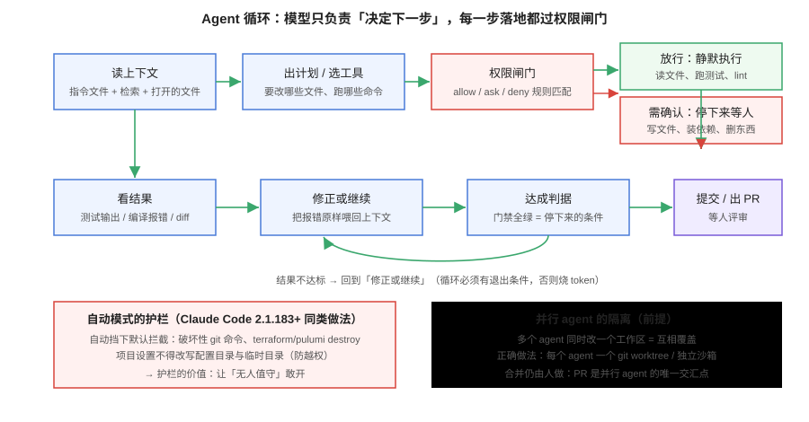
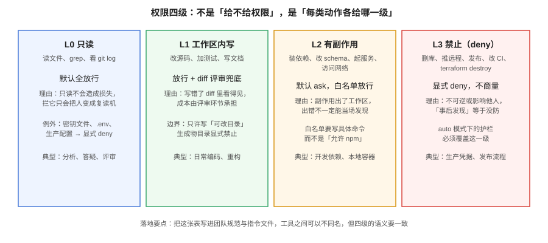

# Agent 模式与自动化

Agent 模式是 2025 年以来编程助手最大的范式变化：**从「它建议、你执行」变成「它执行、你验收」**。这也意味着它引入了补全时代完全不存在的三类问题——权限（它能做什么）、并行（多个它怎么办）、无人值守（你不在时它干了什么）。这一页讲怎么把这三件事管起来。



## Agent 循环：理解它在干什么

所有编码 Agent 的内核都是同一个循环：

```text
读上下文 → 出计划 / 选工具 → 权限闸门 → 执行
   ↑                                        ↓
   ←←←←←←←  看结果（测试/报错/diff）←←←←←←
                              ↓
                     达成判据 → 停，交付
```

三点推论，直接决定你怎么用它：

1. **模型只负责「决定下一步」，每一步落地都过权限系统**。所以安全性不取决于模型多聪明，取决于你的规则表。
2. **循环必须有退出条件**。退出条件就是判据（测试全绿、lint 通过）——没有判据的 Agent 只能猜什么时候停，猜的代价是 token 和时间。
3. **报错会原样回到上下文**，所以门禁输出越友好（带修复建议），Agent 修得越快。

## 权限四级：不是「给不给」，是「每类动作各给哪级」



| 级别 | 动作类型 | 默认策略 | 理由 |
| --- | --- | --- | --- |
| L0 只读 | 读文件、grep、git log | 放行 | 不造成损失，拦它只会让人变成复读机 |
| L1 工作区内写 | 改源码、加测试 | 放行 + diff 评审兜底 | 写错了 diff 里看得见 |
| L2 有副作用 | 装依赖、起服务、访问网络、改 schema | **ask**，白名单放行 | 副作用出了工作区，出错不易当场发现 |
| L3 禁止 | 删库、推远程、发布、改 CI、`terraform destroy` | **deny** | 不可逆或影响他人 |

::: danger 白名单要写到命令粒度
「允许 npm」是无效的白名单——`npm install <任意包>` 与 `npm run test` 的风险完全不同。应该写成「允许 `npm run test` / `npm run lint`」，而不是按前缀放行。**自动模式下的护栏（如 Claude Code 2.1.183 起拦截破坏性 git 命令与 destroy 类操作）是底线，不是全部**——你自己仓库里的 L3 清单还得自己写。
:::

## 并行 Agent：隔离是前提，合并是人做

2026 年的主流工具都支持并行（Cursor 最多 8 个、Claude Code 子代理嵌套 5 层），但**并行的收益完全取决于隔离**：

| 方案 | 做法 | 适用 |
| --- | --- | --- |
| git worktree | 每个 Agent 一个独立工作树，互不覆盖 | 本地并行，最常用 |
| 容器/沙箱 | 每个任务一个容器环境 | 需要环境隔离或跑危险命令 |
| 分仓库/分目录 | 任务天然不相交 | monorepo 的模块边界清晰时 |
| 共享工作区 | 多个 Agent 同时改一个目录 | **不要**，除非任务被证明互不相交 |

**合并仍由人做**：并行 Agent 的产出都应收敛为 PR，PR 是唯一交汇点。谁合并、冲突怎么解，是人的决定。

## 无人值守：CI 里的 Agent

终端 Agent（Claude Code、Copilot CLI、Codex CLI 等）可以跑在 CI 里，这是 L5 的形态。适用与不适用要分清：

**适合交给 CI Agent 的**：依赖升级、修 lint、补测试、文档同步、`TODO` 清理、安全补丁小修。特征是**判据客观、影响面小、可机器验证**。

**不适合的**：涉及架构决策、跨团队接口、生产数据、对外发布。特征是需要人拍板或不可逆。

```yaml
# 一个无人值守任务的最小护栏（伪配置，示意结构）
# 1. 触发：定时 / 事件（如新 issue 打上 ai-task 标签）
# 2. 环境：一次性容器，最小权限凭据，工作目录即沙箱
# 3. 判据：门禁命令 + 断言清单，全绿才算完成
# 4. 产出：只允许开 PR，不允许直接 push 到受保护分支
# 5. 上限：token / 时长 / 轮数 三重上限，防止失控烧钱
# 6. 审计：会话日志与 diff 归档，出问题可回放
```

::: warning 平台级云 Agent 的硬约束
以 Copilot coding agent 为例：单次会话上限 **59 分钟**，每次任务消耗 AI Credits **和** GitHub Actions 分钟数，且不在免费档。派任务前先算这两笔账（见[工具全景](../ToolLandscape/index.md#计费口径-三代模式与算账方法)）。
:::

## hooks 与 skills：把流程固化

以 Claude Code 的机制为代表（各家能力不同，思路相通）：

| 机制 | 作用 | 典型用法 |
| --- | --- | --- |
| hooks | 在**生命周期事件**上挂你的命令（PreModelSwitch、TaskCompleted 等） | 提交前强制跑门禁；模型切换时记录审计 |
| skills（SKILL.md） | 把「某类任务怎么做」写成可复用的清单 | 「给本仓库加页面」的固定五步 |
| 子代理（subagent） | 把子任务交给独立上下文的代理，避免污染主会话 | 大范围检索、批量分析 |

**判据：能写成脚本的不要写成提示**。hooks/skills 的价值在于把「每次都要口头交代」的事变成**入库的、可评审的、可版本化的流程**——和 CI 是同一个思想。

## 实战小结

```text
□ 权限表写进了团队规范与指令文件（四级语义一致）
□ 白名单到命令粒度；L3 清单显式 deny
□ 并行任务用 worktree/容器隔离，合并走 PR
□ 无人值守任务有三重上限（token/时长/轮数）与审计留痕
□ 交给 CI 的任务都是「判据客观、影响面小」的
□ 循环退出条件明确（门禁命令 + 断言清单）
```

## 参考资料

- Claude Code 文档：权限与 hooks、子代理、skills
- GitHub Copilot：coding agent 与 Actions 环境说明
- Cursor 文档：并行 Agent 与后台任务
- 本仓库 [AGENTS.md](../../../AGENTS.md)：可执行判据的仓库样例
