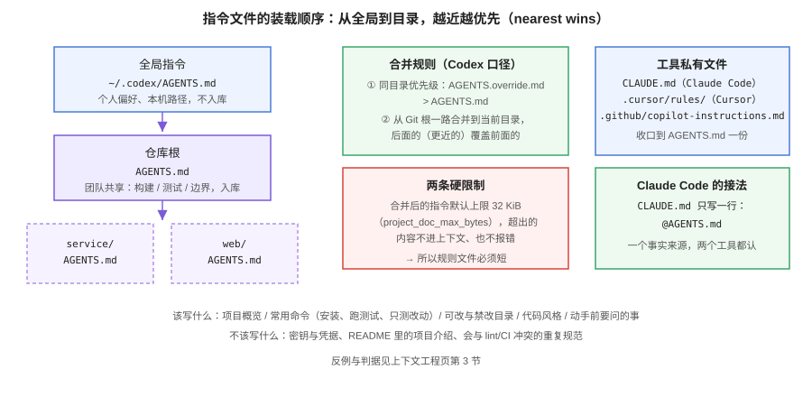

# 上下文工程

AI 编程助手答非所问，**九成不是模型不行，而是上下文没喂对**。模型每开一个新会话都是失忆的：它不知道项目怎么构建、测试怎么跑、哪些目录不能碰、团队遵守什么约定。上下文工程就是把「这些它必须知道的事」变成**可维护的、入库的、会被装载的东西**——而不是靠每次在对话框里重新交代。



## 指令文件：从各自为政到 AGENTS.md

很长一段时间里，每家工具都发明自己的规则文件，同一个团队要维护四份几乎相同的内容，并且在一周内开始漂移：

| 文件 | 谁读 | 状态 |
| --- | --- | --- |
| `AGENTS.md` | Codex、Cursor、Copilot、Jules、Aider、Zed、Devin、VS Code Agent Mode 等 30+ 工具 | **事实标准**（OpenAI 2025-08 发布，现由 Linux Foundation 旗下 Agentic AI Foundation 治理，6 万+ 开源仓库采用） |
| `CLAUDE.md` | Claude Code | 仍在用；可用一行 `@AGENTS.md` 导入标准 |
| `.cursorrules` / `.cursor/rules/` | Cursor | 旧路径，官方建议迁移 |
| `.windsurfrules` | Windsurf | 工具私有 |
| `.github/copilot-instructions.md` | Copilot | 工具私有 |

**收口策略：内容只维护一份 `AGENTS.md`，工具私有文件要么删掉、要么变成指向它的一行。** 这样既保留了各工具的兼容性，又消除了多份内容漂移的可能。

```markdown
<!-- CLAUDE.md 的完整内容，就这一行 -->
@AGENTS.md
```

## AGENTS.md 该写什么

没有强制 schema，但有效的文件几乎都有这几节。**判据是：AI 动手前必须知道、而它又猜不出来的事才写**：

```markdown
# 项目：订单服务

## 概览
Java 21 + Spring Boot 4.1，MySQL 8.4；TypeScript 全程。

## 常用命令
- 安装：pnpm install
- 本地跑：pnpm dev
- 只测改动的：pnpm test -- related
- 全量测试：pnpm test（提交前必须全绿）

## 结构与边界
- src/：业务代码（可改）
- migrations/：迁移脚本（新增前必须先说明影响）
- dist/：生成物，禁止直接修改
- legacy/：存量代码，除非任务明确要求，否则不重构

## 代码风格
- 用 async/await，不用裸 Promise 回调
- 错误在路由层统一捕获；不要吞异常（空 catch 会被 CI 拦）
- 新增依赖必须在 PR 描述里写明理由

## 动手前先问
- 数据库 schema 变更
- 对外 API 签名变化
- 新增环境变量
```

约 120 词就能覆盖核心。**文件越长，关键指令越被稀释**——agent 和人一样会略读。

### 装载规则与两条硬限制

以 Codex 的实现为例（各家大同小异，细节以各自文档为准）：

1. **先读全局再读项目**：`~/.codex/AGENTS.md`（全局，不入库）→ 仓库根 → 从 Git 根一路合并到当前工作目录。
2. **就近优先（nearest wins）**：同目录有 `AGENTS.override.md` 时覆盖 `AGENTS.md`；子目录的规则覆盖根目录的通用规则。monorepo 因此可以「根上放通用规矩、每个包放专属规矩」。
3. **合并后默认上限 32 KiB**（`project_doc_max_bytes`）：**超出部分不进上下文、也不报错**——这是最阴险的一条，规则文件太长不会收到任何提示，只是后半截静默失效。

::: danger 三个高频坑
1. **文件名大小写**：必须是 `AGENTS.md`，`agents.md` 在部分工具上不会被识别，且不报错。
2. **把密钥写进规则文件**：`AGENTS.local.md` 一类本地文件必须进 `.gitignore`，且无论哪份文件都不该出现凭据。
3. **规则与 CI 冲突**：如果规则文件说「用 npm」而仓库实际用 pnpm，AI 会自信地执行错误命令。**规则文件里的每条命令都应该被 CI 实际跑过**。
:::

## 上下文的其余三路来源

指令文件只是静态底座，一次会话的上下文还有三路来源，各有各的坑：

| 来源 | 机制 | 坑 |
| --- | --- | --- |
| 显式引用 | `@file`、`@folder`、`@docs`、拖图 | 引用太多会稀释关键内容；引用太少则瞎猜 |
| 自动检索 | 工具按相似度/结构挑文件（如 Cursor 的 codebase 索引） | 检索召回不等于相关；生成的 API 可能来自「长得像」的其他模块 |
| 长会话累积 | 对话历史 + 自动压缩 | 压缩会丢细节；改了 A 又问 B 时，A 的结论可能已被压缩掉 |

**实操口径**：

1. **显式引用优先于指望检索**。你知道相关文件在哪时，直接给；只有你不知道时才靠检索。
2. **压缩之后重述关键约束**。长会话里每隔一段，把「必须遵守的三条」重贴一遍，成本远低于返工。
3. **别把整个目录丢进去**。给目录 = 让模型自己挑，错了你都不知道它看了什么。

## 仓库可读性改造：写给 AI 看的仓库

上下文工程的另一半是**把仓库本身变得对 agent 友好**。这不是额外工作，而是把人也要的东西（清晰结构、可重复命令、明确边界）显式化：

| 改造 | 人得到什么 | AI 得到什么 |
| --- | --- | --- |
| `AGENTS.md` 写清构建/测试命令 | 新人上手清单 | 不用猜命令 |
| 目录职责表（可改 / 禁改 / 生成物） | 架构透明 | 不越界改文件 |
| 门禁脚本可一条命令跑全 | 提交前自查 | 有明确的「完成判据」 |
| 失败输出友好（报错带修复建议） | 排障快 | 错误信息可直接被吃回上下文 |
| 破坏性操作显式化（Makefile 目标命名、危险脚本标注） | 少手滑 | 权限规则有落点 |

::: tip 本仓库就是一个例子
本仓库根目录的 `AGENTS.md` 写明了「Markdown 规范、侧边栏维护、构建验证命令」，`docs-website` 的各类巡检脚本（链接、表格、容器、图片 alt）把「写得对不对」变成**可执行判据**——这正是 Agent 时代仓库该有的样子。完整做法见[实战页](Practice/index.md)。
:::

## MCP：给工具接外部上下文

MCP（Model Context Protocol）是把外部系统（数据库、API、内部文档）以标准方式接给助手的协议，现同属 Agentic AI Foundation 治理。它解决的是「上下文不止在仓库里」：

- **该接**：内部文档库、数据库 schema、监控面板、任务系统——这些「AI 不接就永远不知道」的事实。
- **不该接**：AI 本来就会的东西（通用语言文档），接了只会增加噪声。
- **必须管**：MCP server 的访问范围与凭据要走允许清单（Copilot Enterprise 的 MCP allow list 即为此设计），别让一个第三方 server 成为数据出口。

::: warning 上下文不是越多越好
上下文窗口从 128K 涨到了百万级，但**有效上下文 ≠ 窗口大小**：塞得越满，关键约束越容易被稀释，成本也越高。判据是「这条信息会不会改变 AI 的行为」——不会的，别放。
:::

## 验证方式

```text
□ 仓库根有 AGENTS.md，且每条命令都真的能跑通
□ 工具私有规则文件已收口（删掉或改成一行引用）
□ 文件长度合并后 < 32 KiB（安全边界：远小于它）
□ 密钥与凭据不在任何规则文件里；本地规则文件在 .gitignore 中
□ 做过一次「新会话冷启动」测试：只靠指令文件，AI 能正确跑起项目
□ MCP server 走允许清单，凭据不在仓库
```

**可执行的冷启动测试**：

```shell
# 在一个新会话里，不贴任何额外说明，直接问助手：
#   「这个项目怎么在本地跑起来并验证改动？」
# 期望：它给出与 AGENTS.md 一致的命令，并且命令真的能执行成功。
# 若它开始编造命令或路径，说明指令文件还没被有效装载。
```

## 参考资料

- AGENTS.md 规范官网：https://agents.md/
- OpenAI Codex 的 AGENTS.md 机制（读取顺序与 `project_doc_max_bytes`）：https://developers.openai.com/codex/
- Claude Code 记忆与导入：https://docs.anthropic.com/en/docs/claude-code/memory
- Model Context Protocol：https://modelcontextprotocol.io/
- GitHub Copilot MCP 允许清单（官方文档）
