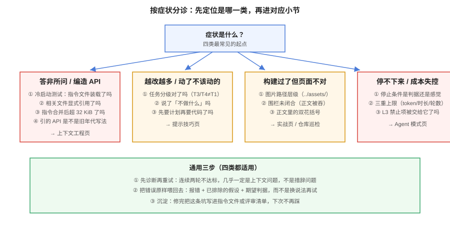

# 常见问题与最佳实践

这一页收两类内容：**排障**（某个具体症状怎么定位）与**判断**（要不要这么做）。所有问题都来自真实使用中的高频场景。



## 一、排障：按症状定位

```text
答非所问 / 编造 API
  ├─ 检查上下文：指令文件被装载了吗？（新会话冷启动测试）
  ├─ 检查引用：相关文件显式给了吗？还是指望检索？
  ├─ 检查长度：合并后的指令超过 32 KiB 了吗？（超出部分静默失效）
  └─ 检查年代：它引的 API 是不是 2024 年教程里的旧写法？

改了不该改的 / 越改越多
  ├─ 任务分级错了吗？（T3/T4 被当 T1 一句话砸过去）
  ├─ 说了「不做什么」吗？（不动的目录、不升级的依赖）
  └─ 计划先行了吗？（先要计划再要代码）

构建过了但页面不对
  ├─ 图片路径层级：子页用 ../assets/，主题首页用 ./assets/
  ├─ 围栏未闭合：正文被吞进代码块（fencecheck）
  └─ 双花括号：正文里的 {{ }} 会被当模板表达式（放围栏内）

Agent 停不下来 / 成本失控
  ├─ 停止条件明确吗？（门禁命令 + 断言清单）
  ├─ 有三重上限吗？（token / 时长 / 轮数）
  └─ 是不是把 L3 禁止的事也交给它跑了？

无人值守出事故
  ├─ 白名单到命令粒度了吗？
  ├─ L3 显式 deny 了吗？（推远程、发布、删数据）
  └─ 产出只走 PR 吗？
```

## 二、高频问题

### Q1：补全和 Agent 该用哪个？

不是二选一，是分层并用：**日常编码用补全/编辑（L1~L2），跨文件任务用对话（L3），批量机械任务才用 Agent（L4~L5）**。判据看两点：任务是否边界清晰、判据是否机器可验证。两个都满足才交给 Agent（见[概述页](Overview/index.md)的能力分层）。

### Q2：它编造了一个不存在的 API，怎么防？

三层防：**上下文层**——把真实依赖与版本写进指令文件（「本项目用 MyBatis-Plus 3.5.17，不是 MyBatis」）；**验证层**——写完必须编译/跑测试，幻觉在编译期暴露；**评审层**——对不熟悉的 API 保持默认怀疑。没有银弹，幻觉是大模型的本性，工程手段只是压概率。

### Q3：规则文件要不要写很长，把所有规范都塞进去？

不要。两条硬理由：合并后默认上限 32 KiB，**超出部分静默失效**；文件越长关键约束越被稀释。正确做法是「规则文件放最小集 + 链接到详细文档」，并且**每条命令必须真的能跑**。

### Q4：团队里有人说 AI 没用，有人说离不开了，怎么裁？

他们说的可能都是真的——**任务类型不同**。用[度量页](Metrics/index.md)的四步法按任务类型分组测：样板/单测大概率收益稳定，存量核心模块大概率不确定。别用平均值裁，平均值会把两个真实信号洗成一个假结论。

### Q5：公司代码不敢贴给云服务怎么办？

按顺序排查：① 问供应商的企业档条款（不训练、零留存、区域）；② 看能否私有化/内网部署；③ 只把**脱敏后的结构**给 AI（去掉业务语义的接口签名、改名的样例）；④ 真不行就只用本地模型（见[本地模型部署](../../LocalModel/index.md)），接受能力折价。**同时管住个人账号**——合规失效往往在个人免费档，不在企业版。

### Q6：AI 生成的测试全绿，能信吗？

不能直接信。先查三件事：**断言是不是被改弱了**（删断言、放宽阈值、skip）、**是否覆盖了边界**（不只主干路径）、**测试是否在验证实现而非验证自己**。AI 生成测试的正确用法是「人定契约、AI 补用例」，而不是「AI 既定契约又验证契约」。

### Q7：要不要把 `.cursorrules` 之类迁到 AGENTS.md？

要，但不必删旧文件。收口策略：内容只维护 `AGENTS.md` 一份，工具私有文件改成一行引用或删除。迁移后做一次冷启动测试确认各工具都还正确装载（见[上下文工程](Context/index.md)）。

### Q8：成本怎么控制？

四件事：**按角色给档位**（不是人人 Ultra）；**月度席位对账**清幽灵席位；**超量单价写进预算**（含云 Agent 的双重计费）；**给无人值守任务设三重上限**。最后一条最重要：成本失控几乎都发生在无人值守场景。

### Q9：新人该先用 Agent 还是先学基础？

先学基础，但**用 AI 加速学基础**：让它解释代码、带行号提问、要求举一反三的例子。完全跳过基础直接让 Agent 写代码的新人，会在第一次排障时暴露——他连问题都描述不出来。建议路径见[团队规范页](TeamStandard/index.md)第六节。

### Q10：指标怎么向管理层汇报？

三层结构汇报：第 1 层报成本（花了多少、闲置多少），第 2 层报产出（PR/churn 变化 + 陷阱说明），**第 3 层报结论**（交付指标带适用范围）。一句话版本：「T1/T2 任务前置时间 −30%，存量任务无显著变化，变更失败率持平，月成本 X」——这比任何「效率提升 55%」都更可信。

## 三、最佳实践清单

```text
上下文
□ 指令文件入库、走评审、有 owner、每条命令都被真实执行过
□ 合并后长度远小于 32 KiB
□ 密钥不在任何规则文件里

提示
□ 任务先分级（T1~T5）再选策略
□ T3 以上先要计划再要代码
□ 每次提示至少含一个可执行判据

Agent
□ 权限四级定表，白名单到命令粒度
□ 无人值守有三重上限 + 审计留痕 + 只走 PR
□ 并行用 worktree/容器隔离

团队
□ 评审清单四查（重复 / 吞错 / 边界 / 断言放水）
□ 合规六问有书面答案，约束个人账号
□ 月度成本对账有人负责

度量
□ 基线在启用前收
□ 数据按任务类型分组
□ 结论只基于交付层指标，且带适用范围
```

## 四、术语表

| 术语 | 含义 |
| --- | --- |
| Agent 模式 | 助手自主读仓库、改文件、跑命令、迭代修复的工作模式 |
| AGENTS.md | 给编码 Agent 读的仓库规则文件，事实标准，Linux Foundation 治理 |
| AI Credits | Copilot 自 2026-06 起的用量计费单位（Chat/Agent/Review 计费，补全不计） |
| 用量池 | Cursor 等工具的计费模型：含量 + 超量按价，自研与第三方模型分池 |
| 就近优先 | 子目录的规则文件覆盖上层规则的装载语义 |
| 幽灵席位 | 已付费但无活跃使用的许可证 |
| churn | 提交后短期内被重写或删除的代码占比 |
| DORA 四项 | 部署频率、变更前置时间、变更失败率、MTTR |
| MCP | Model Context Protocol，把外部系统以标准方式接给模型的协议 |
| hooks / skills | 在生命周期事件上挂命令 / 把任务流程写成可复用清单 |

## 参考资料

- 各专题页的「参考资料」小节（事实来源逐页标注）
- [DORA](https://dora.dev/)、[METR](https://metr.org/)、GitClear、Stack Overflow Survey 2026
- 本仓库其余巡检脚本与 [AGENTS.md](../../../AGENTS.md)
