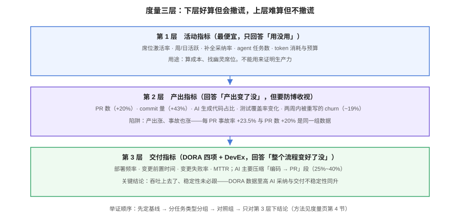

# 度量与收益论证

「我们用了 AI 编程助手，效率提升了吗？」——这个问题之所以难答，不是因为没数据，而是因为**大多数团队手里只有最便宜的那层数据，却用它回答最贵的问题**。这一页给出可落地的度量框架，以及怎么避免用错误指标自欺。



## 三层指标：越往上越难算，越往上越能说明问题

### 第 1 层：活动指标（最便宜）

| 指标 | 回答什么 | 能否证明生产力 |
| --- | --- | --- |
| 席位激活率 / 周·日活跃 | 用没用 | 否 |
| 补全采纳率 | 补全质量的主观体验 | 否 |
| Agent 任务数 / token 消耗 | 用了多少、花了多少钱 | 否（但必须收集，用于成本） |

**正确用途：算成本、清幽灵席位、发现「买了没用」的团队。** 误用方式：把「采纳率 35%」写进 ROI 汇报。

### 第 2 层：产出指标（要防博收视）

| 指标 | 参考变化（行业数据，2026-10 口径） | 陷阱 |
| --- | --- | --- |
| PR 数 / 人 | 约 +20% | 评审产能没跟上时，事故率同步 +23.5% |
| commit 量 | 约 +43% | 拆分 commit 即可刷高 |
| AI 生成代码占比 | 平均约 46%（Java 约 61%） | 生成量 ≠ 上线量 |
| 两周内被重写的 churn | 约 16% → 约 19% | 说明部分产出在还自己 |

### 第 3 层：交付指标（DORA 四项 + DevEx）

| 指标 | AI 的真实影响 |
| --- | --- |
| 部署频率 | 通常上升（早期数据 +18%~35%），有 4~8 周滞后 |
| 变更前置时间 | 下降最多的一段是「编码 → PR」（约 25%~40%）；评审与部署段基本不动 |
| 变更失败率 | **不确定**：低采纳团队反而略升，采纳与评审纪律成熟后回落 |
| MTTR | AI 不直接作用；受监控与应急流程影响 |

::: tip 为什么第 3 层才是答案
业务问题从来不是「代码写得快不快」，而是「**功能从想法到上线**快不快、稳不稳」。编码段只占前置时间的一部分（多数团队 40%~60%），AI 恰好压缩的就是这一段——所以前置时间的改善**小于**编码段的改善，这是正常的，不要因为「没提升 55%」就否定工具。
:::

## 证据的边界：三种研究，三种可信度

| 研究 | 类型 | 结论 | 使用方式 |
| --- | --- | --- | --- |
| GitHub +55%（2022） | 受控实验，任务边界清晰 | 明显加速 | 只对绿地/样板任务引用 |
| METR −19%（2025 初） | 随机对照，资深开发者在自己的老仓库 | 更慢 | 用来说明「不是普遍加速」；注意被试无 AI 使用经验 |
| GitClear churn/重复度 | 相关性研究，6.23 亿行 diff | 质量信号恶化 | 只用于提出假设，不下因果结论 |

::: danger 汇报时的三条纪律
1. **结论必须带适用范围**：「在样板与单测任务上 +55%」是对的，「我们团队提速 55%」是错的。
2. **不采信单点百分比**。任何只有一个数字、没有对照与样本描述的效率声明，都不该进决策文档。
3. **区分「感觉快了」和「交付快了」**。METR 实验里被试自估快 20%~24%，实测慢 19%——主观感受是所有指标里最不可信的一个。
:::

## 怎么做一次能站得住的度量

四步法，成本可控且能出结论：

```text
① 定基线（启用前 2~4 周就收集）
   - DORA 四项 + PR 评审时长 + churn + 每千行事故率
   - 按任务类型打标：绿地 / 存量 / 样板 / 排障

② 分组对照
   - 组内对照：同一人同一仓库的 AI 辅助 vs 非辅助提交
   - 或时间对照：启用前后，同一类任务
   - 至少一个不受影响的对照组（其他团队/仓库）

③ 分任务类型看结果
   - 预期：样板/单测收益稳定，存量核心模块不确定
   - 混在一起平均，会把真实信号洗掉

④ 只对第 3 层下结论，第 1 层只用于成本
   - 结论形如：「T1/T2 任务前置时间 -30%，T4 无显著变化，
     变更失败率持平，每月成本 X」
```

## 五个反模式

1. **只看补全采纳率**。它是活动指标，回答不了生产力问题。
2. **只看编码段提速**。瓶颈会转移到评审——PR +20% 与事故率 +23.5% 是同一组数据。
3. **启用前后直接对比，不看同期其他变化**。同一时期你们可能还换了 CI、改了流程、加了人。
4. **把工具演示当实验**。演示用的是为演示挑的任务。
5. **度量指标变成绩效指标**。一旦采纳率进 KPI，开发者会为了指标而采纳——数据从此失真（古德哈特定律）。

## 成本侧的度量

ROI 有两个分子（收益）与一个分母（成本），分母经常被算小：

```text
分母 = 订阅费（含超量）+ 云 Agent 的 Actions 分钟数 + token 消耗
     + 试点/培训时间 + 门禁与评审流程改造的一次性投入
     + 幽灵席位浪费（对账前通常 20%~40%）
```

行业参考（2026 口径，用于 sanity check 而非引用）：混合 ROI 估计约 171%，生成式 AI 每投入 1 美元回报约 3.7 美元（IDC/Microsoft 调研）——**这些是跨行业平均，别直接套到自己团队**；回报最高的场景常是代码评审与事件响应，而不是代码生成。

## 验证方式

```text
□ 能说出你的团队现在只收集了哪一层的数据
□ 基线在启用前就开始收了（否则补不回来）
□ 数据按任务类型分了组
□ 结论带适用范围，且只基于第 3 层
□ 成本算全了（超量 + Actions 分钟 + 幽灵席位）
```

## 参考资料

- DORA（Google Cloud）：State of AI-assisted Software Development（2026-03）
- METR：Measuring the Impact of Early-2025 AI on Experienced Open-Source Developer Productivity
- GitClear：AI 代码质量仓库级信号（6.23 亿行变更）
- Stack Overflow Developer Survey 2026
- Halkwinds：Software Engineering Productivity Benchmark Report 2026（758 家组织）
- DORA 四项指标官方说明：https://dora.dev/
