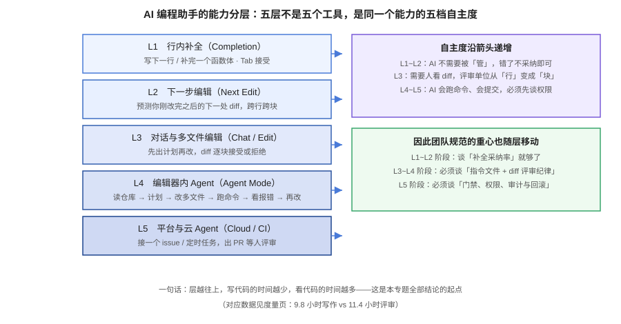
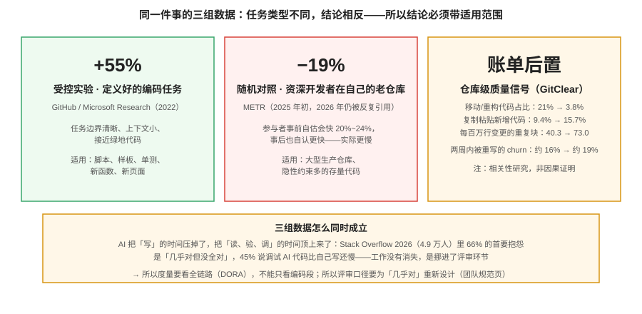

# 概述：从补全到 Agent

AI 编程助手是一种**以大模型为内核、以你的仓库为上下文、以生成代码为产出的开发协作工具**。它解决的不是「不会写代码」，而是三件更具体的事：把机械劳动（样板、单测、格式转换）交出去、把陌生的代码库变平（快速读懂与定位）、把「想到」与「写完」之间的距离缩短。它**不**解决需求理解错误与架构设计错误——这两件事它只会更高效地放大。

## 能力分层：五层不是五个工具

把市面上的功能压成五层，是理解一切选型、规范与度量问题的前提。**层与层之间的差别不是「功能多不多」，而是「自主度」与「错了之后谁来兜底」**：

| 层 | 交互形态 | 出错成本 | 谁兜底 | 团队要管的事 |
| --- | --- | --- | --- | --- |
| L1 行内补全 | Tab 接受 | 低，不采纳即可 | 个人 | 基本不用管 |
| L2 下一步编辑 | 预测下一处 diff | 低 | 个人 | 基本不用管 |
| L3 对话与多文件编辑 | 先计划再改，逐块接受 | 中，diff 里看得见 | 评审人 | 指令文件、diff 评审纪律 |
| L4 编辑器内 Agent | 读 → 改 → 跑 → 再改 | 高，会跑命令 | 权限 + 门禁 | 权限分级、并行隔离 |
| L5 平台/云 Agent | 接 issue 出 PR | 最高，异步批量 | 门禁 + 审计 | 门禁、审计、回滚 |

::: tip 一句话记住
**层越往上，写代码的时间越少，看代码的时间越多。** 2026 年活跃用户的平均画像已经是每周约 9.8 小时写作、11.4 小时评审——这直接决定了后面评审与度量两页的结论。
:::

## 生产力证据：三组数据，三种结论

这是本专题最重要的一节。网上关于「AI 让开发快了多少」的说法互相矛盾，**因为它们量的根本不是同一件事**。

**数据一：+55%（受控实验，定义好的任务）。** GitHub / Microsoft Research 的对照实验，让开发者完成一个边界清晰的任务，用 Copilot 的组快 55%。这是被引用最多、也最常被误用的数字——它适用于**任务边界清晰、上下文小、接近绿地**的场景。

**数据二：−19%（随机对照，资深开发者在自己的老仓库）。** METR 的实验里，经验丰富的开源开发者在自己长期维护的仓库上用 AI 反而慢了 19%，而他们事前自估会快 20%~24%、事后也自认更快。原因不难理解：大型生产仓库里有大量**隐性约束**（历史决策、未写下来的依赖关系、谁都不能碰的角落），AI 重建这些约束的成本比人高。**注意：这批被试没有 AI 使用经验，工具也在快速进步；它证明的是「快」不成立为普遍命题，而不是「慢」成立。**

**数据三：账单后置（仓库级质量信号）。** GitClear 对 6.23 亿行变更的分析：移动/重构代码占比从 21%（2022）掉到 3.8%（2026），复制粘贴式新增从 9.4% 升到 15.7%，每百万行变更的重复块从 40.3 升到 73.0，两周内被重写的 churn 从约 16% 升到约 19%。这是**相关性研究**，不能证明因果，但方向与「生成容易、重构变贵」的机制一致。

::: danger 三组数据同时成立，意味着什么
**工作没有消失，是挪进了评审环节。** Stack Overflow 2026（4.9 万人）里 66% 的首要抱怨是「AI 的方案几乎对但没全对」，45% 说调试 AI 生成的代码比自己写还慢；DORA 的数据则显示 AI 采纳率上升同时推高吞吐与交付不稳定性。结论：**只度量编码段的团队会高估收益，只看「感觉变快」的团队会高估得更厉害。** 度量怎么做，见[度量页](Metrics/index.md)。
:::

## 三种形态与它们各自的坑

| 形态 | 代表 | 坑 |
| --- | --- | --- |
| 编辑器插件 | Copilot、通义灵码、CodeBuddy | 能力上限被宿主编辑器锁死；多文件重构弱于原生编辑器 |
| AI 原生编辑器 | Cursor、Windsurf、TRAE | 换编辑器有迁移成本；用量池容易超预算 |
| 终端/平台 Agent | Claude Code、Copilot CLI、coding agent | 没有权限与门禁就敢让它跑，等于把生产环境交给一个实习生 |

## 讲什么 / 不讲什么

| 讲 | 不讲 |
| --- | --- |
| 能力分层与选型判据 | 具体某个模型的能力排名（变化以月计） |
| 上下文工程（指令文件、仓库可读性） | 提示词的通用写法（见[提示词工程](../PromptEngineering/index.md)） |
| Agent 的权限、并行、CI 化 | 自己用框架编排 Agent（见[Agent 框架深入](../AgentFramework/index.md)） |
| 团队规范、安全合规、成本治理 | 某公司内部的效率神话 |
| 度量方法与证据边界 | 「XX 团队效率提升 N%」式单点数字 |

## 常见误解

1. **「采纳率越高说明越好用。」** 补全采纳率是活动指标，只回答「用没用」；用它证明生产力等于用通话时长证明业绩（见[度量页](Metrics/index.md)第 1 节）。
2. **「Agent 模式 = 更强的补全。」** 不是。Agent 会跑命令、会写文件、会提交，引入了补全时代完全不存在的权限与审计问题。
3. **「规则文件写一次就行。」** 仓库在变、门禁在变，指令文件是要**评审与维护的代码**，半年不更新的规则文件比没有更危险（它让 AI 自信地沿用过期命令）。
4. **「我们团队年轻，用了会变快。」** 任务类型比资历更重要：绿地与样板任务收益稳定，存量核心模块的收益不确定——先分层再谈收益。

## 验证方式

读完本页，你应该能不查资料回答下面四个问题；答不上来说明需要回到对应小节：

1. 你的团队现在主要在 L1~L5 的哪一层？想升到哪一层？
2. 「+55%」和「−19%」分别适用于什么任务？
3. 为什么「AI 生成代码占比 46%」与「每 PR 事故率 +23.5%」可以是同一组数据？
4. 你所在团队下一个要管的事，是权限、评审口径，还是度量？

## 参考资料

- DORA（Google Cloud）：State of AI-assisted Software Development（2026-03，90% 在工作使用 AI；吞吐与稳定性同升）
- METR：Measuring the Impact of Early-2025 AI on Experienced Open-Source Developer Productivity
- GitHub / Microsoft Research：The Impact of AI on Developer Productivity: Evidence from GitHub Copilot（+55%）
- GitClear：AI 代码质量仓库级信号（6.23 亿行变更）
- Stack Overflow Developer Survey 2026（84% 采用、3% 高信任、66%「几乎对」抱怨）
