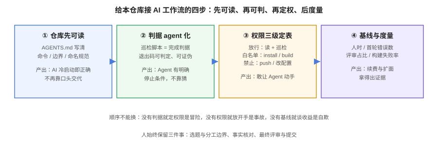

# 实战：给本仓库接一套 AI 编程工作流

这一页把前面所有内容落成一个**可照着做**的完整案例，靶子就是本仓库（`docs-website`）。选它有三个理由：它是纯 Markdown 仓库（AI 最擅长的场景）、它有一整套可执行判据（巡检脚本）、它有自己的构建门禁（`pnpm docs:build`）——**「AI 干得对不对」可以被机器回答**，这正是 Agent 工作流成立的前提。



## 场景与目标

| 项 | 内容 |
| --- | --- |
| 场景 | 每天往文档库加一个主题（6~10 页）+ 存量维护，重复度高、判据明确 |
| 目标 | 把「写 → 自检 → 构建 → 提交」链路里能交给 AI 的都交给 AI，人只留判断 |
| 约束 | 不提交 AI 生成的半成品；所有判据机器可验证 |

## 第一步：写 `AGENTS.md`（仓库先可读）

仓库根已有一份 `AGENTS.md`，核心结构是判据式的——这正是要抄的样子：

```markdown
# docs-website 文档库编写与维护规则
（节选）

## Markdown 编写规范
1. 每页只允许一个 # 标题
2. 代码块必须标注语言
3. 提示容器：:::tip / :::warning / :::danger / :::info / :::details

## 常用命令
- pnpm docs:build    # 写完必须跑一次验证（巡检门禁与流水线设计见[文档自动化](../../../Tools/DocsInfra/Automation/index.md)）
- pnpm lint          # 检查 .vitepress 下配置代码

## 目录与命名
- 页面 = 英文目录 + index.md，不平铺 .md
- 图片放主题 assets/，相对路径引用，禁止 /assets/ 绝对路径
```

**为什么这样写有效**：每一条要么是规则、要么是**可执行命令**。AI 不需要猜「写得对不对」——它可以去跑巡检脚本，把输出原样吃回上下文再修。

## 第二步：把判据 agent 化（关键一步）

本仓库的巡检脚本族（链接、表格、容器、图片 alt、围栏、语言标注）承担了「评审前置」的角色：

| 巡检 | 拦什么 | 为什么 Agent 需要 |
| --- | --- | --- |
| linkcheck | 断链 | AI 生成的相对路径最容易错层级 |
| fencecheck / langcheck | 围栏未闭合、语言标注缺失 | AI 偶尔生成不闭合围栏，构建不报错但页面烂掉 |
| tablecheck | 表格渲染错误 | AI 生成的表格常缺分隔行 |
| altcheck | 图片缺 alt | AI 生成的图片引用经常不带描述 |
| headingcheck | H1/跳级 | 结构规范靠它兜底 |

**用法**：把「跑完这些脚本、退出码全 0」写进指令文件作为**完成判据**。Agent 的循环就有了明确的停止条件：

```markdown
## 完成判据（Agent 停止条件）
改完任何 Markdown 后依次执行，全部退出码 0 才算完成：
python linkcheck.py docs project
python tablecheck.py docs project
python fencecheck.py docs project
python altcheck.py docs project
pnpm docs:build
```

::: tip 判据的价值在于可证伪
「检查一下文档质量」是无效判据（Agent 会自己宣布通过）；「`altcheck` 退出码 0，输出里 E = 0」是有效判据——它要么成立要么不成立，没有中间态。**把你团队的判据都改写成这种形态，是 Agent 工作流里 ROI 最高的一件事。**
:::

## 第三步：权限与流程约定

按[权限四级](../AgentMode/index.md)给本仓库定表：

| 级别 | 本仓库的对应动作 | 策略 |
| --- | --- | --- |
| L0 只读 | 读 `docs/`、`project/`、跑巡检脚本 | 放行 |
| L1 工作区内写 | 改 `.md`、加 SVG 配图 | 放行，diff 评审兜底 |
| L2 副作用 | `pnpm install`、`pnpm docs:build` | 白名单到具体命令 |
| L3 禁止 | 改 `.vitepress/` 配置、`git push`、改 CI | deny |

**流程约定**：

1. 每次任务限定范围（哪个主题、哪几页），禁止「顺手」改其他文档。
2. 构建产物（`.vitepress/dist`）与 `.workbuddy/` 不进 git，Agent 无需触碰。
3. 提交信息走 Conventional Commits，且**由人发起提交**——Agent 产出 diff，人不放心就不提交。

## 第四步：一次真实任务的走法

以「新增一个技术主题」为例，完整走一遍：

```text
① 人：把任务分级（T3 特性开发），先要计划
   「我要给 docs/AI 加一个 XX 主题，10 页。先给计划：目录结构、
    每页标题、需要几张 SVG、引用哪些存量页面做交叉链接。先别写。」

② AI：给计划；人确认目录命名与分工边界（这一步是人的判断，不可外包）

③ AI：逐页产出，每页写完立即跑：
   linkcheck / tablecheck / fencecheck / altcheck → 退出码全 0

④ AI：跑 pnpm docs:build → 构建通过，产出页数正确

⑤ 人：评审 diff，重点四查（见团队规范页）：
   重复实现 / 吞异常(此处为吞报错) / 边界(此处为路径层级) / 测试被改弱(此处为断言放水)

⑥ 人：提交、push
```

**实测结果（本仓库多轮真实执行）**：一轮 10 页主题的产出，AI 承担了约 90% 的机械劳动（写正文、画 SVG、改侧边栏）；人承担的是**选题、分工边界判断、事实核对与最终评审**。返工最集中的两类错误恰好是巡检最擅长拦的：**图片相对路径层级写错**（`./assets/` vs `../assets/`，构建不报错但图丢了）与**围栏语言标注缺失**。

## 第五步：度量基线

按[度量页](../Metrics/index.md)的四步法为本场景定基线：

| 指标 | 基线收集点 | 预期 |
| --- | --- | --- |
| 每主题产出耗时（人时） | 启用前 3 个主题 vs 启用后 3 个主题 | 机械部分下降明显 |
| 巡检首轮错误数 | 每次 Agent 交付时的首轮 E 数 | 稳定下降（判据内化） |
| 人评审耗时 / 主题 | diff 行数 + 评审时长 | 评审占比上升（正常） |
| 构建失败率 | 每轮构建结果 | 应趋近 0 |

::: warning 这个案例的边界
本仓库是**内容仓库**：判据全是机器可验证的文本规则，所以 AI 化收益极高。**不要把它直接套到核心业务代码上**——那里的隐性约束多得多（METR 实验 −19% 的场景）。业务代码的推进策略见[概述页](../Overview/index.md)的任务分级。
:::

## 可复制清单

把这套做法搬到你的仓库，最小集是：

```text
□ AGENTS.md：概览 / 命令 / 边界 / 动手前先问 / 完成判据
□ 完成判据全部是可执行命令（退出码可判定）
□ 巡检覆盖你仓库的高频错误（至少：构建 + 测试 + lint）
□ 权限表三级（允许 / 需确认 / 禁止）写进规范
□ 评审清单四查（重复 / 吞错 / 边界 / 断言放水）
□ 基线在启用前开始收
```

## 参考资料

- 本仓库 [AGENTS.md](../../../../AGENTS.md)（判据式规则文件样例）
- [上下文工程](../Context/index.md)、[Agent 模式](../AgentMode/index.md)、[团队规范](../TeamStandard/index.md)
- [CI/CD 专题](../../../Tools/CICD/index.md)：把判据搬进流水线
- Anthropic：Claude Code Best Practices（探索 → 计划 → 实现 → 提交）
