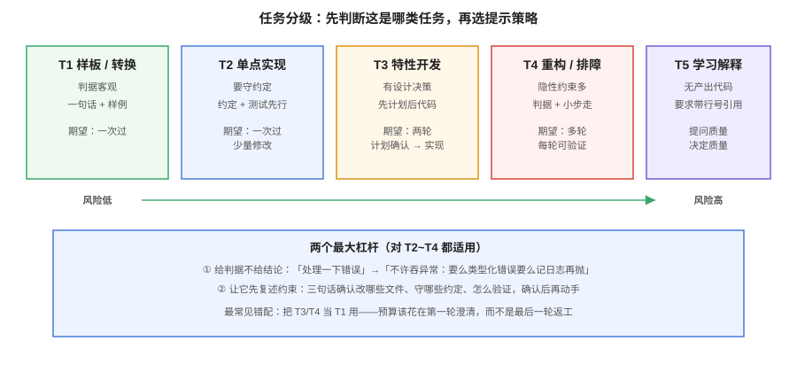

# 协作式提示技巧

这一页讲的是**在编程助手场景里**怎么把话说清楚。它不是通用提示词教程——那是[提示词工程](../../AI/PromptEngineering/index.md)的事。这里的方法都围绕一个差异：编程助手的输出是**会被评审的 diff**，所以提示的目标不是「让它说得好听」，而是「让它交出可评审、可验证、可回滚的最小变更」。



## 任务分级：先判断这是哪类任务

不同任务的提示策略完全不同。用错策略是「觉得 AI 不好用」的最大来源：

| 任务类型 | 特征 | 策略 | 期望 |
| --- | --- | --- | --- |
| T1 样板 / 格式转换 | 边界清晰、判据客观 | 一句话直说，贴样例 | 一次过 |
| T2 单点实现（函数/组件） | 边界清楚但要守约定 | 给约定 + 给测试 | 一次过，少量修改 |
| T3 特性开发（跨文件） | 有设计决策 | **先要计划再要代码** | 两轮：计划确认 → 实现 |
| T4 重构 / 排障 | 隐性约束多 | 给判据 + 小步走 | 多轮，每轮可验证 |
| T5 学习 / 解释 | 无产出代码 | 让它引用行号 | 提问质量决定质量 |

::: tip 最常见的错配
把 T3、T4 当 T1、T2 用——一句话砸过去让它「实现一下」，然后花一小时修它多做的部分。**任务越大，越要把预算花在第一轮的澄清上。**
:::

## 计划先行：T3/T4 的标准两轮

```text
第一轮（只要计划，不要代码）：
  「我想 <目标>。先给我改动计划：涉及哪些文件、每处改什么、
   有什么风险、你打算怎么验证。先不要写代码。」

第二轮（计划确认后再动手）：
  「计划第 2、3 条同意；第 4 条不要动 legacy/；
   验证方式换成 pnpm test -- related。开始实现。」
```

为什么先要计划：

1. **读计划比读代码便宜十倍**——方向错了，一轮对话就掉头，而不是一轮 diff。
2. 计划阶段它会**暴露它不知道的事**（「我不确定 A 和 B 的调用关系」），这正是你补充上下文的时机。
3. Cursor 等工具的 Plan mode、Claude Code 的先读后写习惯，都是把这一步产品化了。

## 给判据，不给结论

「写好一点」「优雅一点」这类形容词没有信息量。**把「什么算对」写成可执行判据**，是把提示质量抬上去的最大单项杠杆：

| 反例（无判据） | 正例（有判据） |
| --- | --- |
| 「处理一下错误」 | 「错误不要吞：捕获后要么返回类型化错误、要么记日志再抛，空 catch 不允许」 |
| 「优化性能」 | 「把这个接口的 P95 从 800ms 降到 300ms 以内，先给我三条候选方案和各自的代价」 |
| 「加点测试」 | 「给 `parseToken` 补测试：过期、篡改、空串、缺字段四类，用参数化测试，不要改实现」 |
| 「重构一下」 | 「把这个 200 行函数拆掉，判据：每函数 ≤ 30 行、测试全绿、公共行为不变（用现有测试证明）」 |

判据还有第二个作用：**它成为 Agent 的停止条件**（见[Agent 模式](AgentMode/index.md)）。没有判据的 Agent 只能靠猜什么时候停。

## 让它先复述约束

对抗「几乎对但没全对」最便宜的一招：让它先复述关键约束再动手。

```text
「动手前先用三句话确认：你要改哪些文件、遵守哪些现有约定、
  用什么命令验证。我确认后你再改。」
```

这不是仪式感。约束被显式复述之后，违反率会明显下降——因为约束进了它本轮的注意力范围，而不是散落在 3000 行上下文里。

## 五类坏味道

1. **一次要太多**。「把这个模块重写 + 加测试 + 写文档 + 顺手修下 bug」——拆开，每轮一个可验证的交付物。
2. **只说做什么，不说不做什么**。AI 默认会顺手「改进」无关代码。明确说「不要动 X、不要升级依赖、不要改格式」往往比说做什么更重要。
3. **贴报错不贴上下文**。报错行前后的 20 行、相关函数签名、你已排除的假设，一起给。
4. **用「必须/一定要」堆砌**。堆 20 条「必须」的结果是全部被稀释。挑出 3 条真正的硬约束，其余交给 lint 与门禁。
5. **在坏结果上继续加码**。第一轮结果不对时，**先诊断为什么**（上下文缺了？任务分错了级？），而不是换个说法再试一次。连续三轮不达标的任务，通常是上下文问题，回[上下文工程](Context/index.md)。

## 测试先行：把提示变成规约

对 T2/T3 任务，最稳的做法是**先让 AI 写测试（或你给它测试），再让它写实现**：

```text
「先不要写实现。根据下面的契约写出失败测试：
   parseToken 输入 null → 抛 TokenError('EMPTY')
   过期令牌 → 抛 TokenError('EXPIRED')
   签名不符 → 抛 TokenError('BAD_SIGNATURE')
 我看过测试确认口径后，你再让测试通过。」
```

好处：测试就是判据，实现阶段 AI 有明确的完成条件；而且**它改弱测试来迁就实现**这类问题会在第一轮就被你看见。

## 与门禁的关系

提示技巧的尽头是门禁。人味儿约定（别吞异常、小函数、注释清晰）在提示里说一遍是提醒，写进 CI 才是约束。**提示负责提高第一次的成功率，门禁负责兜住剩下的**——两者是分工，不是替代。

::: danger 提示技巧解决不了的三件事
1. **架构决策**：它给选项，你拍板。让它替你选架构，等于把业务后果外包给一个不了解你业务的系统。
2. **隐性业务规则**：没写下来的规则它永远不知道，写进指令文件或提示里。
3. **验证**：它能跑测试，但「测试是否测对了东西」需要人判断。
:::

## 验证方式

用你自己上一个真实任务做 A/B：同一段代码，一次用本页方法（分级 → 判据 → 复述约束），一次用你原来的方式，各记三轮内的往返次数与返工量。

```text
□ 能说出手头任务属于 T1~T5 哪一类
□ T3 以上任务都走了两轮（先计划后代码）
□ 每次提示里至少有一个可执行判据
□ 连续两轮不达标时，先诊断而不是重试
```

## 参考资料

- [提示词工程](../../AI/PromptEngineering/index.md)：通用方法论（结构化、few-shot、思维链）
- Anthropic：Claude Code 最佳实践（探索 → 计划 → 实现 → 提交）
- Cursor 文档：Plan mode 与 Agent 工作流
- 本仓库 [AGENTS.md](../../../AGENTS.md)：判据式规范的实际样例
