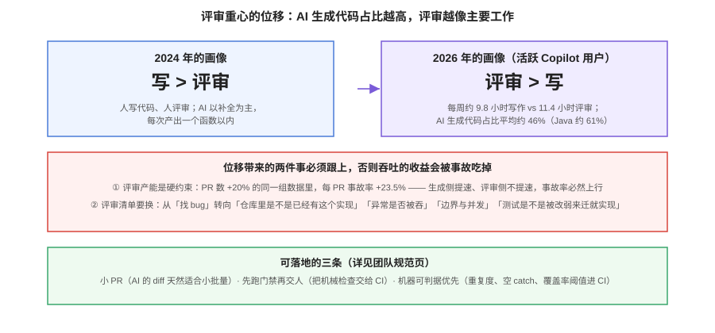

# 团队规范与治理

个人用 AI 编程助手，装上就能用；**团队用，难的不是工具，是约定**。约定要回答四个问题：AI 改的代码怎么进主干（评审）、什么不许它碰（边界）、代码和提示词出事了算谁的（合规）、钱花在哪（成本）。这一页给一套可直接抄的骨架。



## 一、指令文件入库：规则也是代码

[上下文工程](../Context/index.md)讲了怎么写 `AGENTS.md`，团队视角再加三条纪律：

1. **入库 + 走 PR 评审**。规则文件的改动会影响每个会话，改错一条（比如测试命令写错）会让所有 Agent 自信地执行错误命令——它的变更风险不亚于 CI 配置。
2. **指定 owner**。没有 owner 的规则文件半年就烂掉，过期规则比没有更危险。
3. **每条命令必须是活的**。规则文件里的命令要被 CI 或巡检真实执行过；本仓库的做法是把「文档写得对不对」固化为一组巡检脚本，规则里的命令就是这些脚本。

## 二、允许与禁止清单

把「AI 能做什么」写成一张表，放进规范与指令文件（判据见[Agent 模式](../AgentMode/index.md)的权限四级）：

```markdown
## 允许（默认放行）
- 读仓库任何非密钥文件；跑测试、lint、构建
- 修改 src/、tests/、docs/ 下的文件

## 需要人确认
- 安装/升级依赖；新建迁移脚本；改对外 API 签名
- 触碰 legacy/（存量核心模块）

## 禁止
- 推送远程、发布、改 CI 配置、操作生产数据
- 读取 .env、密钥、生产配置
- 「顺手」重构与本任务无关的代码
- 修改测试来让实现通过（除非任务就是改测试，且说明理由）
```

::: danger 最后一条不是玩笑
「改测试让实现过」是 AI 生成代码里**最危险的一类变更**：门禁全绿、事故在后头。评审清单里必须有一条对应的检查（见下文），CI 侧可以用「测试文件变更与实现变更的比率异常」做粗筛。
:::

## 三、评审口径改版

AI 把瓶颈从「写」推到了「评」。评审清单要从「找 bug」转向「AI 最常错的四类」：

| 检查项 | 对应 AI 的典型错误 | 怎么查 |
| --- | --- | --- |
| 重复实现 | 仓库里已有这个工具函数，它又写了一个 | 搜关键词；开启重复度检查 |
| 吞异常 / 掩盖错误 | 空 catch、`except: pass`、返回默认值假装成功 | lint 规则（空 catch 禁止）+ 眼看 |
| 边界与并发 | 只覆盖了主干路径 | 看测试是否覆盖边界；边界矩阵见[测试数据隔离](../../../../project/Base/BackendTemplate/TestIsolation/index.md)思路 |
| 测试被改弱 | 删断言、放宽阈值、跳过用例 | diff 里单独看测试文件 |

**配三个流程约定**：小 PR（AI 的 diff 天然适合小批量）、先跑门禁再交人（把机械检查全推给 CI）、AI 参与 PR 初审（Copilot Code Review / Bugbot 这类工具 2026 年已是产品能力）——但**机器初审不替代人审**，它只解决「看得不过来」，不解决「看对不对」。

## 四、安全与合规

| 问题 | 要问清的 | 常见答案形态 |
| --- | --- | --- |
| 代码会被用于训练吗 | 供应商的数据留存与训练豁免条款 | 企业档通常承诺不训练；免费/个人档要逐条看 |
| 代码存在哪、存多久 | 留存期与区域 | 企业档可要求零留存（zero data retention） |
| 能不能私有化 / 内网部署 | 部署形态 | 国产三线与企业版普遍支持；公有 SaaS 有豁免条款 |
| 生成代码的版权与 IP | 供应商的 IP 赔偿条款 | Enterprise 档多含 IP 赔偿；开源协议污染要靠扫描兜底 |
| 密钥与凭据 | 是否进入提示/上下文 | 一律不进；`.env` 在权限表里显式 deny |
| 许可证合规 | 生成代码的协议风险 | 依赖扫描（SBOM/许可证检查）进 CI，见[依赖与安全治理](../../../Tools/CICD/index.md) |

::: warning 合规不是「买企业版」一件事
即使买了企业版，**开发者个人账号的免费档也在同一张网上**：有人用个人免费账号处理公司代码，数据承诺就失效了。规范里要写明「公司代码只在公司账号与许可的工具里处理」。
:::

## 五、成本治理

1. **席位与活跃对账（每月）**：采购名单 × 活跃数据，清出幽灵席位。20%~40% 的闲置率在没做对账的团队里是常态。
2. **用量画像（按角色）**：重度 Agent 用户与补全用户的成本差一个数量级，配额与档位按角色给，不搞一刀切。
3. **超量规则写进预算**：超量单价（Copilot $0.04/请求、Cursor 按 API 价 + 团队附加费）与云 Agent 的双重计费（Credits + Actions 分钟）都要算进去。
4. **为 ROI 留证据**：续费答辩需要的是「交付层指标的变化 + 可归因的实验」，不是活跃度截图——方法见[度量页](../Metrics/index.md)。

## 六、新人上手

1. 第一天读：`AGENTS.md` + 本专题的[概述](../Overview/index.md)与[提示技巧](../Prompting/index.md)。
2. 第一周的任务模板：从 T1/T2 级任务开始（见[提示技巧](../Prompting/index.md)的任务分级），不派 T4。
3. 师徒制检查前三个 PR：重点看「有没有改弱测试」「有没有重复实现」。

## 验证方式

用这份自查表核对你的团队规范，缺一项补一项：

```text
□ AGENTS.md 入库、有 owner、走 PR 评审
□ 允许/需确认/禁止 三级清单写成文档并进指令文件
□ 评审清单包含四类 AI 高频错误
□ 评审产能有兜底（门禁前置 + 小 PR 约定）
□ 合规六问有书面答案，且约束了个人账号
□ 月度成本对账有人负责，超量规则进了预算
□ 新人路径有文档与检查点
```

## 参考资料

- 本仓库 [AGENTS.md](../../../../AGENTS.md)：入库规则文件的实际样例
- GitHub Copilot Trust Center（数据隐私与 IP 条款）
- 各供应商安全白皮书（留存、训练豁免、私有化）
- [CI/CD 专题](../../../Tools/CICD/index.md)：门禁体系
- [前端测试](../../../Frontend/Testing/index.md)、[测试工具](../../../Tools/TestingTools/index.md)：测试层的工具与策略
