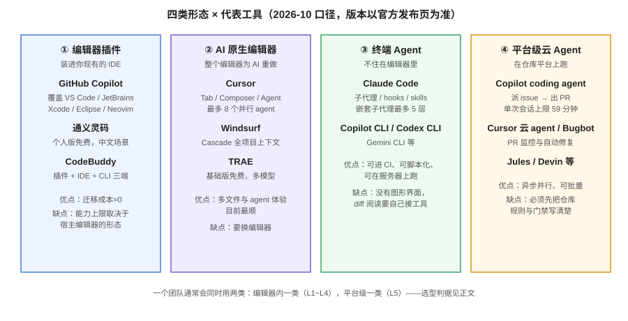

# 工具全景与选型

选 AI 编程助手不是选「最好的那个」，而是**先选形态、再选工具、最后算账**。形态决定工作流（要不要换编辑器、能不能进 CI），工具决定体验细节，账决定能不能长期用下去。顺序错了的典型症状：先被某个演示视频打动，装上之后发现它跟团队现有的 IDE、CI、合规要求全都对不上。



## 四类形态

| 形态 | 代表 | 迁移成本 | 能进 CI 吗 | 适合 |
| --- | --- | --- | --- | --- |
| ① 编辑器插件 | Copilot、通义灵码、CodeBuddy | ≈0 | 部分可 | 已有固定 IDE、想低成本起步 |
| ② AI 原生编辑器 | Cursor、Windsurf、TRAE | 中（换编辑器） | 部分（云 agent） | 重度多文件与 Agent 工作流 |
| ③ 终端 Agent | Claude Code、Copilot CLI、Codex CLI | 低（可脚本化） | **可** | 服务器开发、自动化、CI 无人值守 |
| ④ 平台级云 Agent | Copilot coding agent、Cursor 云 agent/Bugbot | 中（绑定代码平台） | 就是平台 | 批量小任务、PR 自动审查 |

::: tip 一个团队通常两类并用
编辑器内一类（覆盖 L1~L4），平台级一类（覆盖 L5 的异步批量任务）。**不要试图用一个工具覆盖所有层**——终端 Agent 的补全体验通常不如原生编辑器，原生编辑器的云 Agent 通常不如平台级成熟。
:::

## 主流工具逐条（2026-10 口径）

### GitHub Copilot

- **形态**：插件（VS Code / JetBrains / Xcode / Eclipse / Neovim / Visual Studio）+ CLI + GitHub 站内 + 云 Agent，**覆盖面最广**。
- **计费**：Free（2000 次补全/月）→ Pro $10 → Pro+ $39 → Max $100；团队 Business $19、Enterprise $39。**2026-06-01 起改为按用量计**：补全不计费，Chat / Agent / Code Review / CLI 走 AI Credits。
- **特色**：coding agent（派 issue → 在 Actions 环境跑测试 → 开 PR，单会话 59 分钟上限）、Agentic Code Review（2026-03 起 GA）、多模型目录与自动选模、Spaces（2025-11 起取代知识库）。
- **短板**：不是独立编辑器，多文件重构体验弱于 Cursor/Windsurf；最强的几个能力都绑定 GitHub（GitLab/Bitbucket 团队拿不到）。

### Cursor

- **形态**：AI 原生编辑器（VS Code 分叉，扩展与快捷键可一键导入）。
- **计费**：Hobby 免费 → Pro $20 → Pro+ $60 → Ultra $200；Teams Standard $40 / Premium $120。**双用量池**：自研模型池（额度多）+ 第三方模型池（按 API 价）。官方文档自述：日常重度 Agent 用户实际月支出约 $60~$100。
- **特色**：Tab 多行预测、Composer 多文件编排、最多 8 个并行 Agent、Bugbot（PR 自动找 bug 并开修复 PR）、Projects（2026-09 beta，长周期任务的多子代理调度）、2026-08-17 上线自建代码托管 Origin（与 GitHub 双向同步，可试可退）。
- **短板**：预算不可见性被用户诟病（用量面板曾移除成本追踪）；Teams/Enterprise 对第三方模型每百万 token 加收 $0.25（即使 BYOK）。

### Claude Code

- **形态**：终端 Agent（也可进 VS Code / 云端），无图形化 diff 界面，靠权限系统与 hooks 补工程化。
- **版本**：2.1.x 主线（2.1.269 / 2026-09-11；2.1.251 / 2026-08-28 收紧权限边界）。
- **特色**：子代理（嵌套最多 5 层）、Agent Teams、hooks（PreModelSwitch / TaskCompleted 等事件）、SKILL.md 技能体系、`--safe-mode` 排障、auto 模式护栏（拦截破坏性 git 与 `terraform destroy`）、`claude plugin eval`（给插件跑评分测试）。
- **短板**：无 CLI 之外的图形界面；重度使用成本高；规则文件走 CLAUDE.md（用一行 `@AGENTS.md` 接入标准）。

### 国产三线：TRAE / 通义灵码 / CodeBuddy

| 工具 | 形态 | 免费档 | 特色 |
| --- | --- | --- | --- |
| TRAE（字节） | AI 原生 IDE | 基础版免费 | 内置多模型可切换、中文适配好、支持私有化部署 |
| 通义灵码（阿里） | 插件为主 | 个人版免费 | 与阿里云生态贴合、补全稳定 |
| CodeBuddy（腾讯云） | 插件 + IDE + CLI 三端 | 基础版免费 | 与 CloudBase 等部署链路打通、支持 MCP 与团队 Rules |

::: info 选型时别只看评测分数
中文适配、免费额度这类维度**强烈依赖个人场景**，第三方横评的主观打分只能当线索。真正该信的是：官方定价页（算账）、官方 changelog（判断活跃度）、以及**在你自己的仓库上跑一周**。
:::

## 计费口径：三代模式与算账方法

计费方式一年换了三代，选型前必须搞清楚你在哪一代：

| 代际 | 口径 | 特征 | 风险 |
| --- | --- | --- | --- |
| 第一代 | 按席位包月 | 补全为主，用量可预测 | 重度 Agent 用户觉得不够用 |
| 第二代 | 按请求数（premium requests） | 分档配额 + 超额单价 | 配额焦虑，月底不敢用 |
| 第三代（当前） | 按用量（Credits / token 池） | 含量 + 超量按价，自研模型便宜、第三方贵 | **账单不可预测**，超量是常态而非例外 |

算账三步（以 Cursor 与 Copilot 为例，2026-10 口径）：

```text
① 列出团队的真实使用画像：
   - 每人每天多少次补全（第一代口径几乎总是够）
   - 每人每天多少次 Agent 会话（这才是大头）
   - 是否必须用第三方旗舰模型（第三方池按 API 价计）
② 用官方文档给出的量级估算，而不是营销页的数字：
   - Cursor 文档：日常 Agent 用户 $60~$100/月（Pro 席位只覆盖其中 $20）
   - Copilot：Chat/Agent/Review 都吃 Credits，Pro 档 $15 Credits 很容易见底
③ 把「超量」算进预算，而不是当成意外：
   - 超量单价（Copilot $0.04/次、Cursor 按 API 价 + Teams 附加费）要写进选型表
```

::: danger 最容易翻车的三笔隐性成本
1. **云 Agent 的双重计费**：Copilot coding agent 每次任务既吃 AI Credits 又吃 **GitHub Actions 分钟数**，只算前者会低估一半。
2. **BYOK 不一定省钱**：Cursor Teams 对第三方模型加收 $0.25/百万 token，即使你用自己的 API key——用自研模型才豁免。
3. **幽灵席位**：只看采购名单不看活跃数据的团队，普遍有 20%~40% 的席位没人用（见[度量页](Metrics/index.md)第 1 节）。
:::

## 选型判据表

按顺序问自己，第一处命中即得答案：

| 问题 | 命中 | 建议 |
| --- | --- | --- |
| 团队有强合规要求（代码不得出内网 / 需私有化部署）？ | 是 | 国产三线的企业版或自托管方案；先把[安全合规](TeamStandard/index.md#安全与合规)读完再谈工具 |
| 代码托管在 GitLab / Bitbucket，且短期不迁 GitHub？ | 是 | 排除平台级 Copilot；形态 ①②③ 都可用 |
| 主要痛点是「读不懂存量代码、定位慢」？ | 是 | 优先终端 Agent（③）+ 好的上下文工程，而不是更强的补全 |
| 主要痛点是样板与单测写不完？ | 是 | 形态 ① 起步即可，成本低、见效快 |
| 团队要并行跑多个任务（多 PR 流水线）？ | 是 | 形态 ④ 或支持并行 Agent 的 ②③，并先建好门禁 |
| 预算极紧 / 学生 / 个人副业？ | 是 | 免费档起步（TRAE、通义灵码、CodeBuddy、Copilot Free），验证需求后再付费 |

## 迁移与并存

- **从 VS Code 迁到 AI 原生编辑器**：Cursor/TRAE 都支持一键导入扩展、设置与快捷键；Open VSX 与官方市场差异要注意（个别扩展 ID 不同）。
- **多工具并存是常态**：团队规范应约束「哪些仓库允许哪些工具」，而不是一刀切。指令文件统一到 [AGENTS.md](Context/index.md) 后，并存成本会显著下降。
- **先试点再铺开**：选 1~2 个非核心仓库试点 2~4 周，[度量页](Metrics/index.md)第 4 节的基线方法在这时就要建好，否则试点结束拿不出结论。

## 验证方式

按下面的清单核对，全部能回答才算完成选型：

```text
□ 明确了团队要覆盖的层（L1~L5 中哪几层）
□ 形态定了（①②③④ 中选哪两类并用）
□ 三步算账做完：画像 / 官方量级 / 超量单价
□ 合规问题问过法务或安全团队（数据留存、训练豁免、私有化）
□ 试点仓库、试点周期、试点基线都定了
```

## 参考资料

- GitHub Copilot Plans（官方定价与 AI Credits 说明）：https://github.com/features/copilot/plans
- Cursor Pricing（官方，含用量池说明）：https://cursor.com/pricing
- Claude Code 更新日志（官方）：https://github.com/anthropics/claude-code/releases
- CodeBuddy 官网：https://www.codebuddy.cn/
- 各工具版本与价格以官方页为准，本页数字为 2026-10 核对结果
