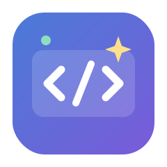
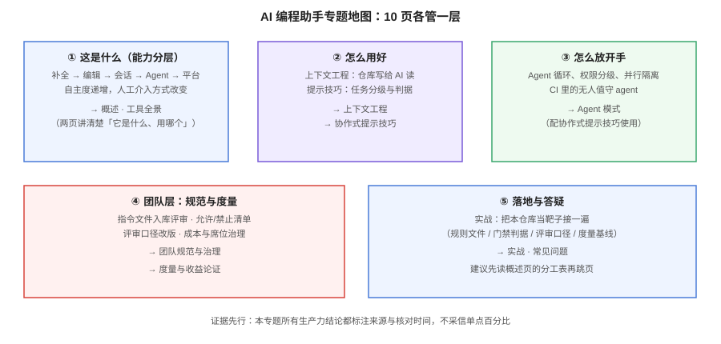

# AI 编程助手

到 2026 年，「AI 写代码」已经不是一个要不要用的问题：DORA 2026 年 3 月的调研里 **90% 的技术从业者在工作中使用 AI**，Stack Overflow 2026（4.9 万名受访者）的采用率是 **84%**。真正的问题换成了三句话——**怎么让它用得对**（上下文与提示）、**怎么敢让它自己做**（Agent 与权限）、**怎么向团队和老板证明它值**（规范与度量）。本专题就讲这三件事。

## 一句话定位

把 AI 编程助手当成**一个要被工程化管理的协作者**：它有输入（上下文）、有行为边界（权限）、有交付物（diff 与 PR）、有质量判据（门禁），也有成本（订阅与 token）。凡是把工具当「自动补全的升级版」随手用用的团队，最后都会停在「感觉快了，但说不出哪里快了」。

## 本专题与相邻专题的分工

「AI 辅助编程」在库内有多个相邻主题，边界如下——先确认你要找的是哪一层，再进对应页面：

| 专题 | 讲什么 | 不讲什么 |
| --- | --- | --- |
| **本专题** | 编程助手这个**协作形态**本身：能力分层、工具选型、上下文工程、提示技巧、Agent 模式、团队规范、度量 | 具体模型怎么选型、提示词的通用写法 |
| [提示词工程](../PromptEngineering/index.md) | **提示词的通用方法论**：结构化、few-shot、思维链、评估 | 编程助手特有的工作流（diff 评审、门禁、指令文件） |
| [Agent 应用](../Agent/index.md) | Agent 的**通用原理**：工具调用循环、记忆、多智能体（框架无关） | 编码场景的落地细则 |
| [Agent 框架深入](../AgentFramework/index.md) | LangGraph / CrewAI 等**编排框架**的工程化 | 编程助手（它自己就是产品，不需要你编排） |
| [IDE 配置](../../Tools/IDE/index.md) | IDE 本身的选型、插件、配置同步与团队统一 | AI 能力怎么用好（本专题） |
| [效率工具](../../Tools/Efficiency/index.md) | 终端、剪贴板、截图等**编码之外**的提效 | 编码过程本身 |
| [前端测试](../../Frontend/Testing/index.md)、[CI/CD](../../Tools/CICD/index.md) | 门禁与测试**体系**怎么建 | AI 生成的代码怎么过门禁（本专题 [团队规范](TeamStandard/index.md)） |

::: tip 一条判断线
想知道「**装哪个、花多少钱**」→ [工具全景与选型](ToolLandscape/index.md)；想知道「**为什么它总答非所问**」→ [上下文工程](Context/index.md)；想知道「**敢不敢让它自己跑**」→ [Agent 模式](AgentMode/index.md)；想知道「**团队怎么定规矩、怎么向老板交代**」→ [团队规范](TeamStandard/index.md) 与 [度量](Metrics/index.md)。
:::

## 专题导航

- [概述：从补全到 Agent](Overview/index.md)：能力五层、生产力证据的真相、讲什么不讲什么
- [工具全景与选型](ToolLandscape/index.md)：四类形态、九个主流工具、计费口径与选型判据
- [上下文工程](Context/index.md)：AGENTS.md 与多工具指令文件、就近优先、32 KiB 上限、仓库可读性改造
- [协作式提示技巧](Prompting/index.md)：任务分级、计划先行、给判据不给结论、五类坏味道
- [Agent 模式与自动化](AgentMode/index.md)：Agent 循环、权限四级、并行隔离、CI 中的无人值守、hooks 与 skills
- [团队规范与治理](TeamStandard/index.md)：指令文件入库评审、允许/禁止清单、评审口径改版、安全与成本治理
- [度量与收益论证](Metrics/index.md)：三层指标、证据的三组数据、实验设计、五个反模式
- [实战：给本仓库接一套 AI 编程工作流](Practice/index.md)：规则文件、门禁判据 agent 化、评审清单、度量基线
- [常见问题与最佳实践](FAQ/index.md)：幻觉 API、越改越多、成本失控、隐私合规等高频问题

## 版本速览（2026-10 核对）

| 工具 | 形态 | 计费口径 | 当前主线状态 |
| --- | --- | --- | --- |
| GitHub Copilot | 插件 + CLI + 云 Agent | 分档订阅 + **AI Credits 用量**（2026-06-01 起按用量计） | 免费档 / Pro $10 / Pro+ $39 / Max $100；Business $19、Enterprise $39 |
| Cursor | AI 原生编辑器 | 双用量池（自研模型 + 第三方模型按 API 价） | Pro $20 / Pro+ $60 / Ultra $200；Teams $40 起 |
| Claude Code | 终端 Agent | 订阅含用量 / API 按量 | 2.1.x（2.1.269 / 2026-09-11） |
| Windsurf | AI 原生编辑器 | 订阅 | Pro 档位，Cascade Agent |
| TRAE / 通义灵码 / CodeBuddy | 国产三线 | 个人档普遍免费 | 插件 / IDE / CLI 多端覆盖 |

::: warning 版本与价格以官方页为准
上表是写作时（2026-10）的核对结果。这一领域的计费口径**一年内换了三代**：按席位 → 按请求 → 按用量（Credits / token 池）。任何写死的数字都会过期，判断当前口径只认官方定价页。
:::

::: danger 大版本口径
本领域的「大版本差异」不在工具版本号，而在**交互范式**：补全时代（2021-2023）→ 对话时代（2023-2024）→ **Agent 时代（2025 起）**。网上 2024 年及更早的教程大多只讲补全与聊天，**没有覆盖权限、并行、门禁、度量这四件 Agent 时代必须做的事**，阅读时注意甄别年代。存量团队的规则文件（`.cursorrules`、`.windsurfrables` 等工具私有文件）建议收口到 [AGENTS.md](Context/index.md) 这一事实标准，旧文件不必删除、指向它即可。
:::

## 学习路径建议

1. **只关心选型** → [工具全景](ToolLandscape/index.md)，看完选型判据表就可以走。
2. **已经装好了但觉得不好用** → 先读 [概述](Overview/index.md) 的能力分层，确认你在哪一层、想要哪一层；然后 [上下文工程](Context/index.md) 与 [提示技巧](Prompting/index.md)，这两页解决 80% 的「答非所问」。
3. **想让它自己干活** → [Agent 模式](AgentMode/index.md)，**必须先读权限四级再放开手**。
4. **团队推广 / 续费答辩** → [团队规范](TeamStandard/index.md) → [度量](Metrics/index.md)。
5. **想照着落地一遍** → [实战](Practice/index.md)，把本仓库当靶子。

## 相关专题

- [提示词工程](../PromptEngineering/index.md)：提示词的通用方法论，本专题的提示技巧页是其编程场景特化
- [Agent 应用](../Agent/index.md) 与 [Agent 框架深入](../AgentFramework/index.md)：自己造 Agent 时的原理与框架
- [IDE 配置](../../Tools/IDE/index.md)：编辑器这一层的选型与团队统一
- [CI/CD](../../Tools/CICD/index.md)：门禁体系，Agent 时代评审产能的兜底
- [代码质量与测试工具](../../Tools/TestingTools/index.md)：把「几乎对」拦下来的工具层

## 参考资料

- DORA（Google Cloud）：State of AI-assisted Software Development，2026-03
- METR：Measuring the Impact of Early-2025 AI on Experienced Open-Source Developer Productivity（随机对照实验）
- Stack Overflow Developer Survey 2026（4.9 万受访者，177 个国家/地区）
- GitClear：AI 代码质量的仓库级信号分析（6.23 亿行变更）
- AGENTS.md 规范：agents.md（现由 Linux Foundation 旗下 Agentic AI Foundation 治理）
- 各工具定价与版本：以 GitHub Copilot Plans、Cursor Pricing、Claude Code 官方发布页为准
