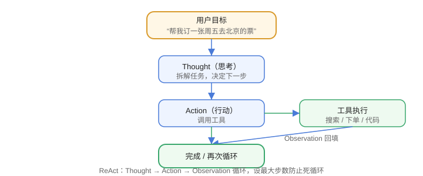

# Agent 原理

AI Agent 是「大模型 + 规划 + 工具 + 记忆」的组合体：模型负责决策，工具负责执行，循环往复直到任务完成。它和聊天机器人最大的区别是**能采取行动**。

## 什么是 Agent

```text
聊天机器人：用户问 → 模型答
AI Agent：  用户给目标 → 模型规划 → 调用工具 → 观察结果 → 再规划 → 完成
```

Agent 四要素：

| 要素 | 作用 |
| --- | --- |
| 模型（LLM） | 决策、推理、生成 |
| 规划（Planning） | 拆解任务、决定下一步 |
| 工具（Tools） | 执行动作：搜索、代码、API、文件 |
| 记忆（Memory） | 保存上下文与历史经验 |

## 感知-规划-行动循环（ReAct）



ReAct 模式把“推理（Reason）”和“行动（Act）”交替进行：

```text
Thought: 用户要查上海天气，需要天气 API
Action: call weather_api(city="上海")
Observation: {"temp": 28}
Thought: 天气 28 度，组织回答
Answer: 上海今天 28 度
```

## Agent 与 Chatbot 对比

| 维度 | Chatbot | Agent |
| --- | --- | --- |
| 目标 | 回答 | 完成任务 |
| 工具 | 无/少 | 丰富 |
| 自主性 | 低 | 高 |
| 状态 | 单轮/多轮 | 多步循环 |
| 风险 | 低 | 需要控制边界 |

## 常见 Agent 范式

| 范式 | 说明 |
| --- | --- |
| ReAct | 推理 + 行动交替 |
| Plan-and-Execute | 先整体规划，再逐步执行 |
| Reflection | 生成后自我检查修正 |
| Tool-Use | 以工具调用为核心 |

## 单 Agent 的局限

1. 上下文有限：长任务需要记忆与压缩。
2. 单点失败：模型决策错一步，后续全错。
3. 工具越多越难选：需要工具描述与路由。
4. 安全风险：自主执行需要权限与确认机制。

## 易错点

::: danger 常见错误
1. 把 Agent 当“更聪明的聊天框”：Agent 的核心是行动循环，没有工具就没有 Agent。
2. 无限循环：不设最大步数，任务卡死或烧钱。
3. 一次规划到底：Plan-and-Execute 也要允许根据中间结果调整。
4. 忽略记忆：多步任务中模型忘记上文，结果错乱。
5. 工具失败不处理：Observation 异常要引导模型换策略。
6. 没有退出条件：任务完成判断不清晰，循环不停。
:::

## 验证方式

1. 实现一个最小 ReAct 循环（模型 + 天气工具），跑通「规划→调用→回答」。
2. 给 Agent 一个需要 3 步以上工具调用的任务，观察循环。
3. 测试最大步数限制与失败重试逻辑。

## 参考资料

- ReAct 论文：https://arxiv.org/abs/2210.03629
- OpenAI Agents 文档：https://platform.openai.com/docs/guides/agents
- Anthropic Agent 指南：https://www.anthropic.com/engineering/building-effective-agents
