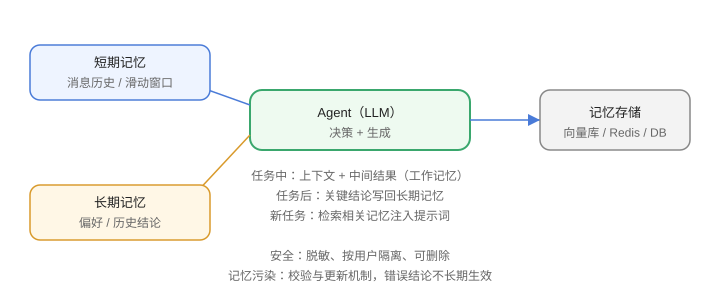

# 记忆与上下文

Agent 的长任务离不开**记忆**：短期记忆（当前任务上下文）与长期记忆（跨会话知识）。上下文管理决定 Agent 能否“记得住、想得全”。



## 三层记忆

| 类型 | 内容 | 实现 |
| --- | --- | --- |
| 短期记忆 | 当前任务的消息历史 | 上下文窗口 |
| 工作记忆 | 任务中的中间结果 | 状态存储 / scratchpad |
| 长期记忆 | 跨会话的用户偏好、历史 | 数据库 / 向量库 |

## 短期记忆与上下文管理

```text
完整历史 → 摘要 → 滑动窗口 → 检索相关片段
```

1. 消息太长：截断或摘要。
2. 关键信息：写入显式状态，不只靠对话。
3. 工具结果：只保留必要字段，避免塞爆上下文。

## 长期记忆实现

```text
记忆写入：任务完成后把关键结论/偏好存库
记忆读取：新任务开始时检索相关记忆注入
```

```python [memory.py]
# 向量检索示意
memory = vector_store.search(user_id, query, top_k=5)
prompt = f"已知用户信息：{memory}\n当前任务：{task}"
```

## 记忆的安全与隐私

1. 敏感信息脱敏后入库。
2. 用户可查看/删除自己的记忆（GDPR 意识）。
3. 记忆检索范围与权限绑定。

## 常见实现

| 方案 | 适用 |
| --- | --- |
| Redis / 关系库 | 简单 KV 记忆 |
| 向量库（pgvector、Milvus） | 语义检索记忆 |
| 记忆框架（Mem0、Letta） | 自动提取与管理 |

## 易错点

::: danger 常见错误
1. 全量历史塞上下文：成本高、关键信息被稀释。
2. 记忆“只写不读”：存了不用等于没存。
3. 记忆注入过多：把不相关的旧记忆塞进来干扰判断。
4. 记忆污染：一次错误结论被当成事实长期使用，需校验与更新机制。
5. 隐私裸奔：记忆里存密码/身份证且不脱敏。
6. 多用户共享记忆：必须按用户隔离。
:::

## 验证方式

1. 做一个“记住用户偏好”的最小 Agent：第二轮对话时读取记忆生效。
2. 对比“全量历史”与“摘要+检索”的 Token 消耗与效果。
3. 测试记忆检索是否只返回该用户的数据。

## 参考资料

- Mem0：https://mem0.ai/
- Letta（原 MemGPT）：https://www.letta.com/
- RAG 与上下文工程：https://www.anthropic.com/news/context-engineering
