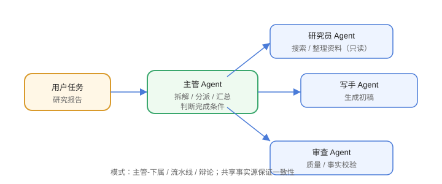

# 多智能体

多智能体（Multi-Agent）把任务拆给多个角色 Agent 协作，适合复杂、可分域的任务。收益是职责清晰、可并行；代价是协调、成本与一致性更难控制。



## 为什么需要多智能体

1. 单一 Agent 上下文有限、提示词过长。
2. 不同角色需要不同工具与权限（只读/写）。
3. 复杂任务可并行处理（多路检索、多路生成）。
4. 专业角色提升输出质量（如“研究员 + 写手 + 审查”）。

## 常见协作模式

| 模式 | 说明 | 适用 |
| --- | --- | --- |
| 主管-下属 | 主管拆解、分派、汇总 | 任务编排 |
| 流水线 | A 输出 → B 输入 | 内容生产 |
| 辩论/评审 | 多 Agent 互相评审 | 提高质量 |
| 市场/协商 | 多个 Agent 模拟各方 | 谈判、推演 |

## 主管-下属示例

```text
主管（Orchestrator）
├── 研究员 Agent（只读：搜索、整理资料）
├── 写手 Agent（生成初稿）
└── 审查 Agent（检查质量、事实）
主管汇总 → 最终输出
```

## 通信与协调

1. **结构化消息**：每个 Agent 输出固定结构（结果 + 状态 + 元数据）。
2. **共享状态**：统一 store 存放中间产物。
3. **终止条件**：主管判断“是否完成”，避免互相等待。
4. **超时**：子 Agent 卡住时主管可重派或降级。

## 成本与挑战

1. **Token 成本**：多 Agent 多轮调用，成本线性增长。
2. **延迟**：串行协作延迟叠加。
3. **一致性**：每个 Agent 的提示词不一致导致风格漂移。
4. **调试困难**：链路长，定位问题难，需完整 trace。

## 何时不该用

1. 单 Agent 能完成的任务。
2. 任务高度耦合、难以拆分。
3. 对延迟/成本极敏感。

## 易错点

::: danger 常见错误
1. 为了“炫技”强行多 Agent：先单 Agent，验证瓶颈再拆分。
2. 角色职责重叠：两个 Agent 抢同一职责，输出冲突。
3. 没有共享事实源：各 Agent 各说各话，用共享记忆/资料库。
4. 无限互相评审：设轮数上限。
5. 权限没隔离：写操作 Agent 和只读 Agent 用同一权限。
6. 不记录 trace：多 Agent 链路出问题无法复盘。
:::

## 验证方式

1. 实现「主管 + 研究员 + 写手」三 Agent 流水线。
2. 对比单 Agent 与多 Agent 在同一任务上的质量与成本。
3. 给子 Agent 注入故障，验证主管的重试与降级。

## 参考资料

- AutoGen：https://microsoft.github.io/autogen/
- CrewAI：https://www.crewai.com/
- LangGraph Multi-Agent：https://langchain-ai.github.io/langgraph/how-tos/
