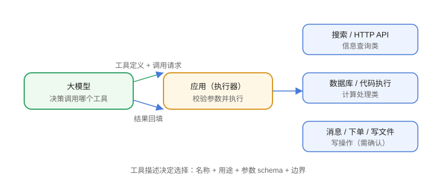

# 工具调用

工具调用（Tool Use / Function Calling）是 Agent 的“手脚”：模型输出结构化调用请求，应用执行并把结果回填给模型，模型基于结果继续。



## 工作原理

```text
1. 把工具列表（名称、描述、参数 schema）发给模型
2. 模型决定调用哪个工具，输出结构化参数
3. 应用执行工具（真实动作）
4. 把结果作为消息回填
5. 模型基于结果生成最终回答或继续调用
```

## 定义工具（JSON Schema）

```json [tools.json]
[
  {
    "type": "function",
    "function": {
      "name": "get_weather",
      "description": "查询指定城市的天气",
      "parameters": {
        "type": "object",
        "properties": {
          "city": { "type": "string", "description": "城市名" }
        },
        "required": ["city"]
      }
    }
  }
]
```

## 工具描述的重要性

模型靠描述决定用哪个工具：

1. **名称**：动词 + 对象，如 `send_email`。
2. **描述**：说明用途、何时使用。
3. **参数 schema**：类型、必填、枚举、默认值。
4. **边界**：写清限制（如“仅支持国内城市”）。

描述含糊 → 模型乱选工具或参数错误。

## 执行与回填

```text
模型输出：get_weather(city="上海")
执行结果：{"temp": 28, "condition": "多云"}
回填消息：Observation: {"temp": 28, "condition": "多云"}
```

回填后模型可以：

1. 直接组织回答。
2. 继续调用其他工具（如订票）。
3. 要求澄清（参数不足时）。

## 常见工具类型

| 类型 | 示例 |
| --- | --- |
| 信息查询 | 搜索、数据库查询、HTTP API |
| 写操作 | 发送消息、下单、创建工单 |
| 计算 | 代码执行、数学计算 |
| 文件 | 读写、上传下载 |
| 系统 | 命令执行、进程管理 |

## 易错点

::: danger 常见错误
1. 工具描述写得太短：模型选错工具，加示例参数。
2. 结果回填格式不稳定：用统一消息结构（如 JSON 字符串）。
3. 不校验工具输出：把模型可能编造的结果当真，执行前校验。
4. 写操作无确认：危险工具要人工确认或权限分级。
5. 工具执行超时：设超时与重试，避免 Agent 卡住。
6. 工具数量过多：先按场景分组/路由，减少选择困难。
:::

## 验证方式

1. 定义 2~3 个工具，让模型自动选择并调用。
2. 输入一个“该用 A 工具”但描述含糊的问题，观察选错概率。
3. 模拟工具失败，验证模型能否换策略或如实告知。

## 参考资料

- OpenAI Function Calling：https://platform.openai.com/docs/guides/function-calling
- Anthropic Tool Use：https://docs.anthropic.com/en/docs/build-with-claude/tool-use/overview
- MCP（模型上下文协议）：https://modelcontextprotocol.io/
