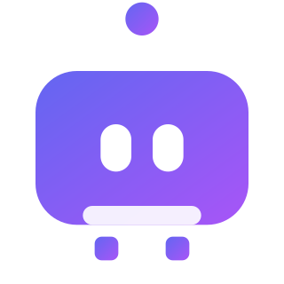

# Agent 应用

AI Agent（智能体）是能**自主规划、调用工具、完成任务**的大模型应用形态，从“问答”升级为“做事”，是当前 AI 应用的核心方向。

- [Agent 原理](AgentPrinciples/index.md)
- [工具调用](ToolCalling/index.md)
- [工作流编排](Workflow/index.md)
- [多智能体](MultiAgent/index.md)
- [记忆与上下文](MemoryContext/index.md)
- [安全边界](Safety/index.md)
- [落地案例](Practice/index.md)
- [常见问题与最佳实践](FAQ/index.md)
