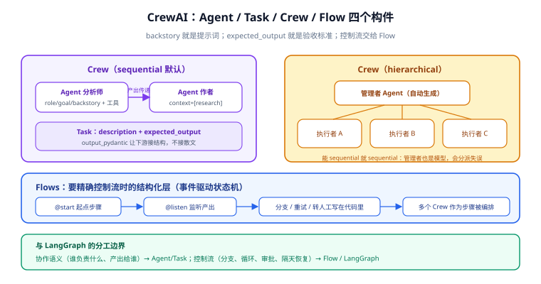

# CrewAI 角色编排

CrewAI 用「**剧组**」组织多智能体：每个 Agent 有角色（role）、目标（goal）、人设（backstory），每个 Task 有职责与预期产出，Crew 把它们攒在一起开工。它解决的不是「流程怎么走」（那是 LangGraph 的事），而是「**怎么把一段模糊的协作需求拆成一组明确的角色与任务**」。



## 1. 四个构件：Agent、Task、Crew、Process

| 构件 | 关键字段 | 一句话 |
| --- | --- | --- |
| **Agent** | `role` / `goal` / `backstory` / `tools` / `llm` | 一个被角色化提示词包装的模型调用 |
| **Task** | `description` / `expected_output` / `agent` / `context` / `output_pydantic` | 一份「任务委托书」，产出可给后续任务用 |
| **Crew** | `agents` / `tasks` / `process` / `memory` | 剧组本身，`kickoff()` 开跑 |
| **Flow** | `@start` / `@listen` / 状态 | 结构化流程层：精确控制多个 Crew / 步骤的先后与分支 |

**backstory 就是提示词**——角色设定、专业背景、口吻约束都写在里面。写 backstory 的功力直接决定产出质量，本质是 [提示词工程](../../PromptEngineering/index.md) 的应用场景。

```python
from crewai import Agent, Task, Crew, Process
from crewai_tools import SerperDevTool

researcher = Agent(
    role="资深行业分析师",
    goal="用可靠数据源调研给定主题，产出结构化的要点清单",
    backstory="十年科技行业研究经验，坚持每个结论都给出处，从不编造数据。",
    tools=[SerperDevTool()],
    llm="openai/gpt-4.1-mini",
    verbose=False,
)

writer = Agent(
    role="技术专栏作者",
    goal="把研究要点改写成面向工程师的短文",
    backstory="为多家技术媒体撰稿，风格克制、句子短、先结论后论据。",
    llm="openai/gpt-4.1-mini",
)

research = Task(
    description="调研：{topic} 在 2026 年的现状与三个关键趋势。",
    expected_output="8~12 条要点，每条含一句事实 + 来源链接。",
    agent=researcher,
)

article = Task(
    description="基于研究要点写一篇 500 字短文。",
    expected_output="Markdown 短文，先结论后论据，不引入研究要点之外的事实。",
    agent=writer,
    context=[research],                    # 研究产出作为写作输入
    output_pydantic=ArticleSchema,         # 结构化产出，下游好接
)

crew = Crew(agents=[researcher, writer], tasks=[research, article],
            process=Process.sequential, verbose=False)

result = crew.kickoff(inputs={"topic": "AI 编排框架"})
```

## 2. Process：顺序还是层级

| Process | 怎么走 | 什么时候用 |
| --- | --- | --- |
| **sequential** | 按 tasks 列表顺序执行 | 流程可预知、任务间有明确依赖——**默认选它** |
| **hierarchical** | 自动生成一个「管理者」Agent 动态分派 | 任务集可并行、谁先谁后难预知 |

::: warning hierarchical 不是免费的
管理者模型也是模型，会分派失误、会漏任务、会增加一次模型调用的延迟与成本。**流程能写死就用 sequential**；确实需要动态分派时，对比一下「hierarchical」与「用 [Flows](#_3-flows-要精确控制流时的结构化层) 写死分派逻辑」——后者可测试、可重放。
:::

## 3. Flows：要精确控制流时的结构化层

1.x 把 Flows 作为主推能力：用装饰器表达**事件驱动的状态机**，多个 Crew 可以作为 Flow 的步骤被编排——这正是 CrewAI 与 LangGraph 思路「会师」的地方：

```python
from crewai.flow.flow import Flow, listen, start

class ReviewState(BaseModel):
    draft: str = ""
    passed: bool = False

class WritingFlow(Flow[ReviewState]):
    @start()
    def begin(self):
        self.state.draft = draft_crew.kickoff(inputs={...}).raw

    @listen("begin")
    def check(self):
        self.state.passed = compliance_check(self.state.draft)

    @listen("check")
    def finish(self):
        if not self.state.passed:          # 分支、重试、转人工都写在这里
            self.state.draft = rewrite(self.state.draft)
```

::: tip CrewAI 与 LangGraph 的分工边界
**协作语义（谁负责什么、产出给谁）交给 CrewAI 的 Agent/Task；控制流（分支、循环、审批、恢复）交给 Flow 或 LangGraph。** 在 CrewAI 里需要「暂停三天等审批」时，要么用 Flows 的状态 + 外部触发模拟，要么承认这活儿该由 LangGraph 干（见 [人工介入工程化](../HumanLoop/index.md) 第 6 节）。
:::

## 4. 工具与记忆

| 能力 | 用法 | 注意 |
| --- | --- | --- |
| 工具 | `tools=[...]` 挂到 Agent 上 | 工具描述写清「什么时候该用」，与 Agent 职责匹配 |
| 结构化产出 | `output_pydantic=模型` | 下游接代码而不是解析散文 |
| 短期记忆 | `Crew(memory=True)` | 会话内上下文共享 |
| 长期记忆 / 知识 | 内置 mem0 / Chroma 集成 | 跨会话事实；与 [RAG 专题](../../RAG/index.md) 的检索链路互补 |
| HITL | `human_input=True`（任务级确认） | 无检查点恢复，见第 3 节边界 |

## 5. 角色设计的四个实务

1. **职责单一**：「分析师兼写手兼审校」的 Agent 产出一定混乱——一个 Agent 一个角色，宁多勿混。
2. **expected_output 是验收标准**：写成「可检查的格式描述」（条数、结构、必含字段），不是「写好一点」。
3. **backstory 给约束不给性格**：「坚持给出处、不编造」是约束；「热情开朗」是噪声。
4. **context 显式连线**：任务输入靠 `context=[...]` 指明，别指望模型自己猜上游产出——那是最常见的「Crew 输出断裂」根因。

## 6. 易错点清单

1. **expected_output 写成形容词**：「高质量、专业」无法验收——写结构化描述。
2. **hierarchical 当默认**：管理者模型引入新的不确定性——能 sequential 就 sequential。
3. **把控制流塞进 backstory**：「如果质量不行就重写」这类逻辑应写在 Flow / 代码里。
4. **工具堆给每个 Agent**：工具越多选择越乱——按角色给最小工具集。
5. **指望 human_input 做审批流**：它阻塞且不持久——审批场景用 LangGraph（见 [HumanLoop](../HumanLoop/index.md)）。
6. **忽略成本**：一次 `kickoff` 是 N 次模型调用（含内部重试），先小规模试跑估算单次成本。

## 7. 验证方式

1. **Crew 可跑**：按第 1 节代码跑通双 Agent 流水线，`result.raw` 有产出且 `output_pydantic` 字段齐全。
2. **context 生效**：在 writer 的任务里临时打印 context 长度，确认拿到了研究产出。
3. **结构化产出可解析**：`result.pydantic` 能直接访问字段（不再 `json.loads` 散文）。
4. **流程分支可测**：Flow 的 `check` 步骤用固定输入单测，断言分支走向与状态变化。
5. **成本可见**：verbose / 回调里核对一次 kickoff 的 token 消耗与调用次数。

## 相关文档

- [框架选型与体系总览](../Overview/index.md)：两大框架的定位差异
- [多智能体协作模式](../Patterns/index.md)：supervisor / handoffs 在 LangGraph 侧的对等做法
- [实战](../Practice/index.md)：CrewAI 研究小组的完整可运行案例
- [提示词工程 · 结构化提示词](../../PromptEngineering/StructuredPrompts/index.md)：backstory 与 expected_output 的写法根
- [Agent 应用 · 多智能体](../../Agent/MultiAgent/index.md)：多智能体的概念层（框架无关）

## 参考资料

- CrewAI Agents（官方）：https://docs.crewai.com/concepts/agents
- CrewAI Flows（官方）：https://docs.crewai.com/concepts/flows
- CrewAI Processes（官方）：https://docs.crewai.com/concepts/processes
- CrewAI 更新日志（版本核对）：https://docs.crewai.com/changelog
