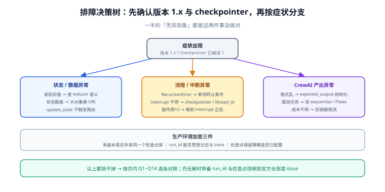

# 常见问题与最佳实践

本页汇总 LangGraph 与 CrewAI 的高频问题，按「先定位、再给解法」组织。排障前先确认两件事：**版本是 1.x**（0.x 的教程代码大量失效）与 **checkpointer 已编译进图**（没有它，一半的「灵异现象」都解释不通）。

## 1. 状态相关

**Q1：节点里更新了字段，下游读到的却是旧值？**
按顺序查：① 该字段是不是 `Annotated` 追加语义而你预期覆盖（或反过来）——reducer 语义决定合并方式；② 节点是否只返回了增量、却被你在外部又合并了一次；③ 并行分支写覆盖字段——结果取决于完成顺序，改追加或在汇合点收口。

**Q2：状态越跑越大，检查点写入越来越慢？**
状态里放大对象了。把大文本 / 大列表换成 URI 或 ID，用时再取；可推导数据（如「已处理数量」可以从列表长度算）从状态里剔除。配合 [持久化与记忆](../Persistence/index.md) 第 4 节的保留策略。

**Q3：`update_state` 改完状态，流程行为没变？**
`update_state` 只改数据不触发路由——改完后要么 `invoke(None, cfg)` 让图从当前节点继续，要么确认路由函数读的字段确实被改到。

## 2. 流程相关

**Q4：图跑着跑着抛 `GraphRecursionError`？**
不是把 `recursion_limit` 调大就完了——先单测终止条件：把每个条件边的路由函数当纯函数，构造「正常 / 边界 / 恶意」三类状态断言返回值。最常见的根因是「失败分支忘了收敛到 END」。

**Q5：`interrupt` 不暂停，直接跑完了？**
三个检查点：① `compile(checkpointer=...)` 忘了配；② 每次请求换了 `thread_id`，运行时以为是新会话；③ 版本低于 0.2 的旧教程写法（`interrupt_before` 参数是另一套机制，与本页 `interrupt()` 函数不同代）。

**Q6：恢复执行后副作用执行了两次？**
[人工介入工程化](../HumanLoop/index.md) 第 1 节的铁律：恢复后 interrupt 所在节点会**从头重跑**，节点内 interrupt 之前的副作用会再执行一遍。把副作用移到 interrupt 之后。

**Q7：生产上多副本部署，恢复时状态对不上？**
所有副本必须连**同一个**检查点库；内存检查点在多 worker 下等于每个副本各活各的。见 [持久化与记忆](../Persistence/index.md) 第 2 节三条硬要求。

## 3. CrewAI 相关

**Q8：Agent 不按角色出牌，产出格式乱？**
三处收敛：① `expected_output` 写成可校验的结构描述（条数、字段、格式），不是「专业一点」；② 用 `output_pydantic` 强制结构化产出；③ backstory 写约束不写性格。仍不行时把任务拆小——一个任务干一件事。

**Q9：hierarchical 模式下管理者漏派任务？**
接受现实：管理者也是模型。改 sequential（流程写死）或用 Flows 显式编排分派逻辑；必须动态分派时，加「任务完成后核对清单」的校验节点。

**Q10：一次 `kickoff` 花了多少 token / 多少钱？**
verbose 输出与回调里有用量；生产环境用事件监听接 Langfuse 之类汇总。先小规模试跑估算单次成本，再乘以预估调用量——Crew 的成本是**任务数 × 模型调用**（含内部重试），不是「一次调用」。

**Q11：CrewAI 能不能像 LangGraph 那样隔天恢复？**
不能——CrewAI 没有检查点级恢复。要「暂停等人再继续」就用 LangGraph（[人工介入工程化](../HumanLoop/index.md)）；或在 Flows 里把「等审批」拆成两个 Flow，中间状态落你自己的存储——这是自建状态机，谨慎评估。

## 4. 选型与协作

**Q12：supervisor 模式该用 `langgraph-supervisor` 包吗？**
不。该包已停止维护。按 [多智能体协作模式](../Patterns/index.md) 第 2 节用 `Command` 自建，三十行以内且完全可控。

**Q13：该用 LangGraph 还是 CrewAI？**
一句话：流程规则驱动、要持久化审批 → LangGraph；角色分工协作、快速验证 → CrewAI；复杂系统可以混合（图节点内嵌 Crew）。更细的判据表见 [框架选型与体系总览](../Overview/index.md) 第 2 节。

**Q14：要不要给每个 Agent 用最强模型？**
不要。路由、分类、审批分派这类轻决策用小模型；核心生成与复杂工具选择才用大模型。这一条对 supervisor 的主管节点尤其有效——主管调用次数最多。

## 5. 最佳实践速查

1. **状态设计先行**：动笔写节点之前，先在纸上列全状态字段与每个字段的 reducer 语义。
2. **路由函数全部纯函数化**：能单测、能进 CI，是图系统最便宜的回归防线。
3. **副作用只出现在两种地方**：审批决策之后；或带幂等键的写操作。
4. **评估集与图同仓库同节奏**：提示词、模型版本、图结构三处改动都要跑。
5. **thread_id 纪律**：会话 / 工单维度全局唯一、跨请求稳定。
6. **升级前查两处**：`langgraph.prebuilt` 的弃用迁移（预置 Agent 已在 `langchain.agents`）；crewai 0.x → 1.x 的破坏性变更。

## 相关文档

- [框架选型与体系总览](../Overview/index.md)：选型判据表
- [LangGraph 状态机深入](../StateGraph/index.md)：状态与路由的机制细节
- [持久化与记忆](../Persistence/index.md)：checkpointer 与 store
- [人工介入工程化](../HumanLoop/index.md)：interrupt 与审批
- [CrewAI 角色编排](../CrewAI/index.md)：角色与任务设计
- [生产化：部署与可观测](../Production/index.md)：上线检查清单
- [LangChain · 常见问题与最佳实践](../../LangChain/FAQ/index.md)：装配层的高频问题
- [Agent 应用 · 常见问题与最佳实践](../../Agent/FAQ/index.md)：概念层的高频问题

## 参考资料

- LangGraph 常见错误（官方 FAQ）：https://docs.langchain.com/oss/python/langgraph/graph-api#common-errors
- LangGraph 发布与版本策略：https://github.com/langchain-ai/langgraph/blob/main/RELEASES.md
- CrewAI 文档首页：https://docs.crewai.com/
