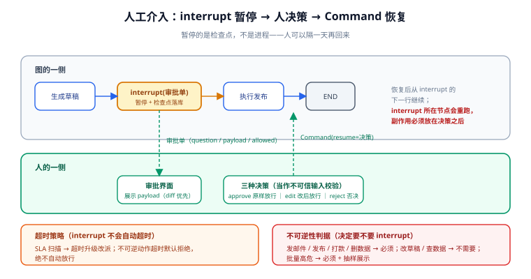

# 人工介入工程化

人工介入不是「弹个确认框」——它是一套**暂停、移交决策、恢复执行**的机制工程。LangGraph 把它做成一等公民：`interrupt()` 暂停图并落检查点，人可以隔一分钟、隔一天甚至隔一周回来，`Command(resume=...)` 从断点继续。本页讲怎么把这套原语落成生产级的审批机制。



## 1. 原语：interrupt 与 Command

```python
from langgraph.types import interrupt, Command

def request_approval(state: PublishState) -> dict:
    # 执行到这里：图暂停、检查点落库、invoke 返回中断信息
    decision = interrupt({
        "question": "是否发布这篇文章？",
        "payload": {
            "title": state["title"],
            "draft": state["draft"],
            "risk_flags": state["risk_flags"],
        },
        "allowed": ["approve", "edit", "reject"],
    })
    # 恢复后从这一行继续，decision 即 Command(resume=...) 的值
    if decision["type"] == "edit":
        return {"draft": decision["value"]}
    if decision["type"] == "reject":
        return {"status": "rejected", "draft": "(已否决)"}
    return {"status": "approved"}
```

```python
cfg = {"configurable": {"thread_id": "post-42"}}
result = graph.invoke(inputs, cfg)
# result['__interrupt__'] 非空 → 把 payload 渲染到审批界面

# 人审完后恢复：
graph.invoke(Command(resume={"type": "approve"}), cfg)   # 从 interrupt 下一行继续
```

三条铁律：

1. **`interrupt` 之前所有副作用必须已完成且可回放**——恢复后**不会重放 interrupt 之前的节点**，但会**重跑 interrupt 所在节点**，该节点里 interrupt 之前的代码会再执行一遍。所以「先发邮件再 interrupt 确认」是灾难：恢复后会再发一封。
2. **resume 的值要当作不可信输入**：校验 `allowed` 集合、类型与范围，就像校验用户表单。
3. **必须配 checkpointer**：没编译进 checkpointer 的图，`interrupt` 不会暂停（静默失效）。

::: danger 最经典的错误：interrupt 节点里先做事再等人
```python
# 错误：恢复后会再执行一遍 send_email
def bad_node(state):
    send_email(state["draft"])          # 副作用
    ok = interrupt("确认发送？")          # 恢复后回到节点开头 → 邮件发两次
    return {}

# 正确：先 interrupt 拿决策，后执行副作用
def good_node(state):
    ok = interrupt({"question": "确认发送？", "allowed": ["yes", "no"]})
    if ok["type"] == "yes":
        send_email(state["draft"])      # 只在决策之后执行一次
    return {}
```
:::

## 2. 审批类型：approve / edit / reject

| 类型 | 语义 | resume 值 | 后续状态 |
| --- | --- | --- | --- |
| **approve** | 原样放行 | `{"type": "approve"}` | 流程继续，记录「谁批的」 |
| **edit** | 改了再放行 | `{"type": "edit", "value": 新内容}` | 用新值更新状态字段后继续 |
| **reject** | 否决 | `{"type": "reject"}` | 走否决分支（归档 / 通知提交人） |

把三种类型设计成**状态机的三个转移**而不是三个 if：`edit` 更新哪个字段、`reject` 触发哪些通知，都写在图里，审批界面只负责收集决策。

## 3. 超时与升级：等人不能无限等

interrupt 没有「自动超时」——它就是一个挂起的检查点。超时是你自己的调度策略：

| 策略 | 做法 | 适用 |
| --- | --- | --- |
| **SLA 扫描** | 定时任务扫「处于 interrupt 状态超过 X 小时」的 thread | 审批 SLA 看板 |
| **自动升级** | 超时后通知上一级审批人（改派而非自动放行） | 有审批层级的组织 |
| **超时默认拒绝** | 到点未批即按 reject 走，宁可重新发起 | 不可逆动作的保守默认 |
| **超时自动放行** | ❌ 不要对不可逆动作这么做 | —— |

::: warning 「自动放行」是把人的责任转嫁给定时器
低风险动作（如重新排版）可以超时放行；**发外部邮件、打款、删数据这类不可逆动作，超时默认必须是「不执行」**。判据见第 5 节。
:::

## 4. 多级审批与并行会签

金额门槛、风险等级会产生多级审批——用**多个 interrupt 节点串联**表达层级，用**并行分支 + 汇合**表达会签：

```python
# 串联：金额超过 1 万加一级
def route_approval(state):
    return "manager_approval" if state["amount"] > 10000 else "execute"

# 会签：法务与安全并行审，都通过才继续（汇合节点判断两份意见）
builder.add_edge("legal_review", "merge_review")
builder.add_edge("security_review", "merge_review")
```

每级 interrupt 的 payload 都要带**上下文**：不只问「批不批」，把「前一级谁批的、批注是什么、当前数据是什么」一并给到——审批人缺上下文就会盲批，机制再好也白搭。

## 5. 什么动作值得 interrupt：不可逆性判据

| 动作特征 | 例子 | 是否 interrupt |
| --- | --- | --- |
| 不可逆 + 外部影响 | 发邮件、发布内容、打款 | **必须** |
| 不可逆 + 内部影响 | 删生产数据、改权限 | **必须** |
| 可逆但成本高 | 触发一次大规模计算 | 建议配合预算门槛 |
| 可逆且便宜 | 改草稿、查数据 | 不需要 |
| 批量高危 | 一次群发 10 万条 | 必须且**抽样展示**（不可能人看 10 万条，看的是统计与样本） |

::: tip 审批 UX 的三条实务
1. **payload 即审批单**：展示 diff 而非全文（改了什么比是什么重要）。
2. **决策要留痕**：谁、何时、批了什么、备注——落在业务审计表，检查点只保证流程。
3. **移动端可达**：审批卡在半夜是常态，通知渠道不通的审批流程形同虚设。
:::

## 6. 与 CrewAI 人工介入的分工

CrewAI 提供 `human_input` / `human_feedback` 钩子，适合**任务产出的人工确认**（写完一段让人看一眼再继续）；但它没有检查点级恢复——**「人三天后回来继续跑」这种场景只有 LangGraph 能接**。两者的取舍见 [CrewAI 角色编排](../CrewAI/index.md) 与 [多智能体协作模式](../Patterns/index.md)。

## 7. 验证方式

1. **暂停生效**：`invoke` 后检查返回值里的 `__interrupt__`，确认 payload 完整、图停在正确节点。
2. **恢复生效**：`Command(resume=...)` 后确认从断点继续（`stream_mode="updates"` 只出现后续节点）。
3. **副作用不重放**：在正确写法的节点里放置计数器（测试桩），恢复后确认副作用只执行一次。
4. **edit 生效**：`resume={"type": "edit", "value": ...}` 后，确认状态字段被更新且流程按新值走。
5. **超时升级**：插入一条过期的 interrupt 记录，跑 SLA 扫描任务，确认触发升级通知且**没有**自动放行。

## 相关文档

- [持久化与记忆](../Persistence/index.md)：interrupt 能暂停多久，取决于 checkpointer 的后端与保留策略
- [LangGraph 状态机深入](../StateGraph/index.md)：审批分支用条件边表达，路由函数可单测
- [实战](../Practice/index.md)：一个带两级审批的完整发布流水线
- [LangChain · 实战：带人工审批的检索增强 Agent](../../LangChain/Practice/index.md)：中间件层的轻量做法

## 参考资料

- LangGraph 中断（官方）：https://docs.langchain.com/oss/python/langgraph/interrupts
- `Command` 参考（官方）：https://langchain-ai.github.io/langgraph/reference/types/#langgraph.types.Command
- Human-in-the-loop 概念（官方）：https://docs.langchain.com/oss/python/langgraph/human-in-the-loop
