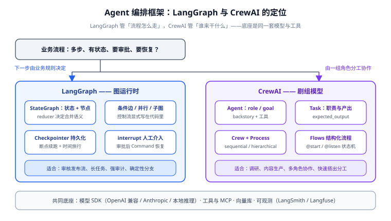

# 框架选型与体系总览

编排框架解决的是同一个问题——**让「多步、有状态、可能出错、可能要等人」的 AI 流程可控**——但两个主流框架的切入点完全不同：LangGraph 从**状态机**切入（流程是一张图），CrewAI 从**角色分工**切入（流程是一组人合作）。本页给出选型判据与整体体系，后续页面分别深入。

## 1. 先回答：需不需要编排框架

编排框架不是免费午餐——它带来学习成本、抽象层调试成本和一套持久化基础设施。按下表自查：

| 你的流程长这样 | 建议 | 理由 |
| --- | --- | --- |
| 一次提问、一次检索、固定 2~3 步 | 直接调 SDK（见 [大模型应用开发](../../LLMApp/index.md)） | 图机制是纯开销 |
| 模型 + 工具调用循环（ReAct） | LangChain `create_agent` 或直接 SDK | 预置循环够用，不必手画图 |
| 中间要**人工审批**、金额门槛、发布动作 | LangGraph | `interrupt` + 检查点是人机协同的正解 |
| 进程崩了要**从断点续跑**、流程跑几小时几天 | LangGraph | 持久化执行（durable execution）是核心卖点 |
| **多个角色**按分工协作（研究员、写手、审校） | CrewAI | Role/Task 装配模型最快 |
| 复杂分支 + 多角色混合 | LangGraph 为主，节点内可嵌 Crew | 图管控制流，Crew 管一段协作 |

::: tip 一句话理解
**LangGraph 管「流程怎么走」，CrewAI 管「谁来干什么」。** 一个复杂系统完全可能两者都用：外层 LangGraph 图控制审核发布流程，其中一个节点是一个 CrewAI Crew 在做资料调研。
:::

## 2. 两大框架的定位差异

| 维度 | LangGraph | CrewAI |
| --- | --- | --- |
| 心智模型 | **图运行时**：节点是函数、边是转移、状态在图中流动 | **剧组模型**：Agent 有角色目标、Task 有描述与负责人、Crew 负责开工 |
| 控制流 | 显式：条件边、并行、子图、循环都写在代码里 | 隐式：Process 决定顺序（sequential / hierarchical），Flows 提供显式结构 |
| 持久化 | 一等公民：checkpointer 抽象 + 多后端 + 时间旅行 | 有记忆（Memory）与知识（Knowledge），但无检查点级恢复 |
| 人工介入 | `interrupt` / `Command(resume=...)` 原语 | `human_input` / `human_feedback` 钩子，粒度较粗 |
| 流式 | 四种 stream_mode，令牌级到状态级 | 回调与事件监听 |
| 部署 | 自托管（FastAPI 包装）/ langgraph-cli / LangGraph Platform | 纯库 + 自托管；有 CrewAI+ 托管增值服务 |
| 学习曲线 | 陡：要懂状态设计、reducer、图语义 | 缓：写清角色与任务就能跑 |
| 适合团队 | 平台/后端工程师，流程强业务规则 | 内容生产、调研分析类协作场景 |

两条独立判据：

1. **流程的「下一步」由谁决定**：由业务规则和数据决定（审批通过走 A、不通过走 B）→ 图；由角色自主决定 → Crew。
2. **要不要「暂停一周等人审批再继续」**：要 → LangGraph（无检查点的暂停只能靠进程挂着或自己造轮子）。

## 3. LangGraph 的分层体系

LangGraph 只有一个运行时包，但围绕它有三层东西，别混为一谈：

| 层 | 是什么 | 包 / 产品 |
| --- | --- | --- |
| **运行时** | 图、状态、检查点、中断、流式 | `langgraph`（MIT 开源） |
| **预置 Agent** | `create_agent` 等预构建图 | `langchain.agents`（`langgraph.prebuilt` 已迁出并弃用） |
| **平台** | 托管部署、持久化、Cron、Studio 调试 UI | LangGraph Platform（商业），自托管用 `langgraph-cli` 起本地 server |

开源运行时**不依赖** LangChain——可以只用 `langgraph` 加任意模型 SDK；但生态里绝大多数示例默认你装了 LangChain。生产系统用 LangSmith 做追踪是常见搭配，但换 Langfuse 等开源方案也完全可行（见 [生产化](../Production/index.md)）。

## 4. CrewAI 的分层体系

| 层 | 是什么 | 说明 |
| --- | --- | --- |
| **Agent** | 角色：role / goal / backstory + 模型 + 工具 | 一段被角色化提示词包装的模型调用 |
| **Task** | 任务：description、expected_output、assigned agent | 任务的产出可以给后续任务用（context） |
| **Crew** | 剧组：Agent + Task + Process + 记忆 | `kickoff()` 开跑 |
| **Flows** | 结构化流程层：`@start` / `@listen` 装饰的状态机 | 1.x 主推：需要精确控制流时用 Flow 编排多个 Crew |
| **Enterprise** | 托管部署与观测 | 商业产品，与开源版分工明确 |

::: danger CrewAI 不是「低代码玩具」也不要神化
CrewAI 的装配模型上手快，但**角色不等于可靠**：Agent 会偏离角色设定、任务产出不符合 `expected_output`、层级 Process 里的管理者模型也会判断失误。把它当「把提示词工程组织成结构」的手段，而不是「免调试的自动化」——验证与评估一节（[生产化](../Production/index.md)）对 CrewAI 同样适用。
:::

## 5. 与相邻方案的边界

| 方案 | 与本专题的分工 |
| --- | --- |
| 传统工作流引擎（BPMN / Flowable） | 确定性业务审批流用它；AI 那一段封装成节点被引擎调用。不要把两者混成一个系统 |
| 低代码平台（n8n / Coze / Dify） | 集成为主、分支简单时用平台；要单测与 CI 回归就写代码。详见 [Agent 应用 · 工作流编排](../../Agent/Workflow/index.md) |
| 直接调 SDK | 一次性的简单调用；见 [大模型应用开发](../../LLMApp/index.md) |
| Spring AI / Langchain4j（Java 侧） | 团队主语言是 Java 时先看那边；架构上 Python 编排服务 + Java 业务后端是常见混合形态 |

## 6. 验证方式

1. **环境就绪**：`pip install langgraph crewai` 后执行 `python -c "import langgraph, crewai; print(langgraph.__version__ if hasattr(langgraph,'__version__') else 'langgraph ok', crewai.__version__)"`，确认无 import 错误。
2. **版本对齐**：`pip index versions langgraph && pip index versions crewai`，输出与本页版本速览同代（1.x）。
3. **最小图可跑**：能按 [LangGraph 状态机深入](../StateGraph/index.md) 第 2 节跑通一个三节点图。
4. **最小 Crew 可跑**：能按 [CrewAI 角色编排](../CrewAI/index.md) 第 2 节跑通一个双 Agent Crew。

## 相关文档

- [LangGraph 状态机深入](../StateGraph/index.md)：图的四大件——状态、节点、边、检查点
- [CrewAI 角色编排](../CrewAI/index.md)：Role/Task/Crew/Flow 的装配细节
- [多智能体协作模式](../Patterns/index.md)：supervisor / handoffs / hierarchical 的落地对照
- [Agent 应用 · 工作流编排](../../Agent/Workflow/index.md)：编排方法论与低代码平台对比

## 参考资料

- LangGraph 概览（官方）：https://docs.langchain.com/oss/python/langgraph/overview
- CrewAI 核心概念（官方）：https://docs.crewai.com/concepts/agents
- LangChain / LangGraph 1.0 发布说明：https://docs.langchain.com/oss/python/releases/langchain-v1
