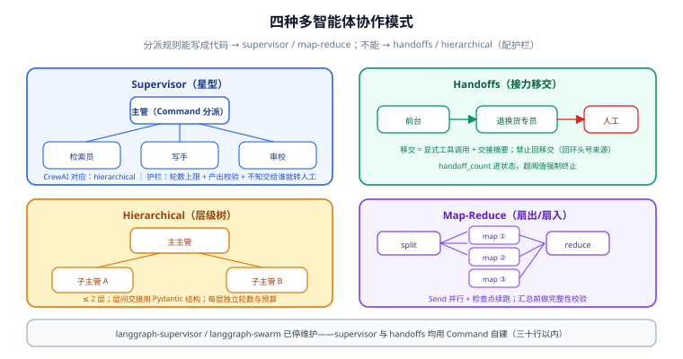

# 多智能体协作模式

多智能体不是「多开几个 Agent 就完事」——**协作拓扑决定故障模式**。本页讲四种在生产中站得住的模式（supervisor、handoffs、hierarchical、map-reduce），每种给出 LangGraph 与 CrewAI 两条落地路径。概念层（为什么需要协作、协作的代价）见 [Agent 应用 · 多智能体](../../Agent/MultiAgent/index.md)，本页只谈落地。



## 1. 四种模式总览

| 模式 | 拓扑 | 适用 | 主要风险 |
| --- | --- | --- | --- |
| **Supervisor（主管）** | 星型：主管分派，专家只与主管通信 | 职责可清晰分工（检索 / 计算 / 写作） | 主管成为单点瓶颈与错误放大器 |
| **Handoffs（接力）** | 链/网：Agent 间直接移交控制权 | 客服分流、工单路由 | 移交死循环（A 交 B、B 又交 A） |
| **Hierarchical（层级）** | 树：层层分派层层汇报 | 大任务天然分阶段 | 每层都是模型，误差逐层累积 |
| **Map-Reduce** | 扇出/扇入：拆分并行、汇总归并 | 批量同构子任务（多文档摘要） | 子任务同构性破坏后汇总失控 |

::: tip 一条选型判据
**分派规则能不能写成代码？** 能 → supervisor / map-reduce（规则在图里，可测试）；不能、依赖模型临场判断 → handoffs / hierarchical（接受不确定性，配好护栏）。
:::

## 2. Supervisor：最常用的起点

**LangGraph**：主管节点返回 `Command(goto=...)`，专家节点干完活回到主管，循环直到主管判断完成：

```python
from langgraph.types import Command
from typing import Literal

def supervisor(state) -> Command[Literal["researcher", "writer", "reviewer", "__end__"]]:
    next_agent, done = plan_with_model(state["messages"])   # 主管决策
    return Command(goto="__end__" if done else next_agent,
                   update={"messages": [f"→ 分派给 {next_agent}"]})

for expert in ("researcher", "writer", "reviewer"):
    builder.add_node(expert, make_expert(expert))           # 专家干完回主管
    builder.add_edge(expert, "supervisor")
```

**CrewAI**：hierarchical Process 天然就是 supervisor——管理者自动分派（见 [CrewAI 角色编排](../CrewAI/index.md) 第 2 节）；sequential 是「预写死分派」的退化形态。

**护栏三件**：① 主管决策轮数上限（复用 `recursion_limit`）；② 专家产出要校验（结构化输出 + 白名单检查）；③ 主管提示词里写明「不知道交给谁就结束并转人工」。

## 3. Handoffs：控制权移交

适合「同一会话里不同专长接力」——客服场景：前台识别意图，把**整个对话控制权**交给退换货专员。LangGraph 的 `Command(goto=...)` 就是移交原语；关键设计在**移交协议**：

1. **移交是显式动作**：当前 Agent 调用一个「移交给 B」的工具，产出交接摘要（不是把原始历史全部倾倒）。
2. **禁止回移交**：B 处理不了应升级到人或主管，而不是交回 A——回移交是死循环的头号来源。
3. **移交次数进状态**：`handoff_count` 累加字段 + 条件边，超过阈值强制终止。

::: danger 官方 supervisor / swarm 包已停维护
`langgraph-supervisor`（最后发布 2025-11）与 `langgraph-swarm` 已停止维护。supervisor 模式按本页第 2 节用 `Command` 自建（三十行以内）；swarm/handoffs 按第 3 节的移交协议自建。**不要为新项目引入这两个包。**
:::

## 4. Hierarchical：层级分派

「市场调研」拆成「数据收集 → 分析 → 报告」三个阶段，每阶段内部再由子主管分派——**树形分解只在任务结构真的分层时用**。落地要点：

- 每一层是一个子图（LangGraph）或一个 Crew（CrewAI），层间交接是**结构化产出**（Pydantic 模型），不是散文。
- 层数控制在 2 层以内——三层以上的层级智能体，误差累积和成本都会失控。
- 每层独立的轮数与预算上限，防止「子任务膨胀」。

## 5. Map-Reduce：批量同构子任务

见 [LangGraph 状态机深入](../StateGraph/index.md) 第 3 节的 `Send` 实现。补充两条批处理特有纪律：

- **子任务结果先落库再汇总**：100 个分片跑到第 80 个失败，靠检查点从断点续跑，而不是从头再来。
- **汇总前做完整性校验**：分片数对不上、有空产出就先补跑——汇总节点不要默默吞错。

## 6. 两个框架怎么选（协作视角)

| 维度 | LangGraph | CrewAI |
| --- | --- | --- |
| 协作拓扑 | 全部自建（代码即拓扑，可测试） | sequential / hierarchical 开箱即用 |
| 角色表达 | 手写角色提示词与路由 | role/goal/backstory 声明式 |
| 持久化与审批 | 检查点级，可隔天恢复 | 无检查点恢复 |
| 调试颗粒度 | 每个超步可回放 | 依赖 verbose / 回调 |
| 适合 | 需要控制流、审计、混合确定性步骤 | 纯协作、快速验证分工方案 |

**混合形态**：LangGraph 图的一个节点内部跑一个 CrewAI Crew——图管审批与恢复，Crew 管一段调研协作。代价是两套抽象都要维护，先确认真的都需要。

## 7. 验证方式

1. **拓扑核对**：LangGraph 下 `draw_mermaid()` 确认星型/链型结构与设计一致。
2. **轮数上限生效**：构造一个永不结束的对话，确认 `GraphRecursionError` / 轮数熔断触发。
3. **移交不回环**：单测移交函数，断言不存在 B→A 的回移交路径。
4. **结构化交接**：每层/每专家产出用 Pydantic 校验，坏产出被拦截而不是传给下游。
5. **断点续跑**：map-reduce 中途 kill 进程，恢复后确认已完成的分片不重跑。

## 相关文档

- [LangGraph 状态机深入](../StateGraph/index.md)：`Command` 与 `Send` 是本页所有模式的原语
- [CrewAI 角色编排](../CrewAI/index.md)：sequential / hierarchical / Flows 的框架侧细节
- [Agent 应用 · 多智能体](../../Agent/MultiAgent/index.md)：概念层——协作的收益、代价与边界
- [人工介入工程化](../HumanLoop/index.md)：所有模式的最终兜底都是「转人工」

## 参考资料

- LangGraph 多智能体（官方）：https://docs.langchain.com/oss/python/langgraph/multi-agent
- CrewAI Processes（官方）：https://docs.crewai.com/concepts/processes
- `langgraph-supervisor` 存档说明（官方仓库）：https://github.com/langchain-ai/langgraph-supervisor
