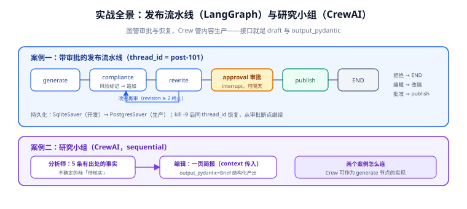

# 实战：内容审核发布流水线与研究小组

本页把前面所有概念串成两个**完整可运行**的案例：案例一用 **LangGraph** 实现「草稿 → 合规审查 → 人工审批 → 发布」流水线（检查点持久化 + interrupt 审批 + 拒绝重写分支）；案例二用 **CrewAI** 实现一个双角色研究小组。按本仓约定，仓库内不提交工程代码，以下代码块是**完整内容**——请复制到你自己的工程里运行。



## 案例一（LangGraph）：带审批的发布流水线

### 1. 环境准备

```shell
mkdir publish-pipeline && cd publish-pipeline
python3 -m venv .venv && source .venv/bin/activate
pip install "langgraph>=1.2" "langchain>=1.4" "langgraph-checkpoint-sqlite" langchain-openai
export OPENAI_API_KEY=sk-...      # 或任何 OpenAI 兼容网关
```

### 2. 状态与图

```python
# pipeline.py
import operator
from typing import Annotated, TypedDict, Literal

from langgraph.graph import StateGraph, START, END
from langgraph.graph.message import add_messages
from langgraph.checkpoint.sqlite import SqliteSaver
from langgraph.types import interrupt, Command
from langchain.chat_models import init_chat_model

llm = init_chat_model("openai:gpt-4.1-mini")

class PipelineState(TypedDict):
    title: str
    draft: str
    risk_flags: Annotated[list, operator.add]   # 追加：各轮审查的风险标记
    messages: Annotated[list, add_messages]
    revision: int                               # 覆盖：改写轮次
    status: str                                 # 覆盖：draft / rejected / published

def generate(state: PipelineState) -> dict:
    resp = llm.invoke(f"为《{state['title']}》写一篇 300 字技术短文草稿。")
    return {"draft": resp.content, "status": "draft"}

def compliance(state: PipelineState) -> dict:
    resp = llm.invoke(
        f"审查以下文本是否包含：夸大宣传、未注明来源的统计数据、敏感词。\n"
        f"只输出 JSON：{{\"risks\": [\"...\"]}}，没有风险输出空数组。\n\n{state['draft']}"
    )
    risks = parse_risks(resp.content)            # 按 JSON 解析，失败视为空并记日志
    return {"risk_flags": risks}

def route_after_compliance(state: PipelineState) -> Literal["approve", "rewrite", "__end__"]:
    if not state["risk_flags"]:
        return "approve"                          # 干净 → 送人工终审
    if state["revision"] >= 2:
        return "__end__"                          # 改两轮仍有风险 → 终止转人工线下处理
    return "rewrite"

def rewrite(state: PipelineState) -> dict:
    resp = llm.invoke(
        f"改写以下文本，规避这些风险项，保持本意：\n风险：{state['risk_flags']}\n\n{state['draft']}"
    )
    return {"draft": resp.content, "revision": state["revision"] + 1}

def human_approval(state: PipelineState) -> dict:
    # interrupt 前无副作用；恢复后从下一行继续
    decision = interrupt({
        "question": f"是否发布《{state['title']}》？",
        "payload": {"draft": state["draft"], "risks": state["risk_flags"]},
        "allowed": ["approve", "edit", "reject"],
    })
    if decision["type"] == "reject":
        return {"status": "rejected"}
    if decision["type"] == "edit":
        return {"draft": decision["value"]}
    return {"status": "approved"}

def publish(state: PipelineState) -> dict:
    # 副作用在决策之后：这里是唯一执行发布的地方
    print(f"[发布] {state['title']} -> {state['draft'][:50]}...")
    return {"status": "published"}

def route_after_approval(state: PipelineState) -> Literal["publish", "__end__"]:
    return "__end__" if state["status"] == "rejected" else "publish"

builder = StateGraph(PipelineState)
builder.add_node("generate", generate)
builder.add_node("compliance", compliance)
builder.add_node("rewrite", rewrite)
builder.add_node("approval", human_approval)
builder.add_node("publish", publish)

builder.add_edge(START, "generate")
builder.add_edge("generate", "compliance")
builder.add_conditional_edges("compliance", route_after_compliance,
                              {"approve": "approval", "rewrite": "rewrite", "__end__": END})
builder.add_edge("rewrite", "compliance")         # 改完再审，闭环
builder.add_conditional_edges("approval", route_after_approval,
                              {"publish": "publish", "__end__": END})
builder.add_edge("publish", END)

checkpointer = SqliteSaver.from_conn_string("pipeline.db")
graph = builder.compile(checkpointer=checkpointer)
```

### 3. 运行与审批闭环

```python
# run.py
from pipeline import graph
from langgraph.types import Command

cfg = {"configurable": {"thread_id": "post-101"}}

# 第一次 invoke：跑到审批处暂停
result = graph.invoke({"title": "LangGraph 入门", "draft": "", "revision": 0}, cfg)
print(result["__interrupt__"][0].value)      # 渲染到审批界面

# ……审批人（可以隔天）看了一眼，选择批准：
graph.invoke(Command(resume={"type": "approve"}), cfg)

# 验证终态
print(graph.get_state(cfg).values["status"])  # published
```

### 4. 验收清单（逐条可执行）

1. `python run.py` 第一次 invoke 返回带 `__interrupt__`，`pipeline.db` 生成且体积 > 0。
2. 审批前 `kill -9` 进程，重启后用同一 `thread_id` 再 `Command(resume=...)`，流程**从审批节点继续**（`stream_mode="updates"` 只出现 `publish`）。
3. 构造一篇必然含风险的输入（草稿里写「全网第一」），确认走 `rewrite` → `compliance` 闭环；把 `revision` 初始值设为 2，确认直接终止转人工。
4. `resume={"type": "edit", "value": "新标题"}`，确认终稿用的是编辑后内容。
5. `print(graph.get_graph().draw_mermaid())`，确认结构与本页第 2 节一致。

## 案例二（CrewAI）：研究小组

```python
# research_crew.py
from pydantic import BaseModel
from crewai import Agent, Task, Crew, Process

class Brief(BaseModel):
    headline: str
    points: list[str]          # 每条含事实与来源

analyst = Agent(
    role="行业分析师",
    goal="围绕给定主题产出 5 条有出处的关键事实",
    backstory="坚持结论给出处，不确定的信息标注「待核实」。",
    llm="openai/gpt-4.1-mini",
)
writer = Agent(
    role="编辑",
    goal="把事实清单压缩成一页简报",
    backstory="风格克制，先结论后论据，不引入清单之外的事实。",
    llm="openai/gpt-4.1-mini",
)

research = Task(description="调研主题：{topic}，产出关键事实。",
                expected_output="5 条事实，每条附来源。", agent=analyst)
brief = Task(description="基于事实写一页简报。",
             expected_output="Markdown 简报：1 句结论 + 5 条要点。",
             agent=writer, context=[research], output_pydantic=Brief)

crew = Crew(agents=[analyst, writer], tasks=[research, brief],
            process=Process.sequential)

if __name__ == "__main__":
    result = crew.kickoff(inputs={"topic": "AI 编排框架 2026"})
    print(result.pydantic.headline)      # 结构化字段可直接访问
```

**验收清单**：① `python research_crew.py` 跑通且 `result.pydantic` 字段齐全；② 在 writer 任务 description 里要求「少于 200 字」，确认产出遵循；③ `verbose=True` 核对一次 kickoff 的调用次数与 token 消耗，估算单次成本。

::: tip 两个案例怎么连
真实系统里，案例二的 Crew 可以作为案例一 `generate` 节点的实现——图管审批与恢复，Crew 管内容生产。接口就是状态里的 `draft: str` 与 Crew 的 `output_pydantic`。
:::

## 相关文档

- [LangGraph 状态机深入](../StateGraph/index.md)：本页 `route_after_compliance` 的路由函数写法与单测
- [人工介入工程化](../HumanLoop/index.md)：`human_approval` 节点的机制细节与超时策略
- [持久化与记忆](../Persistence/index.md)：`SqliteSaver` 换 `PostgresSaver` 上生产的步骤
- [CrewAI 角色编排](../CrewAI/index.md)：案例二的构件细节
- [生产化](../Production/index.md)：本页骨架升级为异步 run + 观测的完整口径

## 参考资料

- LangGraph 示例库（官方）：https://github.com/langchain-ai/langgraph/tree/main/examples
- CrewAI 快速开始（官方）：https://docs.crewai.com/quickstart
- `init_chat_model`（官方）：https://docs.langchain.com/oss/python/langchain/models
