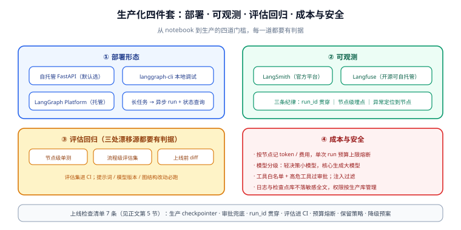

# 生产化：部署与可观测

从「notebook 里能跑」到「生产上稳跑」，隔着四件事：**部署形态、可观测、评估回归、成本与安全**。本页按这四件事给出两个框架通用的工程口径；代码示例以 LangGraph 为主，CrewAI 的对应做法在各节标出。



## 1. 部署形态

| 形态 | 做法 | 适合 |
| --- | --- | --- |
| **自托管 API 服务** | 图编译后用 FastAPI 包一层，checkpointer 连 Postgres | 大多数团队的第一选择，部署即普通后端服务 |
| **langgraph-cli 本地 server** | `pip install "langgraph-cli[inmem]"` → `langgraph dev` | 本地开发、Studio 调试 |
| **LangGraph Platform** | 官方托管：持久化、Cron、Studio | 不想自己运维检查点库与 worker |
| **CrewAI 部署** | Crew 封装成 FastAPI 端点 / 官方企业版 | 协作型负载，通常无长驻状态 |

自托管最小骨架（LangGraph）：

```python
from fastapi import FastAPI
from pydantic import BaseModel

app = FastAPI()
graph = builder.compile(checkpointer=postgres_saver, store=store)

class RunIn(BaseModel):
    thread_id: str
    input: dict

@app.post("/runs")
def run(req: RunIn):
    cfg = {"configurable": {"thread_id": req.thread_id}}
    result = graph.invoke(req.input, cfg)
    if result.get("__interrupt__"):              # 有审批中断 → 返回审批单
        return {"status": "awaiting_approval",
                "payload": result["__interrupt__"][0].value}
    return {"status": "done", "output": result.get("draft")}
```

::: danger 长任务不要用同步 HTTP 端点扛
流程里有人工审批、跑几分钟以上、或依赖外部回调的，用**异步任务 + 状态查询**：`POST /runs` 立即返回 run_id，`GET /runs/{id}` 轮询状态（`awaiting_approval` / `running` / `done`）。同步端点会把网关超时、worker 占满两类问题同时引来。
:::

## 2. 可观测：让每一步可回放

| 工具 | 定位 | 接入成本 |
| --- | --- | --- |
| **LangSmith** | 官方平台：Trace、数据集、评估、提示词版本 | 配环境变量即可，闭源商业 |
| **Langfuse** | 开源可自托管：Trace、评估、成本看板 | SDK 接入或 OpenTelemetry |
| **结构化日志** | 兜底方案：节点进出打点，run_id / thread_id 贯穿 | 零依赖，先把它做对 |

无论用哪个，**三条埋点纪律**：

1. **一次运行一个 `run_id`**，全链路（日志、trace、审批单）携带。
2. **每个节点记录**：输入摘要（不落全文，防泄漏）、耗时、token 用量、错误与重试次数。
3. **异常必须能定位到「哪一个节点、哪一次模型调用」**——`GraphRecursionError`、检查点序列化失败这类错误，没有埋点时排障全靠猜。

CrewAI：`verbose=True` 仅用于开发；生产用回调 / 事件监听接 Langfuse，把每个 Task 的产出与耗时记下来。

## 3. 评估与回归

编排系统的行为会随**提示词、模型版本、图结构**三处改动而漂移——三处都要有回归判据：

1. **节点级评估**：条件边路由函数是纯函数，直接单测；生成类节点用固定输入集比对结构（Pydantic 校验）。
2. **流程级评估**：准备 20~50 条代表性输入，断言终态与关键中间状态（如「高风险样本必须触发审批」）。
3. **上线前 diff**：改图 / 改提示词后跑全套评估集，指标回退即拦——评估集进 CI，与代码同节奏维护。

::: tip 给 CrewAI 的评估口径
`expected_output` 写成可校验的结构（条数、必含字段、来源数），每次 `kickoff` 后自动校验并记录通过率——这是 CrewAI 场景下最便宜的回归门禁。
:::

> 本节是框架视角的操作清单。评估集怎么**分层**（功能 / 安全策略 / 红队沉淀 / 漂移哨兵）、样本怎么治理、防过拟合怎么做，见专题 [提示词安全与评估 · 评估集建设](../../PromptSecurity/EvalSet/index.md)；Agent 场景的注入与越权边界另见 [Agent 应用 · 安全边界](../../Agent/Safety/index.md)。

## 4. 成本与安全

**成本**：

- **按节点预算**：每个生成类节点记 token 与费用，run 级别汇总；设单次 run 预算上限，超限熔断转人工。
- **模型分级**：路由 / 分类等轻决策用小模型，核心生成用大模型——supervisor 模式里主管用小模型是常见优化。
- **缓存**：检索类节点结果按输入哈希缓存（同一问题的检索不必每次重跑）。

**安全**：

- **工具白名单**：每个节点 / Agent 只给最小工具集；高危工具（执行 SQL、发外部请求）必须过 [人工介入](../HumanLoop/index.md)。
- **注入边界**：检索内容、用户输入进入提示词前过一遍注入过滤（详见 [Agent 应用 · 安全边界](../../Agent/Safety/index.md) 与 [提示词安全](../../PromptEngineering/index.md)）。
- **数据最小化**：日志与 trace 不落敏感全文；检查点库的访问权限按生产库标准管理（里面有完整业务状态）。

## 5. 上线检查清单

1. checkpointer 用生产后端（Postgres），**多副本共享**验证通过。
2. 所有不可逆动作有 `interrupt` 审批，超时策略为「默认拒绝」。
3. `run_id` 贯穿日志 / trace / 审批单，异常能定位到节点级。
4. 评估集进 CI，路由函数与关键节点有单测。
5. run 级 token / 费用上报，单次预算上限生效。
6. 检查点保留策略已配置，存储增速在监控内。
7. 降级预案：模型网关故障时流程能暂停（检查点在）而不是崩溃重跑。

## 6. 验证方式

1. **自托管可调**：`uvicorn app:app` 后 `curl -X POST localhost:8000/runs -d '{"thread_id":"t-1","input":{...}}'`，返回 `awaiting_approval` 或 `done`。
2. **审批闭环**：走一次「提交 → 审批单返回 → resume → done」全流程，审批单与 trace 里 run_id 一致。
3. **观测闭环**：在 Langfuse / 日志里能按 run_id 拉出完整节点序列与耗时。
4. **预算熔断**：mock 一个高消耗节点触发上限，确认 run 被熔断并转人工，而非烧完预算。
5. **评估回归**：故意改坏路由函数，CI 评估集变红。

## 相关文档

- [持久化与记忆](../Persistence/index.md)：部署形态的先决条件——checkpointer 后端与多副本共享
- [人工介入工程化](../HumanLoop/index.md)：审批闭环是生产系统的标配
- [实战](../Practice/index.md)：本页骨架代码在实战页串成完整流水线
- [大模型应用开发 · 成本核算与限流降级](../../LLMApp/CostRateLimit/index.md)：不引框架时的成本口径，本页沿用其方法
- [Ops · 监控告警](../../../Ops/Monitoring/index.md)：基础设施层的监控体系

## 参考资料

- LangGraph 部署（官方）：https://docs.langchain.com/oss/python/langgraph/deploy
- langgraph-cli（官方）：https://langchain-ai.github.io/langgraph/reference/cli/
- Langfuse 文档：https://langfuse.com/docs
- LangSmith 文档：https://docs.langchain.com/langsmith/home
