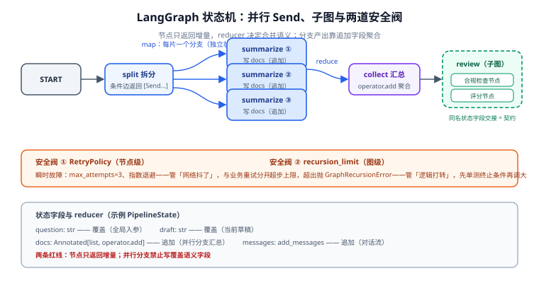

# LangGraph 状态机深入

LangGraph 的核心只有一句话：**节点做计算、边决定下一步、状态在图里流动**。入门篇（[LangChain · LangGraph 编排](../../LangChain/LangGraph/index.md)）讲过最小图，本页深入工程化必须掌握的四件事：**状态与 reducer 体系、`Command` 与条件边的分工、`Send` 并行（map-reduce）、子图与重试**。



## 1. 状态与 reducer：先定合并语义，再写节点

状态是 `TypedDict`，每个字段可带 reducer（`Annotated[类型, reducer]`）。**reducer 决定「两个节点同时写这个字段时怎么合并」**——这是状态设计的全部要害：

| 写法 | 语义 | 用在哪 |
| --- | --- | --- |
| `field: str` | **覆盖**：后写的赢 | 当前草稿、当前阶段 |
| `messages: Annotated[list, add_messages]` | **追加**（带消息去重） | 对话历史、事件日志 |
| `items: Annotated[list, operator.add]` | **追加**（纯拼接） | 收集各分支的结果 |
| `retry_count: Annotated[int, operator.add]` | **累加** | 重试计数、配额消耗 |
| 自定义函数 `def merge(a, b): ...` | **任意合并** | 按 ID 去重的字典合并等 |

```python
import operator
from typing import Annotated, TypedDict
from langgraph.graph.message import add_messages

class PipelineState(TypedDict):
    question: str                                   # 覆盖：全局入参
    messages: Annotated[list, add_messages]         # 追加：对话流
    docs: Annotated[list, operator.add]             # 追加：并行检索结果汇总
    draft: str                                      # 覆盖：当前草稿
    seen_ids: Annotated[set, lambda a, b: a | b]    # 自定义：并集去重
```

::: danger 节点只返回增量
节点返回 `dict`，LangGraph 用 reducer 把它合并进状态。**初学者最常见的错误是在节点里返回完整状态并覆盖了追加字段**——比如返回 `{"messages": state["messages"] + [新消息]}`，配合 `add_messages` 会把整段历史写两遍。正确写法是只放新增量：`{"messages": [新消息]}`。
:::

::: danger 并行分支写「覆盖」字段是未定义行为
两个并行节点同时写同一个**覆盖语义**字段，结果取决于完成顺序。并行分支的产出字段一律用追加或自定义合并 reducer；如果必须写同一字段，在汇合点用一个「合并节点」收口。
:::

## 2. 路由的两条路：条件边 vs `Command`

同样是「一个节点执行完决定去哪」，有两种写法，**适用场景不同**：

| 写法 | 样子 | 什么时候用 |
| --- | --- | --- |
| **条件边** `add_conditional_edges` | 节点纯计算，路由函数**读状态**返回节点名 | 判定依据是**已有状态**；路由逻辑想单独单测 |
| **`Command`** 节点返回 `Command(goto=..., update=...)` | 节点**自己决定**去向并顺带更新状态 | 去向依赖节点**内部**的信息（模型输出、工具返回值）；多智能体 handoff |

```python
from langgraph.types import Command
from typing import Literal

# 写法一：条件边（路由函数是纯函数，可直接单测）
def route(state: PipelineState) -> Literal["generate", "escalate", "__end__"]:
    if state["retry_count"] >= 3:
        return "escalate"
    return "generate" if state["draft"] == "" else "__end__"

builder.add_conditional_edges("review", route)

# 写法二：Command（节点自己决定去向，适合多智能体交接）
def supervisor(state: PipelineState) -> Command[Literal["researcher", "writer"]]:
    choice = judge_model(state["question"])          # 模型决定交给谁
    return Command(
        goto=choice,
        update={"messages": [{"role": "assistant", "content": f"交给 {choice}"}]},
    )
```

::: tip 混用没问题，但同一对节点只用一种
同一条边既加条件边又用 `Command(goto=...)` 会产生难以排查的双重路由。团队约定：**读状态路由用条件边，节点内决策路由用 Command**，代码评审按此对齐。
:::

## 3. `Send` 并行：map-reduce 的正解

「把一篇文章拆成 N 段并行摘要」这类 map-reduce，**不要在节点里开线程池**——用 `Send` 把控制权交给运行时，每个分支自动获得独立的状态副本，还能共享同一个 checkpointer：

```python
from langgraph.types import Send

def fanout(state: PipelineState):
    # map：为每个分片发起一个并行分支
    return [Send("summarize", {"chunk": c}) for c in split(state["draft"])]

def collect(state: PipelineState):
    # reduce：docs 字段是 Annotated[list, operator.add]，自动拼接各分支产出
    return {"draft": merge_summaries(state["docs"])}

builder.add_conditional_edges("split", fanout, ["summarize"])
builder.add_edge("summarize", "collect")
```

要点：

- `Send` 的第二个参数是**该分支的私有输入**，不是全局状态——分支间的隔离靠它。
- 分支写公共字段靠 reducer 合并（追加 / 累加 / 去重），**不要写覆盖字段**。
- 分支数量大时注意上游限流：每个分支都是一次模型调用，`Send` 不会替你做并发数控制，需要时在节点内部用信号量约束。

## 4. 子图：把复杂流程模块化

子图（subgraph）就是**被当成节点用的另一张图**，父图状态与子图状态通过共享的 key 交接：

```python
review_graph = build_review_graph()          # 一张独立的 StateGraph
builder.add_node("review", review_graph)     # 整张图作为一个节点挂进父图
```

| 用途 | 做法 |
| --- | --- |
| 复用一段流程（如「合规审查」在多条流水线出现） | 建成子图，多处挂载 |
| 团队分工：各模块维护各自的图 | 子图边界即接口，状态 key 是契约 |
| 调试隔离 | 子图有自己的检查点命名空间（`checkpoint_ns`），trace 可分层看 |

::: warning 子图状态 key 是隐式契约
父图与子图通过**同名状态字段**交接数据。字段改名是破坏性变更——与 REST 契约一样，key 要进版本评审，不要随手重命名。
:::

## 5. 循环终止与重试：两道安全阀

### 5.1 递归限制

图的每次「超步」（superstep）计入 `recursion_limit`（默认 25）。模型循环打转、条件边写错导致死循环时，运行时抛 `GraphRecursionError` 兜底：

```python
from langgraph.errors import GraphRecursionError

try:
    graph.invoke(inputs, config={"recursion_limit": 50, **cfg})
except GraphRecursionError:
    ...  # 记录 trace、降级或转人工
```

**不要靠调大 limit 掩盖设计问题**：先检查终止条件是否真的可达（把路由函数当纯函数单测一遍）。

### 5.2 节点级重试

外部调用（模型 API、检索服务）抖动用 `RetryPolicy` 声明式解决，与业务重试（状态里的 `retry_count`）分开：

```python
from langgraph.pregel import RetryPolicy

builder.add_node(
    "retrieve",
    retrieve,
    retry=RetryPolicy(max_attempts=3, initial_interval=1.0, backoff_factor=2.0),
)
```

| 安全阀 | 管什么 | 配置处 |
| --- | --- | --- |
| `RetryPolicy` | 瞬时故障（超时、429、网络抖动） | 节点参数 |
| `recursion_limit` | 逻辑死循环、兜底止损 | invoke 配置 |
| 状态里的重试计数 | 业务级「重写 3 次仍不合格就升级人工」 | 状态字段 + 条件边 |

## 6. 易错点清单

1. **在节点里返回完整状态**：覆盖了追加字段或写坏 reducer 合并——只返回增量。
2. **并行分支写覆盖字段**：结果不确定——追加或合并节点收口。
3. **条件边路由函数有副作用**（写库、调模型）：路由要能随便重放，副作用放进节点。
4. **把大对象塞进状态**（整篇文档、整个向量列表）：每步检查点都序列化它——存 ID / URI，用时取。
5. **`recursion_limit` 调到很大**：掩盖终止条件 bug——先单测路由函数。
6. **同一对节点混用条件边与 `Command`**：双重路由难排查——按第 2 节的分工约定。

## 7. 验证方式

1. **图结构核对**：`print(graph.get_graph().draw_mermaid())`，确认节点与分支和设计一致。
2. **reducer 生效**：构造两个返回同字段增量的节点连跑，断言字段值符合合并语义（追加不是覆盖）。
3. **路由可单测**：`route` 是纯函数——构造不同状态直接断言返回值，不启动图。
4. **并行生效**：`stream_mode="updates"` 观察 `summarize` 节点是否出现多次、`docs` 是否聚合了全部分支。
5. **重试生效**：把一个节点指向不存在的端口（或临时 mock 抛 429），观察日志出现 3 次尝试后才失败。
6. **递归限制生效**：故意写一个永不满足终止条件的图，确认抛 `GraphRecursionError` 而不是挂死。

## 相关文档

- [持久化与记忆](Persistence/index.md)：检查点把每一步状态落库，是本页一切可恢复能力的基础
- [人工介入工程化](HumanLoop/index.md)：`interrupt` 暂停图并等待审批
- [多智能体协作模式](Patterns/index.md)：`Command` 路由在 supervisor / handoffs 中的系统用法
- [LangChain · LangGraph 编排](../../LangChain/LangGraph/index.md)：入门篇——最小图与 `interrupt` 初识

## 参考资料

- LangGraph Graph API 概念（官方）：https://docs.langchain.com/oss/python/langgraph/graph-api
- 低层级 `Send` 与 map-reduce（官方）：https://docs.langchain.com/oss/python/langgraph/low-level#send
- 重试策略 `RetryPolicy`（官方）：https://docs.langchain.com/oss/python/langgraph/graph-api#retry
