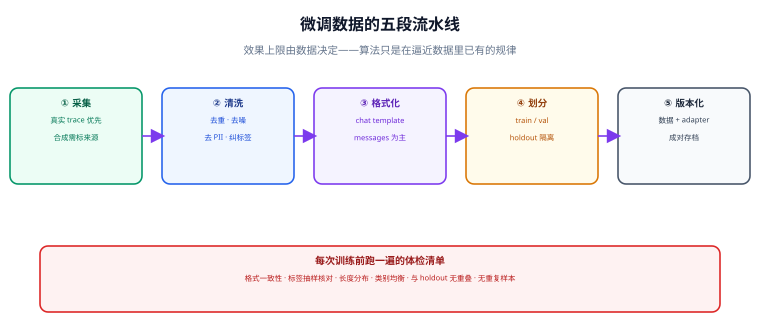

# 数据工程

微调的效果上限由数据决定——训练算法只是在逼近数据里已经存在的规律。同一套超参、同一个模型，换一版数据往往比换十个超参更有效。本页讲清微调数据从哪来、长什么样、怎么清洗、怎么划分、怎么版本化。



## 一句话定位

数据工程的目标不是「凑够条数」，而是造出一份**格式统一、标签可信、与测试集互不污染、可追溯**的样本集。做到这四点，训练反而变成最简单的一环。

## 数据的四种来源与优先级

| 来源 | 质量 | 成本 | 适用 | 注意 |
| --- | --- | --- | --- | --- |
| 真实业务 trace | 最高 | 低（已有） | 客服、代码、工单等天然有历史记录的场景 | 必须去 PII、去重复、去低质对话 |
| 人工标注 | 高 | 高 | 需要专业判断、口径统一的场景 | 必须先写标注手册，做一致率抽检 |
| 模型合成（蒸馏） | 中~高 | 低 | 有明确答案、可自动校验的任务 | **必须过滤**，否则把教师模型的错误也学进去 |
| 公开数据集 | 中 | 最低 | 冷启动、格式学习 | 领域与口吻往往不匹配，只能当配菜 |

::: tip 优先顺序
**真实 trace > 人工标注 > 合成数据 > 公开数据集**。合成数据是加速器不是替代品：正确姿势是「用教师模型批量生成 → 自动校验 + 规则过滤 → 人工抽检 5%~10% → 才进训练集」。
:::

## 三种数据格式：优先用 `messages`

现代训练栈的主线格式是对话消息列表，它把模板交给 tokenizer 的 chat template 处理，避免手拼字符串。

```json [messages 格式（推荐）]
{
  "messages": [
    { "role": "system", "content": "你是电商客服，回答必须简洁，金额一律保留两位小数。" },
    { "role": "user", "content": "我上周买的杯子碎了，能退吗？" },
    { "role": "assistant", "content": "可以。请在订单页选择「商品破损」提交退货申请，审核通过后 48 小时内退款到原支付方式。" }
  ]
}
```

```json [prompt / completion 格式（兼容旧脚本）]
{
  "prompt": "把这句话改得更正式：这个方案我觉得不太行。",
  "completion": "经评估，该方案在当前条件下可行性不足。"
}
```

```json [偏好数据格式（DPO 类方法用）]
{
  "prompt": "客户说快递太慢了，怎么回？",
  "chosen": "抱歉让您久等。我已为您查询物流，预计明天送达，我会在今天 18:00 前同步最新节点。",
  "rejected": "快递慢是快递公司的问题，我们也没办法。"
}
```

三种格式的选择：

- **SFT 用 `messages`**：模板由 tokenizer 统一渲染，跨模型迁移时只换 tokenizer，不动数据。
- **单轮任务可用 `prompt` / `completion`**：更简单，但一旦需要 system 提示就受限。
- **偏好对齐用 `prompt` / `chosen` / `rejected`**：见 [指令微调与偏好对齐](../SFT/index.md)。

::: danger 不要自己手拼对话模板
把 `<|im_start|>user\n...` 这类特殊 token 硬写进数据里，会在换模型时全部失效，也是最难查的一类错误。正确写法：数据只存 `messages`，由 tokenizer 的 chat template 渲染：

```python
rendered = tokenizer.apply_chat_template(
    sample["messages"], tokenize=False, add_generation_prompt=False
)
```
:::

## 只对「回答」计算 loss

SFT 的目标是让模型学会**怎么回答**，不是学会预测用户会问什么。如果对整段序列算 loss，模型会花大量容量去拟合用户输入，浪费训练信号，还容易带出奇怪的生成习惯。

主流 `SFTTrainer` 会根据 chat template 中的 assistant 段落自动生成 `assistant_masks`，只对回答部分计算 loss。你需要确认的是：

1. **数据用的是标准 `messages` 结构**（不是自己拼的字符串）；
2. **tokenizer 的 chat template 正确**——用 `apply_chat_template` 渲染一条样本，肉眼检查分隔符与结束符；
3. 如果自定义了模板，先做一条样本的 loss mask 可视化验证。

```python
import numpy as np

# 渲染后检查：哪些位置参与 loss
ids = tokenizer.apply_chat_template(sample["messages"], tokenize=True)
text = tokenizer.decode(ids)
print(text)   # 期望看到正确包裹的 user / assistant 段与结尾符
```

## 数据量与质量：经验的量级

| 任务类型 | 起步样本量 | 效果趋于稳定的量级 | 说明 |
| --- | --- | --- | --- |
| 只改输出格式 / 字段结构 | 100~300 | 500~1000 | 格式类任务样本效率最高 |
| 单一窄任务分类 | 300~1000 | 2000~5000 | 类别要均衡，每类不少于 50 |
| 领域话术 / 风格迁移 | 500~2000 | 5000~20000 | 风格需要覆盖多种输入形态 |
| 多任务混合助手 | 2000+ | 20000+ | 需要显式控制任务配比 |
| 偏好对齐（DPO） | 1000~5000 | 10000+ | 偏好对的质量比数量更关键 |

::: warning 少于 60 行的页面视为未完成——数据也一样
**少于 300 条高质量样本的窄任务**，先考虑 few-shot 提示词。样本太少的微调通常只会让模型过拟合到少数几个问法上：训练集上完美，换一种问法就崩。
:::

## 质量体检：六个必查项

每次训练前跑一遍，任何一项不过就不开训：

| 检查项 | 做法 | 通过标准 |
| --- | --- | --- |
| 格式一致性 | 校验每条样本结构、字段名、role 取值 | 100% 通过 |
| 重复样本 | 归一化后（去空白、小写）做哈希去重 | 重复率 < 1% |
| 长度分布 | 统计 token 长度分位数 | 99 分位不超过设定的 `max_length` 太多 |
| 类别/任务均衡 | 按标签或任务分组计数 | 最大类 / 最小类 < 10 |
| 标签抽样核对 | 随机抽 30~50 条人工看 | 明显错误率 < 2% |
| 与 holdout 无重叠 | 对训练集与测试集做文本指纹比对 | 重叠为 0 |

```python [dataset_lint.py]
"""微调数据体检脚本：六个必查项一次跑完。"""
import hashlib
import json
import re
from collections import Counter

import numpy as np

DATA = "data/sft_train.jsonl"
HOLDOUT = "data/sft_test.jsonl"


def norm(text: str) -> str:
    """归一化：去空白、去标点差异，用于重复检测与泄漏检测。"""
    return re.sub(r"\s+", "", (text or "").strip().lower())


def fingerprint(msgs) -> str:
    joined = "\n".join(f"{m['role']}:{m.get('content', '')}" for m in msgs)
    return hashlib.md5(norm(joined).encode("utf-8")).hexdigest()


def load(path):
    with open(path, encoding="utf-8") as fh:
        return [json.loads(line) for line in fh if line.strip()]


train, test = load(DATA), load(HOLDOUT)
report = {}

# 1. 格式一致性
bad = [i for i, s in enumerate(train)
       if not isinstance(s.get("messages"), list)
       or not s["messages"]
       or any(m.get("role") not in {"system", "user", "assistant"} or not m.get("content")
              for m in s["messages"])
       or s["messages"][-1]["role"] != "assistant"]      # 末条必须是回答
report["格式不合规条数"] = len(bad)

# 2~3. 重复率
fps = [fingerprint(s["messages"]) for s in train]
dup_rate = 1 - len(set(fps)) / max(len(fps), 1)
report["训练集重复率"] = f"{dup_rate:.2%}"

# 4. 长度分布（按字符近似，真实长度请用 tokenizer 统计）
lens = [sum(len(m["content"]) for m in s["messages"]) for s in train]
report["字符长度分位"] = {p: int(np.percentile(lens, p)) for p in (50, 90, 99, 100)}

# 5. 任务/类别均衡：这里以首条 user 消息的前 6 个字符做粗分桶
buckets = Counter(next(m["content"] for m in s["messages"] if m["role"] == "user")[:6]
                  for s in train)
top = buckets.most_common(1)[0][1]
rare = min(buckets.values())
report["任务分桶数"] = len(buckets)
report["最大/最小类比"] = f"{top / rare:.1f}"

# 6. 训练集与测试集泄漏
test_fps = {fingerprint(s["messages"]) for s in test}
report["与测试集重叠条数"] = len(set(fps) & test_fps)

print(json.dumps(report, ensure_ascii=False, indent=2))

# 断言：不达标直接失败，避免带病训练
assert report["格式不合规条数"] == 0, "存在格式不合规样本"
assert dup_rate < 0.01, "重复率过高"
assert report["与测试集重叠条数"] == 0, "训练集与测试集存在重叠，评测结果不可信"
print("数据体检通过")
```

## 划分：测试集必须「隔离」而不是「切分」

```text
全部数据
├─ train      训练用              80%~90%
├─ val        调参、早停判断       5%~10%
└─ test       只在最终验收时看     5%~10%（训练期间禁止查看）
```

三条纪律：

1. **按「来源」划分，而不是随机切**。同一通对话、同一个订单的多条样本必须落在同一侧，否则测试集里会出现与训练集高度相似的问题，评测分数虚高。
2. **测试集在整个训练期间不可见**。一旦你根据测试集结果反复调整超参，它就不再是测试集，而是验证集。
3. **测试集一经确定就不再改动**。需要新增，就整体重新划分并重新记录基线分数。

## 合成数据：怎么用才不翻车

合成（蒸馏）数据的正确流程：

```text
① 准备种子：少量真实样本（30~100 条），确定输入分布的边界
        ↓
② 批量生成：用强模型按种子风格生成，同时要求给出答案 + 简短理由
        ↓
③ 自动过滤：规则校验（格式 / 字段 / 数值）+ 去重 + 与真实样本相似度检查
        ↓
④ 对可验证任务做真值核对：能算的算一遍，能查的查一遍
        ↓
⑤ 人工抽检 5%~10%，错得离谱就回到 ① 重写提示词
        ↓
⑥ 与真实样本按比例混合（建议真实样本占比不低于 30%）
```

为什么必须混合：全部用合成数据的模型会学出**教师模型的表达习惯和它的系统性错误**，在自己的评测集上看起来还行，但实际上只是学会了模仿教师，而不是学会你的任务。

## 版本化：数据与 adapter 成对存档

每一版训练都必须留下可追溯的三件套：

```text
runs/2026-09-18_sft-lora-r16/
├─ data/                 # 训练实际读的那一份数据（或它的哈希清单）
│  ├─ sft_train.jsonl
│  ├─ sft_test.jsonl     # 冻结的对照集
│  └─ manifest.json      # 样本数、哈希、生成脚本版本
├─ config/               # 完整训练配置（含 chat template 与 special tokens 清单）
├─ adapter/              # 输出的 LoRA 适配器
└─ eval/                 # 本版的评测报告
```

```json [manifest.json 示例]
{
  "created_at": "2026-09-18T10:20:00+08:00",
  "base_model": "Qwen/Qwen2.5-7B-Instruct",
  "base_revision": "cc594898137f460bfe9f0759e9844b3ce807cfb5",
  "dataset": { "train": 3120, "test": 200, "sha256_train": "b1f0…" },
  "chat_template_hash": "9a3c…",
  "trainer": "trl==1.13.0",
  "note": "第二批人工标注数据，修复了退款话术中金额格式不统一的问题"
}
```

::: tip 为什么必须冻结底座 revision
`Qwen/Qwen2.5-7B-Instruct` 只是一个名字，上游随时可能更新权重。用 `revision`（具体的 commit 哈希）锁定，才能保证「三个月后复现同一结果」这件事是真的。
:::

## 本页的可验证收尾

```shell
# ① 数据体检全绿
python dataset_lint.py

# ② 模板渲染肉眼检查（期望看到正确的角色标记与结束符）
python -c "
from transformers import AutoTokenizer
tok = AutoTokenizer.from_pretrained('Qwen/Qwen2.5-7B-Instruct')
import json
row = json.loads(open('data/sft_train.jsonl', encoding='utf-8').readline())
print(tok.apply_chat_template(row['messages'], tokenize=False))
"
```

模板渲染输出中，**每一条 assistant 内容都要被正确的结束标记收尾**（例如 `<|im_end|>`）。缺失结束标记是最隐蔽的错误之一：训练正常，但模型学不会「什么时候该停下来」。

## 参考资料

- [Hugging Face Datasets 文档](https://huggingface.co/docs/datasets/index)
- [Hugging Face Chat Templating 说明](https://huggingface.co/docs/transformers/chat_templating)
- [TRL：SFT 数据格式与 assistant-only loss](https://huggingface.co/docs/trl/sft_trainer)
- [LIMA: Less Is More for Alignment](https://arxiv.org/abs/2305.11206)
