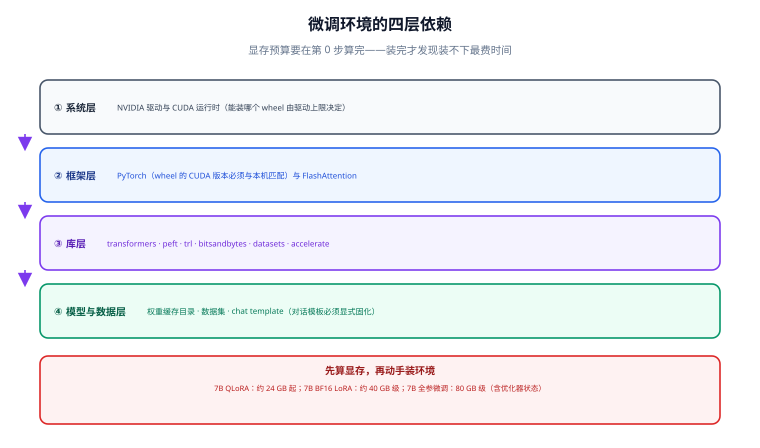

# 环境与显存预算

微调环境踩的坑，八成不是「装不上」，而是**版本漂移**和**显存装不下**。本页先教你算清需要多少显存，再给出一套可复现的依赖组合与自检脚本，最后列出高频环境错误的正确写法。



## 一句话定位

微调环境是**四层依赖的对齐问题**：驱动 → 框架 → 库 → 模型与数据。任何一层错位都表现为「代码没改但跑不起来」。

## 第 0 步：先算显存，再动手装

装环境的成本远小于「装完才发现装不下」的成本。训练显存由五部分组成：

```text
显存 ≈ 权重 + 梯度 + 优化器状态 + 激活值 + 碎片预留

权重     = 参数量 × 每参数字节（BF16 = 2，FP32 = 4，NF4 ≈ 0.5 + 量化常数）
梯度     = 只有「可训练参数」才占（LoRA 时几乎可忽略）
优化器   = AdamW 对每个可训练参数约 8 字节（m、v 两个 FP32 状态）+ 混合精度 master weight 约 4 字节
激活值   ≈ batch × 序列长度 × 隐藏维度 × 层数 × 系数（开启梯度检查点可降 3~5 倍）
碎片预留 = 峰值波动带来的碎块，经验留 10%~20%
```

按这个算法得到的量级参考（**未含激活值**，激活值随 batch × 序列长度线性增长）：

| 模型规模 | 全参 BF16（12~16 B/参数） | LoRA BF16（只算权重 2 B/参数） | QLoRA NF4（约 0.5~0.6 B/参数） |
| --- | --- | --- | --- |
| 7B | 84~112 GB | 14~16 GB | 4~5 GB |
| 13B | 156~208 GB | 26~30 GB | 7~8 GB |
| 32B | 384~512 GB | 64~72 GB | 17~19 GB |
| 70B | 840~1120 GB | 140~160 GB | 38~42 GB |

把激活值加回去，得到实际可跑的下限：

| 场景 | 现实下限 | 舒适区间 | 说明 |
| --- | --- | --- | --- |
| 7B QLoRA（seq 1024~2048） | 16 GB | 24 GB | 16 GB 需开梯度检查点、batch 固定为 1 |
| 7B LoRA BF16（seq 2048） | 24 GB（需梯度检查点） | 40~48 GB | 不检查点时会因激活值峰值 OOM |
| 7B 全参（seq 2048） | 80 GB | 2 × 80 GB（FSDP / ZeRO-2） | 单卡几乎不可行 |
| 13B QLoRA | 24 GB | 40 GB | 长序列优先加显存 |
| 32B QLoRA | 48 GB | 80 GB | 多卡时优先 ZeRO-3 |

::: warning 只看量级，不要当精确值
上表按公式估算，与真实运行时可能差 20%~30%。**判断标准永远是跑一次真实配置并观察 `nvidia-smi` 的峰值**，而不是相信任何一张表。把 batch 从 1 加到 2、序列从 1024 加到 4096，激活值可能翻三倍以上。
:::

## 第 1~4 层：逐层对齐

### ① 系统层：驱动与 CUDA 运行时

关键认知：**PyTorch 的 wheel 自带 CUDA 运行时**，你不需要单独安装完整 CUDA Toolkit；需要匹配的是「驱动版本 ≥ wheel 要求的运行时上限」。

```shell
# 1. 看驱动支持的 CUDA 上限（右上角 CUDA Version 是「驱动能支持的最高版本」）
nvidia-smi

# 2. 看显卡型号、显存与当前占用
nvidia-smi --query-gpu=name,memory.total,memory.used,driver_version --format=csv
```

判断方法：`nvidia-smi` 显示 `CUDA Version: 12.8`，表示**可安装**编译于 CUDA 12.8 及以下的 torch wheel；装 CUDA 13.0 编译的 wheel 会报 `CUDA driver version is insufficient`。

### ② 框架层：PyTorch 与加速组件

```shell
# 按官方矩阵选择 wheel（示例：CUDA 12.8）
pip install torch --index-url https://download.pytorch.org/whl/cu128

# 验证：这两行必须都通过
python -c "import torch; print(torch.__version__, torch.version.cuda)"
python -c "import torch; print('cuda ok:', torch.cuda.is_available(), torch.cuda.get_device_name(0))"
```

### ③ 库层：一套可复现的版本组合

微调生态的版本之间是**绑定关系**，务必成组升级，不要单点升级：

```shell
# 建议在独立虚拟环境中执行，不要装进系统 Python
python -m venv .venv-finetune
# Windows
.venv-finetune\Scripts\activate
# Linux / macOS
source .venv-finetune/bin/activate

pip install -U pip

# 一套经过对齐的组合（2026-09 主线版本）
pip install "transformers>=5.16" \
            "peft>=0.21,<0.22" \
            "trl>=1.13,<1.14" \
            "datasets>=4.7" \
            "accelerate>=1.0" \
            "bitsandbytes>=0.45" \
            "safetensors" \
            "sentencepiece" \
            "einops"

# 显存优化与并行（可选，按需）
pip install "deepspeed>=0.18.6"
pip install flash-attn --no-build-isolation   # 编译耗时长，先确认 CUDA 与 torch 匹配
```

::: danger 三个必须成组安装的版本约束
1. **`peft` / `transformers` / `accelerate` / `torch` 必须一起升级。** 单独 `pip install -U peft` 常导致训练时出现 `AttributeError` 或 `ImportError`；官方排障文档把这四个当作一个整体处理。
2. **TRL 1.13 起不能再 `from trl import PPOTrainer`。** 该符号自 1.10 起已不可用，1.13.0 正式移除 `PPOTrainer`、`PPOConfig` 与 value-head 相关代码。旧脚本请迁移到 `SFTTrainer` / `DPOTrainer` / `GRPOTrainer` / `RLOOTrainer`，或固定安装移除前的版本。
3. **`trl[vllm]` 的 vLLM 有上限约束。** 直接装最新版 vLLM 常与当前 transformers 冲突，按 extra 声明的范围安装；只有在线生成类方法（GRPO / RLOO）才需要它，SFT 和离线 DPO 用不到。
:::

### ④ 模型与数据层：三个必须显式固化的东西

- **权重缓存目录**：默认在 `~/.cache/huggingface`，多用户机器上建议 `export HF_HOME=/data/hf`，否则会把系统盘写满。
- **chat template（对话模板）**：必须显式固化并随 adapter 一起存档。训练用了哪个模板，推理就必须用同一个；模板错位是「训练 loss 很低但线上答非所问」的第一大原因。
- **数据集快照**：训练用哪一版数据要能追溯（见 [数据工程](../Dataset/index.md)）。

```shell
# 建议写进 shell 配置或用 .env 管理
export HF_HOME=/data/hf
export HF_HUB_ENABLE_HF_TRANSFER=1     # 需要 pip install hf_transfer，加速大模型下载
export TOKENIZERS_PARALLELISM=false    # 关掉 tokenizer 并行告警
export PYTORCH_CUDA_ALLOC_CONF=expandable_segments:True   # 缓解显存碎片导致的 OOM
```

## 自检脚本：一次跑完所有关键项

把下面这段保存为 `check_env.py`，在训练用的同一个虚拟环境里执行。**它必须是你的第一个可验证产物**——后面所有训练问题的排查都从它的输出开始。

```python [check_env.py]
"""微调环境自检：版本对齐 + 显存可用性 + 关键能力探测。"""
import importlib
import sys

print(f"Python : {sys.version.split()[0]}  ({sys.executable})")

# 1. 关键库版本（缺失就继续，不中断）
LIBS = [
    ("torch", None), ("transformers", None), ("peft", None), ("trl", None),
    ("datasets", None), ("accelerate", None), ("bitsandbytes", None),
]
for name, _ in LIBS:
    try:
        mod = importlib.import_module(name)
        print(f"{name:14s}: {getattr(mod, '__version__', 'unknown')}")
    except Exception as exc:                      # noqa: BLE001
        print(f"{name:14s}: 未安装 / 导入失败 -> {type(exc).__name__}: {exc}")

# 2. CUDA 与显存
try:
    import torch
    print(f"\ntorch.cuda.is_available(): {torch.cuda.is_available()}")
    print(f"torch.version.cuda       : {torch.version.cuda}")
    if torch.cuda.is_available():
        for i in range(torch.cuda.device_count()):
            prop = torch.cuda.get_device_properties(i)
            total = prop.total_memory / 1024**3
            print(f"  GPU{i}: {prop.name}  {total:.1f} GiB  算力 sm_{prop.major}{prop.minor}")
        free, total = torch.cuda.mem_get_info()
        print(f"  当前空闲：{free / 1024**3:.1f} GiB / {total / 1024**3:.1f} GiB")
except Exception as exc:                          # noqa: BLE001
    print(f"CUDA 探测失败：{exc}")

# 3. 关键能力探测
print("\n--- 能力探测 ---")
try:
    import bitsandbytes as bnb
    print(f"bitsandbytes {bnb.__version__} 已就绪（4 bit / 8 bit 量化可用）")
except Exception as exc:                          # noqa: BLE001
    print(f"bitsandbytes 不可用，QLoRA 无法运行：{exc}")

try:
    import trl
    names = ["SFTTrainer", "SFTConfig", "DPOTrainer", "GRPOTrainer"]
    missing = [n for n in names if not hasattr(trl, n)]
    print(f"TRL 训练器：{ {n: ('ok' if n not in missing else '缺少') for n in names} }")
except Exception as exc:                          # noqa: BLE001
    print(f"TRL 探测失败：{exc}")
```

预期输出（示意）：

```text
Python : 3.12.8
torch         : 2.9.0+cu128
transformers  : 5.16.0
peft          : 0.21.0
trl           : 1.13.0
datasets      : 4.7.1
accelerate    : 1.10.0

torch.cuda.is_available(): True
torch.version.cuda       : 12.8
  GPU0: NVIDIA GeForce RTX 4090  23.5 GiB  算力 sm_89
  当前空闲：23.1 GiB / 23.5 GiB
```

## 最小可跑验证：三步确认环境真的能用

环境「装上了」和「能训练」是两件事。按下面三步逐级验证，每一步失败都能定位到具体层：

```python [smoke_forward.py]
"""第 1 步：不训练，只验证「模型能加载 + 能前向」。
用一个极小的模型在 CPU 上跑，排除显存因素。"""
from transformers import AutoModelForCausalLM, AutoTokenizer
import torch

name = "sshleifer/tiny-gpt2"          # 约 2 MB，仅用于连通性验证
tok = AutoTokenizer.from_pretrained(name)
model = AutoModelForCausalLM.from_pretrained(name, torch_dtype=torch.float32)

batch = tok(["微调环境的第一次前向"], return_tensors="pt")
out = model(**batch)
print("logits:", tuple(out.logits.shape))     # 期望 (1, 序列长度, 词表大小)
```

```python [smoke_lora.py]
"""第 2 步：验证 PEFT 能注入 adapter 且可训练参数不为 0。"""
from transformers import AutoModelForCausalLM
from peft import LoraConfig, TaskType, get_peft_model

model = AutoModelForCausalLM.from_pretrained("sshleifer/tiny-gpt2")
cfg = LoraConfig(r=4, lora_alpha=8, task_type=TaskType.CAUSAL_LM,
                 target_modules=["c_attn"])   # 注意：名字必须匹配该模型的模块命名
model = get_peft_model(model, cfg)
model.print_trainable_parameters()
```

```text
trainable params: 2,304 || all params: 102,720 || trainable%: 2.2430
```

```python [smoke_sft.py]
"""第 3 步：用真实尺寸模型 + 极小数据集跑 2 步 SFT，验证训练链路。
这一步才会真正吃显存，是「能不能开始干活」的判据。"""
from datasets import Dataset
from trl import SFTConfig, SFTTrainer

rows = [{"messages": [
    {"role": "user", "content": "把这句话改得更正式：这个方案我觉得不太行。"},
    {"role": "assistant", "content": "经评估，该方案在当前条件下可行性不足。"},
]}] * 16
ds = Dataset.from_list(rows)

cfg = SFTConfig(
    output_dir="./out-smoke",
    num_train_epochs=1,
    per_device_train_batch_size=1,
    gradient_accumulation_steps=2,
    gradient_checkpointing=True,
    learning_rate=2e-4,
    logging_steps=1,
    save_strategy="no",
    max_length=512,                     # 注意：长度类参数在 Config 上，不在 Trainer 构造器
    report_to=[],
)
trainer = SFTTrainer(model="Qwen/Qwen2.5-0.5B-Instruct", train_dataset=ds, args=cfg)
trainer.train()
print("SFT 链路验证通过")
```

第 3 步的**成功判据**：日志里出现 `train_loss` 且数值为有限数（不是 `nan` / `inf`），进程正常退出。

::: danger 第 3 步最常见的三个报错与正确写法
1. **`TypeError: SFTTrainer.__init__() got an unexpected keyword argument 'max_seq_length'`** —— 长度、packing、优化器之类的参数已迁移到 `SFTConfig`。正确写法：把它们写进 `SFTConfig(...)`，`SFTTrainer` 只接收 `model` / `train_dataset` / `args` / `processing_class`。
2. **`Attempting to unscale FP16 gradients`** —— 底座以 fp16 加载，而 Trainer 的混合精度期望可训练参数为 fp32。正确写法：底座用 `torch_dtype=torch.bfloat16` 加载（或对 LoRA 参数强制 fp32），不要用 fp16 存权重。
3. **`KeyError` / 模板相关报错**：`tokenizer=` 在较新版本已弃用，改用 `processing_class=`；同时确认数据是 `messages` 形式，模板由 tokenizer 的 chat template 提供。
:::

## 本页的可验证收尾

完成以下三条，才算环境就绪：

```shell
# ① 自检脚本无「未安装/失败」项，且 CUDA 可用
python check_env.py

# ② 三步 Smoke 全过（第 3 步日志有有限的 train_loss）
python smoke_sft.py

# ③ 训练期间另开一个终端，观察显存峰值是否留有余量
nvidia-smi --query-gpu=memory.used,memory.total --format=csv -l 2
```

显存峰值**低于总容量的 85%** 才算安全；逼近 95% 时，即使这一版能跑完，换一个稍长的样本也会 OOM。

## 常见问题速查

| 现象 | 大概率原因 | 处理 |
| --- | --- | --- |
| `CUDA driver version is insufficient` | torch wheel 的 CUDA 版本高于驱动上限 | 降级 wheel 或升级驱动 |
| 训练启动即 OOM | batch / 序列过长，未开梯度检查点 | 见「显存预算」；`expandable_segments:True` |
| 训练中途 OOM（步数不固定） | 显存碎片或数据长度分布不均 | 开梯度检查点、按长度分桶、限制 `max_length` |
| 极慢但显存占用低 | 数据加载瓶颈或未用 GPU | `dataloader_num_workers`、确认 `device_map` |
| 版本莫名报 `AttributeError` | peft/transformers/accelerate/torch 漂移 | 成组重装，固定同一组合 |
| `bitsandbytes` 导入失败（Windows） | 缺编译好的 wheel | 装官方 Windows wheel 或在 WSL2 / Linux 下训练 |

## 参考资料

- [PyTorch 官方安装矩阵（选择 CUDA 版本）](https://pytorch.org/get-started/locally/)
- [Hugging Face PEFT 安装与排障](https://huggingface.co/docs/peft/install)
- [Hugging Face TRL 安装与版本迁移说明](https://huggingface.co/docs/trl/index)
- [bitsandbytes 官方文档](https://huggingface.co/docs/bitsandbytes/index)
- [DeepSpeed 官方文档](https://www.deepspeed.ai/)
