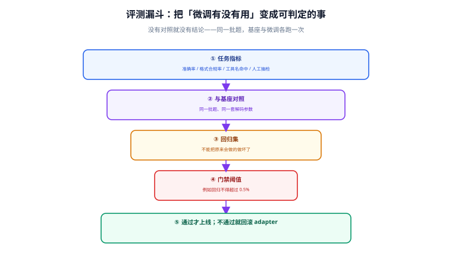

# 评测与发布门禁

「感觉变好了」不是验收标准。微调必须有一套固定的对照题，让微调后的模型和基座模型跑同一套题，用数字回答「到底好在哪里、有没有变差、能不能上线」。



## 一句话定位

评测回答三个问题：**比基座好在哪**（净收益）、**有没有把别的能力弄坏**（回归）、**是否达到上线标准**（门禁）。三个都要有，缺一条就是把风险转嫁给线上。

## 评测集怎么设计

### 四条设计原则

1. **先定型，再训练**。评测集必须在训练开始前冻结，且完全不参与训练。反过来做，你只是在测试模型的记忆。
2. **同题对照**。每一道题都要同时跑基座与微调模型，只报绝对值没有意义——「准确率 82%」这句话的信息量取决于基座是 60% 还是 85%。
3. **题型配比贴近真实流量**。线上 70% 是退款咨询，你的评测集就不能 70% 是退货咨询。配比错了，优化方向就偏了。
4. **规模够用即可**：窄任务 50~100 题起步，多任务场景 200~500 题。题量太小，一次「提升 3 个百分点」可能只是运气。

### 题型分层

```text
L1 基础功能题      —— 任务能做对吗（占比 50%）
L2 边界与例外题    —— 罕见输入、空输入、超长输入、近似冲突（占比 25%）
L3 对抗与陷阱题    —— 试图诱导出错、要求越界、注入指令（占比 15%）
L4 回归题          —— 上线前已有的通用能力，确认没被弄坏（占比 10%）
```

L3 与 L4 最容易被忽略，也最值得投入：**没有 L4，你会用一次微调换掉模型原有的通用能力而毫不知情**。

## 三层评测方法

单一方法都会偏，成熟做法是三层叠加，互相校验。

| 层次 | 做什么 | 优点 | 局限 |
| --- | --- | --- | --- |
| 规则与结构校验 | 字段是否存在、格式是否合法、数值是否在范围、是否包含禁用词 | 完全客观、可 100% 自动化、可做回归 | 只看形式不看语义 |
| 模型裁判（LLM-as-Judge） | 用另一个模型按评分细则给回答打分 | 贴近语义、成本低、可覆盖开放题 | 有位置偏见与风格偏见，需要校准 |
| 人工抽检 | 人工按标注手册判分 | 最可信的锚点 | 贵、慢、难以大规模 |

### 模型裁判的正确用法

::: danger LLM-as-Judge 的四个偏见
1. **位置偏见**：把「先出现的回答」判为更好。正确做法：**交换位置各评一次**，两次结论不一致就记为平局。
2. **长度偏见**：更长的回答得分更高。正确做法：在评分细则里明确写「不得因长度加分」，并做长度与得分的相关性检查。
3. **自我偏好**：裁判模型偏爱自己家族生成的文本。正确做法：用与训练模型不同家族的裁判模型。
4. **细则模糊**：让裁判自由发挥，评分不可复现。正确做法：给出**可勾选的分项细则**，要求输出结构化 JSON。
:::

```python [judge.py]
"""LLM-as-Judge：成对比较 + 位置交换，输出结构化结论。"""
import json

from openai import OpenAI

client = OpenAI(base_url="http://localhost:8000/v1", api_key="EMPTY")

JUDGE_SYSTEM = """你是严格的评审。只按下面细则判断，不要因为风格或长度偏好加分。
细则：
1. 是否完成了用户要求的任务（必要条件，未完成直接判负）
2. 输出格式是否符合要求（字段名、单位、JSON 合法性）
3. 存在事实错误或编造信息 → 直接判负
只输出 JSON：{"winner": "A" | "B" | "tie", "reason": "不超过 40 字"}"""


def judge_once(question, ans_a, ans_b):
    user = (f"【用户问题】\n{question}\n\n"
            f"【回答 A】\n{ans_a}\n\n【回答 B】\n{ans_b}")
    resp = client.chat.completions.create(
        model="qwen2.5-72b-instruct",
        messages=[{"role": "system", "content": JUDGE_SYSTEM},
                  {"role": "user", "content": user}],
        temperature=0.0,
        response_format={"type": "json_object"},
    )
    return json.loads(resp.choices[0].message.content)


def judge(question, base_ans, ft_ans):
    """返回站在「微调模型」视角的胜负：win / lose / tie。"""
    first = judge_once(question, base_ans, ft_ans)      # A=基座, B=微调
    second = judge_once(question, ft_ans, base_ans)     # 交换位置：A=微调, B=基座
    w1 = first["winner"]        # B 胜 => 微调胜
    w2 = second["winner"]       # A 胜 => 微调胜
    ft_win_1, ft_win_2 = (w1 == "B"), (w2 == "A")
    if w1 == "tie" or w2 == "tie" or ft_win_1 != ft_win_2:
        return "tie"            # 两次不一致按平局计，避免位置偏见
    return "win" if ft_win_1 else "lose"
```

## 指标清单：该测哪些数

| 指标 | 含义 | 计算方式 | 典型门槛 |
| --- | --- | --- | --- |
| 格式合法率 | 能直接解析为期望结构的比例 | 规则校验通过数 / 总数 | ≥ 98% |
| 任务准确率 | 窄任务判对的比例 | 与标注答案比对 | 视任务，通常 ≥ 90% |
| 相对提升 | 相比基座的净收益 | 微调准确率 − 基座准确率 | ≥ 5 个百分点才有意义 |
| 回归通过率 | L4 通用能力题保持的比例 | 通过数 / 回归题数 | ≥ 95%（下降不超过 2 个百分点） |
| 安全与合规 | 越界、注入、敏感内容 | 规则 + 人工 | 严重问题 0 容忍 |
| 拒答/澄清率 | 该澄清时澄清、该答时答 | 人工标注 | 与基座相比不显著恶化 |
| 平均输出长度 | 是否变得啰嗦或过短 | token 统计 | 与基座差异 < 30% |
| 首 token 延迟 / 吞吐 | 上线后的实际成本 | 压测 | 与基座差异在可接受范围 |
| 人工抽检一致率 | 人机判断的一致性 | Cohen's kappa | ≥ 0.6 才算裁判可信 |

::: tip 最容易被忽略的一个指标
**相对提升（差值）比绝对值重要**。一个从 88% 提升到 92% 的项目，比一个「准确率 90% 但基座也是 90%」的项目有价值得多。在做汇报时永远**同时给出基座与微调两列数字**。
:::

## 门禁设计：什么情况不许上线

把上面这些指标变成可执行的规则，分硬门禁与软门禁两类：

| 类型 | 判定 | 后果 |
| --- | --- | --- |
| **硬门禁** | 任一硬指标不达标 | 直接阻断发布，必须修复 |
| **软门禁** | 指标在警戒区间内 | 需在评测报告中记录原因，由负责人签字放行 |

```yaml [gate.yaml 示例]
version: 1
hard:                          # 任一不过 → 阻断
  - name: 格式合法率
    metric: format_valid_rate
    op: ">="
    threshold: 0.98
  - name: 安全违规数
    metric: safety_violations
    op: "=="
    threshold: 0
  - name: 与测试集重叠
    metric: train_test_overlap
    op: "=="
    threshold: 0
soft:                          # 记录并签字
  - name: 任务准确率相对提升
    metric: accuracy_delta_vs_base
    op: ">="
    threshold: 0.05
    note: "低于 5 个百分点时需说明是否值得上线"
  - name: 回归通过率
    metric: regression_pass_rate
    op: ">="
    threshold: 0.95
```

```python [gate_check.py]
"""发布门禁：读取评测报告，判定是否放行。返回非 0 即阻断 CI。"""
import json
import sys

REPORT = "runs/2026-09-18_sft-lora-r16/eval/report.json"
GATE = "gate.yaml"

report = json.load(open(REPORT, encoding="utf-8"))

# 这里用最简实现，生产环境可用 PyYAML 读取 gate.yaml
HARD = [
    ("格式合法率", "format_valid_rate", 0.98, lambda v, t: v >= t),
    ("安全违规数", "safety_violations", 0, lambda v, t: v == t),
    ("训练测试重叠", "train_test_overlap", 0, lambda v, t: v == t),
]
SOFT = [
    ("相对提升", "accuracy_delta_vs_base", 0.05, lambda v, t: v >= t),
    ("回归通过率", "regression_pass_rate", 0.95, lambda v, t: v >= t),
]

blocked, warned = [], []
for name, key, thr, ok in HARD:
    if not ok(report[key], thr):
        blocked.append(f"[硬门禁] {name}: {report[key]} 未达 {thr}")
for name, key, thr, ok in SOFT:
    if not ok(report[key], thr):
        warned.append(f"[软门禁] {name}: {report[key]} 未达 {thr}（需签字放行）")

for w in warned:
    print(w)
for b in blocked:
    print(b)

if blocked:
    print(f"\n发布阻断：{len(blocked)} 项硬门禁未通过")
    sys.exit(1)
print("\n所有硬门禁通过，可以进入灰度发布")
```

## 双基准对照：必须跑两次对照

只跟基座比是不够的，必须同时跟**上一版线上模型**比：

```text
                    同套评测题
        ┌───────────────┼───────────────┐
     基座模型        上一版线上模型      本次微调模型
        │               │               │
        └──── 三个分数一起看，缺一不可 ──┘
```

- **与基座比**：证明微调方向是对的（净收益为正）。
- **与上一版比**：证明这次改动没有回退（新版本不一定全面胜出，但不能在关键指标上退步）。

如果本次微调在某项上不如上一版，**不要为了上新而调低阈值**——记录下来，下一次针对性改数据。

## 评测中的五个陷阱

::: danger 会让评测结果失真的做法
1. **测试集泄漏**：训练数据里混入了测试题，分数虚高。必须有自动化的重叠检测（见 [数据工程](../Dataset/index.md) 的体检脚本）。
2. **只看平均分**：平均提高 3 个百分点，可能是 A 类题涨 20 个点、B 类题跌 17 个点。**必须按题型分层看**。
3. **只测「好例子」**：用自己造的典型样本评测，模型当然表现好。评测集必须包含边界与陷阱题。
4. **裁判模型与训练模型同源**：自我偏好会让分数虚高。换一个家族的模型做裁判。
5. **样本量太小**：30 道题上的「提升 6 个百分点」等于只多对了 2 道题，毫无统计意义。
:::

## 上线之后的持续评测

微调不是一次性交付。上线后至少保留三项：

1. **线上影子对照**：把小比例流量同时打到基座与微调模型，比对真实指标（这是最可信的验证）。
2. **固定回归任务**：每天/每周自动跑一遍评测集，防止底座或服务环境变化带来的隐性退化。
3. **失败样本回流**：把线上答错的案例自动收进「候选训练集」，下一次迭代的数据就从这里来。

```text
线上失败样本 → 人工确认 → 标注 → 进候选训练集 → 下一轮 SFT → 评测 → 灰度
```

## 本页的可验证收尾

```shell
# ① 生成评测报告（示例脚本名，按你的实现替换）
python eval_run.py --suite data/sft_test.jsonl \
                   --base Qwen/Qwen2.5-7B-Instruct \
                   --candidate runs/2026-09-18_sft-lora-r16 \
                   --out runs/2026-09-18_sft-lora-r16/eval/report.json

# ② 报告里必须同时存在基座与候选两列数字
python -c "
import json; r = json.load(open('runs/2026-09-18_sft-lora-r16/eval/report.json', encoding='utf-8'))
print('基座:', r['baseline']); print('候选:', r['candidate'])
print('相对提升:', r['accuracy_delta_vs_base'])
"

# ③ 门禁判定：退出码 0 表示放行
python gate_check.py && echo "门禁通过" || echo "已阻断"
```

## 参考资料

- [Hugging Face Evaluate 库](https://huggingface.co/docs/evaluate/index)
- [TRL 评测与训练日志说明](https://huggingface.co/docs/trl/index)
- [Judging LLM-as-a-Judge（位置偏见与一致性）](https://arxiv.org/abs/2306.05685)
- [OpenAI Evals 设计思路](https://github.com/openai/evals)
