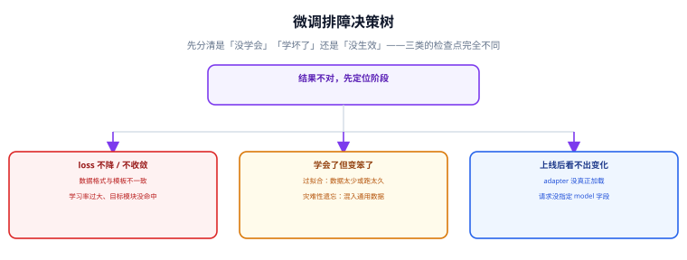

# 常见问题与排错

微调出问题时，「结果不对」这句话的信息量几乎为零。本页先把问题分成三类——**没学会、学坏了、没生效**——再按症状给出可直接执行的检查顺序。



## 通用排错顺序

::: tip 遇到任何问题的第一步
```text
① 关掉适配器再跑一遍     → 输出变好 = 训练在起反作用，问题在数据
② 用训练时的一条样本推理 → 输出对不上 = 模板不一致
③ 打印可训练参数名       → 数量为 0 = 适配器没真正注入
④ 只跑 20 条样本、1 步   → 能否复现 = 判断是不是配置问题
```
这四步能定位 80% 的问题，且成本低于 10 分钟。
:::

## 一、没学会：loss 不降或一直不收敛

| 现象 | 最可能的原因 | 处理 |
| --- | --- | --- |
| loss 基本不动（几十步内没有下降） | LoRA 学习率沿用全参量级（如 `2e-5`） | 改为 `1e-4`~`3e-4` |
| loss 不动且可训练参数很少 | `target_modules` 名字没匹配上模型层 | `print` 出可训练参数名，确认模块名正确 |
| loss 剧烈震荡、出现 `nan` | 学习率过大 / 等效 batch 太小 / fp16 溢出 | 降学习率、加梯度累积、改用 bf16 |
| loss 下降但速度极慢 | 等效 batch 太小、warmup 过长 | 调大 `gradient_accumulation_steps`，`warmup_ratio` 降到 0.03 |
| 前几步正常，之后陡降为 0 | 数据里有大量重复样本被记住 | 跑数据体检的去重检查 |
| loss 一直很高（如 > 5） | 数据格式与模板不一致，模型在学「乱码」 | 打印 `apply_chat_template` 的渲染结果肉眼核对 |

::: danger 「loss 不降」最常见的两个真实原因
1. **学习率**：LoRA 只训练极少量参数，用全参的学习率（`2e-5`）时几乎不动。这是新手最常踩的坑，且日志上看不出任何异常。
2. **模板错位**：数据是 `messages` 但 tokenizer 没有 chat template，或用了错误的模板，导致训练信号变成「学会输出分隔符」。
:::

## 二、学坏了：loss 很低但效果差

| 现象 | 最可能的原因 | 处理 |
| --- | --- | --- |
| 训练集上完美，换问法就崩 | 过拟合：数据太少或 epoch 太多 | 加数据、减 epoch、加 `lora_dropout` |
| 模型变得只会背训练集答案 | 数据里存在一对多的问法却只给了一个固定答案 | 补充多样化答案，避免同一输入多个矛盾标签 |
| 通用能力明显下降（聊天、算术都变差） | 灾难性遗忘 | 按比例混入 5%~10% 通用指令数据 |
| 回答变得非常啰嗦 / 格式化 | 偏好对齐数据里 chosen 普遍更长 | 在评分细则中禁止长度加分；平衡 chosen 长度 |
| 模型不再拒答、什么都敢答 | 训练集缺少「该拒答」的样本 | 补充安全样本，重跑门禁 |
| 输出格式时对时错 | 训练数据里答案格式不统一 | 统一答案格式后重训 |
| 训练 loss 下降但评测全面变差 | 训练集与测试集分布不一致 | 检查两边的来源与构造方式是否相同 |

```text
灾难性遗忘的预防比例（经验值）：
  专用数据 : 通用指令数据 = 9 : 1  ~  19 : 1
通用数据可以来自既有高质量指令集，作用是「提醒模型别忘本」。
```

## 三、没生效：上线后看不出变化

| 现象 | 最可能的原因 | 处理 |
| --- | --- | --- |
| 请求结果与基座完全一样 | 请求 `model` 字段没写适配器名，走的是底座 | 确认服务端适配器名与请求一致 |
| 三个适配器输出几乎相同 | `--lora-modules` 未生效或加载失败 | `curl /v1/models` 列出适配器确认 |
| 加载适配器报错 | 底座不是训练时的那一份（revision 不同） | 锁定底座 revision，与适配器元数据比对 |
| 加载报 rank 相关错误 | 适配器 `r` 超过 `--max-lora-rank` | 调大上限或重训为更小的 `r` |
| 合并后效果比「底座 + 适配器」差 | 用量化底座直接 `merge_and_unload` | 用 BF16 底座合并 |
| 输出格式崩坏 | 推理用的 chat template 与训练时不同 | 模板随适配器一起存档并在推理时复用 |
| 第一个请求特别慢，之后正常 | 适配器冷换入（毫秒到数十毫秒级） | 预热请求，或把常用适配器放进常驻范围 |
| 高并发下吞吐明显下降 | 适配器挤占 KV cache 空间 | 下调 `--gpu-memory-utilization`，重新标定并发上限 |

## 四、版本与报错类问题

| 报错 | 原因 | 正确写法 |
| --- | --- | --- |
| `import error: cannot import name 'PPOTrainer' from 'trl'` | TRL 1.13 起移除 PPO | 改用 `SFTTrainer` / `DPOTrainer` / `GRPOTrainer` / `RLOOTrainer`，或锁版本 |
| `unexpected keyword argument 'max_seq_length'` | 长度类参数在 `SFTConfig` 上 | 把参数移入 `SFTConfig(...)` |
| `tokenizer=` 相关弃用告警或报错 | 参数已改名 | 改用 `processing_class=` |
| `Attempting to unscale FP16 gradients` | 底座以 fp16 加载，AMP 期望 fp32 可训练参数 | 用 bf16 加载底座，或让 LoRA 参数保持 fp32 |
| peft/transformers 相关的 `AttributeError` | 四个库版本漂移（peft / transformers / accelerate / torch） | 成组升级，固定一套组合 |
| 偏好数据预处理报 `None` 相关错误 | 新版对嵌套样本不再自动剥离 `None` | 训练前自行清理 `remove_none_values` |
| `bitsandbytes` 在 Windows 上导入失败 | 缺官方 wheel | 使用官方提供的 Windows wheel，或转到 WSL2 / Linux |
| `flash-attn` 编译失败 | CUDA 与 torch 不匹配、或未加 `--no-build-isolation` | 先确认版本，再按官方说明编译；不必强求 |

::: warning 关于「旧脚本突然变慢/变怪」
升级 TRL 后，GRPO/RLOO 的默认生成模式、SFT 的 packing 取值等都发生过调整。这类改动**不会报错，只会静默改变行为**。跨版本升级时务必跑一遍基线评测，用数字确认没有退化，而不是相信「能跑起来就没问题」。
:::

## 五、决策类问题

**Q：到底需要多少数据？**

窄任务（格式/分类）100~300 条起步，500~1000 条趋于稳定；领域话术类 500~2000 条起步。**少于 300 条时优先考虑 few-shot 提示词**，而不是微调。

**Q：合成数据能用吗？**

能，但必须：真实样本占比不低于 30%、生成后做规则过滤与去重、对可验证任务做真值核对、人工抽检 5%~10%。全合成数据的模型往往在「像教师模型」上表现好，在你的真实任务上表现一般。

**Q：LoRA 还是全参？**

先 LoRA。LoRA 在格式、分类、话术类任务上与全参差距通常在 1~3 个百分点内。只有需要学习新语言结构、新符号体系，且确认数据无问题时，才考虑全参。

**Q：需要 DPO 吗？**

只有当 SFT 已经达标、但模型在「两个都合理的答案中选错了偏好」时才需要。SFT 没达标就做偏好对齐，只会把不确定性叠加。

**Q：微调还是 RAG？**

按需求类型分：改行为 → 微调；补事实 → RAG；修指令 → 提示词。详见 [微调概述与选型](../Overview/index.md)。

**Q：能不能边训练边加数据？**

不能。中途改数据会让这一轮训练无法归因。正确做法是跑完一轮、评测、再从「失败样本」构造下一轮数据。

## 六、求助时该提供什么

提问时把下面这六项一起给出，对方（或你自己两周后回看）能省掉大半来回：

```text
1. 环境自检输出（check_env.py 的完整结果）
2. 完整的训练配置（SFTConfig / LoraConfig 的所有字段）
3. 一条训练样本的 chat template 渲染结果（不是原始 jsonl）
4. loss 曲线（train_loss 与 eval_loss 同图）
5. 可训练参数占比与参数名列表
6. 实际输出与期望输出的对照（至少 3 条）
```

::: tip 最小复现
把问题缩到「20 条样本 + 1 个 epoch + 极小模型（如 0.5B）」还能复现时，问题通常只剩配置层。**能复现的最小配置，比任何猜测都有价值。**
:::

## 七、一页速查表

| 症状 | 类别 | 第一检查项 |
| --- | --- | --- |
| loss 不动 | 没学会 | 学习率是否达到 `1e-4` 级 |
| loss 为 nan | 没学会 | 是否 fp16 溢出 / 学习率过大 |
| 换问法就崩 | 学坏了 | 数据量与 epoch |
| 通用能力下降 | 学坏了 | 是否混入通用数据 |
| 格式时好时坏 | 学坏了 | 训练数据格式是否统一 |
| 上线输出无变化 | 没生效 | 请求 `model` 字段 / 适配器是否加载 |
| 合并后变差 | 没生效 | 是否用量化底座合并 |
| 首请求慢 | 没生效 | 适配器冷换入，做预热 |
| 装不上 / 导入错 | 环境 | 四个库是否成组对齐 |

## 参考资料

- [Hugging Face PEFT 排障与常见问题](https://huggingface.co/docs/peft/install)
- [Hugging Face TRL 迁移指南](https://github.com/huggingface/trl/blob/main/MIGRATION.md)
- [vLLM LoRA 使用说明](https://docs.vllm.ai/en/latest/features/lora.html)
- [Transformers Chat Templating](https://huggingface.co/docs/transformers/chat_templating)
