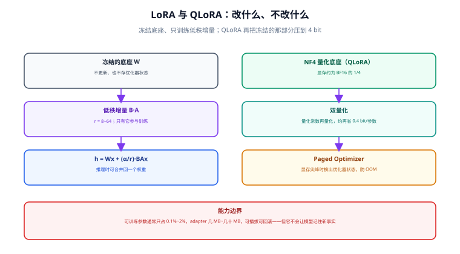

# LoRA 与 QLoRA

LoRA（Low-Rank Adaptation，低秩适配）是当前微调的默认选择：冻结底座、只训练一小块低秩增量，用 1%~2% 的可训练参数换到接近全参微调的效果。QLoRA 再把冻结的那部分压到 4 bit，让 7B 模型可以在一张消费级显卡上训练。



## 一句话定位

LoRA 把「更新整个权重矩阵」换成「更新一个低秩分解出来的小矩阵」：**改的是一块可插拔的增量，底座原封不动**。这带来的好处是可插拔、可回滚、显存需求低；代价是容量有限——它擅长改行为与风格，不擅长塞进新事实。

## 原理解析：为什么低秩增量就够了

全参微调要把权重 `W` 从 `W₀` 更新到 `W₀ + ΔW`，ΔW 与 W 同样大。LoRA 的假设是：**微调带来的变化是低秩的**——任务适配只需要在少数几个方向上调整。

于是把 ΔW 分解成两个小矩阵的乘积，用秩 `r` 控制容量：

```text
h = W₀x + ΔWx = W₀x + (α / r) · B · A · x

W₀ ∈ R^(d×k)   冻结，不更新
A  ∈ R^(r×k)   可训练，用高斯初始化
B  ∈ R^(d×r)   可训练，初始化为全 0（保证训练开始时 ΔW = 0）
α / r          缩放系数，让改 r 时不必重调学习率
```

可训练参数量从 `d × k` 降到 `r × (d + k)`。以 7B 模型、`r=16`、只作用于注意力投影层为例，可训练参数约占全模型的 **0.2%~0.5%**，适配器文件通常只有 **几 MB 到几十 MB**。

关键设计点是 `B` 初始化为零：训练第一步时 `ΔW = 0`，模型行为与底座完全一致，训练是**平滑地**从底座出发，不会因为随机初始化把模型带偏。

## 关键超参怎么定

| 参数 | 含义 | 建议起点 | 调整方向 |
| --- | --- | --- | --- |
| `r` | 低秩的秩，容量控制 | 8~16 | 效果不足先升到 32/64；再升收益递减且更易过拟合 |
| `lora_alpha` | 缩放系数（`α/r` 参与前向） | `2 × r` | 与 `r` 同向调整，保持比例是最省心的做法 |
| `lora_dropout` | 适配器上的 dropout | 0.05（数据少时 0.1） | 过拟合时加大；数据充足时可设 0 |
| `target_modules` | 作用到哪些层 | `all-linear`（全线性层） | 效果不足时从「只加 q/v」扩到全部线性层 |
| `bias` | 是否训练 bias | `none` | 一般不动；`lora_only` 只在特殊任务上试 |
| `use_rslora` | 用 `α/√r` 缩放 | 大 `r`（≥64）时开启 | 高秩下训练更稳定 |
| `use_dora` | 启用 DoRA（权重分解） | 先不用 | 在 LoRA 已达瓶颈、且愿意多花显存时对比 |

关于 `target_modules` 的一个现实建议：**能全加就全加**。只给 `q_proj` / `v_proj` 加适配器是早期为了省显存的习惯；在 7B 及以上规模、显存允许时，给所有线性层（注意力 + MLP）加 LoRA，效果通常明显更好，代价只是适配器文件变大几倍。

```python
from peft import LoraConfig, TaskType

# 稳妥的起点配置
lora_config = LoraConfig(
    r=16,
    lora_alpha=32,               # 保持 alpha = 2 * r
    lora_dropout=0.05,
    bias="none",
    task_type=TaskType.CAUSAL_LM,
    target_modules="all-linear",  # 所有线性层；也可给具体列表 ["q_proj","k_proj","v_proj","o_proj"]
    use_rslora=False,             # r >= 64 时改为 True
)
```

::: danger 模块名不匹配是最常见的「静默失败」
不同模型家族的线性层命名不同：LLaMA / Qwen 系是 `q_proj`、`k_proj`、`v_proj`、`o_proj`，GPT-2 是 `c_attn`，部分模型是 `query`、`key`、`value`。

- PEFT 只在**一个都没匹配上**时才硬失败；部分匹配会静默跳过没匹配到的层——训练照常跑，但一部分层根本没被适配。
- `peft 0.21.x` 起，用 `add_adapter` 添加第二个适配器时，若目标层不存在会直接报错（早期是静默不生效）。这类「静默不生效」的历史问题正是新版加严检查的原因。

正确做法：

```python
# 训练前先确认到底匹配到了哪些层
from peft import get_peft_model
model = get_peft_model(base_model, lora_config)
model.print_trainable_parameters()          # trainable% 不为 0 才说明注入成功
print(sorted({n.split(".")[-1] for n, p in model.named_parameters() if p.requires_grad}))
```
:::

## QLoRA：把冻结的底座压到 4 bit

QLoRA 在原论文里的三件套，缺一不可：

| 技术 | 作用 | 效果量级 |
| --- | --- | --- |
| **NF4 量化** | 把冻结权重存成 4 bit 正态浮点，比 INT4 更契合权重分布 | 权重显存约为 BF16 的 1/4 |
| **双量化（Double Quantization）** | 对量化常数本身再量化一次 | 每个参数再省约 0.4 bit |
| **Paged Optimizer** | 显存尖峰时把优化器状态换出到内存页，避免瞬时 OOM | 显著减少随机 OOM |

```python
import torch
from transformers import AutoModelForCausalLM, BitsAndBytesConfig

bnb_config = BitsAndBytesConfig(
    load_in_4bit=True,
    bnb_4bit_quant_type="nf4",              # NF4 量化
    bnb_4bit_use_double_quant=True,         # 双量化
    bnb_4bit_compute_dtype=torch.bfloat16,  # 计算时反量化到 bf16
)

model = AutoModelForCausalLM.from_pretrained(
    "Qwen/Qwen2.5-7B-Instruct",
    quantization_config=bnb_config,
    device_map={"": 0},                     # 单卡；单机多卡训练时通常交给 Trainer/DeepSpeed
    torch_dtype=torch.bfloat16,
)
model.config.use_cache = False              # 训练时必须关掉 KV cache，否则与梯度检查点冲突
```

QLoRA 的三条实践结论：

1. **算得下优先**：先让训练跑起来（QLoRA，24 GB 甚至 16 GB 卡），再考虑是否为了效果换成 BF16 LoRA。
2. **`bnb_4bit_compute_dtype` 用 bf16**，不要用 fp16：fp16 在反量化计算中更容易出现数值不稳与溢出。
3. **量化底座不直接合并**：4 bit 权重没有足够的精度承接合并后的增量。要合并请先加载 BF16 底座，再加载适配器合并（见下一节）。

## 训练：一个完整可跑的 LoRA 脚本

```python [train_lora.py]
"""7B 模型 QLoRA 训练最小完整示例（trl 1.13.x + peft 0.21.x）。"""
import torch
from datasets import load_dataset
from peft import LoraConfig
from transformers import AutoModelForCausalLM, AutoTokenizer, BitsAndBytesConfig
from trl import SFTConfig, SFTTrainer

MODEL = "Qwen/Qwen2.5-7B-Instruct"
OUT = "./runs/2026-09-18_sft-lora-r16"

tokenizer = AutoTokenizer.from_pretrained(MODEL)
if tokenizer.pad_token is None:
    tokenizer.pad_token = tokenizer.eos_token

bnb = BitsAndBytesConfig(
    load_in_4bit=True,
    bnb_4bit_quant_type="nf4",
    bnb_4bit_use_double_quant=True,
    bnb_4bit_compute_dtype=torch.bfloat16,
)
model = AutoModelForCausalLM.from_pretrained(
    MODEL, quantization_config=bnb, torch_dtype=torch.bfloat16, device_map={"": 0}
)
model.config.use_cache = False

lora = LoraConfig(
    r=16, lora_alpha=32, lora_dropout=0.05, bias="none",
    task_type="CAUSAL_LM", target_modules="all-linear",
)

# 长度、packing、优化器类参数都放在 Config 里
cfg = SFTConfig(
    output_dir=OUT,
    num_train_epochs=2,
    per_device_train_batch_size=1,
    gradient_accumulation_steps=8,      # 等效 batch = 8，比开大 batch 省显存
    gradient_checkpointing=True,        # 用时间换显存，激活值可降 3~5 倍
    learning_rate=2e-4,                 # LoRA 常用 1e-4 ~ 3e-4，比全参高一个数量级
    lr_scheduler_type="cosine",
    warmup_ratio=0.03,
    logging_steps=10,
    save_strategy="epoch",
    eval_strategy="epoch",              # 有 val 集时才生效
    bf16=True,
    max_length=2048,
    packing=False,                      # 短样本多时开启可提升吞吐
    report_to=[],
    seed=42,
)

ds = load_dataset("json", data_files={"train": "data/sft_train.jsonl",
                                      "validation": "data/sft_val.jsonl"})

trainer = SFTTrainer(
    model=model,
    args=cfg,
    train_dataset=ds["train"],
    eval_dataset=ds["validation"],
    peft_config=lora,
    processing_class=tokenizer,         # 注意：不是 tokenizer=
)
trainer.train()
trainer.save_model(OUT)                 # LoRA 场景下这里保存的是适配器
tokenizer.save_pretrained(OUT)          # 模板与特殊 token 必须随适配器一起存档
```

::: danger 四个高频错误写法
1. **`tokenizer=` 已弃用**，改用 `processing_class=`。旧脚本在新版会报参数相关错误或告警。
2. **`max_seq_length` / `max_length` 写在 `SFTTrainer(...)` 里不生效**，必须放进 `SFTConfig`。
3. **训练时忘了 `model.config.use_cache = False`**：与梯度检查点同时开启会报错或静默变慢。
4. **LoRA 的学习率沿用全参的值**（如 `2e-5`）：LoRA 的可训练参数少，通常需要比全参高 **10 倍左右**（`1e-4`~`3e-4`）才动得起来，表现为「loss 几乎不降」。
:::

## 保存、加载与合并

三种使用方式，按场景选择：

```python
# ① 直接加载适配器（推荐用于验证与多适配器部署）
from peft import PeftModel
from transformers import AutoModelForCausalLM

base = AutoModelForCausalLM.from_pretrained("Qwen/Qwen2.5-7B-Instruct",
                                            torch_dtype="auto", device_map="auto")
model = PeftModel.from_pretrained(base, "./runs/2026-09-18_sft-lora-r16")
out = model.generate(**inputs, max_new_tokens=256)
```

```python
# ② 合并权重并单独保存（推荐用于交付与推理引擎部署）
import torch
from peft import PeftModel
from transformers import AutoModelForCausalLM, AutoTokenizer

base = AutoModelForCausalLM.from_pretrained("Qwen/Qwen2.5-7B-Instruct",
                                            torch_dtype=torch.bfloat16)   # 注意：BF16 底座
model = PeftModel.from_pretrained(base, "./runs/2026-09-18_sft-lora-r16")
merged = model.merge_and_unload()
merged.save_pretrained("./merged/qwen25-7b-ft-v1", safe_serialization=True)
AutoTokenizer.from_pretrained("Qwen/Qwen2.5-7B-Instruct").save_pretrained(
    "./merged/qwen25-7b-ft-v1")
```

```python
# ③ 多适配器挂载与切换（适合一份底座服务多个业务）
from peft import PeftModel

model = PeftModel.from_pretrained(base, "./runs/a", adapter_name="cs")
model.load_adapter("./runs/b", adapter_name="legal")
model.set_adapter("legal")            # 切换到法务适配器
with model.disable_adapter():         # 临时回到纯底座，用于对照
    baseline_out = model.generate(**inputs, max_new_tokens=128)
```

::: warning 关于「合并后效果变差」
- 不要把 4 bit 量化的底座直接 `merge_and_unload`：反量化过程会引入误差，合并结果可能比「底座 + 适配器」差。正确做法是用 BF16 底座合并。
- **务必用 `with model.disable_adapter()` 跑一遍对照**：这是成本最低的一次自检——如果关掉适配器后结果更好，说明训练数据或超参有问题，适配器在起反作用。
- `peft 0.21.x` 起，**删除一个已合并的适配器会直接报错**（因为合并效果无法撤销）。要清理，请在合并前的模型对象上操作，或重新加载模型。
:::

## 效果预期：LoRA 到底能到什么程度

经验上的量级（具体任务差异很大，仅供设定预期）：

- **格式类、分类类、话术类任务**：LoRA 与全参微调的差距通常在 1~3 个百分点内，LoRA 是明确划算的选择。
- **需要学习新语言结构、新符号体系**：LoRA 明显不如全参，`r` 调大也只能部分弥补。
- **需要注入大量新事实**：两者都不合适，应该走 [RAG 检索增强](../../RAG/index.md)。
- 若 LoRA 效果不足，**优先怀疑数据（质量 / 覆盖度 / 一致性），其次才是容量**。把 `r` 从 16 提到 64 往往只带来边际改善，而修一遍数据的收益常常是翻倍的。

## 本页的可验证收尾

```shell
# ① 可训练参数占比在预期范围（窄任务常见 0.1%~2%）
python -c "
from peft import LoraConfig, get_peft_model
from transformers import AutoModelForCausalLM
m = get_peft_model(AutoModelForCausalLM.from_pretrained('Qwen/Qwen2.5-7B-Instruct'),
                   LoraConfig(r=16, lora_alpha=32, task_type='CAUSAL_LM',
                              target_modules='all-linear'))
m.print_trainable_parameters()
"

# ② 训练日志中 loss 在 50 步内出现可观测下降；否则先查学习率与数据
grep -E "loss" runs/2026-09-18_sft-lora-r16/trainer_state.json | head

# ③ 关掉适配器对照一次，确认适配器是「正收益」
python eval_compare.py --adapter runs/2026-09-18_sft-lora-r16 --disable-adapter
```

## 参考资料

- [LoRA: Low-Rank Adaptation of Large Language Models](https://arxiv.org/abs/2106.09685)
- [QLoRA: Efficient Finetuning of Quantized LLMs](https://arxiv.org/abs/2305.14314)
- [DoRA: Weight-Decomposed Low-Rank Adaptation](https://arxiv.org/abs/2402.09353)
- [Hugging Face PEFT：LoRA 与量化使用指南](https://huggingface.co/docs/peft/developer_guides/lora)
- [Hugging Face PEFT：量化模型使用说明](https://huggingface.co/docs/peft/developer_guides/quantization)
