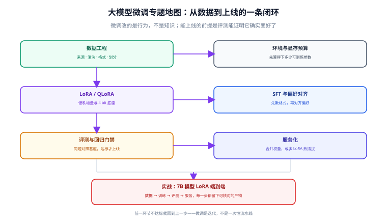
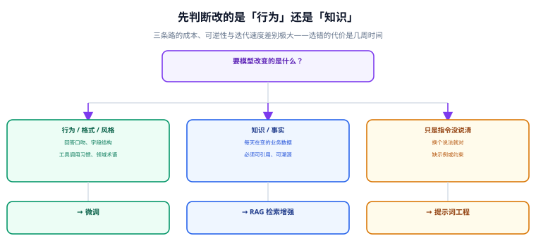

# 微调概述与选型

微调是「用你的数据继续训练一个已经训练好的模型」。它的目标不是让模型知道更多，而是**让模型改变生成行为**——稳定地按你的格式输出、稳定地遵守你的业务规则、稳定地表现出你期望的判断倾向。本页解决第一个问题：**这个需求到底该不该微调，以及该用哪种微调。**



## 微调在技术栈里的位置

一个模型从预训练到可用，通常要经过四个阶段，微调只覆盖其中后半段：

| 阶段 | 做什么 | 数据形态 | 典型规模 | 本专题覆盖 |
| --- | --- | --- | --- | --- |
| 预训练（Pre-training） | 从零学语言与世界知识 | 海量无标注文本 | 万亿 token / 千卡 | 否 |
| 继续预训练（CPT） | 向底座注入领域语料 | 大规模领域文本 | 十亿 token / 数十卡 | 简略涉及 |
| 指令微调（SFT） | 学「怎么回答」 | 指令-回答对 | 千~十万条 | 是，核心 |
| 偏好对齐（Alignment） | 学「哪个回答更好」 | 偏好对 / 可验证奖励 | 千~十万条 | 是，重点 |

关键的认知是：**SFT 不擅长注入新事实**。如果训练语料里某个事实只出现几次，模型学不会；出现几百次，它可能记住，但同时会带来幻觉风险——模型会开始用同样自信的语气编造相似的事实。这就是「微调改行为、RAG 补知识」这条分界线的由来。

## 第一步：判断要改的是什么

先问「现在的模型哪里不对」，答案决定技术路线，而不是反过来。



具体判断标准：

1. **换个说法就对**——问题在指令，不在模型。先做提示词工程：补示例（few-shot）、补输出格式约束、补思维链要求。成本以小时计。
2. **同样的问法，内容总是过期或不准**——问题在知识。走 RAG：把事实放进可检索的库，让模型在回答时引用。成本以天计，且事实更新只需重灌索引，不必重训。
3. **回答格式总是不稳定、字段名老写错、口吻不对、工具调用参数总缺**——问题在行为。这是微调的主场：几百到几千条高质量样本就能明显改善。
4. **任务需要一套内部特有的判断标准**（例如工单分类口径、风控话术、领域缩写），而外部模型没见过这口径——微调 + 少量示例，或用微调把判断标准固化下来。

::: tip 一句话总结
**行为靠微调，知识靠检索，指令靠提示词。** 三者可以叠加，但顺序要先便宜后昂贵。
:::

## 常见误区：以为微调能做的事

::: danger 五个高频误判
1. **用微调让模型「学会公司最新的产品价格」。** 价格每天变，微调是「快照」；改完还要重训、重评测、重上线。正确做法是把价格放进 RAG 或配置表，由提示词注入。
2. **数据不够，指望模型自己泛化。** 50 条样本微调出来的模型通常比基座更差——它会变得过拟合、对相似问题答非所问。正确做法是先降低目标（只改输出格式）或改用 few-shot。
3. **先微调，再补评测。** 结果是无法证明效果，也无法回滚。正确做法是**先固定一版对照评测集**，再开始训练。
4. **把 SFT 和偏好对齐混在一起做。** SFT 教「怎么做」，DPO 类方法教「哪个更好」。没有稳定的 SFT 基线就直接做偏好对齐，通常会把模型带偏。
5. **只看训练 loss 判断成败。** loss 下降只说明模型在拟合训练集；验证集和对照题上的表现才是结论。
:::

## 微调的四种粒度

选型时按「显存预算 → 效果要求 → 迭代频率」三层过滤，绝大多数场景会落在 LoRA / QLoRA 上。

| 方案 | 更新参数 | 显存量级（7B 参考） | 效果上限 | 迭代/回滚成本 | 适用场景 |
| --- | --- | --- | --- | --- | --- |
| 全参微调（Full FT） | 全部权重 | 80 GB 级（含优化器状态） | 最高 | 高：每版都是完整权重，几十 GB | 领域差异极大、算力充足、版本不常变 |
| LoRA / QLoRA | 低秩增量，通常 0.1%~2% | QLoRA 约 24 GB 起 | 接近全参，多数任务够用 | 低：适配器几 MB~几十 MB，可插拔 | **默认选择** |
| 提示类（P-Tuning / Prompt Tuning / Prefix） | 少量虚拟 token 向量 | 很低 | 较弱，对模型规模敏感 | 极低 | 多任务共享底座、样本极少 |
| 适配层/向量类（IA³、DoRA、VeRA 等） | 极少量标量或低秩向量 | 很低 | 因任务而异 | 低 | 研究或极端的参数预算约束 |

选择建议：

- 先在 LoRA 上把流程跑通，用评测结果判断「效果不够」到底是**数据问题**还是**容量问题**。
- 只有当 LoRA 在增加秩（`r=64`）和扩大 `target_modules` 后仍明显不足，且确认数据质量没问题，才考虑全参微调。
- PEFT 的适配器方法在快速扩充：截至 `peft 0.21.x`，除 LoRA 系列外还包含 DoRA、VeRA、IA³、OFT、以及新增的 KaSA、ShadowPEFT、Super-Tuning 等。**新方法不要一上线就用**，先在对照评测集上验证是否真的优于 LoRA。

## 训练目标的层级与顺序

一个完整的「让模型变成我的模型」的流程，通常是串行而非并行的：

```text
① 继续预训练 (CPT)   —— 有大量领域语料、且语言风格差异极大时才做（可选）
        ↓
② 指令微调 (SFT)     —— 教格式、教流程、教领域话术（必做）
        ↓
③ 偏好对齐 (DPO/ORPO) —— 教「两个都对时选哪个」（效果不足时再做）
        ↓
④ 评测与门禁          —— 每一版都要过，不过就不上线
```

- **跳过 ① 是常规做法**：除非你的领域语料与模型原有语料差异极大（例如大量专业符号、行业黑话），否则直接 SFT 更快。
- **② 是必做项**：没有 SFT 基线的偏好对齐等于在没有地基的楼上加层。
- **③ 视效果而定**：SFT 已经达标就不要做偏好对齐，多做一步就多一份不稳定。
- **④ 不能省**：见 [评测与发布门禁](../Evaluation/index.md)。

## 成本模型：先算清楚再动手

微调真正的成本不在「训练那几个小时」，而在外围。做立项判断时按这四项估：

| 成本项 | 估算方式 | 常见偏差 |
| --- | --- | --- |
| 数据成本 | 单条标注 5~30 分钟 × 样本数；合成数据另有清洗成本 | 最容易低估，通常是训练耗时的 5~10 倍 |
| 算力成本 | (显存规格 × 训练时长) 折算；LoRA 通常 1~2 张卡小时级 | 试错次数会放大 3~5 倍 |
| 评测成本 | 对照题设计 + 人工抽检 + 回归耗时 | 常被完全忽略 |
| 维护成本 | 底座升级、数据增量、适配器版本管理 | 上线后才显现，长期最大头 |

::: tip 省成本的两个杠杆
1. **把任务窄化**：一个「只做退款工单分类」的模型，比一个「什么客服问题都能答」的模型少一个数量级的数据量。
2. **先做数据，后买卡**：数据到位后，训练往往只占几天；数据不到位，再多卡也只是把错误拟合得更彻底。
:::

## 与 RAG 的组合姿势

微调和 RAG 不是二选一，成熟方案通常是「微调行为 + 检索知识」：

```text
用户问题
   ↓
[检索层] 向量库 / 业务数据库 → 事实片段（可溯源、可热更新）
   ↓
[模型层] 微调后的模型 → 按你的固定格式、你的话术风格输出
   ↓
[后处理] 字段校验 / 敏感词 / 引用标注
```

这样做的收益：

- 知识更新只需重建索引，**不必重新训练**；
- 输出格式的稳定性由微调保证，**不必在提示词里反复强调格式**；
- 模型可以放心引用检索结果，因为它的「行为」被训练成以证据为准。

## 本页的可验证收尾

在动手之前，把下面这张「立项自检表」填完。任何一项填不出来，就先回去补，而不是先训练：

```text
1. 我要改的是行为 / 知识 / 指令？          → 行为
2. 现在的模型在什么问题上表现不好？      → 举 3 个真实例子（写下来）
3. 成功的标准是什么数字？                → 例如「格式合法率 ≥ 98%，分类准确率 ≥ 90%」
4. 我有多少条可用样本？                  → 至少 300 条起步（窄任务）
5. 我用什么题来对照基座？                → 一组固定的 50~200 题，测试集不参与训练
6. 我准备花多少显存？                    → 见「环境与显存预算」页的算例
```

填完后对照第 2 步举出的例子再看一遍：如果这三个例子用一句更明确的提示词就能修好，**这个项目就不用微调**。

## 参考资料

- [Hugging Face PEFT：概念与方法总览](https://huggingface.co/docs/peft/index)
- [Hugging Face TRL：SFT / DPO / GRPO 训练器](https://huggingface.co/docs/trl/index)
- [LoRA: Low-Rank Adaptation of Large Language Models](https://arxiv.org/abs/2106.09685)
- [QLoRA: Efficient Finetuning of Quantized LLMs](https://arxiv.org/abs/2305.14314)
- [Direct Preference Optimization](https://arxiv.org/abs/2305.18290)
- [ORPO: Monolithic Preference Optimization without Reference Model](https://arxiv.org/abs/2403.07691)
