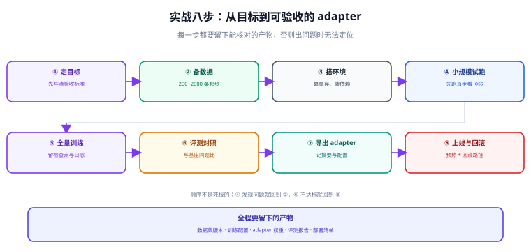

# 实战：7B 模型端到端

前八页讲的是每一环怎么做，本页把它们串成一条**可复现的流水线**：从目标定义到灰度上线，每一步都留下可核对的产物。跟着做一遍，你会得到一个能回答「客户工单该归到哪一类、该怎么回」的专属模型。



## 一、先把目标和验收标准写死

| 项 | 内容 |
| --- | --- |
| 任务 | 输入一条客户工单，输出：① 类别（4 选 1）② 一条可直接发送的回复草稿 |
| 类别 | `退换货` / `物流` / `发票` / `其他` |
| 底座模型 | `Qwen/Qwen2.5-7B-Instruct`（锁定 revision） |
| 输出格式 | 严格的 JSON：`{"category": "...", "reply": "..."}` |
| 验收指标 | 格式合法率 ≥ 98%；类别准确率 ≥ 90%；较基座提升 ≥ 15 个百分点；回归题通过率 ≥ 95% |
| 硬件 | 单卡 24 GB |
| 方案 | QLoRA（`r=16`，`all-linear`） |

::: tip 为什么这个任务适合微调
- 属于**行为类**需求：格式固定、判断口径内部特有、话术风格要统一。三条都落在微调的强项上。
- 类别只有 4 个，属于窄任务，几百到几千条样本即可收敛。
- 有**客观可测的指标**（类别准确率），不依赖主观判断，评测成本低。
:::

## 二、目录结构

```text
finetune-workshop/
├─ data/
│  ├─ raw/                  # 原始工单（去 PII 后）
│  ├─ sft_train.jsonl
│  ├─ sft_val.jsonl
│  └─ sft_test.jsonl        # 冻结的对照集，训练期间不许看
├─ scripts/
│  ├─ check_env.py
│  ├─ build_dataset.py
│  ├─ dataset_lint.py
│  ├─ eval_run.py
│  └─ gate_check.py
├─ runs/                    # 每次训练一个目录（数据+配置+adapter+报告）
├─ merged/                  # 合并后的完整权重（交付用）
└─ gate.yaml
```

## 三、第 1 步：环境与冒烟

先跑环境自检与三步冒烟（见 [环境与显存预算](../Environment/index.md)）。本步的**产物**是：

```shell
python scripts/check_env.py > runs/_env.txt 2>&1
python smoke_sft.py && echo "链路可用"
```

判据：自检无「未安装/失败」项；`smoke_sft.py` 日志出现有限的 `train_loss`。

## 四、第 2 步：造数据

### 2.1 从真实工单出发

```python [scripts/build_dataset.py]
"""从原始工单构造 SFT 数据集：清洗 → 模板化 → 划分 → 版本化。

依赖前序步骤：data/raw/tickets.jsonl 每行形如
{"text": "客户原话", "category": "退换货", "reply": "人工客服的实际回复"}
"""
import hashlib
import json
import random
import re
from pathlib import Path

RAW = Path("data/raw/tickets.jsonl")
OUT = Path("data")
SEED = 42

SYSTEM = ("你是电商客服助手。请把工单归类到 退换货 / 物流 / 发票 / 其他 之一，"
          "并给出一条可直接发送的回复草稿。只输出 JSON，不要输出任何解释。")

# --- 1. PII 脱敏：手机号 / 身份证 / 订单号 ---
PATTERNS = [
    (re.compile(r"1[3-9]\d{9}"), "[手机号]"),
    (re.compile(r"\b\d{17}[\dXx]\b"), "[身份证]"),
    (re.compile(r"\b\d{12,20}\b"), "[订单号]"),
]


def scrub(text: str) -> str:
    for pat, repl in PATTERNS:
        text = pat.sub(repl, text)
    return re.sub(r"\s+", " ", text).strip()


def norm(text: str) -> str:
    return re.sub(r"\s+", "", text.lower())


def to_sample(row: dict) -> dict:
    """转成 messages 格式；答案也用 JSON 字符串，与推理时的期望格式一致。"""
    answer = json.dumps({"category": row["category"], "reply": row["reply"]},
                        ensure_ascii=False)
    return {"messages": [
        {"role": "system", "content": SYSTEM},
        {"role": "user", "content": scrub(row["text"])},
        {"role": "assistant", "content": answer},
    ]}


rows = [json.loads(line) for line in RAW.read_text(encoding="utf-8").splitlines() if line.strip()]

# --- 2. 清洗：去空、去过短、去重复 ---
clean, seen = [], set()
for row in rows:
    text = scrub(row.get("text", ""))
    if len(text) < 6 or not row.get("category") or not row.get("reply"):
        continue
    fp = hashlib.md5(norm(text).encode("utf-8")).hexdigest()
    if fp in seen:
        continue
    seen.add(fp)
    row["text"] = text
    clean.append(row)

# --- 3. 迭代合成补量：只在样本不足时启用，且真实样本优先保留 ---
MIN_PER_CLASS = 400
from collections import Counter

cnt = Counter(r["category"] for r in clean)
print("原始类别分布：", dict(cnt))

# 合成部分（此处只给出结构；实际调用教师模型批量生成，见下一段提示词）
# synthetic = generate_with_teacher(clean[:60], need={...})
synthetic = []          # 占位：真实项目里在这里接入教师模型生成

all_rows = clean + synthetic

# --- 4. 划分：先按类别分层，再随机切，保证三类都有且分布一致 ---
random.seed(SEED)
by_cat = {}
for row in all_rows:
    by_cat.setdefault(row["category"], []).append(row)

train, val, test = [], [], []
for cat, items in by_cat.items():
    random.shuffle(items)
    n = len(items)
    n_test, n_val = max(20, int(n * 0.1)), max(20, int(n * 0.1))
    test += items[:n_test]
    val += items[n_test:n_test + n_val]
    train += items[n_test + n_val:]

for name, part in (("sft_train", train), ("sft_val", val), ("sft_test", test)):
    random.shuffle(part)
    path = OUT / f"{name}.jsonl"
    with path.open("w", encoding="utf-8") as fh:
        for row in part:
            fh.write(json.dumps(to_sample(row), ensure_ascii=False) + "\n")
    print(f"{name}: {len(part)} 条 -> {path}")

manifest = {
    "seed": SEED,
    "system_prompt_hash": hashlib.md5(SYSTEM.encode("utf-8")).hexdigest(),
    "counts": {"train": len(train), "val": len(val), "test": len(test)},
    "real_vs_synthetic": {"real": len(clean), "synthetic": len(synthetic)},
}
(OUT / "manifest.json").write_text(
    json.dumps(manifest, ensure_ascii=False, indent=2), encoding="utf-8")
```

### 2.2 合成数据的提示词模板

用真实样本（30~100 条）当种子，让强模型按同一风格补量。关键在于**要求它输出结构化结果**，以便自动过滤：

```text
你是数据合成助手。参考下面 3 条真实工单的风格与详细程度，
再生成 5 条新的电商客服工单，要求：
1. 类别在 退换货/物流/发票/其他 之间均匀分布
2. category 必须是这四个值之一
3. reply 必须是 1~2 句、可以直接发送给客户的话术，不得包含占位符
4. 不得出现真实姓名、手机号、订单号（用 [订单号] 之类占位）
5. 输出 JSON 数组，每项形如 {"text": "...", "category": "...", "reply": "..."}

【参考样本】
...
```

生成后必须走一遍过滤：格式校验 → 去重 → 与真实样本相似度检查 → 类别均衡检查 → 人工抽检 5%~10%。

### 2.3 数据体检

```shell
python scripts/dataset_lint.py
```

判据：格式不合规 0 条、重复率 < 1%、与测试集重叠 0 条、类别最大最小比 < 10。

**本步产物**：`data/sft_train.jsonl`、`sft_val.jsonl`、`sft_test.jsonl`、`manifest.json`。

## 五、第 3 步：先跑基座，冻结基线分数

**这一步最容易被跳过，但它决定了后面所有数字是否有意义。**

```python [scripts/eval_run.py]
"""在固定评测集上跑一个模型，产出可对照的报告。

用法：
    python scripts/eval_run.py --model Qwen/Qwen2.5-7B-Instruct --tag base
    python scripts/eval_run.py --model ./merged/qwen25-7b-cs-v1 --tag v1
"""
import argparse
import json
import re
from collections import Counter
from pathlib import Path

import torch
from transformers import AutoModelForCausalLM, AutoTokenizer

SYSTEM_EXTRACT = re.compile(r"\{.*\}", re.S)


def load_cases(path):
    return [json.loads(line) for line in Path(path).read_text(encoding="utf-8").splitlines()
            if line.strip()]


def score(outputs, cases):
    fmt_ok = acc_ok = 0
    bad = []
    for out, case in zip(outputs, cases):
        gold = json.loads(case["messages"][-1]["content"])
        try:
            match = SYSTEM_EXTRACT.search(out)
            pred = json.loads(match.group(0)) if match else None
            assert isinstance(pred, dict) and "category" in pred and "reply" in pred
            fmt_ok += 1
            if pred["category"] == gold["category"]:
                acc_ok += 1
            else:
                bad.append({"pred": pred["category"], "gold": gold["category"]})
        except Exception:                                    # noqa: BLE001
            bad.append({"pred": "<解析失败>", "gold": gold["category"]})
    n = max(len(cases), 1)
    return {
        "n": len(cases),
        "format_valid_rate": round(fmt_ok / n, 4),
        "accuracy": round(acc_ok / n, 4),
        "confusion": dict(Counter(f"{b['gold']}->{b['pred']}" for b in bad).most_common(10)),
    }


def main():
    ap = argparse.ArgumentParser()
    ap.add_argument("--model", required=True)
    ap.add_argument("--suite", default="data/sft_test.jsonl")
    ap.add_argument("--tag", required=True)
    ap.add_argument("--limit", type=int, default=0, help="0 表示全量")
    args = ap.parse_args()

    tok = AutoTokenizer.from_pretrained(args.model)
    model = AutoModelForCausalLM.from_pretrained(
        args.model, torch_dtype=torch.bfloat16, device_map="auto")
    model.eval()

    cases = load_cases(args.suite)
    if args.limit:
        cases = cases[: args.limit]

    outputs = []
    for case in cases:
        msgs = case["messages"][:-1]                      # 去掉标准答案
        prompt = tok.apply_chat_template(msgs, tokenize=False, add_generation_prompt=True)
        inputs = tok(prompt, return_tensors="pt").to(model.device)
        with torch.no_grad():
            ids = model.generate(**inputs, max_new_tokens=256, do_sample=False,
                                 temperature=None, top_p=None, top_k=None)
        outputs.append(tok.decode(ids[0][inputs["input_ids"].shape[1]:],
                                  skip_special_tokens=True))

    report = {"tag": args.tag, "model": args.model, "suite": args.suite,
              **score(outputs, cases)}
    out = Path(f"runs/eval_{args.tag}.json")
    out.parent.mkdir(parents=True, exist_ok=True)
    out.write_text(json.dumps(report, ensure_ascii=False, indent=2), encoding="utf-8")
    print(json.dumps(report, ensure_ascii=False, indent=2))


if __name__ == "__main__":
    main()
```

```shell
# 冻结基线：这一步的结果就是「及格线」
python scripts/eval_run.py --model Qwen/Qwen2.5-7B-Instruct --tag base
```

基线示例输出（数字仅示意）：

```json
{
  "tag": "base",
  "format_valid_rate": 0.62,
  "accuracy": 0.71,
  "confusion": { "退换货->其他": 12, "物流->退换货": 9 }
}
```

解读：基座能做对七成，但**只有六成多的输出是合法 JSON**——这正是需要微调的地方（格式与口径）。

## 六、第 4 步：训练

用 [LoRA 与 QLoRA](../LoRA/index.md) 里的脚本，把 `max_length` 按数据长度分位设置为覆盖 99 分位的值（本例 1024 足够），其余用推荐起点：

```shell
python scripts/train_lora.py \
  --base Qwen/Qwen2.5-7B-Instruct \
  --train data/sft_train.jsonl --val data/sft_val.jsonl \
  --out runs/2026-09-18_sft-lora-r16 \
  --r 16 --alpha 32 --lr 2e-4 --epochs 2
```

训练期间的观察点：

| 观察项 | 正常表现 | 异常与处理 |
| --- | --- | --- |
| `train_loss` | 前 50 步内可观测下降 | 不动 → 查学习率（LoRA 需 `1e-4` 级）与 `target_modules` |
| `train_loss` 与 `eval_loss` | 同步下降后趋于平稳 | `eval_loss` 回升 → 减少 epoch |
| 显存峰值 | 稳定在 85% 以下 | 贴顶 → 降 batch、开梯度检查点 |
| 生成抽样 | 格式逐步变规范 | 一直不收敛 → 回数据页做体检 |

**本步产物**：`runs/2026-09-18_sft-lora-r16/`（含 adapter、trainer_state.json、日志）。

## 七、第 5 步：评测与门禁

```shell
# ① 用同一套题评测微调模型（先不合并，直接加载 adapter）
python scripts/eval_run.py --model runs/2026-09-18_sft-lora-r16 --tag v1

# ② 生成对照报告：基座 vs 本次
python scripts/compare.py runs/eval_base.json runs/eval_v1.json

# ③ 门禁判定
python scripts/gate_check.py && echo "可以灰度" || echo "已阻断"
```

期望的对照结果（示意）：

| 指标 | 基座 | 微调后 | 变化 |
| --- | --- | --- | --- |
| 格式合法率 | 0.62 | 0.99 | +37 个百分点 |
| 类别准确率 | 0.71 | 0.93 | +22 个百分点 |
| 回归题通过率 | 1.00 | 0.97 | −3 个百分点（在阈值内） |

出现「某项退步」是正常的，**关键是退步幅度是否在门禁允许范围内，以及是否记录在案**。

## 八、第 6 步：合并与服务化

```shell
# 合并为完整权重（交付/推理引擎部署用）
python scripts/merge_lora.py \
  --base Qwen/Qwen2.5-7B-Instruct \
  --adapter runs/2026-09-18_sft-lora-r16 \
  --out merged/qwen25-7b-cs-v1

# 起服务（多 LoRA 形态，一份底座挂多个适配器）
python -m vllm.entrypoints.openai.api_server \
  --model Qwen/Qwen2.5-7B-Instruct \
  --enable-lora --max-lora-rank 32 --max-loras 4 --max-cpu-loras 8 \
  --lora-modules cs-v1=./runs/2026-09-18_sft-lora-r16 \
  --gpu-memory-utilization 0.85 --port 8000
```

验证：

```shell
curl -s http://localhost:8000/v1/chat/completions \
  -H "Content-Type: application/json" \
  -d '{"model":"cs-v1","messages":[{"role":"system","content":"你是电商客服助手。请把工单归类到 退换货 / 物流 / 发票 / 其他 之一，并给出一条可直接发送的回复草稿。只输出 JSON，不要输出任何解释。"},{"role":"user","content":"订单号 [订单号] 的东西还没发货，急用"}],"max_tokens":128}' \
  | python -c "import sys,json;print(json.load(sys.stdin)['choices'][0]['message']['content'])"
```

期望输出形如：

```json
{"category": "物流", "reply": "抱歉让您久等，我已为您查询该订单的物流状态，通常 24~48 小时内会更新发货信息，我会持续跟进并第一时间同步进展。"}
```

## 九、第 7 步：灰度与回滚

按 [服务化部署](../Serving/index.md) 的流程走：影子流量 → 5% → 20% → 100%，每一档设观察窗口；网关层保留 `cs-v0`（基座）与上一版适配器，随时可切回。

灰度期间重点看四个数：格式合法率、P95/P99 延迟、输出长度分布、人工抽检的差评率。

## 十、资源预算与时间线（单卡 24 GB 参考）

| 阶段 | 工作量 | 说明 |
| --- | --- | --- |
| 目标与验收定义 | 半天 | 别省，后面全靠它 |
| 数据清洗与构造 | 2~5 天 | 最大头；真实项目通常是训练的 5~10 倍 |
| 环境与冒烟 | 半天 | 首次配置；后续复用 |
| 基线评测 | 1 小时 | 全量评测 200 题在 7B 上约 20~40 分钟 |
| 训练（QLoRA，3000 条约 2 epoch） | 1~3 小时 | 显存峰值约 18~22 GB |
| 评测与门禁 | 1 小时 | 自动化后每次迭代都要跑 |
| 合并与服务化 | 半天 | 首次搭建；后续是换适配器 |
| 灰度观察 | 1~3 天 | 按业务流量定 |

## 十一、常见偏离与处理

::: danger 实战中最容易走偏的四处
1. **训练准确率很高但评测很差** → 测试集泄漏或评测集太接近训练集。跑数据体检，确认重叠为 0。
2. **格式合法率上不去** → 训练数据里存在格式不统一的样本（有的用 JSON，有的用自然语言）。统一答案格式后重训。
3. **准确率上去了但话术变得很奇怪** → 数据里的 `reply` 风格本身不统一，或者训练轮次过多。统一话术风格、降低 epoch。
4. **上线后发现比评测差很多** → 线上模板与训练模板不一致，或线上 system 提示词与训练时不同。把 system 提示词与模板一起纳入版本管理。
:::

## 十二、全流程可核对的产物清单

| 步骤 | 产物 | 核对方式 |
| --- | --- | --- |
| 目标定义 | 验收指标表 | 指标是否可量化、是否有基座对照 |
| 数据 | 三个 jsonl + manifest.json | `dataset_lint.py` 全绿 |
| 基线 | `runs/eval_base.json` | 评测题数与测试集一致 |
| 训练 | `runs/…/adapter` + `trainer_state.json` | loss 曲线正常、可训练参数占比在预期内 |
| 评测 | `runs/eval_v1.json` + 对照报告 | 硬门禁全过 |
| 服务化 | 服务 `/v1/models` 列表 | 适配器可见、三份输出有差异 |
| 灰度 | 灰度记录 | 有切量比例、观察时长、批准人 |

## 参考资料

- [TRL SFTTrainer 完整示例](https://huggingface.co/docs/trl/sft_trainer)
- [PEFT LoRA 量化训练指南](https://huggingface.co/docs/peft/developer_guides/lora)
- [vLLM LoRA 服务化](https://docs.vllm.ai/en/latest/features/lora.html)
- [Hugging Face 模型与数据集版本管理（revision 锁定）](https://huggingface.co/docs/huggingface_hub/guides/download)
