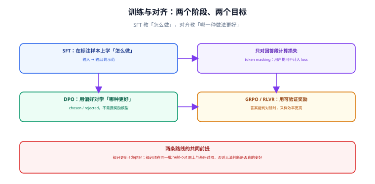

# 指令微调与偏好对齐

指令微调（SFT）教模型「怎么回答」，偏好对齐（DPO / ORPO / GRPO）教模型「两个都还行时该选哪个」。两者的数据、超参和失败模式都不同，必须分阶段做。



## 一句话定位

SFT 是**把期望行为写进样本里**；偏好对齐是**把评价标准写进比较里**。前者是必做项，后者是在 SFT 已经达标之后还差一点时的补充手段。

## 训练闭环：微调不是一次性的

```text
① 定型评测集（先做，不参与训练）
        ↓
② SFT 基线训练 → 评测 → 是否达标？
        ↓ 否                          ↓ 是
③ 归因：数据 or 超参 or 容量        ④ 偏好对齐（可选）
        ↓                                   ↓
⑤ 回到 ②，一次只改一个变量        ⑥ 评测 → 门禁 → 上线
```

纪律只有一条：**一次只改一个变量**。同时改数据和学习率，出了问题无法归因，只能重来。

## SFT 的核心配置

### 参数速查表

| 参数 | 建议起点 | 说明与调整方向 |
| --- | --- | --- |
| `learning_rate` | LoRA：`2e-4`；全参：`2e-5` | LoRA 比全参高约一个数量级；loss 不降先查这一项 |
| `num_train_epochs` | 2~3 | 超过 3 轮通常开始过拟合；小数据集 3~5 轮可试 |
| `per_device_train_batch_size` | 显存允许的最大值 | 与 `gradient_accumulation_steps` 乘积是**等效 batch** |
| `gradient_accumulation_steps` | 8~32 | 用来在不增显存的前提下扩大等效 batch |
| `gradient_checkpointing` | `True` | 省显存、慢 20%~30%；显存够时关掉换取速度 |
| `lr_scheduler_type` | `cosine` | `linear` 也可；小数据集差异不大 |
| `warmup_ratio` | 0.03 | 太小学不到东西，太大浪费时间 |
| `max_length` | 覆盖 99 分位长度 | 短于数据会截断（可能截掉答案），长于数据浪费显存 |
| `packing` | 短样本多时 `True` | 把多条样本拼成一条以提升吞吐，细节见下 |
| `bf16` | `True` | 不支持 bf16 的卡用 `fp16` |
| `seed` | 固定值（如 42） | 固定随机种子，否则两次训练结果无法对比 |

### 过拟合的判断标准

真正的判据不是 `train_loss`，而是 **`train_loss` 与 `eval_loss` 的走势关系**：

| 现象 | 含义 | 处理 |
| --- | --- | --- |
| 两者同步下降 | 正常学习 | 继续 |
| `train_loss` 降，`eval_loss` 先降后升 | 过拟合 | 减 epoch、加 dropout、加数据 |
| 两者都不降 | 学不到东西 | 查学习率、数据格式、loss mask |
| `train_loss` 剧烈震荡 | 学习率过大或等效 batch 太小 | 降学习率或加梯度累积 |
| `eval_loss` 略升但对照题准确率提升 | 常见的「变好但 loss 不好看」 | **以对照题为准**，不要只看 loss |

::: danger 三个「训练看起来正常但结果不对」的情况
1. **loss 很低但模型不会停**：数据里 assistant 段缺少结束标记，模型没学会在哪停。检查 chat template 渲染结果。
2. **loss 很低但答非所问**：训练与推理用的 chat template 不一致。把模板与适配器一起存档，推理时用同一份。
3. **loss 卡在某个平台不动**：LoRA 学习率仍沿用全参量级（`2e-5`），或者 `target_modules` 一个都没匹配上。用 `print_trainable_parameters()` 与参数名打印确认。
:::

### packing 的取舍

`packing=True` 会把多条短样本首尾相接地拼进同一条 `max_length` 序列，显著提升吞吐（短样本场景常见 2~3 倍）。

- **开启条件是「短样本多」**：如果你的数据普遍已经接近 `max_length`，packing 没有收益。
- **必须确认框架会用注意力掩码隔离各样本**，否则会出现「前一条样本的答案被后一条的问题影响」的串味问题。
- 最新 TRL 中 SFT 的 packing 相关取值有调整（旧值 `bfd-requeue` 已更名为 `bfd_split`），升级版本时注意旧脚本会静默走另一条路径——表现为「为什么我的旧脚本变慢/变怪了」。

## 偏好对齐：什么时候需要，用哪个

SFT 之后如果模型「大致会做，但有时会选出你不喜欢的那个答案」，才轮到偏好对齐。

| 方法 | 需要什么数据 | 是否需要参考模型 | 特点 | 适用 |
| --- | --- | --- | --- | --- |
| **DPO** | 偏好对（prompt + chosen + rejected） | 是（或隐式） | 最成熟、最稳，超参少 | **默认选择** |
| **ORPO** | 偏好对 | 否 | SFT 与偏好对齐合并成一步，省一次训练 | 数据少、想省算力 |
| **KTO** | 只有好/坏标签（不需要成对） | 是 | 数据门槛更低，只需二元反馈 | 有大量点赞/点踩记录 |
| **GRPO / RLOO** | prompt + 可自动校验的奖励 | 否 | 在线生成 + 打分，适合有明确对错的任务 | 数学、代码、可验证规则 |

::: danger TRL 1.13 起 PPO 已被移除
`PPOTrainer`、`PPOConfig` 与 value-head 相关代码在 **TRL 1.13.0 正式删除**（顶层的 `from trl import PPOTrainer` 自 1.10 起就不可用）。网上 2024—2025 年的大量 PPO 教程与脚本**不能直接在新版本上运行**。

正确做法：
- 需要稳定可控 → 用 **DPO**；
- 需要在线生成与自动打分 → 用 **GRPO / RLOO**；
- 确实必须跑经典 PPO → 固定安装 TRL 1.13 之前的版本，并把整套依赖一起锁死。
:::

## DPO：最常用的一次偏好对齐

```python [train_dpo.py]
"""DPO 最小完整示例（trl 1.13.x）。前提：已有通过评测的 SFT 适配器。"""
from datasets import load_dataset
from trl import DPOConfig, DPOTrainer

ds = load_dataset("json", data_files={"train": "data/pref_train.jsonl",
                                     "validation": "data/pref_val.jsonl"})

cfg = DPOConfig(
    output_dir="./runs/2026-09-18_dpo",
    num_train_epochs=1,              # 偏好对齐轮次通常远少于 SFT，1 轮很常见
    per_device_train_batch_size=1,
    gradient_accumulation_steps=8,
    learning_rate=5e-6,              # 比 SFT 小 1~2 个数量级，太大会把模型带偏
    beta=0.1,                        # 与参考模型的偏离惩罚，太大=几乎不学，太小=跑飞
    max_length=2048,
    max_prompt_length=1024,
    gradient_checkpointing=True,
    bf16=True,
    logging_steps=10,
    report_to=[],
)

trainer = DPOTrainer(
    model="./merged/qwen25-7b-ft-v1",      # 从 SFT 之后的模型出发
    args=cfg,
    train_dataset=ds["train"],
    eval_dataset=ds["validation"],
    processing_class=tokenizer,
)
trainer.train()
trainer.save_model("./runs/2026-09-18_dpo/adapter")
```

DPO 的三个关键参数：

1. **`beta`（默认 0.1）**：控制与参考模型的偏离程度。观察 `rewards/margins`（chosen 与 rejected 的得分差）——持续上升是正常学习；长期贴 0 说明没学到，突然变成很大的值说明跑飞。
2. **`learning_rate`（`5e-6` 级）**：DPO 对学习率远比 SFT 敏感，大一点就会破坏 SFT 已经学好的能力（表现为「格式全乱了」）。
3. **`num_train_epochs`（1 轮）**：偏好对齐过拟合极快，多轮通常表现为「一味讨好 chosen 的措辞，其他能力下降」。

## 顺序与禁忌

正确的阶段顺序：

```text
底座模型
  → ① SFT（教格式与流程）          必做
  → ② 评测，确认 SFT 基线达标      必做
  → ③ DPO / ORPO（教偏好）         可选，仅在②达标但仍有偏好问题
  → ④ 再次评测，与②的分数对比      必做
```

五条禁忌：

1. **不要在 SFT 未达标时做偏好对齐**：你会同时面对两个不确定因素，无法归因。
2. **不要用 SFT 的数据做偏好对齐的 chosen**：偏好数据需要「两个都合理但有一个更好」的结构，直接拿标准答案当 chosen 会让模型学到「更啰嗦 = 更好」。
3. **不要跳过「反向验证」**：DPO 之后必须重跑 SFT 的对照题，确认没有把已学会的能力弄丢。
4. **不要在偏好数据里混入格式错误的 rejected**：模型会学到「格式错 = 更差」，但同时也可能学到「格式是可以选择的」。
5. **不要相信单次运行**：固定 `seed` 后重复一次，结果差异大于你的验收阈值时，说明数据量或评测题量不够。

## 本页的可验证收尾

```shell
# ① 训练日志中 loss 有可观测下降，且 eval_loss 未持续上升
cat runs/2026-09-18_sft-lora-r16/trainer_state.json | python -m json.tool | tail -40

# ② DPO 的 rewards/margins 应呈上升趋势（若做了 DPO）
grep "rewards/margins" runs/2026-09-18_dpo/trainer_state.json

# ③ 与基座同题对照，确认净收益为正（这是最终判据）
python eval_compare.py --base Qwen/Qwen2.5-7B-Instruct \
                       --adapter runs/2026-09-18_sft-lora-r16 \
                       --suite data/sft_test.jsonl
```

第 ③ 步的期望输出：格式合法率、任务准确率等指标**高于基座**。如果某项变差而另一项变好，属于正常的权衡，但要记录在评测报告里，由发布门禁决定是否可接受。

## 参考资料

- [TRL SFTTrainer 文档](https://huggingface.co/docs/trl/sft_trainer)
- [TRL DPOTrainer 文档](https://huggingface.co/docs/trl/dpo_trainer)
- [Direct Preference Optimization](https://arxiv.org/abs/2305.18290)
- [ORPO: Monolithic Preference Optimization](https://arxiv.org/abs/2403.07691)
- [KTO: Model Alignment as Prospect Theoretic Optimization](https://arxiv.org/abs/2402.01306)
- [DeepSeek-R1 与 GRPO 相关说明](https://arxiv.org/abs/2501.12948)
- [TRL MIGRATION.md（版本迁移注意项）](https://github.com/huggingface/trl/blob/main/MIGRATION.md)
