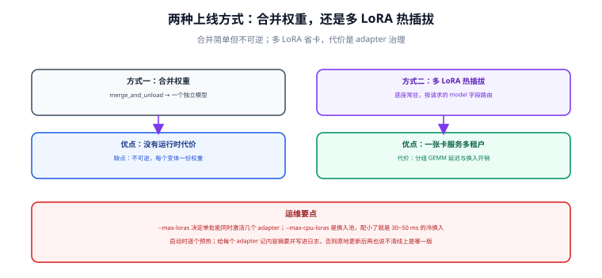

# 适配器服务化与多 LoRA 部署

训练出适配器只是半成品，能稳定地对外提供服务才算交付。本页讲清三种交付形态的取舍、vLLM 多 LoRA 服务化的关键参数，以及灰度与回滚的做法。



## 一句话定位

服务化的核心决策是：**为每个业务各起一个完整模型，还是共享一份底座、把适配器当作可插拔的路由目标**。前者简单、隔离好、显存贵；后者省显存、切换快、但对底座与适配器的一致性要求更高。

## 三种交付形态

| 形态 | 做法 | 显存 | 隔离性 | 切换速度 | 适用 |
| --- | --- | --- | --- | --- | --- |
| **合并权重** | 把适配器合并进底座，导出一个完整模型 | 每版一份完整权重 | 最好（物理隔离） | 换版本需重启实例 | 版本稳定、只需一版、给第三方交付 |
| **单适配器加载** | 底座 + 一个适配器在线加载 | 底座一份 + 适配器几十 MB | 好 | 秒级 | 业务单一、迭代频繁 |
| **多 LoRA 服务化** | 共享底座，按请求路由到不同适配器 | 底座一份 + N 个适配器 | 逻辑隔离 | 冷换入数十毫秒级 | 多业务/多租户共用一套 GPU |

选择建议：

- 只有一个业务、且版本不频繁 → 合并权重 + 常规推理服务，最简单，问题最少。
- 多个业务/多租户、都要微调、但流量都不大 → **多 LoRA 服务化**，这是最省钱的形态。
- 有合规或隔离要求（数据不能混、延迟不能互相影响）→ 拆实例，不要共享底座。

## vLLM 多 LoRA：关键参数

vLLM 对 LoRA 的支持包含两层：**启动时静态声明** 与 **运行时动态加载**。

```shell
# 静态声明：启动时把适配器挂上（最简单，重启后依然生效）
python -m vllm.entrypoints.openai.api_server \
  --model Qwen/Qwen2.5-7B-Instruct \
  --served-model-name qwen25-7b-base \
  --enable-lora \
  --max-lora-rank 32 \
  --max-loras 4 \              # 单个批次里最多同时用几个 LoRA
  --max-cpu-loras 8 \          # CPU 侧缓存上限：超出后需要从磁盘重新加载
  --lora-modules cs=/models/lora/cs-v1 \
                 legal=/models/lora/legal-v1 \
  --gpu-memory-utilization 0.85 \
  --port 8000
```

```shell
# 动态加载：服务不必重启，适合持续迭代的业务
curl -X POST http://localhost:8000/v1/load_lora_adapter \
  -H "Content-Type: application/json" \
  -d '{"lora_name": "cs-v2", "lora_path": "/models/lora/cs-v2"}'

# 动态卸载
curl -X POST http://localhost:8000/v1/unload_lora_adapter \
  -H "Content-Type: application/json" \
  -d '{"lora_name": "cs-v1"}'
```

参数解释与取值建议：

| 参数 | 作用 | 取值建议 |
| --- | --- | --- |
| `--enable-lora` | 开启 LoRA 支持 | 必开 |
| `--max-lora-rank` | 允许的最大秩 | 与训练时最大 `r` 一致；设得过大会浪费显存 |
| `--max-loras` | 单批次可同时激活的适配器数 | 按并发业务数设，通常 2~8 |
| `--max-cpu-loras` | CPU 侧缓存的适配器数（超出需从磁盘重载） | 按业务总数设，建议 ≥ 业务数 |
| `--gpu-memory-utilization` | 预留给 KV cache 的显存比例 | LoRA 场景建议下调至 0.80~0.85，给适配器留空间 |

::: danger 多 LoRA 场景下最容易踩的两个坑
1. **适配器换入延迟被当成「推理变慢」。** 未被 GPU 缓存的适配器需要从 CPU/磁盘换入，**冷换入是毫秒到数十毫秒量级**（实测数据随硬件与适配器大小变化），表现为「第一个请求明显慢」。如果业务对 P99 敏感，应把常用适配器放进 `--max-loras` 的常驻范围，或做预热请求。
2. **KV cache 显存被适配器挤占导致吞吐下降。** 开启 LoRA 后，KV cache 的可用块变少、更容易出现碎片，长上下文高并发时吞吐可能明显下降。正确做法是**显式下调 `--gpu-memory-utilization`、按实测重新标定并发上限**，而不是沿用纯底座的压测结论。
:::

## 请求路由：把适配器当成「模型名」

多 LoRA 服务最优雅的地方是：**适配器通过 `model` 字段选择**，客户端无需知道底座是什么。

```python
from openai import OpenAI

client = OpenAI(base_url="http://localhost:8000/v1", api_key="EMPTY")

# 走客服适配器
resp = client.chat.completions.create(
    model="cs-v2",
    messages=[
        {"role": "system", "content": "你是电商客服。"},
        {"role": "user", "content": "杯子碎了能退吗？"},
    ],
    temperature=0.2,
    max_tokens=512,
)
print(resp.choices[0].message.content)
```

::: warning 请求里的 model 名与适配器名必须完全一致
- 客户端传 `model="cs-v2"`，服务端必须有名为 `cs-v2` 的适配器（`--lora-modules` 的名字或动态加载时的 `lora_name`）。
- 名字对不上时的报错通常是「模型不存在」而不是「适配器不存在」，容易误判为服务没起来。
- 建议在网关层做一次映射（业务方名称 → 适配器名），这样迭代适配器版本时不必改客户端。
:::

## 一致性要求：三条必须对齐

多 LoRA 能共享底座的前提是**三条约束同时成立**：

| 约束 | 说明 | 违反的后果 |
| --- | --- | --- |
| 同一份底座 | 所有适配器必须基于**同一个底座权重与 revision** 训练 | 效果不可预期，可能出现明显错乱 |
| 模板一致 | 每个适配器训练用的 chat template 与推理时的一致 | 格式崩坏、答非所问 |
| rank 上限 | 所有适配器的 `r` 不超过 `--max-lora-rank` | 服务启动失败或该适配器加载失败 |

```json [适配器元数据：建议随适配器一起发布]
{
  "adapter_name": "cs-v2",
  "base_model": "Qwen/Qwen2.5-7B-Instruct",
  "base_revision": "cc594898137f460bfe9f0759e9844b3ce807cfb5",
  "lora_rank": 16,
  "chat_template": "default-qwen2.5",
  "eval_report": "runs/2026-09-18_sft-lora-r16/eval/report.json",
  "gate_passed": true
}
```

在服务启动脚本里校验这份元数据（底座一致、rank 不超限、门禁已通过），可以避免 90% 的线上事故。

## 灰度与回滚

```text
新适配器 cs-v2（已过门禁）
        ↓
① 影子流量：少量真实请求同时打 cs-v1 与 cs-v2，只记录不返回
        ↓ 指标无异常
② 灰度：5% 流量 → 观察 1 小时（错误率 / 延迟 / 人工反馈）
        ↓
③ 扩量：20% → 50% → 100%，每一档都设观察窗口
        ↓ 任一档指标恶化
④ 回滚：把网关映射切回 cs-v1（多 LoRA 形态下回滚只是改一个名字，秒级生效）
```

回滚设计要点：

- **保留上一版适配器至少一个迭代周期**，不要训练完就删。
- 回滚动作要能在**不重启服务**的情况下完成（这正是多 LoRA 形态的最大优势）。
- 每次灰度都要留档：切了多久、多少流量、指标是什么、谁批准的。

## 监控：服务化后要看哪些指标

| 指标 | 为什么看 | 异常信号 |
| --- | --- | --- |
| 请求侧：错误率、超时率 | 最基本 | 出现 5xx 或超时上升 |
| 延迟分位：P50 / P95 / P99 | LoRA 换入的代价在尾部延迟暴露 | P99 突增而 P50 不变 → 适配器换入问题 |
| 适配器命中分布 | 是否有业务被路由错 | 某适配器流量为 0 或异常集中 |
| GPU 显存与 KV cache 使用率 | 判断是否接近 OOM 边界 | 持续 > 90% |
| 吞吐（tokens/s） | 成本与容量规划 | 相比基线下降 > 20% |
| 输出长度分布 | 模型行为漂移的早期信号 | 突然变长（啰嗦）或变短（截断） |
| 内容侧：格式合法率、拒答率 | 业务实际效果 | 格式合法率下降 → 模板或适配器不一致 |

::: tip 最有用的一条线上监控
**输出长度分布**。它几乎不花钱、不需要标注，却能最早发现「模型行为变了」：适配器加载错了、模板换了、权重被覆盖了，都会先表现为长度分布偏移。
:::

## 压缩与优化

服务化阶段还有两类常见优化：

1. **量化底座**：底座用 AWQ / GPTQ 等 4 bit 权重量化，显存占用可降到 BF16 的约 1/4，从而在同样的卡上容纳更多适配器与更长上下文。注意：**量化底座 + LoRA 的兼容性需要按推理引擎的版本逐一验证**，不要默认「训练用 4 bit 就一定支持服务端 4 bit」。
2. **前缀缓存与批处理调优**：把固定的 system 提示词做成前缀缓存，配合连续批处理（continuous batching），可显著降低首 token 延迟。多 LoRA 场景下要确认前缀缓存与适配器的交互行为符合预期。

## 本页的可验证收尾

```shell
# ① 服务起来且列出全部适配器
curl -s http://localhost:8000/v1/models | python -m json.tool

# ② 同一个 prompt 分别打到底座与两个适配器，确认输出确实不同
for m in qwen25-7b-base cs-v2 legal-v1; do
  echo "=== $m ==="
  curl -s http://localhost:8000/v1/chat/completions \
    -H "Content-Type: application/json" \
    -d "{\"model\":\"$m\",\"messages\":[{\"role\":\"user\",\"content\":\"用一句话说明退货政策\"}],\"max_tokens\":64}" \
    | python -c "import sys,json;print(json.load(sys.stdin)['choices'][0]['message']['content'])"
done

# ③ 压测并记录 P99（确认适配器换入没有拖坏尾部延迟）
hey -n 200 -c 8 -m POST -T application/json \
  -d '{"model":"cs-v2","messages":[{"role":"user","content":"你好"}],"max_tokens":64}' \
  http://localhost:8000/v1/chat/completions
```

第 ② 步的期望结果：三份输出有可辨识的差异（口吻、格式或措辞），且两个适配器各自符合自己的训练目标。**如果三者输出几乎一致，说明适配器没有真正生效**——优先检查 `model` 名是否匹配、底座 revision 是否与训练时一致。

## 参考资料

- [vLLM LoRA 服务化文档](https://docs.vllm.ai/en/latest/features/lora.html)
- [vLLM OpenAI 兼容服务器](https://docs.vllm.ai/en/latest/serving/openai_compatible_server.html)
- [Hugging Face PEFT：多适配器与合并](https://huggingface.co/docs/peft/developer_guides/lora)
- [S-LoRA: Serving Thousands of Concurrent LoRA Adapters](https://arxiv.org/abs/2311.03285)
