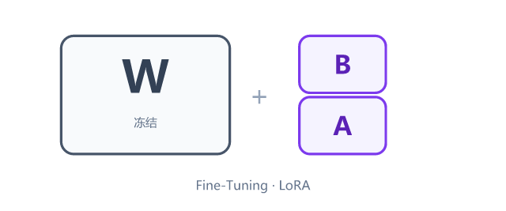
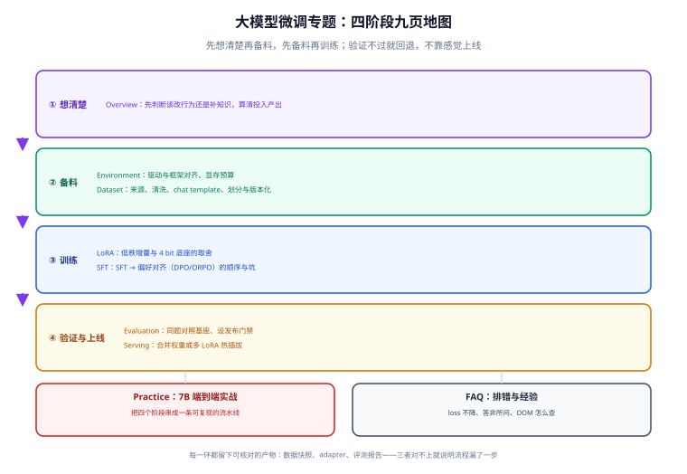

# 大模型微调

**微调（Fine-Tuning）** 是在预训练模型的基础上，用你自己的数据继续训练，把「通用助手」变成「你的专用模型」。它改的是模型的**行为、格式、口吻和判断标准**，不是给它灌输当天可变的事实——这是本专题反复强调的第一条分界线。

## 本专题讲什么

从「要不要微调」开始，到「怎么把训练出来的东西安全上线」结束，中间每一步都给出可复制的命令、可核对的产物和出问题时的排查路径。技术栈以当前主流开源方案为准：**transformers 5.x + peft 0.21.x + trl 1.13.x**，硬件按单机单卡到单机多卡的常见规模展开。

::: tip 一句话定位
微调不是「把模型变聪明」，而是**把模型变听话**；如果你的问题用一段更清楚的提示词或一次检索就能解决，就不要动训练。
:::

## 按环节找页面

| 环节 | 页面 | 你会拿到什么 |
| --- | --- | --- |
| 要不要做、做哪种 | [微调概述与选型](./Overview/index.md) | 行为 vs 知识的决策树、全参 / LoRA / 前缀类的取舍表 |
| 环境怎么装、显存够不够 | [环境与显存预算](./Environment/index.md) | 四层依赖对齐、按参数量估算显存的公式与算例 |
| 数据怎么准备 | [数据工程](./Dataset/index.md) | 采集 → 清洗 → 模板化 → 划分 → 版本化的五段流水线 |
| 怎么省显存地训练 | [LoRA 与 QLoRA](./LoRA/index.md) | 低秩增量的原理、超参怎么定、合并与不合并的代价 |
| 怎么教格式与偏好 | [指令微调与偏好对齐](./SFT/index.md) | SFT 的 loss mask、packing，以及 DPO / ORPO 的相对位置 |
| 怎么证明它真的变好了 | [评测与发布门禁](./Evaluation/index.md) | 基座同题对照、自动 + 人工混合评测、门禁阈值设计 |
| 怎么上线 | [服务化部署](./Serving/index.md) | 合并权重 vs 多 LoRA 热插拔、路由、灰度与回滚 |
| 完整跑一遍 | [实战：端到端](./Practice/index.md) | 7B 模型从数据到上线的可复现流水线 |
| 出问题怎么办 | [常见问题与排错](./FAQ/index.md) | loss 不降、答非所问、OOM、模板错位的对症处理 |

## 按目标选读路径

- **只想先把一个模型调出可用效果（最快路径）**：概述 → 环境 → LoRA → 实战。四页读完就能动手，数据与评测边跑边补。
- **效果不稳定、反复返工**：先补 [数据工程](./Dataset/index.md) 和 [评测与发布门禁](./Evaluation/index.md)。绝大多数「玄学不收敛」都能在这两页里找到可归因的原因。
- **要上生产、有多业务方**：直接看 [服务化部署](./Serving/index.md)，重点是多适配器路由与回滚策略。
- **在选技术栈、要做汇报**：概述里的决策表 + 评测页的门禁设计，这两部分是最容易被问到的。

## 三件事先说在前面

1. **微调改行为，RAG 补知识，提示词补指令。** 三条路的成本差一个数量级：改提示词以小时计，改检索以天计，改训练以周计。顺序错了，你会花几周去解决一个换句话就能解决的问题。知识类需求请看 [RAG 检索增强](../RAG/index.md)。
2. **效果上限由数据决定。** 训练算法只是在逼近数据里已经存在的规律；数据里有 5% 的样本标错，模型就会稳定地学出这 5% 的错误。
3. **没有评测就没有微调。** 「感觉变好了」不是验收标准。上线前必须有一组固定的对照题，让微调后的模型和基座模型跑同一套题，用数字说话。

::: warning 关于版本
本专题基于 2026 年 9 月的主流版本撰写：`peft 0.21.x`、`trl 1.13.x`、`transformers 5.x`。TRL 自 1.13.0 起已**移除 PPOTrainer 与 PPOConfig**（顶层的 `from trl import PPOTrainer` 从 1.10 起就不可用），网上大量 PPO 时代的脚本不能再直接跑；新版以 SFT、DPO、GRPO、RLOO 为主力路径。文中标注 `< 1.13` 与 `>= 1.13` 的差异处，请按你的实际版本选择写法。
:::

## 相关专题

- [大模型应用开发](../LLMApp/index.md)：先把应用骨架搭起来，再决定哪一环需要微调。
- [RAG 检索增强](../RAG/index.md)：事实类、时效类需求的正确解法；与微调是互补而非替代关系。
- [本地模型部署](../LocalModel/index.md)：训练完的模型怎么量化、怎么选推理引擎。
- [提示词工程](../PromptEngineering/index.md)：微调之前应该先榨干的那一层。
- [多模态应用](../Multimodal/index.md)：多模态模型的微调（视觉指令微调）思路一致，差别主要在数据与投影层。

## 参考资料

- [Hugging Face PEFT 官方文档](https://huggingface.co/docs/peft/index)
- [Hugging Face TRL 官方文档](https://huggingface.co/docs/trl/index)
- [Hugging Face Transformers 官方文档](https://huggingface.co/docs/transformers/index)
- [vLLM LoRA 服务化文档](https://docs.vllm.ai/en/latest/features/lora.html)
- [QLoRA 论文（Dettmers et al., 2023）](https://arxiv.org/abs/2305.14314)
- [LoRA 论文（Hu et al., 2021）](https://arxiv.org/abs/2106.09685)
