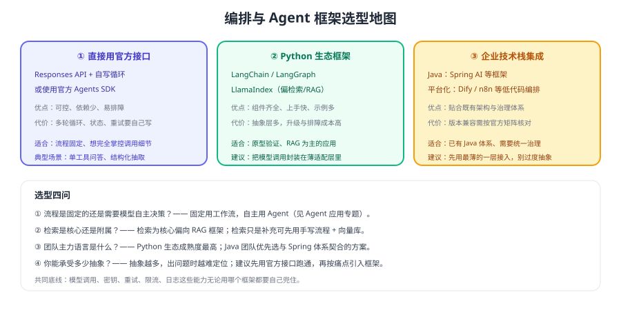

# Agent 框架与应用集成

当任务从「一问一答」升级为「多步执行」时，就需要编排：谁来决定下一步、工具怎么串、失败怎么重试。本页只讲**集成与选型**——不同技术栈怎么把编排跑起来；Agent 的原理、多智能体与安全边界见 [Agent 应用](../../Agent/index.md) 专题，不在此重复。



## 三种落地方式

| 方式 | 组成 | 适用 | 主要代价 |
| --- | --- | --- | --- |
| 官方接口 + 自写循环 | Responses API + 你的工具注册与循环 | 流程固定、工具不多、想完全掌控 | 需要自己写状态、重试、步数控制 |
| 官方 Agents SDK | 官方提供的 Agent/会话抽象 | 想快速搭建标准 Agent，且使用官方生态 | 需要学习其会话与工具模型 |
| 第三方 / 企业框架 | LangChain、LangGraph、LlamaIndex、Spring AI、Dify 等 | 复杂编排、RAG 为主、企业技术栈统一 | 抽象层多、版本升级与排障成本 |

::: tip 一句话理解
**先用最薄的一层跑通，再按痛点引入框架**。90% 的业务只需要「固定流程 + 一两个工具」，用 50 行代码就能写完；过早引入重框架，换来的往往是更难排查的问题。
:::

## 什么时候需要 Agent，什么时候用工作流

| 判断维度 | 用固定工作流 | 用 Agent |
| --- | --- | --- |
| 步骤是否确定 | 确定（先分类再检索再答复） | 不确定（需要模型自行决定顺序） |
| 工具数量 | 1~3 个 | 较多且需按情境选择 |
| 失败代价 | 高（资金、对外承诺） | 相对可控（内部辅助、信息检索） |
| 可观测性要求 | 需要逐步可查 | 同样需要，但依赖框架提供追踪 |
| 推荐做法 | **默认选它** | 确有需要再上 |

实践建议：**把 Agent 限制在"建议 + 只读操作"范围内，写操作走人工确认或固定流程**。

## 集成清单：框架换不掉的那部分

不管用哪种框架，下面这些能力必须由你自己兜住：

| 能力 | 具体要求 | 判断是否合格 |
| --- | --- | --- |
| 模型调用封装 | 超时、重试、降级、令牌统计 | 换模型只改一处配置 |
| 密钥管理 | 环境变量或密钥服务，绝不入库 | 代码仓库搜不到密钥 |
| 权限控制 | 工具内校验身份与数据范围 | 伪造用户 ID 无法越权 |
| 限流与并发 | 按租户/功能限流，控制并发 | 单租户无法拖垮整体 |
| 可观测性 | 记录每步输入输出、令牌、耗时、错误 | 一次会话可完整回放 |
| 人工兜底 | 低置信度、超步数、工具失败时的转人工路径 | 兜底路径有明确入口与告警 |
| 评测回归 | 固定评测集 + 每次改动跑分 | 有可对比的指标曲线 |

## 一个不依赖框架的编排示例

固定流程用「代码即流程」表达最直观，也最容易调试：

```python [workflow.py]
from dataclasses import dataclass

@dataclass
class Route:
    intent: str
    confidence: float

def handle(question: str, user_id: str) -> str:
    # 1. 分类（结构化输出，见 API 调用基础）
    route: Route = classify(question)
    if route.confidence < 0.6:
        return handoff_to_human(question, user_id, reason="分类置信度低")

    # 2. 按意图走不同分支（流程固定、可测试）
    if route.intent == "订单查询":
        order = order_tool.query(user_id)          # 身份由服务端注入，不用模型传
        return answer_with_order(question, order)
    if route.intent == "政策咨询":
        return rag_answer(question, tenant=tenant_of(user_id))

    # 3. 兜底：未知意图转人工，而不是让模型自由发挥
    return handoff_to_human(question, user_id, reason=f"未支持意图：{route.intent}")
```

::: warning 这段代码里最重要的不是模型调用
注意 `order_tool.query(user_id)`：用户身份来自服务端会话而不是模型参数；分类置信度低或意图未知时走人工。**这两点决定了系统是否可上线**，框架不会替你考虑。
:::

## 与既有技术栈的集成

| 技术栈 | 常见做法 | 注意事项 |
| --- | --- | --- |
| Python 后端 | 官方 SDK 直接调用；复杂编排用 LangGraph 等 | 关注框架版本升级的破坏性变更 |
| Java 后端 | Spring AI 等框架接入 | 按官方版本矩阵核对与 Spring Boot 的兼容性 |
| 前端 / BFF | 后端代理转发，前端只拿结果与流式片段 | 绝不把密钥放前端 |
| 低代码平台 | Dify / n8n 等做流程编排与运营 | 复杂逻辑仍应落在自有服务，避免被平台锁死 |
| 批处理 / 定时任务 | 批处理接口 + 队列，异步产出结果 | 与在线链路共用限流与预算池时要做优先级隔离 |

::: danger 集成阶段的高频问题
1. **把模型调用散落在业务各处**：换模型或加限流时要改十几个地方，先收敛到 `clients/` 一层。
2. **信任框架的默认重试**：框架重试叠加 SDK 重试，可能放大 3~9 倍流量，必须统一到一层。
3. **没有步数与超时上限**：Agent 循环可能无限执行，产生高额费用。
4. **工具错误直接抛给用户**：应转成可理解的话术，并保留日志。
5. **上线不做灰度**：先 5% 流量灰度，对比质量、延迟、成本三项指标再放量。
:::

## 验证方式

1. 用同一批 20 条问题分别跑「固定工作流」与「框架编排」两个版本，对比准确率、平均延迟与令牌成本。
2. 人为把分类置信度阈值调高，确认低置信度请求全部走人工兜底而不是被模型硬答。
3. 断开工具依赖服务，确认系统给出可理解提示且不产生脏数据（写操作必须幂等或人工确认）。
4. 统计一次完整会话的令牌与耗时，验证能精确回放到每一步（满足可观测性要求）。

## 参考资料

- Agents 指南：https://developers.openai.com/api/docs/guides/agents
- 生产最佳实践：https://developers.openai.com/api/docs/guides/production-best-practices
- 本库 Agent 专题：[Agent 原理](../../Agent/AgentPrinciples/index.md)、[工作流编排](../../Agent/Workflow/index.md)、[多智能体](../../Agent/MultiAgent/index.md)
- 本库 OpenClaw：[核心概念](../../OpenClaw/CoreConcepts/index.md)
