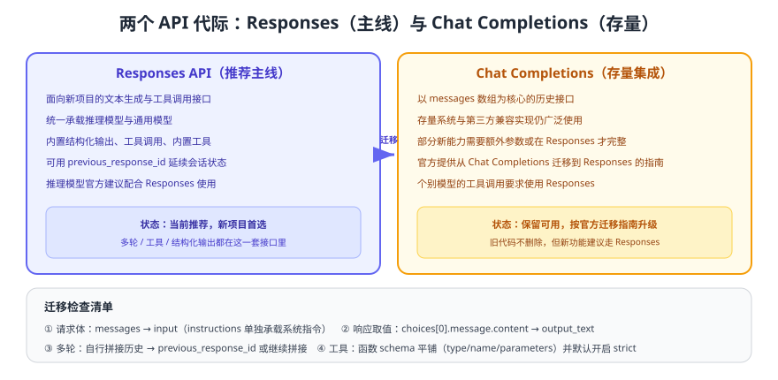

# Chat Completions 兼容用法（存量集成）

::: danger 维护状态声明
本页内容面向**存量集成与兼容用途**。新项目请使用 [Responses API](../index.md)，官方也建议文本生成类应用优先采用 Responses，推理模型尤其如此。Chat Completions 的用法在本库中**保留、不删除、不覆盖**，便于维护老系统与第三方兼容实现；升级请参考官方迁移指南。
:::

很多现有系统、第三方 SDK 与兼容网关仍以 Chat Completions 的 `messages` 结构为中心，因此维护这类代码时，理解它与 Responses 的对应关系非常必要。



## 结构对照

| 维度 | Chat Completions（存量） | Responses（主线） |
| --- | --- | --- |
| 核心入参 | `messages`（role/content 数组） | `input`（字符串或输入项数组）+ `instructions` |
| 系统指令 | `messages` 中 `role: "system"` | 独立字段 `instructions` |
| 结果取值 | `choices[0].message.content` | `output_text`（聚合文本）或 `output`（结构化项） |
| 工具调用 | `tool_calls` + `role: "tool"` 回传 | `function_call` 项 + `function_call_output` 项 |
| 结构化输出 | 通过 `response_format` 约束 | 通过 `text.format` 约束 |
| 会话状态 | 客户端自行拼接历史 | 可继续拼接，也可用 `previous_response_id` |
| 新能力覆盖 | 部分新能力需使用 Responses | 内置工具、推理模型等新能力的主要入口 |

## 存量写法示例

```python [legacy_chat.py]
from openai import OpenAI

client = OpenAI()

resp = client.chat.completions.create(
    model="gpt-5.6",                  # 兼容性示例，实际以官方文档说明为准
    messages=[
        {"role": "system", "content": "你是客服助手，只回答售后问题。"},
        {"role": "user", "content": "订单三天没发货怎么办？"},
    ],
    max_tokens=500,
)

print(resp.choices[0].message.content)
print(resp.usage)                     # prompt_tokens / completion_tokens
```

流式写法：

```python [legacy_stream.py]
stream = client.chat.completions.create(
    model="gpt-5.6",
    messages=[{"role": "user", "content": "用三句话解释什么是令牌。"}],
    stream=True,
)

for chunk in stream:
    delta = chunk.choices[0].delta.content
    if delta:
        print(delta, end="", flush=True)
```

## 迁移到 Responses

官方提供迁移指南，实操上主要是四处改动：

| 改动点 | 迁移前 | 迁移后 |
| --- | --- | --- |
| 请求体 | `messages=[...]` | `instructions="..."` + `input=[...]` |
| 取结果 | `choices[0].message.content` | `output_text` |
| 多轮 | 每次把全部历史重新拼进 `messages` | 可继续拼接 `input`，或用 `previous_response_id` 续接 |
| 工具 | `tools` 中使用嵌套的 `function` 对象，回传 `role: "tool"` | `tools` 中函数定义平铺，回传 `function_call_output` 项 |

```python [migrated.py]
# 迁移后：同样的业务，改用 Responses 主线接口
response = client.responses.create(
    model="gpt-5.6",
    instructions="你是客服助手，只回答售后问题。",
    input=[{"role": "user", "content": "订单三天没发货怎么办？"}],
    max_output_tokens=500,
)
print(response.output_text)
```

::: tip 迁移策略：新旧并行，按接口灰度
1. 先把模型调用收敛到**一个薄封装**（`clients/`），迁移时只改这一层。
2. 用同一批评测样本对比迁移前后的输出质量与令牌消耗，确认无回归再放量。
3. 老接口的路由保留一个开关，出现问题时能按业务线快速回退。
:::

## 兼容实现的注意事项

使用第三方兼容服务或自建网关（以 OpenAI 协议对外）时，留意三类差异：

1. **参数子集不同**：兼容实现未必支持 `strict` 结构化输出、`parallel_tool_calls` 等新参数，接入前要做能力探测。
2. **令牌统计口径不同**：`usage` 字段可能缺失或计算方式不同，成本核算不能直接复用同一套单价。
3. **重试与限流语义不同**：错误码、响应头、限流维度可能不一致，重试策略要按供应商配置，而不是照搬。

::: danger 存量代码常见坑
1. **把 `system` 内容与用户输入拼接**：容易造成提示注入，迁移时顺手拆成 `instructions` 更安全。
2. **依赖 `max_tokens` 名称**：新接口使用 `max_output_tokens`，字段名混用会直接报错。
3. **多轮时重复发送全量历史且无限增长**：令牌成本随轮次平方增长，必须做裁剪或摘要（见 [上下文与记忆管理](../../ContextMemory/index.md)）。
4. **忽略截断**：Chat Completions 用 `finish_reason`，Responses 用 `status` / `incomplete_details`，判断逻辑不能照搬。
:::

## 验证方式

1. 用同一段输入分别调用两个接口，确认输出语义一致、令牌消耗量级相近。
2. 对同一业务代码分别在「旧接口」和「新接口」开关下运行，确认业务结果与错误处理都正确。
3. 用评测集对比迁移前后的准确率与平均延迟，形成可review的迁移结论（而不是凭感觉切换）。
4. 在兼容网关上验证关键参数支持情况（结构化输出、工具调用、流式），并记录能力矩阵。

## 参考资料

- 迁移指南：https://developers.openai.com/api/docs/guides/migrate-to-responses
- 文本生成接口总览：https://developers.openai.com/api/docs
- 结构化输出差异说明：https://developers.openai.com/api/docs/guides/structured-outputs
- 主线接口用法：[API 调用基础](../index.md)
