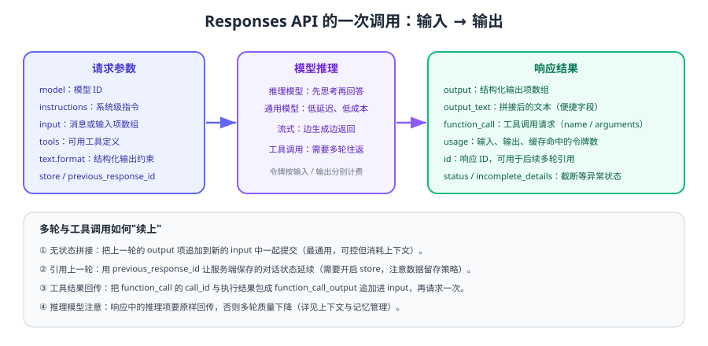

# API 调用基础

把大模型接入业务的第一步是**稳定、可控地调用接口**：请求体怎么写、响应怎么解析、流式怎么处理、失败怎么重试。本页以官方推荐的 Responses API 为主线，给出可直接运行的示例与工程约束。



## 请求与响应结构

| 字段 | 作用 | 工程建议 |
| --- | --- | --- |
| `model` | 指定模型 ID | 放进配置而非硬编码，便于灰度与降级 |
| `instructions` | 系统级指令（独立于用户输入） | 放稳定内容，利于命中提示缓存 |
| `input` | 输入内容：字符串或输入项数组 | 多轮时按「先历史后当前」的顺序组装 |
| `tools` | 可调用的工具定义 | 只暴露本轮需要的工具，越少越准 |
| `text.format` | 结构化输出约束（如 JSON Schema） | 需要程序解析时必开 |
| `max_output_tokens` | 输出上限 | 必须设置，防止异常长输出拉高成本 |
| `store` / `previous_response_id` | 服务端保存与引用对话状态 | 涉及敏感数据时先确认留存策略 |
| `stream` | 是否流式返回 | 面向用户界面时开启，提升体感速度 |

响应侧重点看四个字段：

| 字段 | 说明 |
| --- | --- |
| `output_text` | 便捷聚合的文本结果（适用于纯文本场景） |
| `output` | 结构化输出项数组（工具调用、推理项等都在这里） |
| `usage` | 输入、输出与缓存命中的令牌数，成本核算的依据 |
| `status` / `incomplete_details` | 是否被截断（如达到 `max_output_tokens`） |

## 最小调用与流式输出

```python [basic_call.py]
from openai import OpenAI

client = OpenAI()

response = client.responses.create(
    model="gpt-5.6",
    instructions="你是客服助手，只回答售后问题，其他问题礼貌拒答。",
    input="我的订单三天没发货了，怎么办？",
    max_output_tokens=500,
)
print(response.output_text)
print("tokens:", response.usage)
```

```python [stream_call.py]
stream = client.responses.create(
    model="gpt-5.6",
    input="用 5 条要点说明如何降低大模型应用的成本。",
    stream=True,
)

for event in stream:
    # 只处理文本增量事件，其余事件（如输出项添加）按需处理
    if event.type == "response.output_text.delta":
        print(event.delta, end="", flush=True)
```

预期输出：文本逐步打印而非一次性出现。若前端通过 SSE 转发，注意在首字节前设置好响应头，否则会出现「攒完一次性返回」的假流式。

## 结构化输出：让程序能解析

需要把结果交给程序处理时（分类、抽取、路由），必须约束输出格式：

```python [structured_call.py]
import json
from openai import OpenAI

client = OpenAI()

schema = {
    "type": "object",
    "properties": {
        "category": {"type": "string", "enum": ["售后", "物流", "账单", "其他"]},
        "confidence": {"type": "number"},
        "need_human": {"type": "boolean"},
    },
    "required": ["category", "confidence", "need_human"],
    "additionalProperties": False,
}

response = client.responses.create(
    model="gpt-5.6",
    input="用户说：快递显示签收但我没收到，要求退款。",
    text={
        "format": {
            "type": "json_schema",
            "name": "ticket_classification",
            "schema": schema,
            "strict": True,
        }
    },
)

result = json.loads(response.output_text)
print(result)
if result["confidence"] < 0.6 or result["need_human"]:
    print("置信度不足，转人工")
```

预期输出：`{'category': '物流', 'confidence': 0.9, 'need_human': True}` 之类的可解析 JSON。注意 `strict` 模式要求所有字段都出现在 `required` 中，可选字段用 `["string", "null"]` 表达。

::: tip 结构化输出的三个收益
1. 解析不再靠正则，字段缺失会直接暴露而不是「看起来还行」。
2. 枚举约束能显著减少模型自由发挥（如把「退款」写进「物流」类别）。
3. 便于建立评测集：字段级对比比文本相似度客观得多。
:::

## 令牌与上下文窗口

| 概念 | 说明 | 工程含义 |
| --- | --- | --- |
| 输入令牌 | 系统指令 + 历史 + 工具定义 + 用户输入 + 检索片段 | 通常占总成本大头，压缩收益最直接 |
| 输出令牌 | 模型生成的文本与结构化字段 | 用 `max_output_tokens` 设上限 |
| 缓存输入令牌 | 命中提示缓存的稳定前缀部分 | 计费更低（官方文档描述最高可省 90%） |
| 上下文窗口 | 一次请求可容纳的最大令牌量 | 超限会被截断或报错，必须先做预算 |

::: warning 上下文不是越大越好
把整份文档塞进请求，短期「看起来能用」，长期会带来三件事：成本飙升、延迟上升、关键指令被淹没导致效果变差。正确做法是**检索出相关片段**（见 [RAG 检索增强接入](../RagOverview/index.md)）而不是整篇投喂。
:::

## 错误处理与重试

| 现象 | 常见原因 | 处理方式 |
| --- | --- | --- |
| `401` 未授权 | 密钥错误、环境变量未生效 | 启动时做配置自检，快速失败 |
| `404` 模型不存在 | 模型 ID 下线或拼写错误 | 模型 ID 配置化，按官方页面更新 |
| `429` 触发限流 | RPM / TPM 超限 | 按响应头退避重试，必要时排队或降级 |
| `5xx` 服务端错误 | 上游波动 | 指数退避 + 抖动重试，限制最大次数 |
| 请求超时 | 输出过长或网络抖动 | 设置超时；对写操作类工具调用不要盲目重试 |
| `status=incomplete` | 达到输出上限被截断 | 提高上限或拆分任务，并在业务上识别该状态 |

```python [resilient_call.py]
import random
import time
from openai import OpenAI, APIStatusError, APITimeoutError

client = OpenAI(timeout=30.0, max_retries=0)   # 关闭 SDK 自动重试，自己控制退避

def call_with_retry(payload: dict, max_attempts: int = 4) -> str:
    for attempt in range(1, max_attempts + 1):
        try:
            return client.responses.create(**payload).output_text
        except APIStatusError as e:
            retryable = e.status_code == 429 or e.status_code >= 500
            if not retryable or attempt == max_attempts:
                raise
            delay = min(2 ** attempt, 16) + random.random()      # 指数退避 + 抖动
            time.sleep(delay)
        except APITimeoutError:
            if attempt == max_attempts:
                raise
            time.sleep(1.5 * attempt)
    raise RuntimeError("unreachable")
```

::: danger 高频错误
1. **把用户输入直接拼进 `instructions`**：用户可借此覆盖系统指令（提示注入），应始终分字段传入。
2. **不设置超时和输出上限**：一次异常调用就能占满线程池并产生高额账单。
3. **对所有异常都重试**：参数错误、鉴权失败重试没有意义，只会放大问题。
4. **重试写操作类工具**（如「创建工单」）：要么使用幂等键，要么改成先查询后写入。
5. **忽略 `incomplete` 状态**：被截断的 JSON 无法解析，会表现成「随机失败」。
:::

## 验证方式

1. 运行 `basic_call.py` 与 `stream_call.py`，确认文本与流式两种返回都正常。
2. 运行 `structured_call.py`，把 `category` 换成 10 条真实工单文本，确认字段与枚举全部合法。
3. 人为把 `max_output_tokens` 调到 16，观察 `incomplete_details` 字段，确认程序能识别截断。
4. 用错误密钥与不存在的模型 ID 各调用一次，确认错误被明确捕获且不会重试。

## 参考资料

- OpenAI API 文档总览：https://developers.openai.com/api/docs
- 结构化输出指南：https://developers.openai.com/api/docs/guides/structured-outputs
- 从 Chat Completions 迁移到 Responses：https://developers.openai.com/api/docs/guides/migrate-to-responses
- 生产最佳实践：https://developers.openai.com/api/docs/guides/production-best-practices
