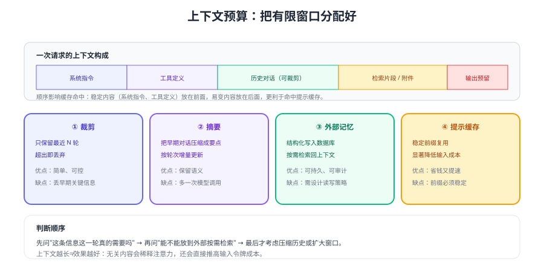

# 上下文与记忆管理

大模型每次请求都是**无状态**的：它只看这次请求里带的内容。所以"记住上一轮说了什么"完全由你的应用负责，而上下文窗口又有限——把哪些内容放进去、放多少，直接决定效果、延迟与成本。



## 上下文里都有什么

| 组成 | 是否稳定 | 建议策略 |
| --- | --- | --- |
| 系统指令 | 稳定 | 放最前面，写成常量，利于命中提示缓存 |
| 工具定义 | 稳定但占空间 | 只放本轮必需的工具；工具多时按需加载 |
| 历史对话 | 持续增长 | 滑动窗口裁剪或滚动摘要 |
| 检索片段 / 附件 | 每次不同 | 放在稳定前缀之后，控制在预算内 |
| 输出预留 | 必须保留 | 按任务复杂度预留令牌，避免被截断 |

::: tip 一句话理解
做上下文管理就是做**预算分配**：先确定输出要留多少，再把剩余空间按「系统指令 < 工具定义 < 检索片段 < 历史」的优先级分配。
:::

## 四种管理策略

### 策略一：滑动窗口裁剪

只保留最近 N 轮对话，实现最简单：

```python [window.py]
def build_input(history: list[dict], max_turns: int = 8) -> list[dict]:
    """保留系统指令 + 最近 max_turns 轮对话。"""
    system = [m for m in history if m["role"] == "system"]
    others = [m for m in history if m["role"] != "system"]
    return system + others[-max_turns * 2:]
```

代价是会丢失早期关键信息，例如用户在第一轮说的订单号。缓解办法：**把关键实体抽出来单独保存**（订单号、城市、金额），每轮作为结构化上下文注入，而不是指望模型自己记住。

### 策略二：滚动摘要

把超过窗口的历史压缩成要点，随对话推进增量更新：

```python [summary.py]
SUMMARY_PROMPT = """把下面的对话压缩成不超过 200 字的要点，保留：
1) 用户身份与订单等关键标识；2) 已确认的需求与约束；3) 尚未解决的问题。"""

def summarize(client, old_messages: list[dict], previous: str = "") -> str:
    text = f"已有摘要：{previous}\n\n新增对话：\n" + "\n".join(
        f"{m['role']}: {m['content']}" for m in old_messages
    )
    resp = client.responses.create(
        model="gpt-5.6",                       # 摘要可用更便宜的模型
        instructions=SUMMARY_PROMPT,
        input=text,
        max_output_tokens=400,
    )
    return resp.output_text
```

摘要会多一次模型调用，但能显著降低后续每轮的输入令牌；**摘要本身也要存版本**，便于回滚与排查。

### 策略三：外部记忆

把需要跨会话保留的信息存到数据库或向量库，需要时检索回上下文：

| 类型 | 示例 | 存放方式 |
| --- | --- | --- |
| 用户画像与偏好 | 语言偏好、常用地区、订阅等级 | 关系型数据库（结构化字段） |
| 事实性记忆 | 客户的设备型号、历史工单结论 | 关系型数据库 + 检索 |
| 语义记忆 | 大量非结构化历史记录 | 向量库（见 [RAG 检索增强接入](../RagOverview/index.md)） |

原则：**结构化能解决就不要用向量**。订单号、金额这类字段用数据库查询最准、最便宜。

### 策略四：提示缓存

官方文档说明：稳定前缀可被缓存复用，缓存命中的输入令牌按更低的费率计费（描述为最高可省 90%），缓存有最小前缀长度要求，且缓存条目有有效期。工程上的结论有三条：

1. **把稳定内容放在最前面**：系统指令、工具定义、固定的 few-shot 示例不要每轮变动。
2. **不要在前缀里放时间戳或随机内容**：哪怕多一个变化的数字，也会让命中失效。
3. **缓存不是持久存储**：它用于降本提速，不能当作状态保存手段。

## 会话状态：两种接法

| 方式 | 做法 | 优点 | 注意 |
| --- | --- | --- | --- |
| 客户端拼接 | 每次把历史按顺序放进 `input` | 完全可控、易审计、可裁剪 | 需要自己做预算与裁剪 |
| 服务端引用 | 用 `previous_response_id` 续接上一轮 | 应用侧更省事 | 依赖服务端保存，涉及敏感数据时先确认留存策略 |

::: warning 推理模型的特殊要求
官方文档指出：无状态请求时应**完整回传响应中的 `output` 项**（包含推理项），否则后续轮次的推理链会断掉、质量下降。用 `previous_response_id` 续接时服务端会替你处理这部分，但仍需注意数据留存与合规。
:::

## 工程落地的五个习惯

1. **给每次请求记预算**：在客户端封装里计算"输入 + 预留输出"，超预算先裁剪而不是硬发。
2. **会话与业务绑定**：`session_id` 关联到业务单据，便于排查"这轮模型看到了什么"。
3. **提示词版本化**：`prompts/` 目录纳入 Git，每次变更记录版本号，出问题可对比。
4. **限制单会话上限**：轮数、令牌、金额三个维度都设上限，防止恶意长对话拖垮账单。
5. **敏感信息不落上下文**：能脱敏就脱敏，能在工具里查就不要塞进提示词。

::: danger 常见错误
1. **每轮重发全量历史**：令牌成本随轮次近似平方增长，长会话会失控。
2. **把工具定义写进系统提示词**：工具应通过 `tools` 参数传入，混写会导致模型"假装调用"。
3. **裁剪时不保护关键实体**：订单号被裁掉后，模型只能反问用户，体验明显变差。
4. **摘要不记录版本**：摘要污染后无法定位是哪一轮开始跑偏的。
5. **依赖缓存保证正确性**：缓存只影响成本与延迟，任何正确性都不能建立在其上。
:::

## 验证方式

1. 构造 20 轮对话，分别在"全量发送"和"窗口裁剪"两种策略下运行，对比每轮输入令牌与总成本。
2. 在对话第一轮给订单号，第 15 轮再问「我的订单到哪了」，确认关键实体抽取策略生效（裁剪后仍能答对）。
3. 连续 5 次发送完全相同的前缀，打印 `usage` 中的缓存相关字段，确认命中情况随前缀稳定性变化。
4. 把时间戳写进系统指令，验证缓存命中率下降（成本上升），再改回固定指令对比，形成可验证的结论。

## 参考资料

- 会话状态管理：https://developers.openai.com/api/docs/guides/conversation-state
- 提示缓存：https://developers.openai.com/api/docs/guides/prompt-caching
- 推理模型使用建议：https://developers.openai.com/api/docs/guides/reasoning
- 本库提示词工程：[结构化提示词](../../PromptEngineering/StructuredPrompts/index.md)
