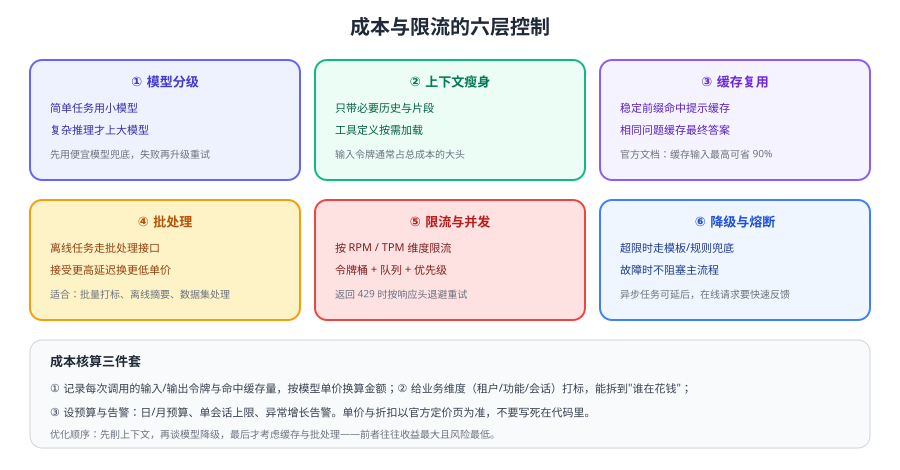

# 成本核算与限流降级

大模型应用的账单可以在一夜之间翻十倍：一次提示词改动、一段被拼进上下文的整篇文档、一个没有上限的 Agent 循环，都会放大成本。本页给出**能算、能控、能降级**的工程做法。



## 成本由什么构成

| 组成 | 说明 | 优化空间 |
| --- | --- | --- |
| 输入令牌 | 系统指令、历史、工具定义、检索片段、用户输入 | 最大（压缩上下文收益直接） |
| 输出令牌 | 模型生成的文本与结构化字段 | 中等（设置输出上限、精简字段） |
| 缓存输入令牌 | 命中提示缓存的稳定前缀 | 大（官方文档描述最高可省 90%） |
| 推理令牌 | 推理模型"思考"过程产生的令牌 | 中（按任务难度选档位，别一律用推理模型） |

::: warning 单价必须实时查询
模型单价、缓存折扣、批处理折扣会随时调整，**不要写死在代码里**。本文只给计算方法，具体价格以官方定价页为准。
:::

## 成本估算：三步算清一笔账

```text
单次成本 = 输入令牌 × 输入单价 + 输出令牌 × 输出单价 + 缓存命中令牌 × 缓存单价
月成本   ≈ 单次成本 × 日调用量 × 30 × 放大系数（重试与失败按 1.1~1.3 估）
```

```python [cost.py]
# 单价从配置中心读取，按官方定价页定期更新，禁止硬编码
PRICES = {
    "gpt-5.6": {"input": 0.0_0, "output": 0.0_0, "cached_input": 0.0_0},  # 单位：每 1M 令牌
}

def estimate(model: str, input_tokens: int, output_tokens: int, cached_tokens: int = 0) -> float:
    p = PRICES[model]
    billable_input = max(input_tokens - cached_tokens, 0)
    return (
        billable_input / 1_000_000 * p["input"]
        + cached_tokens / 1_000_000 * p["cached_input"]
        + output_tokens / 1_000_000 * p["output"]
    )

# 每次调用后记录，按业务维度聚合
record_usage(
    tenant="acme", feature="ticket_assistant", model="gpt-5.6",
    input_tokens=response.usage.input_tokens,
    output_tokens=response.usage.output_tokens,
)
```

必须按**四个维度**打标，否则没法定向优化：租户（谁在用）、功能（哪个场景）、模型（哪个档位）、会话（是否异常长）。

## 六层控制手段

| 层 | 手段 | 典型收益 |
| --- | --- | --- |
| ① 模型分级 | 分类/抽取用通用模型，复杂推理才用推理模型 | 单次成本可差数倍 |
| ② 上下文瘦身 | 裁剪历史、按需加载工具、只带 Top-K 片段 | 输入令牌常能降 50% 以上 |
| ③ 缓存复用 | 稳定前缀命中提示缓存；相同问题缓存最终答案 | 输入成本大幅下降 |
| ④ 批处理 | 非实时任务走批处理接口 | 官方提供批处理折扣 |
| ⑤ 限流与并发 | 令牌桶 + 队列 + 优先级 | 避免突发打爆配额与被限流 |
| ⑥ 降级与熔断 | 超限走缓存/模板/排队/人工 | 保住主流程可用性 |

优化顺序建议：**先削上下文 → 再调模型档位 → 最后才上缓存与批处理**。前两步收益最大且不引入额外复杂度。

::: tip 先量化再优化
动手前先回答三个问题：**每次调用消耗多少令牌？钱花在哪个功能上？优化后能省多少？** 没有这三组数据，任何优化都只是猜测，也很难说服团队投入改造。
:::

## 限流：维度、信号与处理

### 限流的维度

官方文档说明，速率限制会按 **RPM（每分钟请求）、RPD（每天请求）、TPM（每分钟令牌）、TPD（每天令牌）** 等维度计算，**任一维度先到都会被限制**；批处理任务按排队输入的令牌数计算队列限制；用量层级会随累计消费自动提升。

| 维度 | 含义 | 应对 |
| --- | --- | --- |
| RPM / RPD | 请求次数上限 | 合并请求、批量处理、排队 |
| TPM / TPD | 令牌量上限 | 压缩上下文、错峰、分级路由 |
| 队列类限制 | 批处理排队令牌 | 拆批、降低并发、避开高峰 |

### 遇到 429 怎么处理

1. **读取响应头**：官方返回 `x-ratelimit-*` 系列头，包含剩余额度与重置时间，用它计算等待时间比盲目重试更可靠。
2. **指数退避 + 抖动**：等待时间取「服务端建议时间」与「指数退避」的较大值，并加随机抖动避免惊群。
3. **排队而不是硬重试**：在线场景可短暂排队；不可接受时直接降级。
4. **区分优先级**：交互式请求优先，离线任务让路，避免后台任务把配额吃光。

```python [token_bucket.py]
import threading, time

class TokenBucket:
    """极简令牌桶：限制每分钟请求数；生产建议用 Redis 做多实例共享配额。"""
    def __init__(self, rate_per_min: int):
        self.capacity = rate_per_min
        self.tokens = rate_per_min
        self.rate = rate_per_min / 60.0
        self.updated = time.monotonic()
        self.lock = threading.Lock()

    def acquire(self, timeout: float = 5.0) -> bool:
        deadline = time.monotonic() + timeout
        while True:
            with self.lock:
                now = time.monotonic()
                self.tokens = min(self.capacity, self.tokens + (now - self.updated) * self.rate)
                self.updated = now
                if self.tokens >= 1:
                    self.tokens -= 1
                    return True
            if time.monotonic() > deadline:
                return False
            time.sleep(0.05)
```

## 降级策略

| 触发条件 | 降级动作 | 用户体验 |
| --- | --- | --- |
| 命中相同/相似问题 | 直接返回缓存答案（标注"来自缓存"） | 秒级返回 |
| 达到日预算 | 切小模型或模板回答，并提示能力受限 | 仍可用，但能力下降 |
| 触发限流且无法排队 | 提示稍后重试 + 记录待处理任务 | 可预期、不阻塞 |
| 模型服务不可用 | 转人工或走规则引擎 | 主流程不中断 |
| 置信度低 / 超步数 | 转人工，并附上已收集信息 | 人工接手更顺畅 |

::: danger 成本失控的六个典型原因
1. **把整篇文档塞进上下文**：单次请求从 2K 令牌涨到 50K 令牌。
2. **没有输出上限**：模型偶发长篇输出，直接抬高账单。
3. **多重嵌套重试**：SDK 重试 × 框架重试 × 业务重试，失败风暴时流量成倍放大。
4. **Agent 无步数上限**：循环几十次才停。
5. **同一用户高频轮询**：前端每秒刷新一次，每次都真调模型。
6. **缺少用量打标**：只能看到总账，不知道是哪个功能在烧钱。
:::

## 监控指标

| 指标 | 用途 | 告警建议 |
| --- | --- | --- |
| 每请求平均令牌 | 发现上下文膨胀 | 环比上升 30% 告警 |
| 日/月累计费用 | 预算控制 | 达到 70% / 90% 预算分级告警 |
| 缓存命中率 | 验证缓存策略有效性 | 突然下降要查前缀是否被改动 |
| 429 比例 | 判断是否需要提额或限流 | 超过 1% 需处理 |
| P95 延迟 | 用户体验 | 超过 SLA 阈值告警 |
| 失败率与重试次数 | 稳定性 | 重试率上升说明下游或配置异常 |

## 验证方式

1. 打印 100 次真实请求的 `usage`，按 `estimate()` 计算总成本，并与控制台账单核对量级。
2. 把检索片段数量从 3 提高到 10，记录令牌与成本的涨幅，验证上下文对成本的直接影响。
3. 用脚本并发打到触发 429，确认退避与排队逻辑生效、无请求丢失、无级联重试。
4. 人为把日预算调低，确认系统能自动切到降级路径并在界面上给出明确提示。

## 参考资料

- 速率限制指南：https://developers.openai.com/api/docs/guides/rate-limits
- 定价（以官方页面实时信息为准）：https://developers.openai.com/api/docs/pricing
- 批处理接口：https://developers.openai.com/api/docs/api-reference/batch/create
- 提示缓存：https://developers.openai.com/api/docs/guides/prompt-caching
- 生产最佳实践：https://developers.openai.com/api/docs/guides/production-best-practices
- 检索类应用的成本结构（嵌入 / 向量库 / 重排 / 生成）：[RAG 检索增强 · 生产工程化](../../RAG/Pipeline/index.md)
- 自建推理的成本构成（GPU 折旧 / 电费 / 运维）：[本地模型部署 · 常见问题与最佳实践](../../LocalModel/FAQ/index.md)
