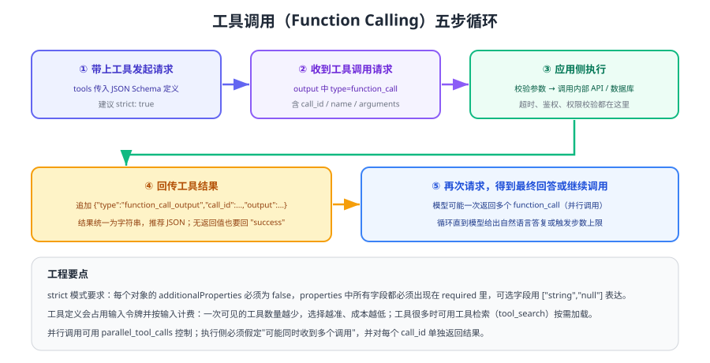

# 工具与函数调用

函数调用（Function Calling，也叫工具调用）让模型能够**请求你的程序去执行动作或查询数据**：查订单、算汇率、建工单、跑 SQL。模型不直接执行任何代码，它只返回「我想调用哪个函数、参数是什么」，真正执行与权限校验都在你的应用侧。



## 核心概念

| 概念 | 含义 |
| --- | --- |
| 工具（Tool） | 你提供给模型的能力，包含名称、描述与参数结构 |
| 工具调用（Tool call） | 模型返回的「请求调用」对象：`call_id`、`name`、`arguments` |
| 工具输出（Tool call output） | 你的程序执行后回传的结果，按 `call_id` 关联 |
| 严格模式（strict） | 强制模型输出符合 JSON Schema，减少参数错误 |

::: tip 一句话理解
函数调用是**多轮对话的一种特例**：第一轮模型说「我要调用 get_weather」，你执行完把结果作为新的一轮输入交回去，模型再生成最终答复。循环几次取决于任务复杂度。
:::

## 定义一个工具

在 Responses 主线接口里，函数定义是**平铺**的（不再嵌套在 `function` 字段下）：

```python [tools.py]
weather_tool = {
    "type": "function",
    "name": "get_weather",
    "description": "查询指定城市的当前天气。仅当用户明确询问天气时调用。",
    "parameters": {
        "type": "object",
        "properties": {
            "city": {"type": "string", "description": "城市名，如：杭州"},
            "unit": {"type": ["string", "null"], "enum": ["celsius", "fahrenheit"]},
        },
        "required": ["city", "unit"],        # strict 模式要求全部字段都出现
        "additionalProperties": False,        # strict 模式要求显式关闭额外字段
    },
    "strict": True,
}
```

::: warning strict 模式的两条硬性要求
1. 每个对象都要显式写 `"additionalProperties": False`（含嵌套对象）。
2. `properties` 中的每个字段都必须出现在 `required` 里；想表达「可选」，用 `{"type": ["string", "null"]}`，而不是把字段从 `required` 中删掉。
:::

## 完整五步循环

```python [tool_loop.py]
import json
from openai import OpenAI

client = OpenAI()

def get_weather(city: str, unit: str | None = None) -> dict:
    """真实项目里这里应调用内部服务，并带超时与鉴权。"""
    return {"city": city, "temperature": 27, "unit": unit or "celsius"}

def call_tool(name: str, args: dict) -> dict:
    if name == "get_weather":
        return get_weather(**args)
    raise ValueError(f"未知工具：{name}")

input_list = [{"role": "user", "content": "杭州今天多少度？"}]
tools = [weather_tool]

for step in range(6):                      # 设置步数上限，避免无限循环
    response = client.responses.create(model="gpt-5.6", input=input_list, tools=tools)
    input_list += response.output           # 把模型输出项原样追加回去

    if not any(item.type == "function_call" for item in response.output):
        print(response.output_text)
        break

    for item in response.output:
        if item.type != "function_call":
            continue
        args = json.loads(item.arguments)
        try:
            result = call_tool(item.name, args)
        except Exception as e:              # 失败也要把错误回传，模型可据此调整
            result = {"error": str(e)}
        input_list.append({
            "type": "function_call_output",
            "call_id": item.call_id,
            "output": json.dumps(result, ensure_ascii=False),
        })
else:
    print("达到步数上限，转人工处理")
```

预期输出：模型先请求 `get_weather`，程序执行后回传结果，模型最终给出类似「杭州今天 27 摄氏度」的答复。把 `get_weather` 改成主动抛异常，确认错误也能被模型正确解释而不是让程序崩溃。

## 控制模型怎么调用

| 参数 | 取值 | 效果 |
| --- | --- | --- |
| `tool_choice` | `"auto"`（默认） | 由模型决定是否调用、调用几个 |
| `tool_choice` | `"required"` | 强制至少调用一个工具 |
| `tool_choice` | `{"type": "function", "name": "..."}` | 强制调用指定工具 |
| `tool_choice` | `allowed_tools` 子集 | 只允许调用白名单内的工具（不改 `tools` 定义，便于复用缓存） |
| `parallel_tool_calls` | `false` | 禁止一次返回多个调用，便于简化执行逻辑 |

::: info 工具很多怎么办
官方文档建议**一轮里初始可用的工具尽量少**（经验值 20 个以内），工具定义本身会占用输入令牌并按输入计费。工具规模较大时可使用工具检索（tool search）按需延迟加载；官方说明该能力有最低模型要求，接入前请核对当前模型支持情况。
:::

## 工具设计的最佳实践

1. **描述写清「什么时候用、什么时候不用」**：模型的判断几乎完全依赖 `description`。
2. **参数用枚举与结构约束非法状态**：例如用 `unit: ["celsius","fahrenheit"]` 而不是自由文本。
3. **不要把模型已知的参数再让它填**：如果上一轮已经拿到 `order_id`，就让函数无参数，由代码带入。
4. **把总是成对出现的调用合并**：先查位置再标记位置，可合并为一个函数。
5. **返回值保持精简且稳定**：返回 20 个字段里只用到 3 个，既费令牌又干扰判断；大对象先裁剪再回传。
6. **写操作必须幂等**：重试或模型重复调用时不能重复下单、重复发券。

::: danger 安全与非功能约束
1. **权限校验写在工具里**：绝不能相信模型传入的用户 ID，必须用服务端会话推导出的身份与权限。
2. **把工具返回内容视为不可信输入**：外部网页、用户上传文件中的内容可能包含注入指令，回传前应清洗或标注来源。
3. **为每个工具设置超时与并发上限**：模型可能一次发起多个调用（并行），没有并发控制会打爆下游。
4. **限制可写操作的爆炸半径**：金额、数量等参数要在服务端做上下限校验，模型不负责风控。
5. **记录完整调用链**：`call_id`、工具名、参数摘要、耗时与结果状态都要能查，便于复盘与审计。
:::

## 验证方式

1. 运行 `tool_loop.py`，确认工具被调用、结果被回传、最终答复正确。
2. 把 `description` 改成含糊描述（如「处理数据」），观察模型是否还会正确调用，以此理解描述的重要性。
3. 让工具返回错误（抛异常），确认错误被包装并回传，模型能解释失败原因。
4. 构造一个需要两次连续调用的任务（先查订单再查物流），确认循环能正确跑完且未超过步数上限。
5. 打印每轮 `response.usage`，观察工具定义对输入令牌的影响。

## 参考资料

- 函数调用指南：https://developers.openai.com/api/docs/guides/function-calling
- 结构化输出（strict 模式基础）：https://developers.openai.com/api/docs/guides/structured-outputs
- 工具检索（工具规模较大时）：https://developers.openai.com/api/docs/guides/tools-tool-search
- 本库 Agent 专题：[工具调用](../../Agent/ToolCalling/index.md)
