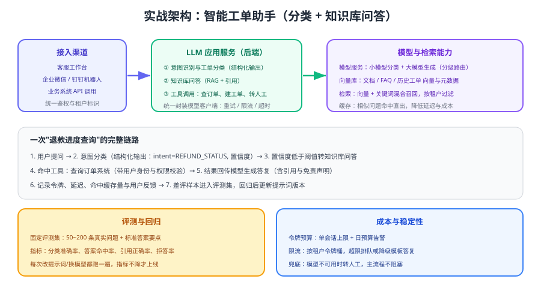

# 实战：智能工单助手

把前面几页拼成一个能上线的系统：**工单分类（结构化输出） + 知识库问答（RAG + 引用） + 工具查询（订单/物流）**，并且有评测集、成本预算与人工兜底。目标不是"炫技"，而是让每一步都可测、可控、可回退。



## 需求与范围

| 需求 | 方案 | 不做什么 |
| --- | --- | --- |
| 自动识别工单类型与紧急度 | 结构化输出 + 枚举约束 | 不让模型直接改工单状态 |
| 政策类问题自动答复 | RAG 检索 + 强制引用 | 无依据时不允许猜测 |
| 查询订单/物流 | 工具调用，身份由服务端注入 | 不接受模型传入的用户 ID |
| 答复不达标时转人工 | 置信度阈值 + 兜底入口 | 不做"看起来对"的自由发挥 |
| 效果可验证 | 固定评测集 + 指标对比 | 不靠"感觉变好了"上线 |

::: tip 范围界定的价值
**只读查询 + 建议类动作用 AI，写操作留在人工或固定流程**。这一条能规避绝大多数线上事故，也让合规评审更容易通过。
:::

## 模块划分

| 模块 | 职责 | 关键约束 |
| --- | --- | --- |
| `clients/` | 模型客户端封装 | 超时、重试、限流、令牌埋点统一在这层 |
| `prompts/` | 分类与问答提示词 | 版本化，改动需评测通过 |
| `tools/` | 订单、物流查询工具 | 身份注入 + 权限校验 + 超时 |
| `services/` | 分类、检索、生成编排 | 低置信度走人工 |
| `evals/` | 评测集与评分脚本 | 每次改动必跑 |
| `monitor/` | 令牌、成本、延迟、429 指标 | 预算告警分级 |

## 第一步：工单分类（结构化输出）

```python [classify.py]
import json
from openai import OpenAI

client = OpenAI()

SCHEMA = {
    "type": "object",
    "properties": {
        "category": {"type": "string", "enum": ["售后", "物流", "账单", "账号", "其他"]},
        "urgency": {"type": "string", "enum": ["低", "中", "高"]},
        "confidence": {"type": "number"},
    },
    "required": ["category", "urgency", "confidence"],
    "additionalProperties": False,
}

INSTRUCTIONS = """你是工单分类器。请阅读工单内容并输出分类结果：
- category 只能取给定枚举值；
- urgency 依据"是否涉及资金损失/账号安全/超时投诉"判断；
- confidence 为 0~1 的置信度，不确定时给低值。"""

def classify(content: str) -> dict:
    resp = client.responses.create(
        model="gpt-5.6",
        instructions=INSTRUCTIONS,
        input=content,
        text={"format": {"type": "json_schema", "name": "ticket", "schema": SCHEMA, "strict": True}},
        max_output_tokens=200,
    )
    result = json.loads(resp.output_text)
    result["_usage"] = resp.usage.model_dump()      # 留下令牌信息用于成本核算
    return result

def route(content: str) -> str:
    result = classify(content)
    if result["confidence"] < 0.6:
        return "HUMAN"                               # 低置信度直接转人工
    if result["category"] == "物流":
        return "RAG"                                 # 政策/流程类问题走知识库
    if result["category"] == "售后":
        return "TOOL"                                # 需要查单据的走工具
    return "HUMAN"
```

预期输出：一条「快递显示签收但我没收到」的工单应判为 `物流 / 高`，`route` 返回 `RAG`；含糊内容（如「你们怎么回事」）应给出低置信度并转人工。

## 第二步：知识库问答（RAG + 引用）

检索链路的完整实现见 [RAG 检索增强接入](../RagOverview/index.md)，这里给出问答环节的提示词模板与拒答逻辑：

```python [rag_answer.py]
QA_INSTRUCTIONS = """你是企业客服知识助手。遵守以下规则：
1) 只依据【材料】回答，材料中没有的内容回答"未在资料中找到依据"；
2) 每个结论后用 [编号] 标注依据；
3) 涉及时限、金额、免责条款必须原文引用；
4) 语气简洁专业，不使用营销话术。"""

def answer(question: str, tenant: str) -> dict:
    hits = vector_store.search(embed(question), top_k=6, filters={"tenant": tenant})
    if not hits:
        return {"answer": "未在资料中找到依据", "refs": [], "handoff": True}

    material = "\n\n".join(f"[{i+1}] {h['text']}" for i, h in enumerate(hits))
    resp = client.responses.create(
        model="gpt-5.6",
        instructions=QA_INSTRUCTIONS,
        input=f"【材料】\n{material}\n\n【问题】{question}",
        max_output_tokens=800,
    )
    text = resp.output_text
    return {
        "answer": text,
        "refs": [h["source"] for h in hits],
        "handoff": "未在资料中找到依据" in text,     # 拒答时同步转人工
    }
```

## 第三步：工具查询（身份由服务端注入）

```python [order_tool.py]
def query_order(session_user_id: str, order_no: str | None = None) -> dict:
    """注意：用户身份来自服务端会话，绝不接受模型传入的用户 ID。"""
    if not permission_service.can_read_orders(session_user_id):
        return {"error": "无权查询订单"}
    orders = order_repo.find_recent(session_user_id, limit=1) if not order_no \
        else order_repo.find_by_no(session_user_id, order_no)
    return {"orders": [o.to_brief() for o in orders]}     # 只返回需要字段，控制令牌
```

工具的 schema 与调用循环见 [工具与函数调用](../FunctionCalling/index.md)；注意返回值只保留模型需要的字段，避免把整行数据带进上下文。

## 第四步：评测集与回归

```python [eval_run.py]
import json

CASES = json.load(open("evals/tickets.json", encoding="utf-8"))

def evaluate() -> dict:
    stats = {"category_hit": 0, "citation_ok": 0, "refusal_ok": 0, "total": len(CASES)}
    for case in CASES:
        result = route(case["content"])
        stats["category_hit"] += int(result == case["expected_route"])
        if case.get("expected_refusal"):
            stats["refusal_ok"] += int(answer(case["content"], "default")["handoff"])
        else:
            ans = answer(case["content"], "default")
            stats["citation_ok"] += int(all(f"[{i+1}]" in ans["answer"] for i in range(len(ans["refs"]))))
    for key in ("category_hit", "citation_ok", "refusal_ok"):
        stats[key + "_rate"] = round(stats[key] / max(stats["total"], 1), 3)
    return stats
```

| 指标 | 目标值 | 说明 |
| --- | --- | --- |
| 分类命中率 | ≥ 90% | 与人工标注的路由结果对比 |
| 引用正确率 | ≥ 95% | 引用片段是否真的支撑结论 |
| 拒答准确率 | ≥ 95% | 无依据时是否正确拒答 |
| P95 延迟 | 按业务 SLA | 分类与问答分别统计 |
| 单次成本 | 按预算倒推 | 每次调用都要记录令牌 |

::: warning 评测集要"小而真"
50~200 条来自真实工单的问题，比 2000 条人工编造的样本更有价值。务必定时把差评与人工纠正的样本回填进评测集——**评测集的质量决定了这套系统能不能持续变好**。
:::

## 第五步：上线检查清单

1. **密钥与配置**：密钥只存在服务端；模型 ID、阈值、预算全部配置化。
2. **限流与预算**：按租户限流、单会话令牌上限、日预算告警三级。
3. **降级路径**：模型不可用 → 模板或人工；429 → 排队或稍后重试。
4. **日志与审计**：记录请求 ID、模型、令牌、工具调用摘要与人工介入原因，敏感字段脱敏。
5. **灰度**：先对 5% 工单启用，观察质量与成本后再放量；保留一键关闭开关。
6. **人工兜底**：低置信度、拒答、超步数三种情况都有明确入口与告警。

::: danger 上线阶段的三个高频失误
1. 只测"好问题"，没测拒答与低置信度路径，上线后遇到边界输入直接乱答。
2. 上线后没人看指标，成本与延迟问题在月度账单里才发现。
3. 提示词改动直接在管理后台热更新，没有版本与评测记录，出问题无法回滚。
:::

## 验证方式

1. 用 100 条真实工单跑分类，确认命中率与低置信度转人工比例符合预期。
2. 用 20 条政策类问题验证问答，逐条人工核对引用是否支撑结论，并构造 5 条知识库外问题验证拒答。
3. 构造一次工具下游超时，确认系统返回可理解话术且不留脏数据。
4. 运行 `eval_run.py`，保存指标；修改提示词后重跑，确认指标可对比、可回滚。
5. 统计一整天的令牌与费用，与预算对比，验证限流与降级是否按预期生效。

## 参考资料

- 结构化输出：https://developers.openai.com/api/docs/guides/structured-outputs
- 函数调用：https://developers.openai.com/api/docs/guides/function-calling
- 嵌入与检索：https://developers.openai.com/api/docs/guides/embeddings
- 速率限制与用量层级：https://developers.openai.com/api/docs/guides/rate-limits
- 本库提示词工程：[效果评估](../../PromptEngineering/Evaluation/index.md)
