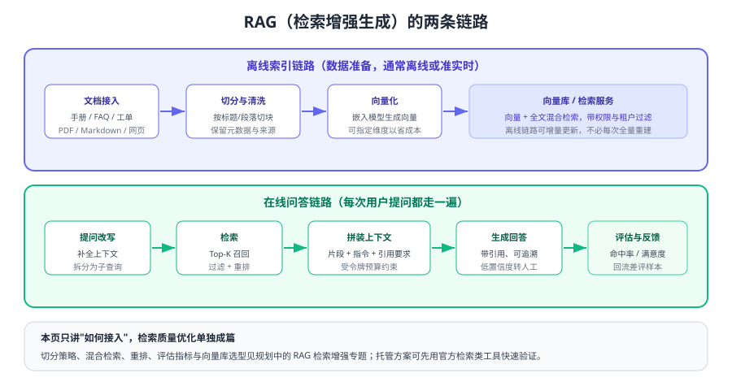

# RAG 检索增强接入

RAG（Retrieval-Augmented Generation，检索增强生成）解决的是模型的三个先天问题：**不知道你的私有知识、记不住最新的内容、会一本正经地编造**。做法很直接：先从你的知识库里检索出相关片段，再让模型"带着材料回答"。



## 先做判断题：RAG 还是微调

| 维度 | RAG | 微调（Fine-tuning） |
| --- | --- | --- |
| 解决的问题 | 知识补充、时效性、可追溯 | 风格、格式、特定任务能力 |
| 更新成本 | 改知识库即可，分钟级 | 需重新训练与验证，周期长 |
| 可解释性 | 强（能给出引用来源） | 弱（能力融进权重里） |
| 数据要求 | 文档即可 | 需要成百上千条高质量样本 |
| 成本结构 | 检索 + 更长的输入令牌 | 训练成本 + 推理成本 |

实践顺序：**先 RAG，后微调**。绝大多数"模型不懂我们业务"的问题，本质是知识没给到。

## 两条链路

### 离线索引链路

1. **接入**：手册、FAQ、工单记录、数据库导出，统一转为纯文本并保留元数据（来源、版本、租户、权限标签）。
2. **切分**：按标题层级与段落切块，块与块之间保留少量重叠，避免一句话被切断。
3. **向量化**：用嵌入模型把每个块转成向量（维度可选，维度越低越省）。
4. **入库**：向量 + 原文 + 元数据写入向量库或检索服务，支持增量更新。

### 在线问答链路

1. **改写**：把口语化问题补全为完整查询（"这个怎么退" → "如何申请退款"）。
2. **检索**：向量召回 + 关键词召回，按权限与租户过滤，再重排取 Top-K。
3. **拼装**：片段 + 指令 + 引用要求，控制在上下文预算内。
4. **生成**：要求模型"只依据材料回答"，无依据时明确说不知道或转人工。
5. **回流**：记录命中片段、用户反馈，差评样本进入评测集。

## 最小可运行实现

```python [index_docs.py]
from openai import OpenAI

client = OpenAI()

def embed(text: str) -> list[float]:
    resp = client.embeddings.create(
        model="text-embedding-3-small",     # 维度更小，成本更低
        input=text,
    )
    return resp.data[0].embedding

def chunk(text: str, size: int = 600, overlap: int = 80) -> list[str]:
    """按字符滑窗切分；生产环境建议按标题/段落语义切分。"""
    chunks, start = [], 0
    while start < len(text):
        chunks.append(text[start:start + size])
        start += size - overlap
    return chunks

# 伪代码：写入你的向量库（pgvector / Milvus / Elasticsearch 等）
for chunk_text in chunk(open("handbook.md", encoding="utf-8").read()):
    vector_store.upsert(
        vector=embed(chunk_text),
        payload={"text": chunk_text, "source": "handbook.md", "tenant": "default"},
    )
```

```python [ask.py]
from openai import OpenAI

client = OpenAI()

PROMPT = """你是企业内部知识助手。请严格依据【材料】回答，并遵守：
1) 材料中没有的内容，直接回答"未在资料中找到依据"，不要推测；
2) 每段结论后用 [片段编号] 标注依据；
3) 涉及金额、时限等关键信息必须原文引用。"""

def ask(question: str, tenant: str) -> str:
    hits = vector_store.search(embed(question), top_k=6, filters={"tenant": tenant})
    material = "\n\n".join(f"[{i+1}] {h['text']}" for i, h in enumerate(hits))
    resp = client.responses.create(
        model="gpt-5.6",
        instructions=PROMPT,
        input=f"【材料】\n{material}\n\n【问题】{question}",
        max_output_tokens=800,
    )
    return resp.output_text
```

预期输出：回答中出现 `[1]`、`[3]` 之类引用；询问知识库中不存在的政策时，应回答「未在资料中找到依据」，而不是编造。

## 检索质量的关键参数

| 参数 | 影响 | 起步建议 |
| --- | --- | --- |
| 切分粒度 | 太小丢上下文，太大引入噪声 | 400~800 字，重叠 10%~20% |
| Top-K | 召回数量与噪声的平衡 | 先取 10 再重排到 3~5 条入上下文 |
| 检索方式 | 语义 vs 关键词各有盲区 | 向量 + 关键词混合检索 |
| 重排 | 决定最终送进模型的片段 | 有预算就加重排模型，收益通常明显 |
| 元数据过滤 | 权限、时效、版本 | 权限过滤必须做，且要在检索层完成 |

::: tip 效果不达标时先查检索，不要先换模型
把检索到的片段打印出来人工看一遍：如果答案就在片段里，模型却说错，那是生成侧问题；如果片段里根本没有答案，换再强的模型也没用，应该去优化切分与召回。
:::

## 评估：把"感觉还行"变成数字

| 指标 | 定义 | 目标 |
| --- | --- | --- |
| 召回命中率 | 标准答案所在片段是否被召回 | 先追求 ≥ 90% |
| 引用正确率 | 回答中的引用是否真的支持结论 | ≥ 95%（防止"引错料"） |
| 拒答准确率 | 无依据时是否正确拒答 | 越高越好，直接关系可信度 |
| 平均延迟 | 端到端响应时间 | 按业务 SLA 设定 |
| 单次成本 | 检索 + 输入 + 输出的合计令牌成本 | 按月预算倒推上限 |

评测集做法：从真实问题里抽 50~200 条，标注"标准答案要点 + 依据片段"，每次改动切分、检索参数、提示词或模型后跑一遍，指标不降才上线。

::: danger 常见错误
1. **把整篇文档塞进提示词**：既贵又不准，应先检索再拼装。
2. **切分忽略标题层级**：条款、步骤被切断后语义完全变样。
3. **不做权限过滤**：检索层不过滤，等于把 A 租户的资料喂给 B 租户。
4. **只做向量检索**：专有名词、编号类查询关键词检索更可靠，必须混合。
5. **不要求引用**：没有引用的回答无法核查，也无法建立用户信任。
6. **知识库不更新**：文档改版后不同步，模型持续输出过期政策。
:::

## 与官方托管能力的关系

如果不想自建向量库，可以先用官方提供的检索类能力（上传文件、建立向量存储、检索工具）快速验证效果，再把验证过的切分与提示词策略迁移到自建方案。官方相关能力与限制请以文档为准。

## 验证方式

1. 用 10 条真实问题跑 `ask.py`，人工核对引用与答案是否一致。
2. 故意问一个知识库里没有的问题，确认模型正确拒答而不是编造。
3. 把 Top-K 从 3 调到 10，观察回答质量与令牌成本的变化，找到平衡点。
4. 修改一篇文档后重新索引，确认新内容能被检索到（验证增量更新链路）。

## 参考资料

- 嵌入与向量检索：https://developers.openai.com/api/docs/guides/embeddings
- 文件检索工具：https://developers.openai.com/api/docs/guides/tools-file-search
- 检索指南：https://developers.openai.com/api/docs/guides/retrieval
- 本库 Agent 专题：[记忆与上下文](../../Agent/MemoryContext/index.md)
