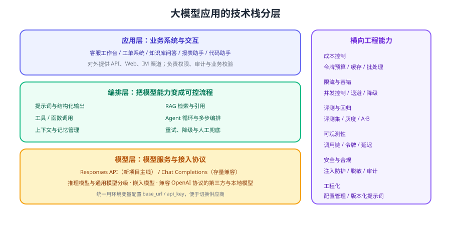

# 大模型应用开发

<p style="text-align:center;"></p>

大模型应用开发（LLM Application Development）指**把大模型能力接入真实业务系统**：不只是「调一次接口拿一段文字」，而是要处理结构化输出、工具调用、上下文与记忆、检索增强、成本控制、限流降级与评测回归。本专题面向后端与全栈开发者，用工程视角把这条链路讲透。



## 专题导航

- [API 调用基础](ApiCall/index.md)：Responses API 的请求与响应、流式、结构化输出、错误处理
- [Chat Completions 兼容用法](ApiCall/ChatCompletions/index.md)：存量集成如何维护、如何迁移到 Responses
- [工具与函数调用](FunctionCalling/index.md)：JSON Schema、strict 模式、并行调用、结果回传
- [上下文与记忆管理](ContextMemory/index.md)：令牌预算、历史裁剪、摘要、外部记忆与提示缓存
- [RAG 检索增强接入](RagOverview/index.md)：把检索接进应用的最小落地（深入内容见 [RAG 检索增强专题](../RAG/index.md)）
- [Agent 框架与应用集成](AgentIntegration/index.md)：官方接口、Python 生态、企业技术栈的选型
- [成本核算与限流降级](CostRateLimit/index.md)：令牌成本、缓存、批处理、限流与兜底
- [实战：智能工单助手](Practice/index.md)：分类 + 知识库问答的完整落地与验证
- [常见问题与最佳实践](FAQ/index.md)：输出不稳定、工具不调用、429、成本失控的排查

::: tip 一句话理解
调通接口只是 10% 的工作。剩下 90% 是：**让输出可控（结构化）、让过程可控（工具与上下文）、让成本可控（预算与缓存）、让效果可验证（评测集）**。
:::

## 先确认要做什么：五类常见应用形态

| 形态 | 输入 → 输出 | 关键技术 | 典型场景 |
| --- | --- | --- | --- |
| 文本生成与改写 | 文本 → 文本 | 提示词、流式输出 | 摘要、翻译、营销文案 |
| 信息抽取 | 文本 → 结构化 JSON | 结构化输出、字段校验 | 合同要素、简历解析、单据录入 |
| 分类与路由 | 文本 → 标签 + 置信度 | 结构化输出、阈值分流 | 工单分类、意图识别、内容审核 |
| 知识库问答 | 问题 → 带引用的回答 | RAG、引用、拒答策略 | 客服助手、内部知识问答 |
| 任务型助手 | 目标 → 多步执行结果 | 工具调用、Agent 循环、安全边界 | 查订单、办工单、数据分析 |

判定的第一个问题是：**输出能不能被程序校验？** 能（JSON 字段、枚举标签）就优先用结构化输出；不能（开放文本）则要把评测与人工复核设计进去。

## 模型与接口版本速览

大模型领域版本迭代快，「用哪一代接口」比「用哪个框架」影响更大。当前的主线与存量关系如下（按 2026-09 官方文档核对）：

| 项目 | 状态 | 说明 |
| --- | --- | --- |
| Responses API | **推荐主线** | 面向新项目的文本生成与工具调用接口，官方建议新应用优先使用，推理模型尤其推荐 |
| Chat Completions API | 存量兼容 | 历史集成与第三方兼容实现仍广泛使用；官方提供迁移到 Responses 的指南，部分新能力需在 Responses 使用 |
| 推理模型（GPT-5 及之后） | 主线 | 先推理再回答，适合复杂分析、多步规划；官方建议配合 Responses API 使用 |
| 通用模型 | 主线 | 延迟与成本更低，适合分类、抽取、改写等高频任务 |
| 嵌入模型 | 长期稳定 | 用于检索与聚类，维度可选（如 1536 / 3072）以平衡成本与效果 |
| 兼容 OpenAI 协议的第三方与本地模型 | 可选 | 通过 `base_url` 切换，适合私有化与成本敏感场景（见后续本地模型部署专题） |

::: info 大版本处理约定
本库对存在代际差异的主题采用「主线 + 存量存档」的方式组织：主线内容面向 **Responses API**；`Chat Completions` 的用法保留在 [Chat Completions 兼容用法](ApiCall/ChatCompletions/index.md) 中，并明确标注为**存量集成与兼容用途**，不删除、不覆盖。模型 ID 与单价变化频繁，文中示例给出的是写法而非固定清单，请以官方模型页与定价页为准。
:::

## 模型分级：把成本花在刀刃上

| 任务类型 | 建议档位 | 理由 |
| --- | --- | --- |
| 分类、打标、路由 | 轻量或通用模型 | 任务边界清晰，用提示词 + 结构化输出即可稳定 |
| 信息抽取、格式转换 | 通用模型 | 需要可靠遵循 schema，成本可控 |
| 多步推理、复杂分析 | 推理模型 | 准确率提升明显，但令牌消耗与延迟更高 |
| 开放问答（带检索） | 通用或推理模型 | 有检索片段支撑时，通用模型通常已足够 |

落地做法：**默认走便宜模型，失败或低置信度时再升级到更强模型重试一次**。

## 环境与工程准备

### 1. 安装官方 SDK

```shell
# Python（本专题示例使用）
python -m venv .venv
source .venv/bin/activate        # Windows PowerShell：.venv\Scripts\Activate.ps1
pip install openai

# Node.js（前端或 BFF 场景）
npm install openai
```

### 2. 用环境变量管理密钥与端点

```shell
# 绝对不要把密钥写进代码仓库
export OPENAI_API_KEY="sk-..."
# 使用兼容实现或网关时，指向自定义端点
export OPENAI_BASE_URL="https://your-gateway.example.com/v1"
```

```python [config.py]
import os
from openai import OpenAI

client = OpenAI(
    api_key=os.environ["OPENAI_API_KEY"],
    base_url=os.getenv("OPENAI_BASE_URL"),   # 未设置时使用官方默认端点
    timeout=30.0,          # 单次请求超时，避免线程被长时间占用
    max_retries=2,         # SDK 内置重试（对 429 / 5xx 生效），业务层仍需兜底
)
```

### 3. 第一个可运行示例

```python [hello_llm.py]
from openai import OpenAI

client = OpenAI()

response = client.responses.create(
    model="gpt-5.6",                      # 以官方模型页当前可用 ID 为准
    instructions="你是一名严谨的技术助手，回答控制在 3 句以内。",
    input="用一句话解释什么是令牌（token）。",
)

print(response.output_text)
print(response.usage)                     # 输入/输出令牌数，用于成本核算
```

预期输出：终端打印一段不超过 3 句的中文解释。若报 `AuthenticationError` 说明密钥未配置；报 `NotFoundError` 通常是模型 ID 已下线，需要按官方模型页替换。

### 4. 推荐的工程结构

```text
llm-app/
├─ config/                 # 模型名、阈值、预算等配置（按环境区分）
├─ prompts/                # 提示词模板，纳入版本管理
├─ clients/                # 模型客户端封装：超时、重试、限流、埋点
├─ services/               # 业务编排：分类、抽取、问答、工具调用
├─ tools/                  # 工具实现与 JSON Schema 定义
├─ evals/                  # 评测集与评测脚本
└─ tests/                  # 单元测试 + 契约测试（解析、错误分支）
```

::: danger 密钥与数据安全的四条红线
1. **不要把密钥写进代码、镜像或前端**：前端调用一律走后端代理，密钥只存在于服务端环境变量或密钥管理服务。
2. **不要打印完整请求体**：用户输入可能包含手机号、订单信息，日志要做脱敏与采样。
3. **不要把生产数据直接投喂给第三方模型**：先确认合规要求，必要时脱敏、裁剪或改用私有化部署。
4. **不要忘记设置超时与输出上限**：没有超时的调用会在下游故障时耗尽线程池，`timeout` 与 `max_output_tokens` 都是必须项。
:::

## 验证方式

1. 运行 `hello_llm.py`，确认能拿到稳定输出；把 `OPENAI_API_KEY` 清空后重跑，确认报错清晰、程序不会挂起。
2. 打印 `response.usage`，确认能看到输入与输出令牌数——这是后续成本核算的基础。
3. 把 `input` 换成一段 2000 字左右的中文说明，观察耗时与令牌变化，建立「长度 ↔ 成本」的直觉。
4. 把 `base_url` 切换到兼容网关或本地模型，确认业务代码无需修改即可继续工作。

## 相关专题

- [提示词工程](../PromptEngineering/index.md)：提示词结构、few-shot、思维链与效果评估
- [Agent 应用](../Agent/index.md)：自主规划、工具调用、多智能体与安全边界
- [OpenClaw](../OpenClaw/index.md)：开箱即用的智能体工具
- [Spring Cloud 消息驱动](../../Backend/SpringCloud/Stream/index.md)：异步任务与事件驱动的工程化基础

## 参考资料

- OpenAI 开发者文档：https://developers.openai.com/api/docs
- 模型总览（以官方页面实时信息为准）：https://developers.openai.com/api/docs/models
- Responses 与 Chat Completions 迁移指南：https://developers.openai.com/api/docs/guides/migrate-to-responses
