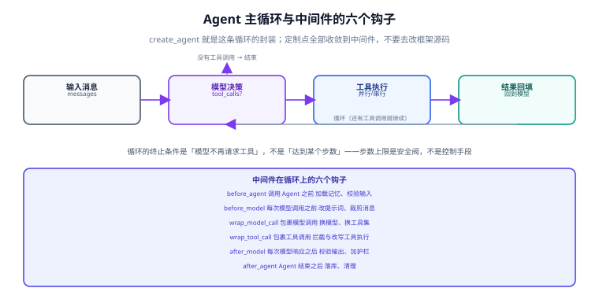

# Agent 与中间件

Agent 的官方定义很短：**一个在循环里调用工具的模型**。v1 把这条循环封装成 `create_agent`，并把所有定制点收敛到**中间件**——这一页讲清这两件事怎么用，以及哪些地方最容易写错。



## 1. 循环的终止条件

`create_agent` 内部的循环是：

1. 把消息列表交给模型。
2. 模型要么给出最终回答（不含 `tool_calls`），要么请求调用一个或多个工具。
3. 若有工具调用：执行工具、把结果作为 `ToolMessage` 追加进消息列表，回到第 1 步。
4. 若没有工具调用：循环结束，返回结果。

::: danger 循环终止不是「达到某个步数」
终止条件是**模型不再请求工具**。步数上限（递归限制）是**安全阀**，作用是防止模型陷入无限调用，不是用来控制流程的手段。

如果你发现自己在调「最大步数」来让结果变正常，说明问题在别处：工具描述不清（模型不知道该调哪个）、工具返回值不可用（模型拿不到有效信息）、或任务本身不适合做成 Agent。
:::

## 2. `create_agent` 的参数

```python
from langchain.agents import create_agent
from langchain.agents.structured_output import ToolStrategy
from pydantic import BaseModel

class DeployAnswer(BaseModel):
    service: str
    deployed_at: str
    version: str
    confident: bool

agent = create_agent(
    model=model,                                  # 字符串或模型实例
    tools=[get_deploy_record, list_services],     # 工具列表（@tool 或普通可调用）
    system_prompt="你是运维助手：先取证再回答，不确定就明说。",
    middleware=[...],                             # 中间件列表（见第 4 节）
    response_format=ToolStrategy(DeployAnswer),   # 结构化输出策略
    checkpointer=InMemorySaver(),                 # 持久化：见「记忆与上下文」
    context_schema=Context,                       # 每次调用的上下文类型
)
```

| 参数 | 作用 | 常见错误 |
| --- | --- | --- |
| `model` | 模型字符串或实例 | 用不存在的模型 ID；生产环境硬编码模型名 |
| `tools` | 工具列表 | 工具描述缺失或不写「什么时候用」 |
| `system_prompt` | 系统提示词 | 把业务规则写死在提示词里，而不是代码里校验 |
| `middleware` | 中间件 | 用中间件做本该在工具内部做的事（如参数校验） |
| `response_format` | 结构化输出策略 | 期望「结构化 + 流式」同时生效 |
| `checkpointer` | 检查点存储 | 生产用内存实现，重启即失忆 |
| `context_schema` | 单次运行的上下文 | 把用户身份放进 `system_prompt` 而不是上下文 |

## 3. 工具：描述比实现更重要

```python
from langchain.tools import tool


@tool
def get_deploy_record(service: str) -> str:
    """查询某个服务最近一次部署记录。

    什么时候用：用户询问「部署时间、版本、是否成功、要不要回滚」时。
    什么时候不要用：用户问的是代码变更内容或工单状态。
    """
    ...
```

::: tip 工具 docstring 的正确写法
模型只能看到**工具名、参数 schema 和 docstring**。写清三件事，调用率与正确率会明显提升：

1. **它做什么**（一句话）。
2. **什么时候用**（触发条件的自然语言描述）。
3. **什么时候不要用**（排除条件，避免模型误调）。

反面写法是只写「查询部署记录」——模型无法判断边界，要么该调不调，要么滥调。
:::

工具函数的健壮性同样重要：

| 要求 | 原因 |
| --- | --- |
| 返回字符串或可序列化结构 | 不可序列化的对象会让消息构造失败 |
| 失败时返回**可读的错误文本**，而不是抛异常 | 模型能读「服务不存在，可选值：a/b/c」并自行纠正；抛栈只会中断循环 |
| 结果长度可控 | 超长结果会挤占上下文，必要时截断并提示模型缩小查询范围 |
| 有副作用时（写库、发消息）**必须可幂等或需审批** | 循环可能重试，副作用会被重复执行 |

## 4. 中间件：六个钩子

| 钩子 | 时机 | 典型用途 |
| --- | --- | --- |
| `before_agent` | 调用 Agent 之前 | 加载记忆、校验输入、注入用户上下文 |
| `before_model` | 每次模型调用之前 | 更新提示词、裁剪消息 |
| `wrap_model_call` | 包裹每次模型调用 | 换模型、换工具集、改请求/响应 |
| `wrap_tool_call` | 包裹每次工具调用 | 拦截与改写工具执行 |
| `after_model` | 每次模型响应之后 | 校验输出、应用护栏 |
| `after_agent` | Agent 结束之后 | 落库、清理、上报指标 |

### 4.1 三个开箱可用的中间件

```python
from langchain.agents import create_agent
from langchain.agents.middleware import (
    PIIMiddleware,
    SummarizationMiddleware,
    HumanInTheLoopMiddleware,
)

agent = create_agent(
    model=model,
    tools=[read_email, send_email],
    middleware=[
        # 1) 发出去之前先脱敏
        PIIMiddleware("email", strategy="redact", apply_to_input=True),
        # 2) 历史过长就压缩
        SummarizationMiddleware(model=model, trigger={"tokens": 4000}),
        # 3) 敏感工具必须人工批准
        HumanInTheLoopMiddleware(
            interrupt_on={
                "send_email": {"allowed_decisions": ["approve", "edit", "reject"]},
            }
        ),
    ],
)
```

这三个覆盖了生产环境最常见的三类「上下文工程」需求：**脱敏、压缩、审批**。它们都不是提示词技巧，而是工程约束。

### 4.2 自定义中间件

```python
from dataclasses import dataclass
from typing import Callable

from langchain.agents.middleware import AgentMiddleware, ModelRequest
from langchain.agents.middleware.types import ModelResponse
from langchain.chat_models import init_chat_model


@dataclass
class Context:
    user_expertise: str = "beginner"


class ExpertiseBasedModelMiddleware(AgentMiddleware):
    """按用户水平换模型与工具集：新手用便宜模型 + 少量工具，专家放开。"""

    def wrap_model_call(
        self,
        request: ModelRequest,
        handler: Callable[[ModelRequest], ModelResponse],
    ) -> ModelResponse:
        level = request.runtime.context.user_expertise
        if level == "expert":
            return handler(request.override(model=init_chat_model("gpt-5.4"), tools=[advanced_search]))
        return handler(request.override(model=init_chat_model("gpt-5.4-mini"), tools=[simple_search]))


agent = create_agent(
    model=model,
    tools=[simple_search, advanced_search],
    middleware=[ExpertiseBasedModelMiddleware()],
    context_schema=Context,
)

# 调用时传入上下文
agent.invoke(
    {"messages": [{"role": "user", "content": "帮我查一下这个报错的成因"}]},
    context=Context(user_expertise="expert"),
)
```

::: info 为什么中间件比继承更好维护
中间件是**组合**，继承是**耦合**。一个中间件只解决一件事（脱敏、压缩、审批各一个），可以自由搭配、单独测试、单独删除；继承框架基类则会在每次升级时面临「基类内部实现变了」的风险。
:::

## 5. 结构化输出：在主循环里完成

v1 的结构化输出改进有两点值得记住：

- **在主循环里生成**，不再额外发起一次模型调用——省掉一次往返的成本与延迟。
- 通过策略（如 `ToolStrategy`）让模型在「调工具」与「用供应商侧结构化输出」之间自选。

```python
from langchain.agents import create_agent
from langchain.agents.structured_output import ToolStrategy
from pydantic import BaseModel


class Weather(BaseModel):
    temperature: float
    condition: str


def weather_tool(city: str) -> str:
    """查询城市天气。什么时候用：用户询问实时天气时。"""
    return f"{city} 晴，24 摄氏度"


agent = create_agent(
    "gpt-5.4-mini",
    tools=[weather_tool],
    response_format=ToolStrategy(Weather),
)

result = agent.invoke({"messages": [{"role": "user", "content": "北京现在什么天气？"}]})
print(repr(result["structured_response"]))
# 形如 Weather(temperature=24.0, condition='晴')
```

**错误处理**也要显式配置：模型生成的数据与 schema 不匹配、或针对结构化输出一次性生成了多个工具调用时，需要决定是重试、报错还是降级为文本。`ToolStrategy` 提供 `handle_errors` 参数控制这两类情况——**不要依赖默认行为**，把它当成接口契约的一部分写进代码。

## 6. 从旧写法迁移

| 旧写法 | 状态 | v1 写法 |
| --- | --- | --- |
| `AgentExecutor` | 遗留 | `create_agent`（黑盒循环不再保留） |
| `langchain.agents.create_react_agent`（0.x） | 遗留 | `create_agent` |
| `langgraph.prebuilt.create_react_agent` | 被取代 | `create_agent` |
| `HumanInterrupt` / `HumanInterruptConfig` | 已替换 | `HITLRequest` / `InterruptOnConfig` |
| `ValidationNode` | 已弃用 | `create_agent` 下工具会自动校验参数 |
| `MessageGraph` | 已弃用 | 用 `StateGraph` + `messages` 键 |
| `AgentState` / `AgentStatePydantic` | 已弃用 | 由 `create_agent` 提供状态 |

::: warning 迁移时的最大陷阱
`create_react_agent` 时代很多人靠**手写 Thought/Action/Observation 提示词模板**来控制行为。这套模板在 `create_agent` 下**不再需要也不再生效**——行为由「工具描述 + 中间件」决定。继续照抄旧模板会得到一堆无效提示词，还会挤占上下文。
:::

## 7. 常见坑

::: danger 七条高频问题
1. **工具该调不调**：八成是 docstring 没写「什么时候用」。补上触发条件比换更强的模型有效。
2. **工具滥调**：没有排除条件、或工具数量太多描述相近。解法：合并同类工具，写清边界。
3. **结果不稳定**：先把 `temperature` 固定、把「模糊要求」改成可判定条件，再考虑模型升级。
4. **上下文被挤爆**：工具返回超长文本。解法：工具侧截断 + 让模型分页/缩小范围，或用 `SummarizationMiddleware`。
5. **重试导致副作用重复**：写库/发消息类工具必须幂等，或加 `HumanInTheLoopMiddleware` 审批。
6. **把用户权限交给提示词**：权限判断必须在工具内部用代码校验，提示词里的「你是管理员」不构成任何约束。
7. **生产用内存检查点**：`InMemorySaver` 只适合本地开发；上线要换数据库后端，否则重启即丢会话。
:::

## 8. 验证方式

1. **循环可见**：打印 `result["messages"]`，确认能看到「模型请求工具 → ToolMessage → 最终回答」的完整序列。
2. **终止可控**：故意构造一个必然反复调用工具的任务，确认达到递归限制时能报出明确错误，而不是无限循环。
3. **中间件生效**：在 `before_model` 里加一行日志打印消息条数，跑一轮对话，确认条数在 `SummarizationMiddleware` 触发后下降。
4. **审批生效**：把 `send_email` 换成打印函数，确认未获批准时**不会执行**，批准后才执行。
5. **结构化输出**：把 `response_format` 指向一个字段必填的模型，故意让工具返回缺字段的数据，确认错误处理路径按预期触发。
6. **权限在代码里**：用一个低权限测试账号调用高权限工具，确认被工具内部拒绝（而不是被提示词劝阻）。

## 相关文档

- [记忆与上下文](../Memory/index.md)：检查点、摘要与跨会话记忆的落地
- [LangGraph 编排](../LangGraph/index.md)：需要显式分支、持久化与更细粒度中断时
- [Agent 应用](../../Agent/index.md)：Agent 的通用原理、多智能体与安全边界
- [提示词工程](../../PromptEngineering/index.md)：写给模型的那部分上下文怎么写

## 参考资料

- Agents（官方）：https://docs.langchain.com/oss/python/langchain/agents
- 中间件指南（官方）：https://docs.langchain.com/oss/python/langchain/middleware
- 结构化输出（官方）：https://docs.langchain.com/oss/python/langchain/structured-output
- LangGraph v1 迁移说明：https://docs.langchain.com/oss/python/migrate/langgraph-v1
