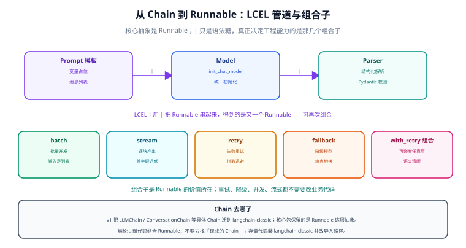

# 从 Chain 到 Runnable

「Chain」是 LangChain 早期最出名的词，也是 v1 里最容易被误解的词。本页讲清：**现在的核心抽象是 `Runnable`，具体 Chain 已迁到兼容包**，以及组合子（重试、降级、并发、流式）为什么比「找一条现成的链」更有价值。



## 1. 认识 Runnable：一个统一接口

`Runnable` 是「可被调用的一段计算」的统一协议。不管是一个提示词模板、一个模型、一段解析逻辑，还是一个自定义函数，只要实现同一套方法，就能互相拼接：

| 方法 | 作用 | 典型用途 |
| --- | --- | --- |
| `invoke(input)` | 单次调用，返回最终结果 | 同步业务代码 |
| `ainvoke(input)` | 异步单次调用 | FastAPI / 高并发场景 |
| `batch(inputs)` | 批量调用（内部并发） | 一次处理几百条数据 |
| `stream(input)` | 流式产出中间块 | 首字延迟敏感的前端对话 |
| `abatch` / `astream` | 上两者的异步版本 | 异步框架内统一用异步版 |

统一的接口带来一个直接好处：**任何位置都能替换成另一个 Runnable，而不牵动上下游**——把「模型」换成「带重试的模型」、把「解析函数」换成「带校验的解析函数」，都是就地替换。

## 2. LCEL：用管道符组合

```python
from langchain.chat_models import init_chat_model
from langchain.messages import HumanMessage
from langchain_core.runnables import RunnableLambda
from pydantic import BaseModel

model = init_chat_model("gpt-5.4-mini", temperature=0)


class Summary(BaseModel):
    title: str
    keywords: list[str]


def make_messages(text: str) -> list:
    return [
        HumanMessage(
            content=f"为下面的文本起一个标题并给出 3 个关键词：\n\n{text}"
        )
    ]


pipeline = RunnableLambda(make_messages) | model.with_structured_output(Summary)

result = pipeline.invoke("VitePress 是一个基于 Vite 的静态站点生成器……")
print(result.title, result.keywords)
```

`|` 只是语法糖，等价于显式构造一条序列：**上一段的输出是下一段的输入**。这条约定简单，但足以表达大多数「固定流程」的需求。

::: tip 什么时候用管道、什么时候写函数
**管道不适合做业务逻辑**。判断标准：这段逻辑写成普通 Python 函数你能一眼看懂吗？能，就写函数；只有当你要用到「批量/流式/重试」这些 Runner 能力时，才值得包装成 Runnable。

经验线：管道节点 **不超过 5 个**、每个节点职责单一。超过 5 个通常说明该用 LangGraph 的图（见 [LangGraph 编排](../LangGraph/index.md)）——图能显式表达分支和状态，管道不能。
:::

## 3. 组合子：Runnable 真正的价值

真正让 Runnable 值得引入的，是这几个「不用改业务逻辑就能加上去」的能力：

```python
from langchain_core.runnables import RunnableParallel, RunnablePassthrough

# 1) 并行：同一份输入同时喂给多条支路，结果合并为字典
parallel = RunnableParallel(
    summary=pipeline,
    raw=RunnablePassthrough(),      # 原样透传，便于下游同时拿到原始输入
)

# 2) 重试：只对可重试的错误生效（超时、限流、5xx）
robust = model.with_retry(stop_after_attempt=3, wait_exponential_jitter=True)

# 3) 降级：主模型失败时切到备用模型或备用端点
fallback = model.with_fallbacks([backup_model])

# 4) 限并发：批量调用时保护下游与自身的速率限制
throttled = model.with_config(max_concurrency=8)

# 5) 把非 Runnable 的函数接进管道
import json
to_json = RunnableLambda(lambda x: json.dumps(x, ensure_ascii=False, indent=2))
```

| 组合子 | 解决什么 | 不用它就得自己写 |
| --- | --- | --- |
| `batch` / `abatch` | 批量吞吐 | 线程池 + 结果顺序对齐 |
| `stream` | 流式输出 | 手工处理各家流式事件格式 |
| `with_retry` | 瞬时故障重试 | 重试装饰器 + 异常分类 |
| `with_fallbacks` | 模型/端点降级 | 多分支 try/except |
| `RunnableParallel` | 并行支路 | 并发编排与结果合并 |
| `RunnableBranch` | 条件路由 | if/elif 链 |

::: warning 重试要分类，不能一味重试
`with_retry` 默认只对「可重试」的异常生效。**不要**把「参数校验失败」「内容审核拒绝」也纳入重试——那只会把同一个错误重复花钱。判据：**错误是「外部瞬时故障」就重试，「输入本身有问题」就快速失败并向上报告**。
:::

## 4. `langchain-classic`：那些被迁走的 Chain

v1 把具体 Chain 与检索器整体移出核心包。它们**没有消失，只是换了导入路径**：

```python
# v0.x（旧）
from langchain.chains import LLMChain, ConversationChain
from langchain.retrievers import MultiQueryRetriever
from langchain.indexes import VectorstoreIndexCreator
from langchain import hub

# v1（等价的兼容写法）
from langchain_classic.chains import LLMChain, ConversationChain
from langchain_classic.retrievers import MultiQueryRetriever
from langchain_classic.indexes import VectorstoreIndexCreator
from langchain_classic import hub
```

迁移时按下面的顺序决策，不要一上来就重写：

| 现有代码 | 建议动作 | 理由 |
| --- | --- | --- |
| `LLMChain(prompt, llm)` | 改成 `prompt \| model \| parser` | 三行管道等价，且能直接用组合子 |
| `ConversationChain` | 改用 `create_agent` + 检查点 | 会话状态的正确位置是检查点，不是链的内存 |
| `MultiQueryRetriever` 等检索器 | 短期改导入路径；中期评估是否用检索层自己实现 | 检索逻辑本身值得被显式管理（见 [RAG 检索增强](../../RAG/index.md)） |
| `VectorstoreIndexCreator` | 拆成「加载 → 切分 → 嵌入 → 入库」四步 | 索引创建是一次性工程动作，隐式封装反而难排查 |
| 自定义 Chain 子类 | 改为 `RunnableLambda` 或自定义 Runnable | 继承框架基类是升级中最脆的部分 |

## 5. 常见坑

::: danger 五个高频问题
1. **管道调试困难**：`a | b | c` 报错时不知道是哪一段。解法：逐段 `invoke` 验证，或用 `.with_config({"run_name": "..."})` 给每段起名，让 trace 里能分辨。
2. **`.batch()` 打爆下游**：批量默认并发度高，容易触发供应商限流。解法：配合 `max_concurrency` 与 `with_retry` 使用。
3. **流式与结构化输出冲突**：结构化输出要求完整 JSON 才能解析，流式拿到的中间块无法解析。解法：二者不要叠在同一次调用上，需要流式就输出文本、最后再单独做一次结构化解析。
4. **在 Runnable 里做有副作用的操作**：日志、写库、发消息放进管道，重试时会重复执行。解法：副作用放管道外，或用中间件（Agent 场景）。
5. **自定义函数不返回统一类型**：`RunnableLambda` 返回 `None` 或任意对象会让下游莫名其妙的报错。解法：给每个自定义节点写清输入输出类型，并加一个断言。
:::

## 6. 验证方式

1. 把上面的 `pipeline` 单独 `invoke` 一次，再把 `model` 单独 `invoke` 一次，确认管道没有改变各段语义。
2. 用 `for chunk in pipeline.stream(...)` 打印分块，确认流式在**管道两端**都能工作（`stream` 会沿管道传播）。
3. 人为让模型调用失败（把 API Key 改错），确认 `with_retry` 按次数重试、`with_fallbacks` 能切到备用端点，并打印出实际使用的是哪一个。
4. 用 `pipeline.batch([...], config={"max_concurrency": 2})` 跑 10 条数据，观察耗时与并发是否受控。
5. 在全库搜索 `langchain.chains` / `langchain.retrievers`：你的项目里若还有这类导入，按第 4 节的表处理。

## 相关文档

- [Agent 与中间件](../Agent/index.md)：当流程需要「模型决定下一步」时，用 Agent 而不是长管道
- [LangGraph 编排](../LangGraph/index.md)：当流程需要分支、持久化、人工中断时，用图
- [大模型应用开发 · 上下文与记忆管理](../../LLMApp/ContextMemory/index.md)：不引入框架时的裁剪与摘要做法
- [RAG 检索增强](../../RAG/index.md)：检索链路本身

## 参考资料

- Runnable 与 LCEL（官方）：https://docs.langchain.com/oss/python/langchain/runnables
- 消息与内容块（官方）：https://docs.langchain.com/oss/python/langchain/messages
- 迁移指南（官方）：https://docs.langchain.com/oss/python/migrate/langchain-v1
