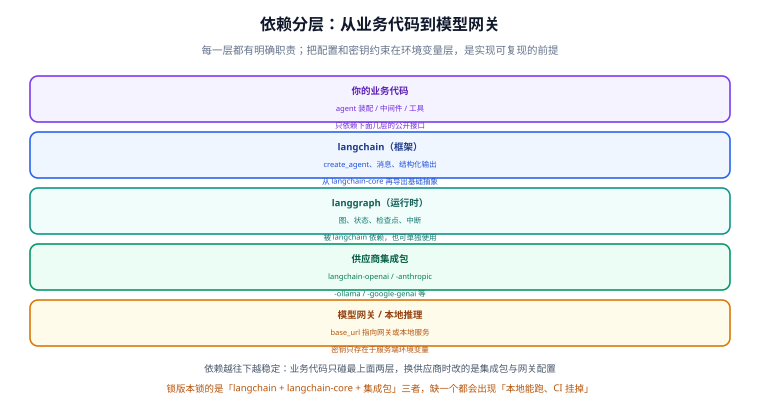

# 环境与模型接入

本页把「从零到 `create_agent` 跑通」的前置条件一次配好：**解释器与依赖管理、版本锁定、密钥与网关、模型统一初始化**。这几件事做对，后面所有示例才具备可复现性。



## 1. 依赖分层：装什么、不装什么

LangChain 是一个**包族**，不是一个包。按需安装，装了没用的集成包只会拖慢安装、扩大升级面：

| 层 | 包名 | 什么情况下装 |
| --- | --- | --- |
| 框架 | `langchain` | 用 `create_agent`、中间件、结构化输出 |
| 基础抽象 | `langchain-core` | 由 `langchain` 自动带入，一般不单独装 |
| 运行时 | `langgraph` | 用 `create_agent` 时自动带入；单独建图时显式装 |
| 供应商集成 | `langchain-openai`、`langchain-anthropic`、`langchain-ollama`、`langchain-google-genai` … | **只装你在用的那一个** |
| 兼容包 | `langchain-classic` | 只有要沿用旧 Chain / 检索器时才装 |

::: tip 不要装的东西
`langchain-community` 里的集成质量参差，且不属于官方核心维护范围。**只在确实没有官方集成时**才用它，并在依赖注释里写清用途和替代计划。
:::

## 2. 解释器与依赖管理

### 2.1 先确认解释器版本

v1 的 Python 版本下限写在包元数据里，**不要凭记忆**：

```shell
python -c "import importlib.metadata as m; print(m.metadata('langchain')['Requires-Python'])"
# 输出形如 >=3.10,<4.0 —— 以你装的那个版本的实际输出为准
```

同时确认解释器本身：

```shell
python -V                 # 例如 Python 3.13.x
where python              # Windows；类 Unix 用 which python，确认不是系统自带的老解释器
```

### 2.2 用虚拟环境隔离（必做）

```shell
# 方式一：标准库 venv
python -m venv .venv
source .venv/bin/activate                 # Windows Git Bash
# Windows 传统终端：.venv\Scripts\activate

# 方式二：uv（推荐，装得快、解析依赖快、天然带锁文件）
uv venv
source .venv/bin/activate
```

### 2.3 安装依赖

```shell
# 标准方式
pip install "langchain" "langchain-openai"

# uv 方式（--frozen / uv.lock 保证可复现）
uv add langchain langchain-openai
```

```text
# 推荐的项目结构
langchain-app/
├─ pyproject.toml            # 依赖声明（uv / poetry）
├─ uv.lock                   # 锁文件，必须入库
├─ .env.example              # 占位符清单，值留空，入库
├─ .env                      # 真实值，**不入库**（写进 .gitignore）
├─ agents/                   # Agent 装配与中间件
├─ tools/                    # 工具实现
├─ evals/                    # 评测集与评测脚本
└─ tests/                    # 单元测试：工具函数、中间件、解析分支
```

::: danger 依赖相关的四个坑
1. **只锁 `langchain` 不锁集成包**：`langchain-openai` 升级会改变工具调用字段的解析行为，必须一起锁。
2. **`.env` 提交进仓库**：密钥泄露最常见的路径。`.gitignore` 里加 `.env`，只提交 `.env.example`。
3. **CI 用 `pip install langchain`（无版本）**：本地能跑、CI 挂掉的典型原因就是没锁版本。
4. **在有代理的环境里忘了给包管理器和模型请求分别配代理**：装包走代理、运行时不走（或反过来）都会报连接错误，两处要分开确认。
:::

## 3. 密钥与网关：全部走环境变量

```shell
# .env.example（入库，只有键名）
OPENAI_API_KEY=
OPENAI_BASE_URL=
```

```python [config.py]
import os

# 真实值只存在于环境变量或密钥管理服务，绝不写进代码
API_KEY = os.environ["OPENAI_API_KEY"]        # 缺失时抛 KeyError，fail fast 是好事
BASE_URL = os.getenv("OPENAI_BASE_URL")       # 未设置时用供应商默认端点
```

::: tip 不给默认值是一种特性
`os.environ[...]` 而不是 `os.getenv(..., "sk-xxx")`：**让配置缺失在启动阶段就暴露**，而不是在半夜第一次调用时变成一个 401。这条规则对密钥、模型名、数据库连接串一律适用。
:::

## 4. 用 `init_chat_model` 统一初始化

供应商包各有自己的 Chat 类，模型名一改就要改代码。`init_chat_model` 把这一步统一：

```python [model.py]
from langchain.chat_models import init_chat_model

# 按模型名推断供应商（前提：对应的集成包已安装）
model = init_chat_model("gpt-5.4-mini", temperature=0)

# 显式指定供应商，避免推断歧义；同时把网关地址透传下去
model = init_chat_model(
    "claude-sonnet-4-6",
    model_provider="anthropic",
    temperature=0,
    timeout=30,
    max_retries=2,
)

resp = model.invoke("用一句话说明什么是向量检索。")
print(resp.content_blocks)      # 统一的内容块，见「生态概览与 v1 变更」
```

::: warning 模型 ID 以官方页面为准
示例里的模型名是**写法演示**。模型 ID 与定价变动频繁，写代码前查一次官方模型页；生产环境把模型名放进配置（环境变量或配置文件），不要硬编码在函数里——否则换模型要重新发版。
:::

## 5. 第一个完整示例：把上面几件事串起来

```python [hello_agent.py]
import os
from langchain.agents import create_agent
from langchain.chat_models import init_chat_model
from langchain.tools import tool


@tool
def get_deploy_record(service: str) -> str:
    """查询某个服务最近一次部署记录。

    什么时候用：用户询问「部署」「发布」「回滚」相关事实时。
    """
    fake_db = {"order-api": "2026-09-10 14:20 由 v3.4.1 发布，状态成功"}
    return fake_db.get(service, f"没有找到服务 {service} 的记录")


model = init_chat_model(
    os.environ.get("MODEL_NAME", "gpt-5.4-mini"),
    temperature=0,
)

agent = create_agent(
    model=model,
    tools=[get_deploy_record],
    system_prompt="你是运维助手，回答部署问题必须先调用工具取证，再给结论。",
)

result = agent.invoke({"messages": [{"role": "user", "content": "order-api 最近一次部署是什么时候？"}]})

for msg in result["messages"]:
    print(type(msg).__name__, "|", getattr(msg, "content", "")[:80])
```

预期输出：能看到一条 `AIMessage` 里带 `tool_calls`（请求调用 `get_deploy_record`），随后出现 `ToolMessage`（工具返回内容），最后是一条给出结论的 `AIMessage`。**看到这三段，说明工具调用循环真的跑起来了**。

## 6. 验证方式

1. **依赖可复现**：删掉环境重建一次（`uv sync` 或按锁文件 `pip install -r`），确认装完能直接运行示例，不需要手工补包。
2. **版本固化**：把 `importlib.metadata.version()` 取到的 `langchain`、`langchain-core`、集成包三个版本号写进项目文档，作为升级前的基线。
3. **密钥缺失可控**：临时清空 `OPENAI_API_KEY` 再启动，确认报错信息明确指出缺哪个变量，而不是抛出一个含糊的 401。
4. **网关可切换**：把 `OPENAI_BASE_URL` 指向兼容网关或本地推理服务，确认业务代码一行不改仍能工作（本地服务见 [本地模型部署](../../LocalModel/index.md)）。
5. **工具描述有效性**：把 `get_deploy_record` 的 docstring 删掉，观察模型是否还会调用它——这是理解「工具描述决定调用率」的最直观实验。

## 相关文档

- [生态概览与 v1 变更](../Overview/index.md)：`content_blocks` 与命名空间迁移
- [Agent 与中间件](../Agent/index.md)：`create_agent` 的参数与钩子
- [大模型应用开发 · API 调用基础](../../LLMApp/ApiCall/index.md)：不引入框架时的客户端封装（超时、重试、限流）
- [本地模型部署](../../LocalModel/index.md)：把网关换成本地推理服务

## 参考资料

- 安装与快速开始（官方）：https://docs.langchain.com/oss/python/langchain/quickstart
- 模型初始化（官方）：https://docs.langchain.com/oss/python/langchain/models
- uv 文档：https://docs.astral.sh/uv/
