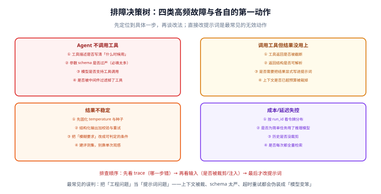
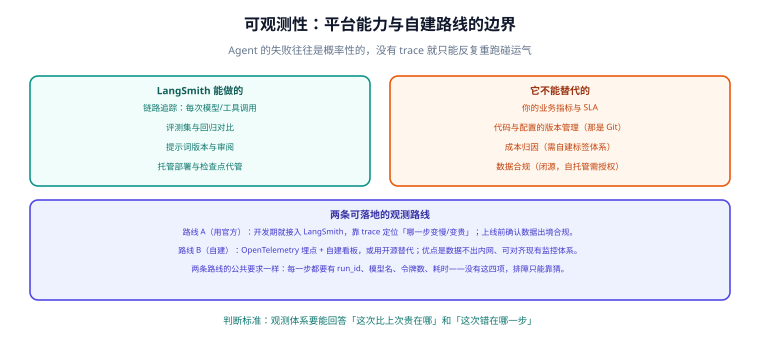

# 常见问题与最佳实践

本页按「**先定位到具体一步，再谈改法**」的原则组织。LangChain 应用的问题八成伪装成「模型变笨了」，实际是工程问题：上下文被裁、schema 太严、超时重试、状态放错层。



## 1. 排障总原则

::: danger 先看 trace，再改提示词
直接改提示词是最常见的无效动作。正确顺序：

1. **看 trace**：这次运行里，模型收到的是什么？工具被调了几次？哪一步报错或变慢？
2. **看输入**：消息列表第几条开始被裁剪？工具返回值是不是空的或超长的？
3. **看配置**：模型名有没有被环境变量改掉？超时是不是太短？
4. **最后才改提示词**，并且改完要跑评测集，不能只看单次观感。
:::

如果暂时没有 trace，最低成本的做法是在 `before_model` 钩子里打印消息条数与最后一条内容——**一行日志就能排除掉一半猜测**。

## 2. 观测能力：平台与自建



| 观测路线 | 得到什么 | 代价 |
| --- | --- | --- |
| 接官方平台 | 开箱的链路追踪、评测集、提示词版本 | 闭源商业产品；自托管需企业授权；注意数据出境合规 |
| OpenTelemetry 自建 | 数据不出内网，能对齐现有监控体系 | 需要自己定义标签、搭看板与告警 |

**两条路线都要满足的最低要求**：每一步都有 run_id、模型名、令牌数、耗时。缺这四项，排障只能靠猜。

## 3. 问答：Agent 行为类

### Q1：模型不调用工具怎么办？

按这个顺序查：

1. **docstring 有没有写「什么时候用」**——最高频原因。
2. **工具的必填参数是不是太多**——必填项越多，模型越容易放弃不调。
3. **模型是否支持工具调用**——部分小模型/本地模型不支持或支持不完整（见 [本地模型部署](../../LocalModel/index.md)）。
4. **工具是否被中间件过滤掉了**——`wrap_model_call` 里改过工具集就会发生。
5. **提示词是否在暗示「直接回答」**——如「尽量简洁，不要调用工具」这类话。

### Q2：模型滥调工具怎么办？

- 给工具加**排除条件**（"什么时候不要用"）。
- **合并语义相近的工具**：`get_user_by_id` 和 `get_user_by_name` 合成 `get_user`，减少选择焦虑。
- 工具数量控制：超过 10 个时考虑分组或改为「先路由再给子集工具」。
- 用 `wrap_model_call` 按场景动态收窄工具集，这比写提示词约束可靠。

### Q3：工具调用了但结果没被用上？

三种可能，逐条验证：

| 可能 | 验证方法 | 改法 |
| --- | --- | --- |
| 返回值被截断 | 打印 `ToolMessage.content` 长度 | 工具侧分页或让模型缩小范围 |
| 返回结构不可读 | 看模型是否说「工具返回了内容但无法解析」 | 改成自然语言 + 关键字段 |
| 上下文已超预算被裁掉 | 在 `before_model` 打印消息条数 | 加摘要中间件或缩短其他部分 |

### Q4：循环停不下来（一直调工具）？

- 检查工具的返回是否**总让模型觉得「信息不足」**（如每次都返回空结果）。
- 检查是否有工具**返回值与调用参数无关**，导致模型反复重试同一调用。
- 检查递归限制是否被误设得很大——它是安全阀，**默认值通常够用**，调大只是掩盖问题。
- 检查任务本身：如果「下一步」真的需要模型判断几百轮，说明任务应该拆成多个子任务或改成固定流程。

## 4. 问答：稳定性与成本

### Q5：结果不稳定，同一问题答案不同？

1. 先固化参数：`temperature=0`、固定种子（若供应商支持）。
2. 把「模糊要求」改成可判定条件：不写「回答要专业」，改写「必须包含接口名、参数、错误码三项」。
3. 用结构化输出 + 校验：字段级约束比自然语言约束硬。
4. 建评测集：**单次观感不是证据**，跑 30 条固定问题看通过率。

### Q6：成本突然涨了？

按 run_id 看令牌分布，通常是四件事之一：

| 原因 | 特征 | 改法 |
| --- | --- | --- |
| 简单任务用了推理模型 | 输出令牌占比低但单价高 | 分级路由：默认便宜模型，低置信度再升级 |
| 历史没裁剪 | 输入令牌随轮次线性增长 | 摘要中间件 + 保留策略 |
| 每次全量检索 | 检索结果超长 | 限制 `top_k`、截断片段、按需再取 |
| 反复重试 | 工具调用次数异常高 | 修 `with_retry` 的异常分类，别重试输入错误 |

### Q7：延迟高，首字等很久？

- 前端要打字机效果 → 用流式（`stream_mode="messages"`），首字延迟立刻改善。
- 模型侧延迟高 → 换更小的模型或降低输出长度上限。
- 检索/工具慢 → 给工具加超时，**超时后返回可读错误**而不是让整个循环挂住。
- 注意：**结构化输出与流式不要叠在同一次调用上**——结构化解析需要完整 JSON。

### Q8：升级到 v1 后大量报错？

先分类，再动手：

```shell
# 1) 模块路径问题（改导入即可）
grep -rn "from langchain.chains\|from langchain.retrievers\|from langchain.indexes" .
# 期望：全部改为 langchain_classic.*

# 2) 已弃用 API（改写法）
grep -rn "create_react_agent\|AgentExecutor\|ConversationChain" .
# 期望：create_agent + checkpointer

# 3) 参数变化
grep -rn "max_iterations\|early_stopping_method" .
```

::: warning 不要为了升级而升级
v1 值得升级的条件只有一条：**你要用新能力**（标准内容块、`create_agent` 的中间件生态）。如果现有系统稳定、也不追新模型能力，锁在 v0.x 继续跑是理性选择——升级的时间成本应该由「能得到什么」来付账。
:::

## 5. 问答：工程与合规

### Q9：密钥怎么管？

- 只走环境变量或密钥管理服务，**永不进代码仓库**（`.env` 写进 `.gitignore`）。
- 缺失时**快速失败**（`os.environ["X"]` 而不是给默认值），让问题在启动阶段暴露。
- 网关转发时，密钥留在服务端；前端一律走后端代理。

### Q10：用户数据能不能发给第三方模型？

- 先走合规确认，再做技术方案：脱敏（`PIIMiddleware`）、裁剪（只发必要字段）、或改私有化部署（见 [本地模型部署](../../LocalModel/index.md)）。
- **日志同样要脱敏**：请求体、响应体、工具参数都可能含个人信息。
- 保留审计记录：谁在什么时候发了什么，出问题时可追溯。

### Q11：多实例部署后会话「失忆」？

检查点后端是内存实现。多实例必须换成数据库后端，并保证所有实例连同一个库。这是 `InMemorySaver` 只在开发环境可用的原因。

### Q12：怎么判断「该不该上 Agent」？

按顺序问三个问题：

1. **下一步做什么，需要模型判断吗？** 不需要 → 固定流程 + 一次模型调用。
2. **动作可逆吗？** 不可逆 → 必须有人工审批环节。
3. **效果能自动判定吗？** 不能 → 先解决评测问题，否则上线就是赌运气。

三个问题的答案都指向 Agent 时才用 Agent——多数业务问题在第一步就被筛掉了。

## 6. 最佳实践清单

::: tip 十二条
1. 工具 docstring 写全「做什么 / 什么时候用 / 什么时候别用」。
2. 有副作用的工具必须幂等，或必须经过审批。
3. 权限判断放代码里，不放提示词里。
4. 上下文分层：会话内用检查点，跨会话用检索，装不下用摘要。
5. 原始对话与摘要分开存，保证可审计。
6. 生产环境检查点用数据库，配保留策略。
7. 模型名、阈值、`top_k` 全部走配置。
8. 结构化输出配显式错误处理，不依赖默认行为。
9. 评测集先于优化：没有度量就没有优化。
10. 验收脚本要能失败（故意制造一次红灯验证）。
11. 每一步都有 run_id / 模型名 / 令牌数 / 耗时。
12. 不可逆动作前必有一次人工确认。
:::

## 7. 术语表

| 术语 | 含义 |
| --- | --- |
| Runnable | 统一的可调用抽象：`invoke` / `stream` / `batch` 及其异步版本 |
| LCEL | LangChain Expression Language，用 `\|` 组合 Runnable 的语法 |
| 中间件（Middleware） | 挂在 Agent 循环六个钩子上的可组合扩展单元 |
| 检查点（Checkpoint） | 图每一步状态的持久化快照，支持恢复与时间旅行 |
| `thread_id` | 一条会话的标识，消息历史与检查点按它分组 |
| `context` | 单次运行的数据（用户、租户、渠道），供工具与中间件读取 |
| 条件边（Conditional Edge） | 由纯函数决定下一个节点的边 |
| `interrupt` | 暂停执行并把决策权交给人的原语，配合 `Command(resume=...)` 恢复 |
| 结构化输出（Structured Output） | 让模型按给定 schema 产出可校验数据 |
| 内容块（Content Blocks） | 跨供应商统一的响应内容表示（文本、推理、工具调用等） |
| `langchain-classic` | 存放 v1 迁出的历史 Chain、检索器与索引 API 的兼容包 |
| LangSmith | 官方可观测、评测与部署平台（闭源商业产品） |

## 相关文档

- [生态概览与 v1 变更](../Overview/index.md)：v1 的三项改动与迁移对照
- [Agent 与中间件](../Agent/index.md)：六个钩子与工具设计
- [实战：带人工审批的检索增强 Agent](../Practice/index.md)：把上面的实践串成可验收链路
- [大模型应用开发 · 常见问题与最佳实践](../../LLMApp/FAQ/index.md)：不引入框架时的排查经验

## 参考资料

- 官方文档总入口：https://docs.langchain.com/
- LangChain v1 迁移指南：https://docs.langchain.com/oss/python/migrate/langchain-v1
- LangGraph 文档：https://docs.langchain.com/oss/python/langgraph/overview
