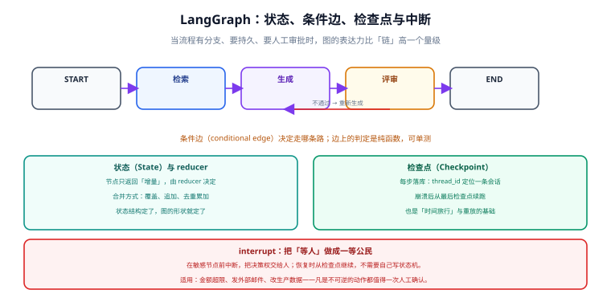

# LangGraph 编排

当流程需要**分支判断、持久化状态、人工审批、失败续跑**时，「链」的表达力就不够了——链只有一个方向。LangGraph 用**图**来表达控制流：节点做计算、边决定下一步、状态在图里流动。`create_agent` 本身就是一张预置的图，理解图之后，Agent 的行为就不再是黑盒。



## 1. 什么时候该用图

| 需求 | 用 `create_agent` | 用 LangGraph 图 |
| --- | --- | --- |
| 模型 + 工具调用循环 | ✅ 首选 | 也可以，但没必要 |
| 固定多步骤流程（检索 → 生成 → 校验） | ⚠️ 能用但不表达分支 | ✅ 显式表达 |
| 中间要人工审批 | 用 `HumanInTheLoopMiddleware` | ✅ 需要细粒度控制时 |
| 失败要从指定步骤续跑 | 检查点能力可用 | ✅ 更可控 |
| 多个角色/子流程协作 | ❌ 不支持 | ✅ 子图与路由 |
| 需要严格可审计的流程 | ❌ 循环是隐式的 | ✅ 图结构即文档 |

::: tip 一条判断线
**「下一步做什么」由模型决定 → 用 Agent；由业务规则决定 → 用图。** 两者可以混用：图的某个节点内部就是一个 Agent，这是最常见的生产形态。
:::

## 2. 最小可运行示例

```python
import operator
from typing import Annotated, TypedDict

from langgraph.graph import StateGraph, START, END
from langgraph.graph.message import add_messages
from langgraph.checkpoint.memory import InMemorySaver


class ReviewState(TypedDict):
    # add_messages 是「追加」语义的 reducer：新消息追加到列表而不是覆盖
    messages: Annotated[list, add_messages]
    # 自定义 reducer：用 operator.add 做数值累加
    retry_count: Annotated[int, operator.add]
    draft: str


def retrieve(state: ReviewState) -> dict:
    return {"messages": [{"role": "user", "content": "检索相关片段……"}], "retry_count": 0}


def generate(state: ReviewState) -> dict:
    return {"draft": "生成的第一版草稿"}


def review(state: ReviewState) -> dict:
    passed = "风险" not in state["draft"]
    return {"retry_count": 0 if passed else 1, "draft": state["draft"]}


def route(state: ReviewState) -> str:
    """条件边的判定函数必须是纯函数：只读状态，返回下一个节点名。"""
    return "end" if state["retry_count"] == 0 else "generate"


builder = StateGraph(ReviewState)
builder.add_node("retrieve", retrieve)
builder.add_node("generate", generate)
builder.add_node("review", review)

builder.add_edge(START, "retrieve")
builder.add_edge("retrieve", "generate")
builder.add_edge("generate", "review")
builder.add_conditional_edges("review", route, {"generate": "generate", "end": END})

graph = builder.compile(checkpointer=InMemorySaver())

out = graph.invoke(
    {"messages": [], "retry_count": 0, "draft": ""},
    config={"configurable": {"thread_id": "review-1"}},
)
print(out["draft"])
```

要点：

- **状态是 TypedDict**，每个字段可以带 reducer（`Annotated[类型, reducer]`）。没有 reducer 的字段是**覆盖**语义。
- **节点只返回增量**（一个 dict），不要自己拼完整状态——这是最容易写错的地方。
- **条件边返回节点名**，判定函数写成纯函数以便单测。
- **`compile(checkpointer=...)` 之后才有持久化**。

## 3. 状态设计决定图的质量

| 反模式 | 问题 | 改法 |
| --- | --- | --- |
| 状态字段太多、语义重叠 | 节点间职责不清，改一处崩三处 | 按「谁会读它」划分字段 |
| 状态里存大对象（整个文档） | 每一步检查点都要序列化，存储与延迟都涨 | 存 ID 或 URI，用时再取 |
| 该追加的字段用了覆盖 | 历史丢失，无法回溯 | 用 `add_messages` 或 `operator.add` |
| 把可推导的数据也放进状态 | 一致性问题（两份真相） | 用时现算，或只存源头 |
| 靠全局变量在节点间传数据 | 图失去可重放性 | 全部走状态 |

## 4. 检查点与时间旅行

```python
config = {"configurable": {"thread_id": "review-1"}}

# 查看当前状态（含下一步将执行哪些节点）
snapshot = graph.get_state(config)
print(snapshot.values, snapshot.next)

# 查看历史检查点，逐个回放
for state in graph.get_state_history(config):
    print(state.config["configurable"]["checkpoint_id"], state.next)
```

| 能力 | API | 用途 |
| --- | --- | --- |
| 中断后恢复 | 同一 `thread_id` 再次 `invoke` | 崩溃续跑、审批后继续 |
| 时间旅行 | `get_state_history` + 指定 `checkpoint_id` | 从任意一步重放，换提示词试另一条路 |
| 人工修改状态 | `update_state(config, values)` | 修数据后继续（如补全被审批人修正的字段） |

::: danger 检查点不是越细越好
每一步都落库意味着**存储与写放大**。生产环境要处理两件事：

1. **保留策略**：按时间或条数清理历史检查点（时间旅行只在排障时用得上）。
2. **序列化边界**：状态里放大对象会让每步检查点都膨胀，这是图跑着跑着变慢的常见原因。
:::

## 5. `interrupt`：把「等人」做成一等公民

人工审批不要用「轮询数据库标记位」实现——那是自建状态机，容易出竞态。LangGraph 提供原语：

```python
from langgraph.types import interrupt, Command


def request_approval(state: ReviewState) -> dict:
    # 执行到这里会暂停并落检查点，把决策权交给人
    decision = interrupt(
        {
            "question": "这封邮件是否发送？",
            "draft": state["draft"],
            "allowed": ["approve", "edit", "reject"],
        }
    )
    if decision["type"] == "edit":
        return {"draft": decision["value"]}
    if decision["type"] == "reject":
        return {"draft": "(已拒绝发送)"}
    return {}


# 恢复执行：外部拿到审批结果后，用 Command(resume=...) 继续
graph.invoke(Command(resume={"type": "approve"}), config=config)
```

适用判断很简单：**凡是不可逆的动作都值得一次人工确认**——发外部邮件、改生产数据、金额超限的转账、对外发布内容。

## 6. 流式输出

```python
# stream_mode 决定你看到什么
for chunk in graph.stream(inputs, config=config, stream_mode="updates"):
    print(chunk)          # 每个节点执行完的增量

for chunk in graph.stream(inputs, config=config, stream_mode="messages"):
    print(chunk)          # 模型逐令牌输出，前端首字延迟最低
```

| `stream_mode` | 产出 | 用途 |
| --- | --- | --- |
| `values` | 每步后的完整状态 | 调试、状态看板 |
| `updates` | 每个节点的增量 | 进度提示（「正在检索…」） |
| `messages` | 模型令牌级输出 | 前端打字机效果 |
| `custom` | 节点内主动推的事件 | 自定义进度（如已处理 30/100） |

## 7. 与工作流引擎的边界

| 维度 | LangGraph | 传统工作流引擎（如 BPMN 类） |
| --- | --- | --- |
| 适用对象 | 有概率性节点的 AI 流程 | 确定性强的业务审批流 |
| 状态 | 代码里的 TypedDict | 引擎管理的流程变量 |
| 变更成本 | 改代码即改流程（要配版本管理） | 图形化改流程，有版本与灰度 |
| 与模型的耦合 | 原生 | 需要自己包一层 |
| 审计 | 靠检查点与 trace | 引擎自带审计与权限 |

**混合是常见答案**：业务审批留在工作流引擎，AI 相关的那一段封装成一个「节点」被引擎调用。不要把两者混成一个系统，职责边界一乱，排障成本会成倍上升。

## 8. 验证方式

1. **图结构可见**：`print(graph.get_graph().draw_mermaid())` 输出 Mermaid 源码，确认分支与节点和你以为的一致。
2. **条件边可单测**：把 `route` 当普通函数测：构造不同状态，断言返回值。这是最省事的测试点。
3. **持久化生效**：中断进程后用同一 `thread_id` 再 `invoke`，确认上下文还在。
4. **中断可恢复**：在审批节点触发 `interrupt`，确认 `invoke` 返回时带中断信息；再用 `Command(resume=...)` 恢复，确认从断点继续而不是从头跑。
5. **历史可回放**：`get_state_history` 能列出多条检查点，指定其中一个能重放。
6. **流式对齐**：用 `stream_mode="updates"` 打印节点名，确认前端进度提示与实际执行顺序一致。

## 相关文档

- [Agent 与中间件](../Agent/index.md)：`create_agent` 其实就是一张预置图
- [记忆与上下文](../Memory/index.md)：检查点、`thread_id` 与长期记忆的关系
- [实战：带人工审批的检索增强 Agent](../Practice/index.md)：把本页的图与中间件串起来
- [Agent 应用 · 工作流编排](../../Agent/Workflow/index.md)：编排层的方法论

## 参考资料

- LangGraph 概览（官方）：https://docs.langchain.com/oss/python/langgraph/overview
- 持久化与检查点（官方）：https://docs.langchain.com/oss/python/langgraph/persistence
- 中断（官方）：https://docs.langchain.com/oss/python/langgraph/interrupts
- 流式（官方）：https://docs.langchain.com/oss/python/langgraph/streaming
