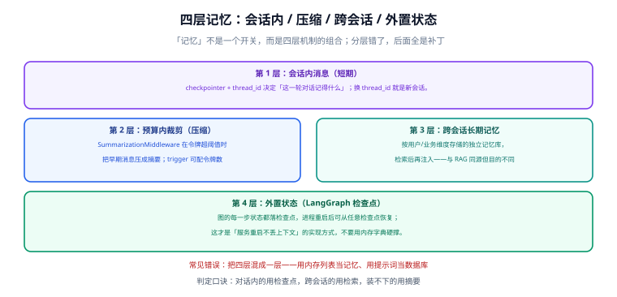

# 记忆与上下文

「给 Agent 加记忆」是一句含糊的需求。它至少包含四件不同的事：**这一轮对话记得什么、装不下的怎么压、跨会话怎么记、进程重启后怎么恢复**。分层放错，后面全是补丁。



## 1. `thread_id` 与检查点：会话记忆的机制

`create_agent` 基于 LangGraph 构建，所以**持久化是内建的**——但前提是你给它一个检查点存储：

```python
from langchain.agents import create_agent
from langgraph.checkpoint.memory import InMemorySaver

agent = create_agent(
    model=model,
    tools=[get_deploy_record],
    checkpointer=InMemorySaver(),        # 本地开发用；生产换成数据库后端
)

config = {"configurable": {"thread_id": "user-42-conv-1"}}

# 第一轮
agent.invoke({"messages": [{"role": "user", "content": "order-api 上次部署是什么版本？"}]}, config=config)

# 第二轮：同一 thread_id，模型能看到上一轮的全部消息
agent.invoke({"messages": [{"role": "user", "content": "那它回滚过吗？"}]}, config=config)
```

| 概念 | 作用范围 | 说明 |
| --- | --- | --- |
| `thread_id` | 一条会话 | 消息历史与检查点按它分组；换 ID 就是新会话 |
| `context` | 单次运行 | 每次调用传入的数据（用户身份、租户、渠道），供工具与中间件读取 |
| 检查点 | 每一步状态 | 崩溃后从最后一个检查点恢复，也是「时间旅行」的数据基础 |

::: danger 三个必须改掉的写法
1. **用模块级列表存历史**：多用户会话互相污染，且重启即丢。
2. **把用户身份塞进 `system_prompt`**：那是提示词，不是状态。正确做法是走 `context`，由工具/中间件读取。
3. **生产用 `InMemorySaver`**：它不跨进程、不跨实例。多实例部署必须换数据库后端，否则同一用户请求打到不同实例就会「失忆」。
:::

## 2. 第 2 层：装不下的时候压缩

上下文窗口有限，长会话必然要压缩。两条路：

| 做法 | 触发方式 | 取舍 |
| --- | --- | --- |
| 摘要压缩（`SummarizationMiddleware`） | 令牌数超过阈值时把早期消息压成摘要 | 保留语义，但**细节会丢**；适合长对话 |
| 消息裁剪（`trim_messages`） | 按条数或令牌数直接丢弃早期消息 | 实现简单、无损；但会粗暴丢掉上下文 |

```python
from langchain.agents.middleware import SummarizationMiddleware

agent = create_agent(
    model=model,
    tools=[...],
    middleware=[SummarizationMiddleware(model=model, trigger={"tokens": 4000})],
    checkpointer=InMemorySaver(),
)
```

```python
# 手工裁剪：需要精确控制保留策略时使用
from langchain.messages import trim_messages

trimmed = trim_messages(
    messages,
    max_tokens=4000,
    strategy="last",            # 保留最近的；也可按首条保留系统提示
    token_counter=model,
    include_system=True,
)
```

::: warning 压缩是有损操作，记得留证据
摘要一旦生成，**原始消息在该会话里就取不回来了**。所以生产环境要把原始对话**另存一份**（数据库或日志），摘要只用于喂模型。否则出问题时无法复盘「当时用户到底说了什么」。
:::

## 3. 第 3 层：跨会话的长期记忆

`thread_id` 只解决「同一条会话内记得」。要让 Agent 记住「这个用户是运维负责人、偏好简洁回答、上次反馈过检索太慢」，需要**跨会话的记忆库**：

```text
写入时机：after_agent 钩子里抽取「值得长期记住的事实」
存储位置：按 user_id / tenant 维度的表或向量库
读取时机：before_agent 钩子里按当前问题检索出相关记忆，注入消息
```

要点：

- **存「事实」而不是「原文」**：`用户偏好简短回答` 比整段聊天记录有用得多。
- **必须有有效期与删除路径**：用户说「忘掉这件事」时要有实现方式，这既是合规要求也是体验要求。
- **与 RAG 同源但目的不同**：检索的是「关于用户的事实」，而不是「业务知识」；两者可以共用一个向量库，但要用字段隔离，且**评估指标不同**（记忆看「有没有用上」，RAG 看「召回对不对」）。

## 4. 第 4 层：外置状态与恢复

图的每一步状态都会落检查点，这带来三个具体能力：

| 能力 | 依赖 | 典型用途 |
| --- | --- | --- |
| 崩溃恢复 | 检查点 + `thread_id` | 进程被 kill 后，下一条消息继续，不需要用户重述 |
| 时间旅行 | 检查点历史 | 从任意一步重放，换提示词试另一条路径 |
| 人工中断 | 检查点 + `interrupt` | 审批前暂停、审批后恢复（见 [LangGraph 编排](../LangGraph/index.md)） |

## 5. 常见错误对照

| 错误做法 | 后果 | 正确做法 |
| --- | --- | --- |
| 用列表当会话记忆 | 多用户串话、重启丢失 | 检查点 + `thread_id` |
| 把身份/权限写进系统提示词 | 提示词失效即越权，无法审计 | 走 `context`，权限在工具内部校验 |
| 只做裁剪不做摘要 | 长会话丢关键约束 | 摘要 + 原始对话另存 |
| 把长期记忆当 RAG 用 | 检索不出「关于用户」的事实 | 按维度隔离，单独定义写入与召回 |
| 压缩后不保留原文 | 无法复盘、无法审计 | 原始对话落库，摘要只喂模型 |
| 多实例部署用内存检查点 | 请求打到另一实例就失忆 | 统一数据库后端 |

## 6. 验证方式

1. **会话隔离**：用两个不同的 `thread_id` 交替提问，确认互不影响。
2. **重启可恢复**：把 `checkpointer` 换成数据库后端，重启服务后用同一 `thread_id` 继续对话，确认模型仍记得上文。
3. **压缩可见**：把 `trigger` 的令牌阈值调得很低（如 200），跑几轮对话，观察消息条数下降且摘要出现。
4. **裁剪可控**：单独对 `trim_messages` 做单元测试：构造 10 条消息，断言裁剪后保留的条数与首条系统消息。
5. **长期记忆可删除**：验证「忘掉某条记忆」的接口真的生效（再问一次，确认相关内容不再被引用）。
6. **原文留档**：确认原始消息在数据库/日志里能查到，且与摘要不是同一份数据。

## 相关文档

- [Agent 与中间件](../Agent/index.md)：`before_agent` / `after_agent` 两个钩子的用法
- [LangGraph 编排](../LangGraph/index.md)：检查点、`interrupt` 与时间旅行
- [大模型应用开发 · 上下文与记忆管理](../../LLMApp/ContextMemory/index.md)：不引入框架时的令牌预算与裁剪策略
- [RAG 检索增强](../../RAG/index.md)：检索链路与评估指标

## 参考资料

- 短期记忆（官方）：https://docs.langchain.com/oss/python/langchain/short-term-memory
- 长期记忆（官方）：https://docs.langchain.com/oss/python/langchain/long-term-memory
- 持久化与检查点（官方）：https://docs.langchain.com/oss/python/langgraph/persistence
