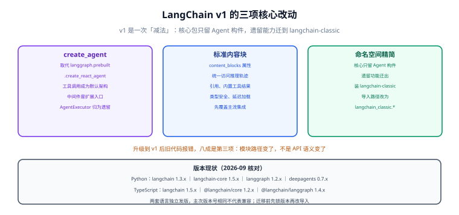

# 生态概览与 v1 变更

本页回答三个问题：**为什么需要一个框架**、**v1 到底改了什么**、**什么情况下不该用它**。把这三件事想清楚，后面几页的 API 细节才有落点。



## 1. 直接调 SDK 的四个重复劳动

不引入框架时，每个项目都会重复解决同一批问题：

| 重复劳动 | 具体表现 | 框架给出的抽象 |
| --- | --- | --- |
| 多供应商差异 | 消息格式、工具调用字段、流式事件名各家不同 | 统一的消息与内容块模型 |
| 工具描述与调用 | 手写 JSON Schema、手动解析工具调用、手动回填结果 | `@tool` + 自动 schema 生成 + 循环封装 |
| 上下文管理 | 历史太长要裁剪、要摘要、要按场景注入 | 中间件与消息裁剪工具 |
| 结构化输出 | 提示模型输出 JSON、再校验、失败重试 | `response_format` + 策略化重试 |

**框架的价值是把这四件事标准化，代价是多一层抽象与一版依赖**。所以判断标准很朴素：这四个问题你在项目里都遇到了，框架就值；只遇到一个，直接写 30 行胶水代码更划算。

## 2. v1 三项改动

### 2.1 `create_agent` 成为装配标准

v1 之前，搭一个工具调用 Agent 有三条路，且都不理想：

| 写法 | 状态 | 问题 |
| --- | --- | --- |
| `AgentExecutor` + `create_react_agent`（LangChain 0.x） | 遗留 | 黑盒循环，几乎无法插入自定义逻辑 |
| `langgraph.prebuilt.create_react_agent` | 被取代 | 需要理解图才能定制 |
| **`langchain.agents.create_agent`（v1）** | **标准** | 默认工具调用架构，定制点收敛到中间件 |

```python
from langchain.agents import create_agent

agent = create_agent(
    model="claude-sonnet-4-6",          # 也可以传模型实例或 init_chat_model 的结果
    tools=[search_web, query_db],
    system_prompt="你是一名严谨的技术助手，回答必须给出依据。",
)

result = agent.invoke({"messages": [{"role": "user", "content": "查一下上次的部署记录"}]})
print(result["messages"][-1].content)
```

`create_agent` 底层就是一条循环：**调用模型 → 模型请求工具 → 执行工具 → 结果回填 → 再调用模型 → 直到不再请求工具**。它构建在 LangGraph 之上，所以持久化、流式、人工中断、时间旅行是**开箱即得**的，不需要你显式建图。

### 2.2 标准内容块（`content_blocks`）

过去拿「模型的推理过程」要按供应商分支写：有的放在 `additional_kwargs`，有的藏在 `response_metadata`。v1 引入统一的 `content_blocks`：

```python
from langchain.chat_models import init_chat_model

model = init_chat_model("claude-sonnet-4-6")
response = model.invoke("用一句话说明什么是向量检索。")

for block in response.content_blocks:
    if block["type"] == "reasoning":
        print("推理：", block["reasoning"])
    elif block["type"] == "text":
        print("正文：", block["text"])
    elif block["type"] == "tool_call":
        print("工具：", block["name"], block["args"])
```

::: warning 内容块当前只覆盖部分集成
官方明确列出先支持 `langchain-anthropic`、`langchain-aws`、`langchain-openai`、`langchain-google-genai`、`langchain-ollama`，其余供应商逐步跟进。用在未覆盖的集成上会拿不到 `content_blocks`，此时退回各家的原生字段。
:::

### 2.3 命名空间精简与 `langchain-classic`

v1 把 `langchain` 包收窄成「只放装配 Agent 要用的东西」，历史能力整体迁出：

| 你现在想找的东西 | v1 里在哪 |
| --- | --- |
| `create_agent`、`AgentState` | `langchain.agents` |
| 消息类型、内容块、`trim_messages` | `langchain.messages`（从 `langchain-core` 再导出） |
| `@tool`、`BaseTool` | `langchain.tools` |
| `init_chat_model`、`BaseChatModel` | `langchain.chat_models` |
| `Embeddings`、`init_embeddings` | `langchain.embeddings` |
| `LLMChain`、`ConversationChain` 等具体 Chain | `langchain_classic.chains` |
| `MultiQueryRetriever` 等检索器 | `langchain_classic.retrievers` |
| 索引 API、`hub` 模块 | `langchain_classic.indexes` / `langchain_classic.hub` |

```shell
# 存量项目升级：核心包 + 兼容包一起装，再按上表改导入路径
uv pip install -U langchain
uv pip install langchain-classic
```

```python
# 旧写法（v0.x）
from langchain.chains import LLMChain

# v1 写法 A：用 Runnable 组合替代具体 Chain（推荐）
# 见「从 Chain 到 Runnable」
# v1 写法 B：短期不重构，先改导入路径
from langchain_classic.chains import LLMChain
```

::: danger 升级到 v1 后代码报错的真实原因
绝大多数报错**不是语义变了，而是模块路径变了**。排查顺序：

1. 先看报错是不是 `ModuleNotFoundError` / `ImportError`——是就按上表改路径，别改逻辑。
2. 再看是不是用了 `langgraph.prebuilt.create_react_agent`——改用 `create_agent`。
3. 最后才看 API 参数变化（如 `response_format` 的写法）。

反过来，**如果项目不需要新模型能力，锁在 v0.x 继续跑是合理选择**——升级的时间成本应该由「能得到什么」来付账。
:::

## 3. 中间件：v1 真正的核心

`create_agent` 之所以可定制，是因为中间件把「上下文工程」做成了可组合的槽位。所谓上下文工程，就是**在正确的时机把正确的信息交给模型**：

- 发给模型的提示词要不要动态拼装？（`before_model`）
- 历史太长，要不要压缩？（`SummarizationMiddleware`）
- 敏感信息要不要先脱敏？（`PIIMiddleware`）
- 危险工具要不要人工批准？（`HumanInTheLoopMiddleware`）
- 某个工具要不要暂时藏起来不给模型看？（`wrap_model_call` 里改工具集）

官方把这套钩子定义为六个（时序见 [Agent 与中间件](../Agent/index.md) 的示意图）：

| 钩子 | 时机 | 典型用途 |
| --- | --- | --- |
| `before_agent` | 调用 Agent 之前 | 加载记忆、校验输入 |
| `before_model` | 每次模型调用之前 | 更新提示词、裁剪消息 |
| `wrap_model_call` | 包裹每次模型调用 | 换模型、换工具集、改请求/响应 |
| `wrap_tool_call` | 包裹每次工具调用 | 拦截与改写工具执行结果 |
| `after_model` | 每次模型响应之后 | 校验输出、应用护栏 |
| `after_agent` | Agent 结束之后 | 落库、清理 |

::: tip 设计的启发
「把定制点做成钩子」比「继承框架类再重写方法」更抗升级——钩子有稳定契约，基类没有。这条经验不只适用于 LangChain：**凡是准备长期维护的框架集成，优先找钩子/中间件，其次才考虑继承**。
:::

## 4. 什么情况下不该用 LangChain

| 场景 | 更好的做法 |
| --- | --- |
| 单次问答、固定提示词 | 直接调官方 SDK，省一层依赖 |
| 流程完全确定、没有工具调用 | 写普通函数编排，模型只负责生成文本 |
| 只需要向量检索 | 直接用向量库客户端 + 嵌入接口，不必引入框架 |
| 需要严格审计每一步、不允许黑盒 | 自己写循环（30 行左右）比逆向框架行为更省时间 |
| 团队完全没写过 Python | 先评估维护成本：框架版本迭代快，没人跟版本会变成技术债 |

::: info 一条经验
**框架不能替你决定「该不该有 Agent」**。多数业务问题用「固定流程 + 一次模型调用」就能解决，且更稳、更便宜、更好测。只有当「下一步做什么」真的需要模型来判断时，Agent 才是对的形态。
:::

## 5. 验证方式

1. 建一个空目录，按 [环境与模型接入](../Environment/index.md) 装好依赖，跑通 `create_agent` 的最小示例，确认能拿到 `result["messages"][-1].content`。
2. 把 `tools` 换成两个至少一个会失败的函数，观察模型是否会因失败结果自行重试——这是理解「循环终止条件」的最快方式。
3. 故意写一句 `from langchain.chains import LLMChain`，确认报的是 `ModuleNotFoundError`，再按 2.3 的表改成 `langchain_classic`——把「路径问题 ≠ 语义问题」变成肌肉记忆。
4. 用 `python -c "import langchain, langgraph; print(langchain.__version__, langgraph.__version__)"` 记录当前版本，写进项目的依赖锁文件。

## 相关文档

- [环境与模型接入](../Environment/index.md)：把上面的示例跑起来所需的全部前置
- [Agent 与中间件](../Agent/index.md)：六个钩子的实操
- [大模型应用开发](../../LLMApp/index.md)：不用框架时的对照实现

## 参考资料

- LangChain v1 新特性：https://docs.langchain.com/oss/python/releases/langchain-v1
- 中间件指南：https://docs.langchain.com/oss/python/langchain/middleware
- 内容块指南：https://docs.langchain.com/oss/python/langchain/messages
