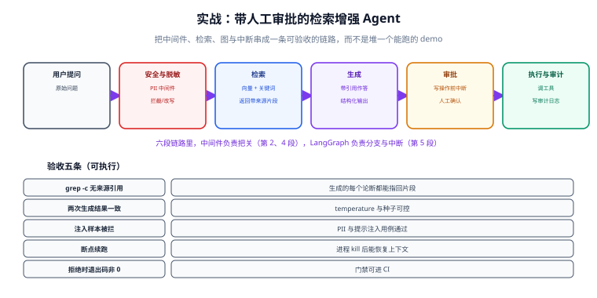

# 实战：带人工审批的检索增强 Agent

本页把 [中间件](../Agent/index.md)、[记忆](../Memory/index.md)、[LangGraph 编排](../LangGraph/index.md) 串成一条**可验收**的链路：一个能查内部知识库、能起草对外邮件、但**发送前必须人工审批**的运维助手。



## 1. 需求与验收标准

| 维度 | 要求 | 验收方式 |
| --- | --- | --- |
| 功能 | 回答问题必须给出知识库来源；不确信时明确说不知道 | 抽查 10 个问题，可指回片段 |
| 安全 | 输入中的手机号、身份证号先脱敏；工具权限在代码层校验 | 注入脱敏样本，确认日志里是掩码 |
| 可靠 | 进程被 kill 后同一会话可继续 | 手工 kill 后继续提问 |
| 可控 | 发邮件前必须人工批准，未批准不执行 | 拒绝批准，确认邮件未发出 |
| 可观测 | 每次运行可回答「哪一步慢、哪一步贵」 | 按 run_id 查到模型名/令牌/耗时 |

::: info 为什么不用「一句话加个记忆」的做法
因为上面五条里只有第一条是「模型能力」，其余四条都是工程约束。**约束必须落在代码里，不能落在提示词里**——提示词是一份「请求」，不是一道「闸门」。
:::

## 2. 项目结构

```text
ops-assistant/
├─ config.py               # 模型名、阈值、知识库路径，全部来自环境变量
├─ tools/
│  ├─ kb_search.py         # 知识库检索（带来源与得分）
│  └─ send_mail.py         # 发送邮件（有副作用，需审批）
├─ middleware/
│  ├─ pii.py               # PII 脱敏
│  ├─ guard.py             # 权限与越权校验（代码层）
│  └─ audit.py             # 审计日志（after_agent）
├─ graph/
│  ├─ state.py             # ReviewState 定义
│  └─ build.py             # 建图：检索 → 生成 → 审批 → 执行
├─ evals/                  # 评测集：问题 + 期望来源 + 期望是否拒答
└─ tests/                  # 工具单测、判定函数单测、中间件单测
```

## 3. 工具：检索与副作用分开

```python [tools/kb_search.py]
from langchain.tools import tool


@tool
def kb_search(query: str, top_k: int = 5) -> str:
    """在运维知识库中检索。什么时候用：用户询问部署、告警、故障处理流程时。

    什么时候不要用：用户问的是某人的联系方式或未入库的口头约定。
    """
    hits = _vector_search(query, top_k=top_k)          # 返回 [{doc_id, title, snippet, score}]
    if not hits:
        # 关键：返回「可读的空结果」，让模型能明确说不知道
        return "知识库中没有找到相关文档。请直接回答「知识库未收录」。"
    return "\n".join(
        f"[{h['doc_id']}] {h['title']}（相关度 {h['score']:.2f}）：{h['snippet']}" for h in hits
    )
```

```python [tools/send_mail.py]
from langchain.tools import tool


@tool
def send_mail(to: str, subject: str, body: str) -> str:
    """发送邮件（有副作用，必须先获得人工批准）。什么时候用：用户明确要求对外发送通知时。

    什么时候不要用：用户只是让你「起草」——起草不要调用本工具。
    """
    # 幂等键：同一 (to, subject, body) 只发一次，避免循环重试导致重复发送
    key = f"{to}|{subject}|{hash(body)}"
    if _already_sent(key):
        return "该邮件此前已发送，本次跳过。"
    return _smtp_send(to, subject, body, dedup_key=key)
```

三条要求对应三个具体设计：**空结果可读**（让模型能说不知道）、**有副作用的工具必须幂等**、**docstring 写清边界**。

## 4. 中间件：三道闸门

```python [middleware/pii.py]
from langchain.agents.middleware import PIIMiddleware

# 输入侧脱敏：手机号与身份证号不进模型
pii_input = PIIMiddleware(
    "phone_number",
    detector=r"(?:\+?86[- ]?)?1[3-9]\d{9}",
    strategy="redact",
    apply_to_input=True,
)
```

```python [middleware/guard.py]
from langchain.agents.middleware import AgentMiddleware


class PermissionMiddleware(AgentMiddleware):
    """代码层鉴权：提示词说「你是管理员」不构成任何约束，权限必须在代码里判。"""

    def wrap_tool_call(self, request, handler):
        tool_name = request.tool_call["name"]
        user = request.runtime.context.user
        if tool_name == "send_mail" and not user.has_perm("mail.send"):
            return _tool_error("当前账号没有发送权限，请让有权限的同事执行。")
        return handler(request)
```

```python [middleware/audit.py]
class AuditMiddleware(AgentMiddleware):
    """每次运行结束落一条审计：谁、问了什么、调了哪些工具、结果如何。"""

    def after_agent(self, state, runtime):
        _write_audit(
            user=runtime.context.user.id,
            thread_id=runtime.config["configurable"]["thread_id"],
            tool_calls=_collect_tool_calls(state),
            answer=_last_ai_text(state),
        )
```

::: danger 中间件里不要做的事
1. **不要做业务校验**（如「金额必须大于 0」）——那属于工具内部，中间件拿不到完整业务上下文。
2. **不要在里面发起长时间网络请求**——它是关键路径上的同步环节，会把整体延迟拉高。
3. **不要在 `wrap_tool_call` 里吞掉异常**——吞掉之后模型会以为工具成功，产生更难排查的错误结论。返回**可读的错误文本**，让模型自己纠正。
:::

## 5. 建图：把审批做成节点

```python [graph/state.py]
from typing import Annotated, TypedDict
from langgraph.graph.message import add_messages


class OpsState(TypedDict):
    messages: Annotated[list, add_messages]     # 追加语义
    top_docs: list[str]                         # 本轮检索到的来源，用于验收「可指回」
    mail_draft: dict | None                     # 待审批的邮件
    approved: bool | None
```

```python [graph/build.py]
from langgraph.graph import StateGraph, START, END
from langgraph.types import interrupt
from langgraph.checkpoint.sqlite import SqliteSaver


def retrieve(state: OpsState) -> dict:
    docs = _search(state["messages"][-1].content)
    return {"top_docs": [d["doc_id"] for d in docs]}


def draft(state: OpsState) -> dict:
    """用 Agent 生成回答与邮件草稿；Agent 内部工具不包含 send_mail。"""
    result = agent.invoke({"messages": state["messages"], "top_docs": state["top_docs"]})
    return {"messages": result["messages"], "mail_draft": _extract_draft(result)}


def approve(state: OpsState) -> dict:
    if not state.get("mail_draft"):
        return {"approved": None}
    decision = interrupt({"question": "是否发送这封邮件？", "draft": state["mail_draft"]})
    return {"approved": decision["type"] == "approve"}


def execute(state: OpsState) -> dict:
    if state.get("approved") is True:
        return {"messages": [{"role": "assistant", "content": send_mail.invoke(state["mail_draft"])}]}
    return {"messages": [{"role": "assistant", "content": "已取消发送。"}]}


def route_after_draft(state: OpsState) -> str:
    return "approve" if state.get("mail_draft") else "end"


builder = StateGraph(OpsState)
builder.add_node("retrieve", retrieve)
builder.add_node("draft", draft)
builder.add_node("approve", approve)
builder.add_node("execute", execute)

builder.add_edge(START, "retrieve")
builder.add_edge("retrieve", "draft")
builder.add_conditional_edges("draft", route_after_draft, {"approve": "approve", "end": END})
builder.add_edge("approve", "execute")
builder.add_edge("execute", END)

# 生产用数据库检查点（Sqlite 适合单机；多实例换成 Postgres 后端）
graph = builder.compile(checkpointer=SqliteSaver.from_conn_string("./checkpoints.db"))
```

关键设计：**生成与执行分成两个节点**，中间夹一个 `approve`。这样「模型能起草但不能自己发」变成结构约束，而不是提示词约定。

## 6. 五条可执行验收

```shell
# ① 每个论断都能指回来源：抽查 10 个问题，检查输出里的 [doc_id]
python -m evals.check_citations --n 10        # 期望：10/10 命中

# ② 脱敏生效：喂入含手机号的样本，grep 原始号码应无命中
python -m evals.check_pii                    # 期望：原始号码 0 命中，掩码 N 命中

# ③ 未批准不发送：走一遍拒绝路径，检查发件箱
python -m evals.check_reject                 # 期望：发件箱 0 封新邮件

# ④ 断点续跑：kill 后用同一 thread_id 继续
python -m evals.check_resume                 # 期望：上下文仍在，不重复检索

# ⑤ 质量门禁可进 CI：任何一条不过，退出码非 0
python -m evals.run_all; echo "exit=$?"       # 期望：exit=0
```

| 验收 | 判据 | 失败时的第一动作 |
| --- | --- | --- |
| 可指回来源 | 10/10 带 `[doc_id]` | 检查提示词是否要求引用；检查工具是否返回了 doc_id |
| 脱敏生效 | 原始号码 0 命中 | 检查中间件是否 `apply_to_input=True` |
| 拒绝不发 | 发件箱无新增 | 检查生成与执行是否真的分成两个节点 |
| 断点续跑 | 上下文保留 | 检查是否真的配了 checkpointer 且 `thread_id` 一致 |
| 门禁退出码 | 非 0 即失败 | 检查评测脚本是否把断言失败映射成退出码 |

::: tip 验收脚本要能「失败」
如果所有验收永远通过，那它测的不是系统，是运气。写完验收后**故意制造一次失败**（把 doc_id 去掉、把中间件注释掉），确认脚本真的红——这一步不能省。
:::

## 7. 成本与延迟观测

要能回答两个问题：**这次比上次贵在哪**、**这次错在哪一步**。

| 指标 | 采集点 | 用途 |
| --- | --- | --- |
| 每步令牌数 | 模型调用返回值里的 usage | 找出「哪个环节吃掉了预算」 |
| 每步耗时 | 各节点/钩子的进出时间 | 找出「哪一步慢」 |
| 检索命中数与得分 | 检索工具内部 | 判断是「没召回」还是「召回没用上」 |
| 工具调用次数 | `after_agent` 汇总 | 异常放大（模型反复调同一工具）的信号 |
| 拒答率 | 输出是否包含「知识库未收录」 | 评估覆盖度，而不是当成失败 |

两条可选路线：接官方平台（开箱有 trace，注意数据出境合规），或 OpenTelemetry 自建（数据不出内网，需自己定义标签）。**两条路线的公共要求一样**：每一步都要有 run_id、模型名、令牌数、耗时——缺这四项，排障只能靠猜。

## 8. 上线清单

- [ ] 检查点后端已换成数据库（非内存），且配了保留策略
- [ ] `send_mail` 等有副作用的工具已幂等
- [ ] 权限校验在代码层（中间件或工具内部），不依赖提示词
- [ ] 五条验收脚本进 CI，失败即红灯
- [ ] 原始对话与摘要分开存储，可审计
- [ ] 模型名与阈值全部走配置，改配置不需要改代码
- [ ] 有降级路径：模型不可用时返回「暂不可用」而不是挂起

**回滚方式**：图的版本与提示词都在 Git 里，回滚 = 回滚代码 + 指定旧检查点继续。这正是「把流程写成图」比「写在提示词里」更可控的地方。

## 相关文档

- [Agent 与中间件](../Agent/index.md)：本页用到的 `create_agent` 与中间件
- [LangGraph 编排](../LangGraph/index.md)：状态、条件边、`interrupt` 的机制
- [记忆与上下文](../Memory/index.md)：检查点与 `thread_id`
- [RAG 检索增强 · 评估体系](../../RAG/Evaluation/index.md)：检索侧指标的定义
- [Ops · 监控告警](../../../Ops/Monitoring/Overview/index.md)：把 Agent 指标接进现有监控体系

## 参考资料

- LangGraph 持久化（官方）：https://docs.langchain.com/oss/python/langgraph/persistence
- 中断与人工审批（官方）：https://docs.langchain.com/oss/python/langgraph/interrupts
- 中间件指南（官方）：https://docs.langchain.com/oss/python/langchain/middleware
- OpenTelemetry 语义约定：https://opentelemetry.io/docs/specs/semconv/
